# Parallel Computer Architecture
## Lecture 1: Flynn's Taxonomy & Parallelism Intuition
### GWU ECE 6125 | Armin Mehrabian | Spring 2026

---

## Outline

- **Definitions and Conceptual Classifications**
  - Parallel Processing, MPPs, and Related Terms
  - Flynn's Classification of Computer Architectures
- **Operational Models for Parallel Computers**
- **Parallelism Intuition**
  - Data Locality and Caches
  - Instruction-Level Parallelism (ILP)

---

## What is Parallel Processing?

A data processing approach that emphasizes exploring and exploiting **inherent parallelism** in a problem.

**Related Terms:**

- **Massively Parallel Processors (MPPs):** Systems designed with many processors working concurrently
- **Scalable Processors:** Architectures that maintain efficiency as more processors are added
- **Heterogeneous Processing:** Use of accelerators like GPUs, FPGAs, TPUs, and other specialized hardware
- **Grid Computing:** Distributed systems across multiple administrative domains
- **Cloud Computing:** Virtualized resources on demand over the internet

---

## Why Massively Parallel Processors (MPPs)?

**Increased Processing Speed & Memory:**
- Enables the study of problems with **higher resolutions** or **larger datasets**

**Cost Efficiency:**
- Offers a **low-cost alternative** to traditional vector machines
- Achieves high performance without relying on expensive processors or memory technologies

---

## Vector Machines

**Vector Machines:** Specialized computing systems designed to handle **vector operations** efficiently. Widely used in HPC during the 1970s and 1980s.

**Key Characteristics:**

- **Vector Processing:** Operate on entire vectors (arrays of data) simultaneously instead of one element at a time
- **Hardware Design:** Specialized vector registers and pipelines optimized for long sequences of data
  - Examples: Cray-1, NEC SX series
- **High Performance:** Excelled in tasks with predictable data patterns (weather modeling, fluid dynamics)
- **Cost and Complexity:** Extremely expensive to build and maintain; less adaptable to general-purpose computing

---

## Vector vs. MPP Architectures

| Aspect | Vector Processor-Based | Microprocessor-Based (MPP) |
|--------|----------------------|---------------------------|
| Design | Specialized for vector data | Many off-the-shelf microprocessors |
| Examples | Cray X-MP, Y-MP, C90, T94 | IBM Blue Gene, Thinking Machines CM-5 |
| Scalability | Limited (few processors) | Highly scalable |
| Cost | Expensive | Cost-efficient |

**Historical Transition (1980s-90s):** Shift from vector processors to microprocessor-based architectures due to scalability and cost benefits.

---

## Von Neumann Architecture

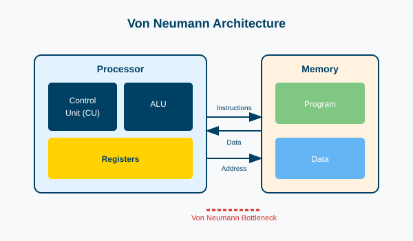

---

## Von Neumann Architecture

**Key Concept - Separation of Memory and Compute:**
- Memory stores both instructions and data
- The processor fetches instructions and data from memory to execute tasks

**Core Features:**
- **Single Memory:** Shared storage for both program instructions and data
- **Sequential Execution:** Operations performed step-by-step: Fetch → Decode → Execute
- **Central Processor Control:** Manages all computation and memory operations

**Why It Matters:**
- Forms the foundation of most modern computers
- Simple and flexible design, but limited by the **Von Neumann Bottleneck** (slow memory access compared to processor speed)

---

## Micro-Instructions

**Micro-instructions** are low-level control instructions used in **microprogrammed control units** within a CPU.

**Example - ADD Instruction Execution:**

| Phase | Micro-Instructions |
|-------|-------------------|
| **Fetch** | MAR ← PC; MDR ← MEM[MAR]; IR ← MDR; PC ← PC + 1 |
| **Decode** | Control Unit interprets opcode in IR |
| **Execute** | TEMP ← R1; ALU_OUT ← TEMP + R2; R3 ← ALU_OUT |
| **Write Back** | Update flags in Status Register (carry, overflow, zero) |

---

## The IAS Machine

**Developed by:** John von Neumann at the Institute for Advanced Study (IAS), Princeton

**Historical Significance:** First electronic computer to implement the **stored program concept**

**Key Features:**
- **Stored Program Concept:** Programs and data stored together in the same memory
- **Von Neumann Architecture:** Common memory shared for both instructions and data
- **Instruction Cycle:** Fetch → Decode → Execute → Write Back

---

## Flynn's Classification (1966)

A simple and memorable way to classify computer architectures based on:
- **Multiplicity of instruction streams** (SI/MI)
- **Multiplicity of data streams** (SD/MD)

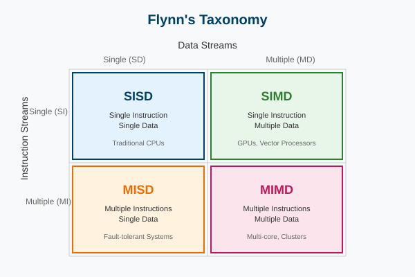

---

## 1. Single Instruction, Single Data (SISD)

**Definition:** A single control unit fetches and executes one instruction at a time, operating on a single data item. Traditional sequential computing.

**Examples:**
- **Classical:** Early computers like Intel 8086 or ENIAC
- **Modern:** Single-core CPUs when running a single thread

**Use Case:** Tasks with no inherent parallelism, such as simple control programs

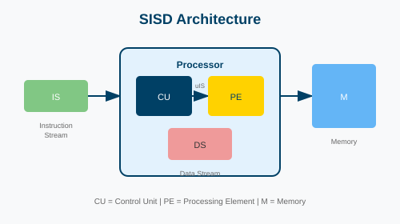

---

## 2. Single Instruction, Multiple Data (SIMD)

**Definition:** A single instruction operates on multiple data elements simultaneously. Ideal for **data-level parallelism**.

**Examples:**
- **Classical:** Cray-1, early vector processors
- **Modern:**
  - GPUs (NVIDIA Hopper/Blackwell, AMD Instinct MI300)
  - CPU SIMD Extensions: Intel AVX-512/AVX10, ARM SVE/SVE2, ARM NEON

**Use Case:** Matrix multiplication, image processing, machine learning

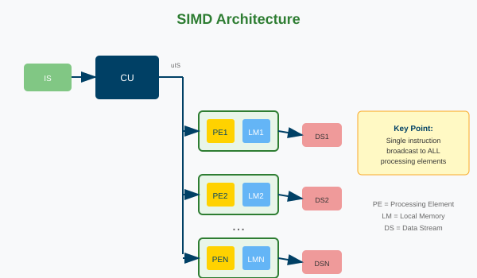

---

## SIMD Characteristics

- **PEs (Processing Elements):** Multiple PEs work in parallel, each processing a portion of the data array
- **Hardware Synchronization:** All PEs synchronized by a single control unit
- **Exploits Data Parallelism:** Same operation applied to different pieces of data simultaneously
- **Spatial Parallelism:** Data stored contiguously for easy parallel access

**Typical Data Structures:** Arrays, matrices, and other contiguous data structures

---

## 3. Multiple Instructions, Single Data (MISD)

**Definition:** Multiple instructions operate on the same data stream. Rare in practice, mostly theoretical.

**Examples:**
- **Theoretical:** Fault-tolerant systems with redundant operations
- **Practical:** Space Shuttle Flight Control Computers, some systolic arrays

**Use Case:** Fault tolerance, niche control systems where outputs are compared for error detection

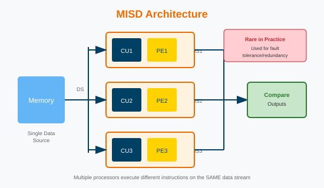

---

## 4. Multiple Instructions, Multiple Data (MIMD)

**Definition:** Multiple processors execute independent instructions on independent data streams. **Most common category for modern parallel computing.**

**Examples:**
- **Classical:** IBM SP-2, Beowulf clusters
- **Modern:**
  - Multi-core Processors: Intel Core i9, AMD Ryzen/EPYC
  - Distributed Systems: AWS clusters, Google TPU pods
  - Supercomputers: El Capitan, Frontier, Aurora (exascale systems)

**Use Case:** High-performance computing (HPC), distributed databases, real-time applications


---

## Flynn Classification Summary

| Category | Definition | Classical Example | Modern Example | Use Case |
|----------|-----------|------------------|----------------|----------|
| **SISD** | Single instruction, single data | Intel 8086, ENIAC | Single-core CPUs | Basic sequential tasks |
| **SIMD** | Single instruction, multiple data | Cray-1 | GPUs (Hopper/Blackwell), AVX-512, TPU v6/v7 | Vector operations, ML |
| **MISD** | Multiple instructions, single data | Fault-tolerant systems | Control systems | Error detection |
| **MIMD** | Multiple instructions, multiple data | IBM SP-2 | Multi-core CPUs, cloud | HPC, distributed systems |

---

## Systolic Arrays

**Definition:** Arrays of processors arranged in a regular, grid-like network. Data flows rhythmically through the array.

**Classification:**
- **SIMD-like:** When same operation is performed on multiple data elements
- **MISD-like:** When different processors perform distinct instructions on same data stream

**Modern Examples:**
- **TPUs (Tensor Processing Units):** Google's TPU v6 (Trillium) uses 256×256 systolic arrays for matrix multiplications, delivering ~918 peak BF16 TFLOPS
- **FPGAs:** Often implement systolic arrays for signal processing or AI inference
- **AI Accelerators:** NVIDIA Tensor Cores, AMD Matrix Cores use similar concepts

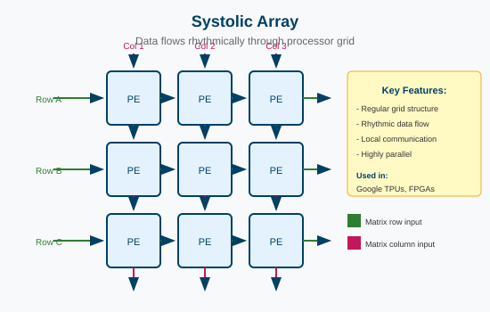

---

## Systolic Array Example: Matrix Multiplication

**3x3 Systolic Array for Matrix Multiplication:**
- Processors arranged in a 2-D grid
- Each processor accumulates one element of the product
- Data flows rhythmically through the array

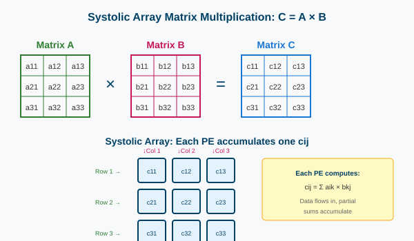

---

## Parallelism Styles in Programs

Three main styles of parallelism in software:

1. **Data Parallelism** - Same operation on multiple data elements
2. **Functional Parallelism** - Independent functions execute concurrently
3. **Pipeline Parallelism** - Tasks overlap their execution

---

## Data Parallelism

**Definition:** Many data elements processed in the **same manner** simultaneously.

**Programming Examples:**
- GPU programming with CUDA/OpenCL
- TensorFlow for neural networks
- NumPy vectorized operations

**Real-World Example:** Image Processing - applying a filter (e.g., Gaussian blur) to every pixel in parallel

**Hardware Connection:** Efficiently implemented on **SIMD architectures** (GPUs, vector processors, CPUs with AVX)

---

## Functional Parallelism

**Definition:** Independent functions or program modules execute concurrently.

**Programming Examples:**
- **Multi-threaded programs:** Web servers handling multiple client requests
- **Data Pipelines:** ETL processes with independent stages
- **Distributed systems:** MapReduce frameworks (Hadoop)

**Real-World Example:** Web servers with separate threads for request parsing, database queries, and response generation

**Hardware Connection:** Best suited for **MIMD architectures** (multi-core CPUs, clusters)

---

## Pipeline Parallelism

**Definition:** Tasks arranged to overlap their execution, reducing idle time.

**Programming Examples:**
- Asynchronous Programming: Python's `asyncio` for I/O-bound operations
- Instruction Pipelines in CPUs: Fetch → Decode → Execute stages overlap

**Real-World Example:** Network packet processing - while one packet is sent, the next is prepared

**Hardware Connection:** Implemented in **pipelined architectures**, common in all modern CPUs

---

## Pipelining

Tasks divided into sequential stages, each performing part of the work.

**Goal:** Increase throughput by overlapping task execution

**Example - Floating Point Addition Pipeline:**

| Stage | Operation |
|-------|-----------|
| **Align** | Align operands to same exponent |
| **Add** | Perform the addition |
| **Normalize** | Adjust result to standard format |

**Performance:** 4 tasks × 3 stages = 6 clocks (pipelined) vs 12 clocks (sequential) = **Up to 3x faster**

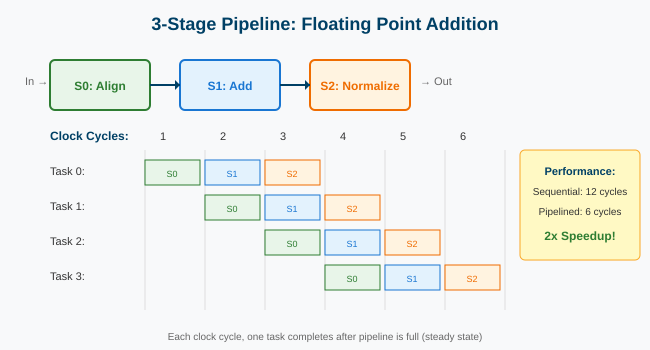

---

## Pipelining: Instruction Pipeline

**Real-World Application - CPU Instruction Pipeline:**

| Stage | Description |
|-------|-------------|
| **IF** (Instruction Fetch) | Retrieve instruction from memory |
| **ID** (Decode) | Interpret the instruction |
| **OF** (Operand Fetch) | Retrieve required data |
| **EX** (Execute) | Perform the operation |
| **WB** (Write Back) | Store results |

**Key Advantage:** Exploits **overlapped/temporal parallelism** to maximize system efficiency

---

## Pipeline Hazards: Data Hazards

**Definition:** Occurs when an instruction depends on the result of a previous instruction that has not yet completed.

**RAW (Read After Write) Example:**
```
ADD R1, R2, R3  // Produces result in R1
SUB R4, R1, R5  // Needs R1 but ADD not finished
```

**Resolution Techniques:**
- **Forwarding/Bypassing:** Use intermediate results directly from pipeline stages
- **Stalling:** Delay dependent instructions until hazard resolves

---

## Pipeline Hazards: Structural Hazards

**Definition:** Occurs when multiple instructions require the same hardware resource simultaneously.

**Examples:**
- Single memory port needed for fetch and write-back
- Multiple instructions requiring the ALU

**Resolution Techniques:**
- **Increase Resources:** Add duplicate units (dual-port memory, multiple ALUs)
- **Stalls:** Serialize access when resources are limited

---

## Pipeline Hazards: Control Hazards

**Definition:** Pipeline is unsure which instruction to fetch next due to branches.

**Example:**
```
BEQ R1, R2, LABEL  // Conditional branch
ADD R3, R4, R5     // Depends on branch outcome
```

**Resolution Techniques:**
- **Branch Prediction:** Modern TAGE predictors achieve 97-98% accuracy; misprediction rates below 2-3%
- **Speculative Execution:** Execute predicted path, discard if wrong
- **Pipeline Flush:** Clear incorrect instructions on misprediction

---

## Operational Models for Parallel Computers

**Basic Categories (Historical Perspective):**
- **SIMD:** Now integrated into modern processors (GPUs, Intel AVX-512, ARM SVE2)
- **MIMD:** Basis for multi-core CPUs and distributed systems
- **Vector Processors:** Concepts live on in SIMD extensions
- **Clusters:** Modern clusters are heterogeneous (CPUs + GPUs + accelerators)

**Modern Systems:** Employ a mix of these models at different architecture levels

---

## SIMD Operational Model

**Key Features:**
- Architecture designed for **data parallelism**
- **Historical (1980s):** Connection Machine, Thinking Machines CM-2
- **Modern:** Integrated into CPUs (AVX-512, ARM SVE2), GPUs (NVIDIA SIMT), AI accelerators

**Technical Features:**
- **Instruction Broadcast:** Microinstructions broadcast to all PEs
- **Hardware Synchronization:** Ensures simultaneous operation
- **Challenge:** Divergence when different elements need different instructions

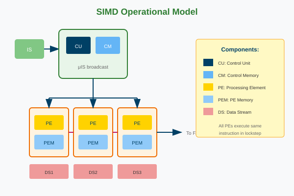

---

## SIMD Components

| Component | Description |
|-----------|-------------|
| **CU (Control Unit)** | Issues microinstructions to all PEs, ensures synchronous execution |
| **CM (Control Memory)** | Stores program/instructions for the CU |
| **PE (Processing Element)** | Data processors with ALU and local memory |
| **PEM (PE Memory)** | Local memory attached to each PE |
| **DS (Data Stream)** | Communication channels between PEs |

---

## SIMD Operation Example: Matrix Averaging

To compute the average of a matrix element with its four neighbors:

1. Each PE is assigned one element, stored in its **PEM**
2. Control unit broadcasts instruction to **shift** data across neighbors
3. Each PE accumulates neighbor values and computes average locally
4. Process repeated for all matrix elements **in parallel**

---

## MIMD Operational Model

**Key Features:**
- **Control/Functional Parallelism:** Parallel execution of independent instructions
- **Asynchronous Operation:** Processors execute independently
- **Synchronization:** Handled in software (OS or application-level)
- Can emulate SIMD using **SPMD** (Single Program, Multiple Data)

**Examples:** HPE Cray EX (Frontier, Aurora), Eviden BullSequana (JUPITER), Fugaku

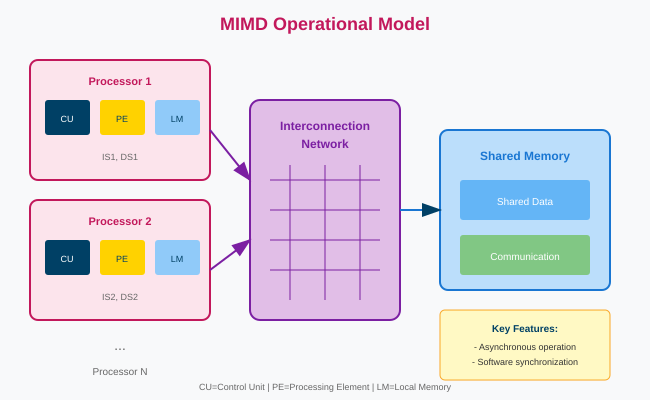

---

## MIMD Components

| Component | Description |
|-----------|-------------|
| **Processor Units** | Each has CU + PE, operates independently |
| **Local Memory (LM)** | Private memory for fast access, reduces contention |
| **Shared Memory** | Global memory accessible by all processors |
| **Interconnection Network** | Bridge between processors and shared memory |

---

## MIMD: How It Works

**Data Access:**
- Processors work on data in **local memory** for fast, independent operation
- Access **shared memory** through interconnection network when needed

**Communication:**
- Shared memory used for communication and synchronization between processors

**Synchronization:**
- Locks, barriers, or semaphores coordinate access to shared memory

---

## MIMD: Advantages and Challenges

| Advantages | Challenges |
|------------|------------|
| **Ease of Programming:** Global address space simplifies data sharing | **Memory Contention:** Processors compete for shared memory access |
| **Fast Local Access:** Reduces contention | **Synchronization Overhead:** Preventing data races adds complexity |
| **Scalability:** With appropriate network | **Network Bottlenecks:** Efficiency depends on network design |

---

## Taxonomy of MIMD

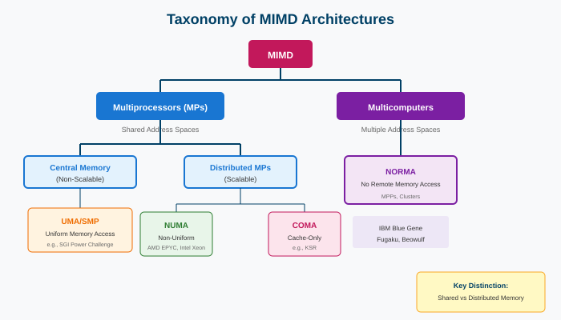

---

## MIMD Memory Architectures

| Type | Description |
|------|-------------|
| **UMA (Uniform Memory Access)** | Memory access time uniform for all processors |
| **NUMA (Non-Uniform Memory Access)** | Access time depends on memory location relative to processor |
| **COMA (Cache-Only Memory Access)** | All local memories are caches; data migrates dynamically |
| **NORMA (No Remote Memory Access)** | Distributed memory; communication via message-passing |

---

## Uniform Memory Access (UMA) / SMP

- Memory access time is **uniform** for all processors
- **Symmetric Multiprocessing (SMP):** All processors have equal access to:
  - Memory
  - Peripherals (I/O devices)
  - Operating System Kernel
- Processors can execute independent tasks or work collaboratively

---

## Non-Uniform Memory Access (NUMA)

**Key Features:**
- **Global Address Space:** LM and GSM mapped into single address space
- **Access Time Hierarchy:**
  - **Fastest:** Local memory (LM)
  - **Medium:** Global shared memory (GSM)
  - **Slowest:** Memory in external cluster

**Examples:** SGI Altix, AMD EPYC, Intel Xeon

---

## Hierarchical NUMA

Multi-level hierarchical memory organization for large-scale systems.

**Memory Access Levels:**
- **Level 1:** Local memory (fastest)
- **Level 2:** Cluster Shared Memory (CSM)
- **Level 3:** Global Shared Memory (GSM) - slowest

**Cluster Organization:**
- Processors grouped into clusters
- Connected via Cluster Interconnection Network (CIN): HPE Slingshot, InfiniBand NDR/XDR, NVLink, CXL

---

## Cache-Only Memory Access (COMA)

A **special case of NUMA** where all local memories are structured as caches.

**Key Features:**
- No fixed "home nodes" - data **migrates** to frequently accessing processors
- COMA caches are much larger than typical L2 caches (expensive)
- Dynamic data migration and replication based on access patterns

**Challenges:**
- **Data Location:** Complex hardware to locate data without home nodes
- **Memory Pressure:** Evicted data has no home, complicating management

---

## Multicomputers (MPPs/Clusters)

**Distributed Memory:**
- Each processor has its **own private memory**
- No shared memory; processors communicate explicitly

**No Remote Memory Access (NORMA):**
- Processors cannot directly access memory of other nodes
- Communication via **Message-Passing Interface (MPI)**
- High-speed interconnects: HPE Slingshot, InfiniBand NDR/XDR, NVIDIA NVLink

**Examples:** El Capitan, Frontier, Aurora, JUPITER, Fugaku

---

## Parallelism Intuitions

Understanding the fundamental concepts that enable and limit parallel execution

---

## A Program's Perspective of Memory

Memory is structured as an array of bytes, each with a unique **address**.

| Address | Value |
|---------|-------|
| 0x0 | 10 |
| 0x1 | 0 |
| 0x2 | 1 |
| ... | ... |
| 0x1F | 255 |

- Byte at address **0x2** contains value **1**
- Byte at address **0x1F (31)** contains value **255**

---

## What Are Caches?

A **cache** is a small, high-speed hardware storage layer that holds frequently accessed data.

**Key Properties:**
- **Transparent to Software:** Does not alter program behavior, only impacts performance
- **On-Chip Storage:** Faster than DRAM (1-5 cycles vs 100+ cycles)
- **Cache Line Granularity:** Data stored in fixed-size blocks (e.g., 64 bytes)

**Two Ways Caches Help:**
- **Temporal Locality:** Recently accessed data likely accessed again
- **Spatial Locality:** Nearby data likely accessed soon

---

## Caches and Data Locality

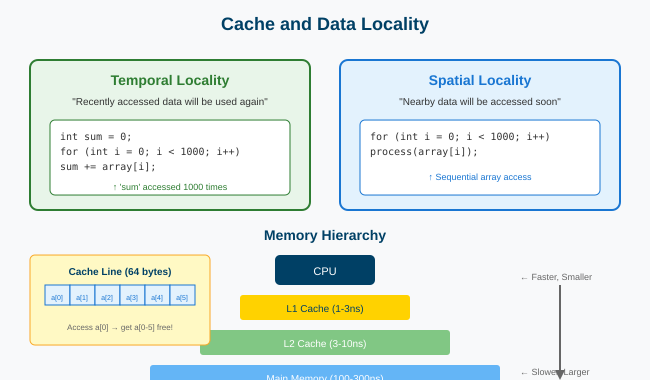

---

## Cache Mapping Policies

**1. Direct-Mapped Cache:**
- Each memory block maps to **exactly one** cache location
- Simple but high conflict misses

**2. Set-Associative Cache:**
- Each memory block maps to a **set** of locations (e.g., 4-way)
- Balanced performance and complexity

**3. Fully Associative Cache:**
- Data can be placed **anywhere** in cache
- Minimal conflicts but high complexity (rarely used for large caches)

---

## Direct-Mapped Cache

**Rule:** Each memory address maps to exactly one cache line

**Mapping Formula:** `Cache Line = (Address / Block Size) % Total Lines`

| Pros | Cons |
|------|------|
| Simple hardware | High conflict misses |
| Fast access time | Inflexible replacement |
| Low power consumption | Poor utilization |

---

## Set-Associative Cache

**Rule:** Each memory address maps to a set (e.g., 2 lines per set)

**Mapping Formula:** `Set = (Address / Block Size) % Total Sets`

| Pros | Cons |
|------|------|
| Reduced conflict misses | Increased complexity |
| Balanced performance | Slightly slower access |
| Flexible replacement (LRU) | Higher power usage |

---

## Fully Associative Cache

**Rule:** Any memory address can map to any cache line

| Pros | Cons |
|------|------|
| Minimal conflict misses | High complexity |
| Optimal replacement | Impractical for large sizes |
| Ideal for small caches (TLB) | Power-intensive |

---

## Instruction-Level Parallelism (ILP)

**Definition:** Executing multiple instructions simultaneously within a single program thread.

**Key Techniques:**
- **Superscalar Execution:** Multiple instructions decoded/executed per cycle
- **Pipelining:** Overlap stages of instruction processing
- **Out-of-Order Execution:** Dynamically reorder instructions to avoid stalls

```
1. a = x + y  ──┐
2. b = z * 2    │ Independent → Can run in parallel
3. c = a + b  ──┘ (Depends on 1 and 2)
4. d = m - n  ──► Independent of 1-3
```

---

## ILP: One Processor, Multiple Execution Units

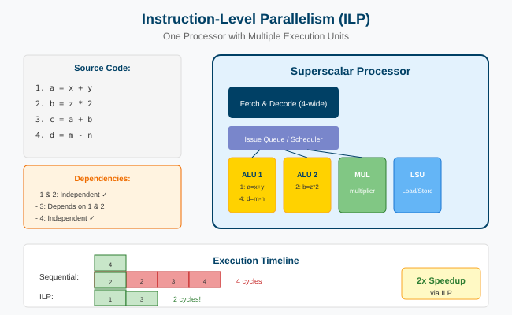

---

## ILP Diminishing Returns

The majority of chip transistors are utilized to enhance the speed of executing a single instruction stream.

**Problems:**
- **Diminishing Returns:** More transistors for ILP yield smaller performance gains
- **Higher Costs:** Complex ILP logic increases design complexity and power
- **Underutilized Potential:** Many workloads lack sufficient parallelism
- **Memory Bottlenecks:** Caches can't fully mitigate memory delays
- **ILP Saturation:** Out-of-order execution faces hard limits

**Better Alternatives:** Transistors better spent on more cores or specialized accelerators

---

## Any Other Ideas for Parallelism?

Beyond ILP, we can exploit parallelism at higher levels:

- **Thread-Level Parallelism (TLP):** Multiple threads on multiple cores
- **Data-Level Parallelism (DLP):** SIMD operations on vectors
- **Task-Level Parallelism:** Distribute tasks across processors

**The Future:** Combining all forms of parallelism to maximize performance

---

## Summary

- **Flynn's Taxonomy** classifies architectures by instruction/data stream multiplicity
- **SIMD** excels at data parallelism; **MIMD** dominates modern computing
- **Pipeline parallelism** increases throughput by overlapping operations
- **Memory hierarchy** (caches) critical for performance
- **ILP** has limits; must look to higher-level parallelism
- Modern systems combine multiple parallelism strategies
