# Parallel Computer Architecture
## Lecture 2: Intuition for Parallelism
### GWU ECE 6125 | Armin Mehrabian | Spring 2026

---

## Parallelism Intuitions

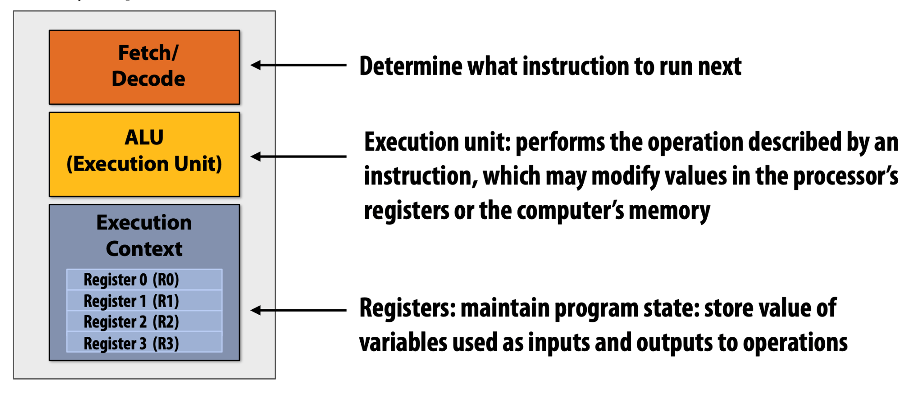

---

## A Program's Perspective of Memory

A computer's memory is structured as an array of bytes.

| Address | Value |
|---------|-------|
| 0x0 | 10 |
| 0x1 | 0 |
| 0x2 | 1 |
| ... | ... |
| 0x1F | 255 |

- Each byte is assigned a unique **address**, which represents its position in the memory array
- (We'll continue assuming the memory is byte-addressable.)

**Examples:**
- The byte at address **0x2** contains the value **1**
- The byte at address **0x1F (31)** contains the value **255**

---

## Cache

**What Are Caches?**

A **cache** is a small, high-speed hardware storage layer that holds frequently accessed data to reduce memory access latency.

**Key Properties of Caches:**

- **Transparent to Software:** Does not alter program behavior. Only impacts performance.
- **On-Chip Storage:** Stores a subset of data from main memory. Faster access than DRAM (e.g., 1-5 cycles vs. 100+ cycles).
- **Cache Line Granularity:** Data stored in fixed-size blocks (cache lines). Example: 4-byte line size.

**Two ways caches help:** Spatial and Temporal locality

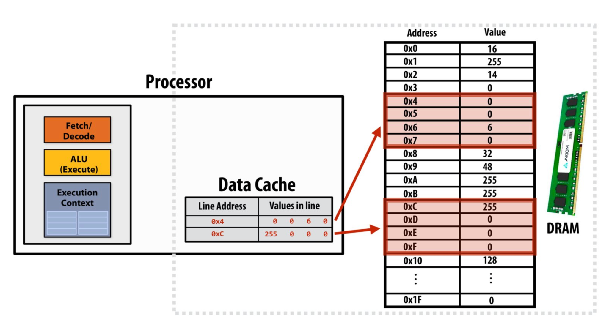

---

## Caches and Data Locality

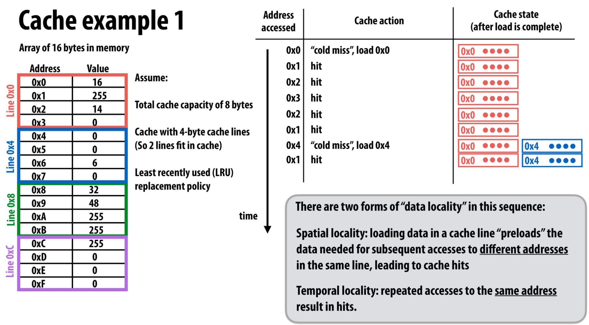

---

## Caches and Data Locality

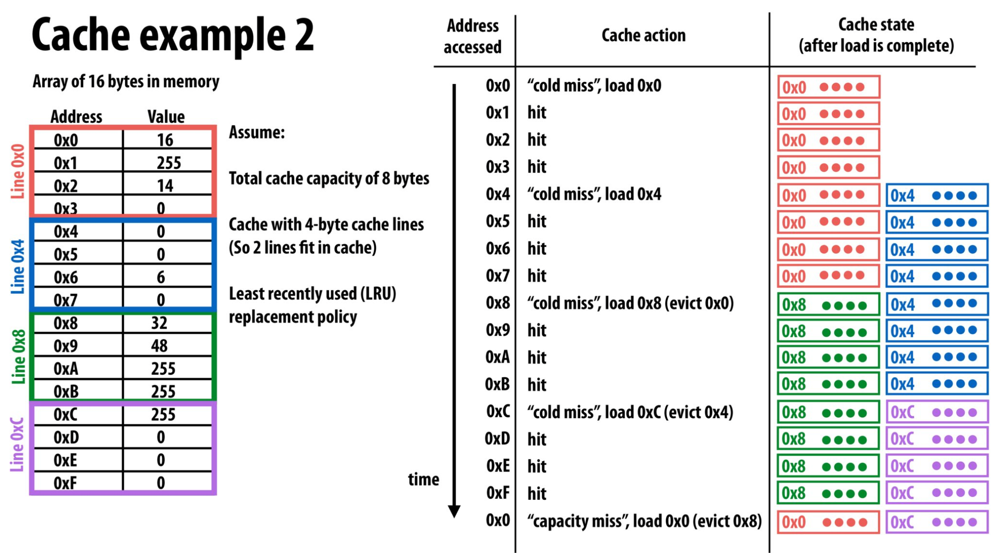

---

## How Does a Processor Decide What Data to Keep in Cache?

**Cache Mapping Policies** (Simplified Overview)

**1. Direct-Mapped Cache**
- Each memory block maps to **exactly one location** in the cache.

**2. Set-Associative Cache**
- Each memory block maps to a **set** of cache locations (e.g., 4-way associative).

**3. Fully Associative Cache**
- Data can be placed **anywhere** in the cache (rarely used).

---

## Direct-Mapped Cache

**Rule:** Each memory address maps to **exactly one cache line**

**Example:**
- Cache Size: 4 lines (0-3)
- Memory Addresses: 0x00, 0x04, 0x08, 0x0C

**Mapping Formula:** `Cache Line = (Address / Block Size) % Total Lines`

| Pros ✅ | Cons ❌ |
|---------|---------|
| **Simple hardware:** Easy to implement (no complex search logic) | **High conflict misses:** Multiple addresses compete for the same cache line |
| **Fast access time:** Fixed mapping means no decision-making overhead | **Inflexible replacement:** No choice in eviction—forced replacement on collision |
| **Low power consumption:** Minimal circuitry required | **Poor utilization:** Frequently accessed blocks may evict each other |

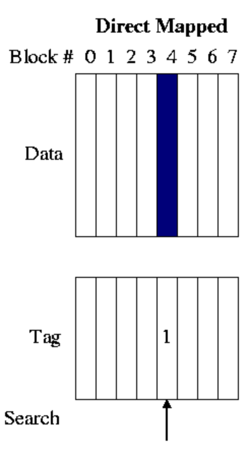

---

## Set-Associative Cache

**Rule:** Each memory address maps to a **set** (e.g., 2 lines per set)

**Example:**
- Cache: 4 sets × 2 lines = 8 total lines
- Memory Addresses: 0x00, 0x08, 0x10

**Mapping Formula:** `Set = (Address / Block Size) % Total Sets`

| Pros ✅ | Cons ❌ |
|---------|---------|
| **Reduced conflict misses:** Multiple slots per set reduce collisions | **Increased complexity:** Additional logic to manage sets and replacement policies |
| **Balanced performance:** Better hit rate than direct-mapped, simpler than fully associative | **Slower than direct-mapped:** Slightly longer access time due to set search |
| **Flexible replacement:** Policies like LRU can be applied within a set | **Higher power usage:** More circuitry for tag comparison |

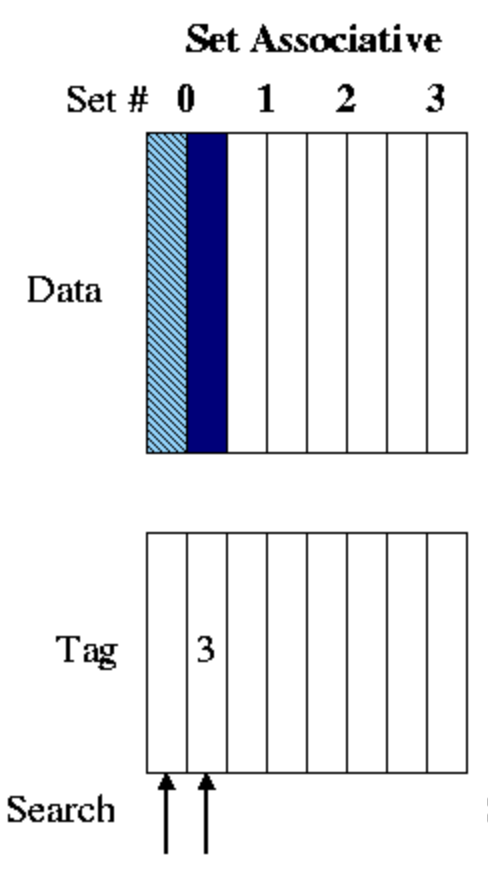

---

## Fully-Associative Cache

**Rule:** Any memory address can map to **any cache line**

**Example:**
- Cache Size: 4 lines
- Memory Addresses: 0x00, 0x04, 0x08, 0x0C, 0x10

| Pros ✅ | Cons ❌ |
|---------|---------|
| **Minimal conflict misses:** Any block can occupy any cache line | **High complexity:** Requires searching all entries for a match (slow) |
| **Optimal replacement:** Global LRU policy maximizes cache utilization | **Impractical for large sizes:** Hardware cost grows exponentially with cache size |
| **Flexibility:** Ideal for small, high-priority caches (e.g., TLB) | **Power-intensive:** Parallel tag comparison consumes significant energy |

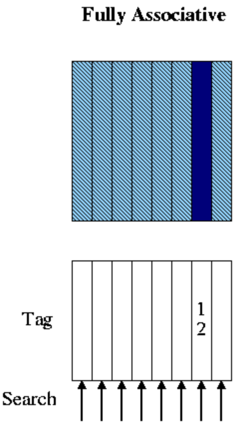

---

## Example Program

```c
int main() {
    int result = 1;
    for (int i = 0; i < 10; i++) {
        result = result * 2;
    }
    printf("%d\n", result);
    return 0;
}
```

**Compiled to assembly:**
```
ld   r0, addr[r1]
───────────────────────────────
mul  r1, r0, r0
───────────────────────────────
mul  r1, r1, r0
───────────────────────────────
...
───────────────────────────────
st   addr[r2], r0
```

---

## Program Execution Visualization

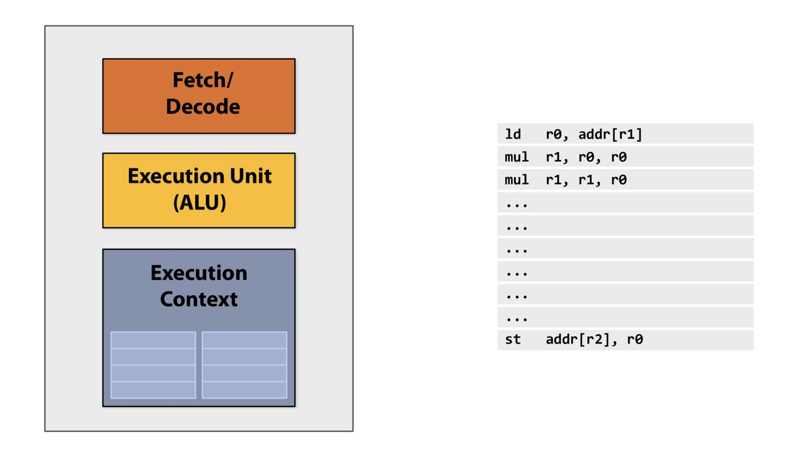

---

## Instruction Pipeline

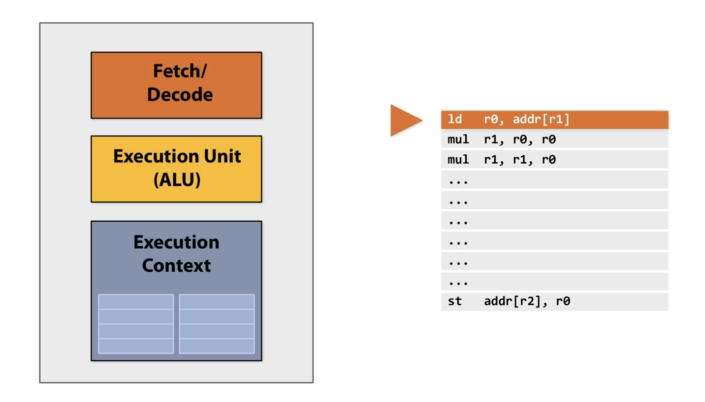

---

## Pipeline Stages

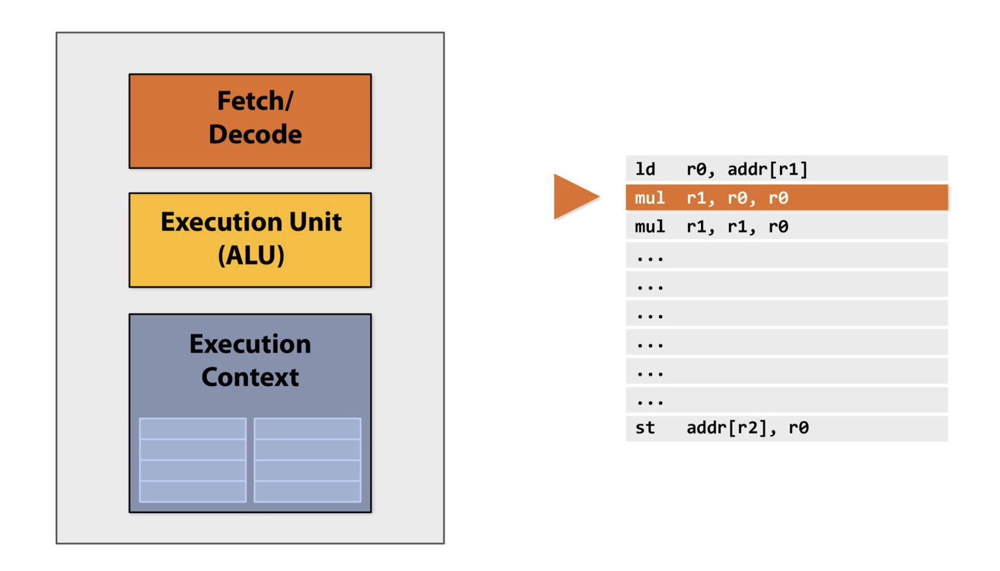

---

## Pipeline Hazards

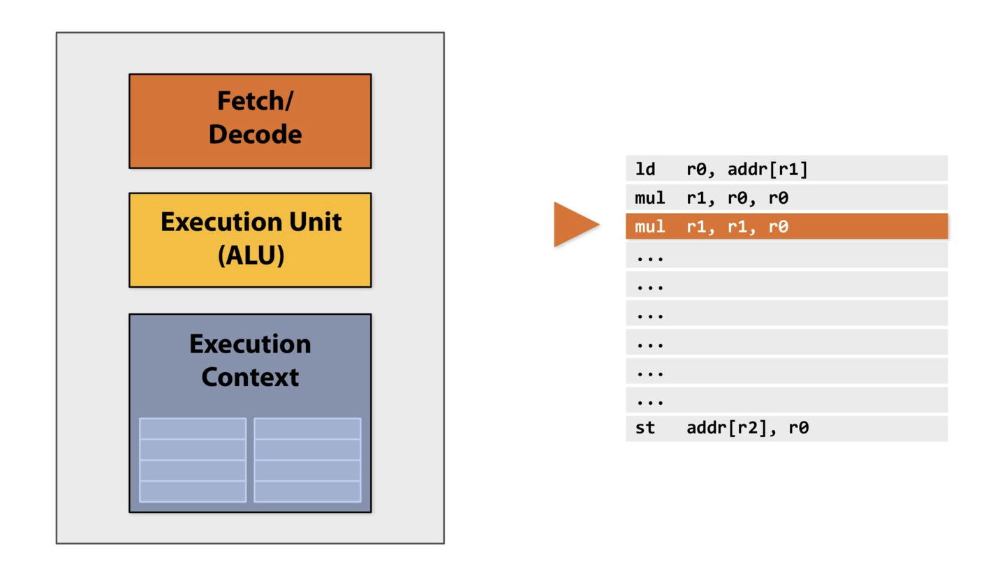

---

## First Attempt at Parallelism (ILP)

**Instruction-Level Parallelism (ILP):** Executing multiple instructions simultaneously within a single program thread.

**Key Techniques:**

- **Superscalar Execution:** Multiple instructions decoded/executed per clock cycle. Example: Intel/AMD processors.
- **Pipelining:** Overlap stages of instruction processing (Fetch, Decode, Execute, Writeback).
- **Out-of-Order Execution:** Dynamically reorder instructions to avoid stalls.

```
1. a = x + y  ──┐
2. b = z * 2    │ Independent → Can run in parallel
3. c = a + b  ──┘ (Depends on 1 and 2)
4. d = m - n  ──► Independent of 1-3
```

---

## Example Program with ILP

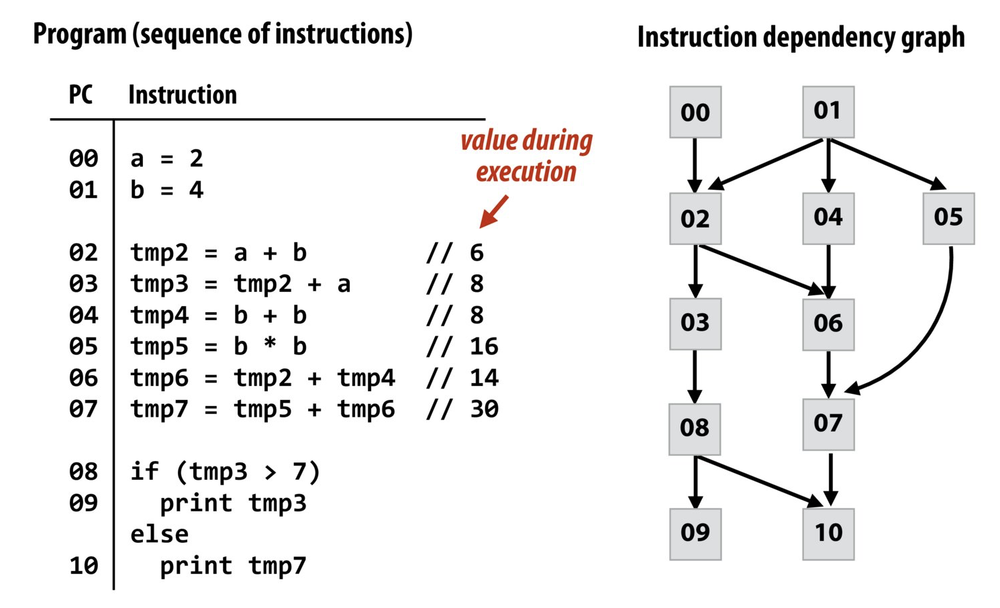

---

## ILP: One Processor, Multiple Execution Units

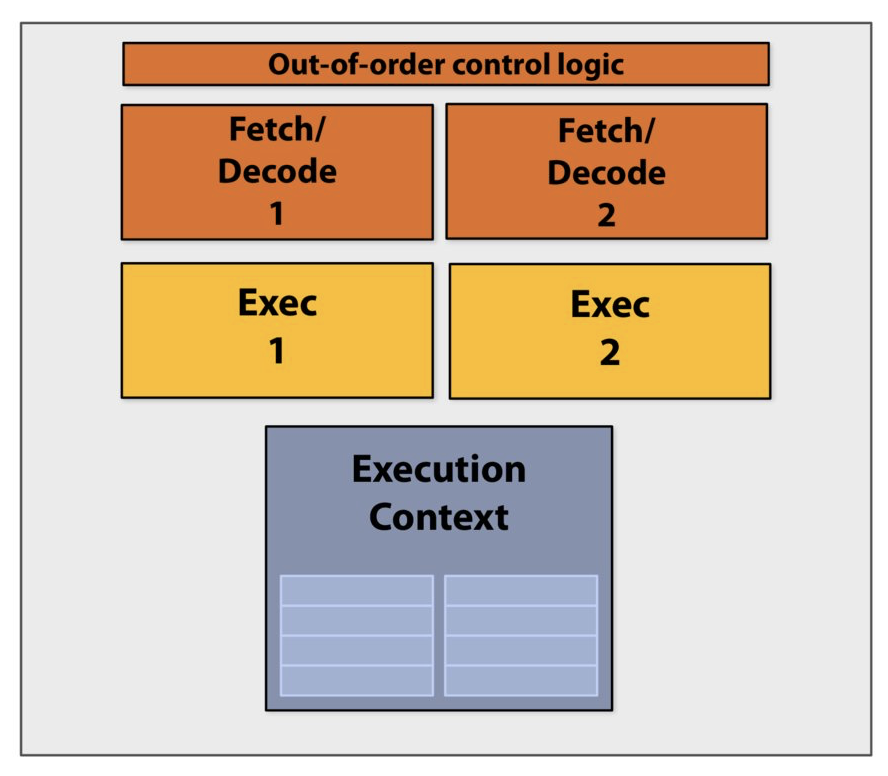

---

## Example Program

**Inputs (x):** A single 1D array containing **both masses and velocities** for the 2D grid:
- The first half of x contains **mass values** (`x[index]`)
- The second half contains **velocity values** (`x[index + M]`)
- Organized in a row-major format for a grid with dimensions **N × M**

**Outputs (y):** A 1D array where each element represents the **total kinetic energy** for a row in the grid.
- `y[i]` corresponds to the total energy for the i-th row.

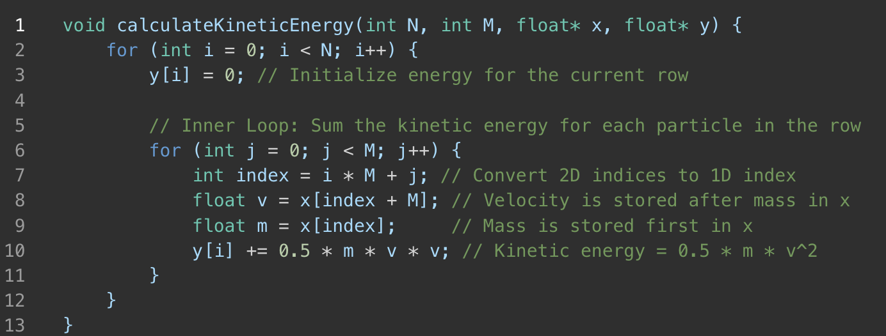

---

## Example Program


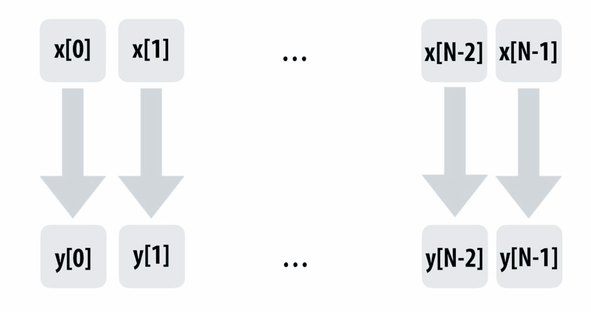

---

## Example Program

**Compile the program → Sequence of Instructions**


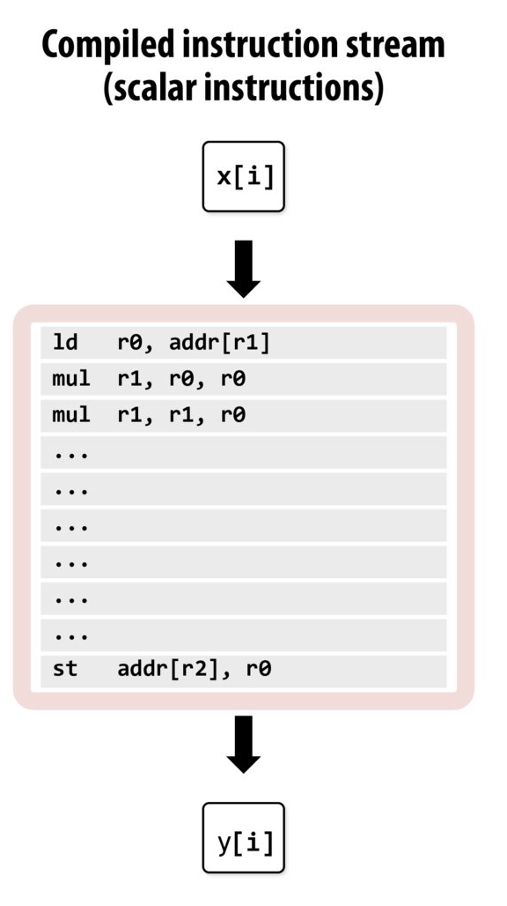

---

## Example Program


---

## Example Program: ILP

**Dependency!**


---

## ILP vs Higher Level Parallelism

**Is there any parallelism left here?**


---

## ILP Diminishing Return

The majority of chip transistors are utilized to enhance the speed of executing a single instruction stream.

- **Diminishing Returns:** More transistors for ILP features yield smaller performance gains as ILP approaches its limits.
- **Higher Costs:** Complex ILP logic increases design complexity, power usage, and manufacturing costs.
- **Underutilized Potential:** Many workloads lack sufficient parallelism to fully benefit from advanced ILP optimizations.
- **Better Alternatives:** Transistors could be better spent on more cores or specialized accelerators.
- **Memory Bottlenecks:** Larger caches and smarter predictors can't fully mitigate memory access delays.
- **ILP Saturation:** Techniques like out-of-order execution face hard limits on their effectiveness.


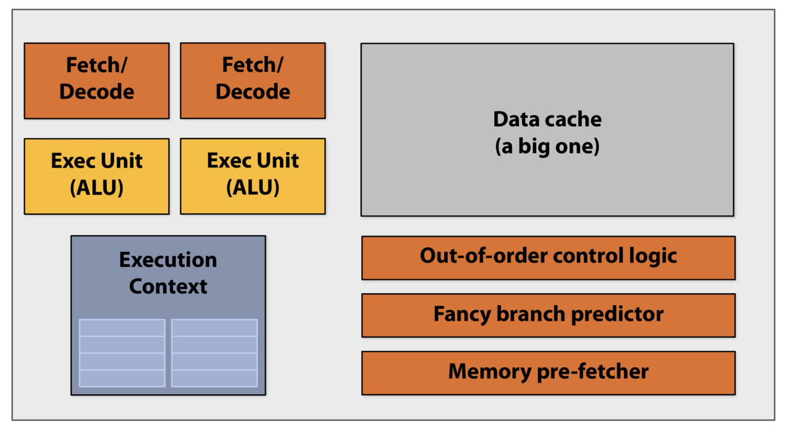

---

## Parallelism

**Any other idea for parallelism?**

---

## Many-Core vs Single-Core

**Old Approach: Enhancing Single-Core Performance**
- More transistors → Faster execution of one instruction stream.
- Techniques: Out-of-order execution, speculative operations.

**New Approach: Multi-Core Processing**
- More transistors → More cores, not just a faster single core.
- Enables parallel execution, better efficiency, and scalability.
- **Simpler cores:** each core may be slower at running a single instruction stream than our original "fancy" core (e.g., 25% slower) But there are now two cores: 2 × 0.75 = 1.5 (potential for speedup!)


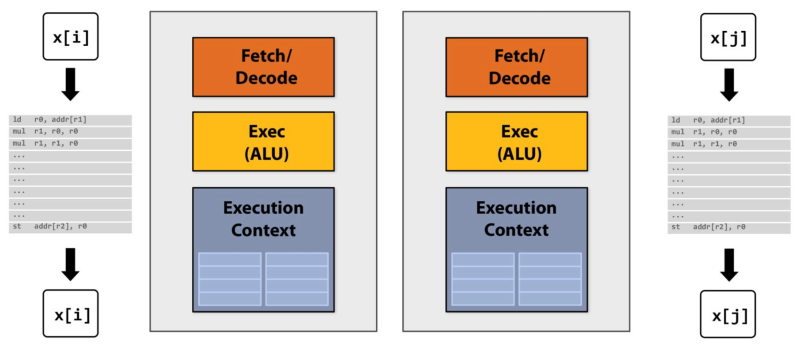

---

## But, No Parallelism Expressed in the Code

This C program compiles into a single instruction stream that executes on one thread and one processor core.

Simple processor cores was 25% slower than the original single complicated one, our program now runs 25% slower than before.


---

## Spawning Multiple Threads

We can create two threads which generates two instruction streams.

**"We"** the **programmer**, or sometimes **compiler** has the knowledge that, which parts of the code is **parallel**.

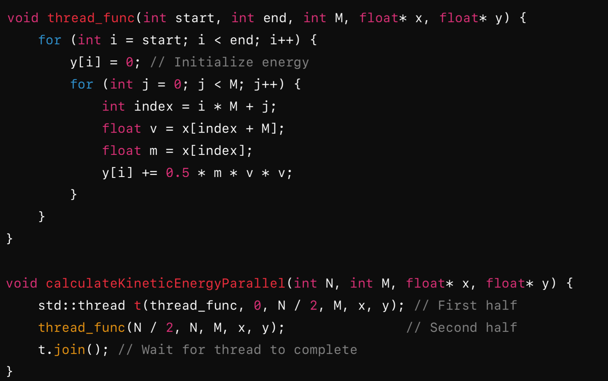

---

## 4 Cores → 4 Instruction Streams

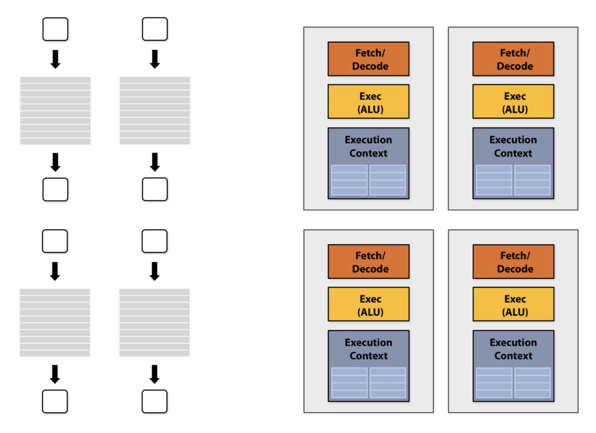

---

## 16 Cores → 16 Instruction Streams

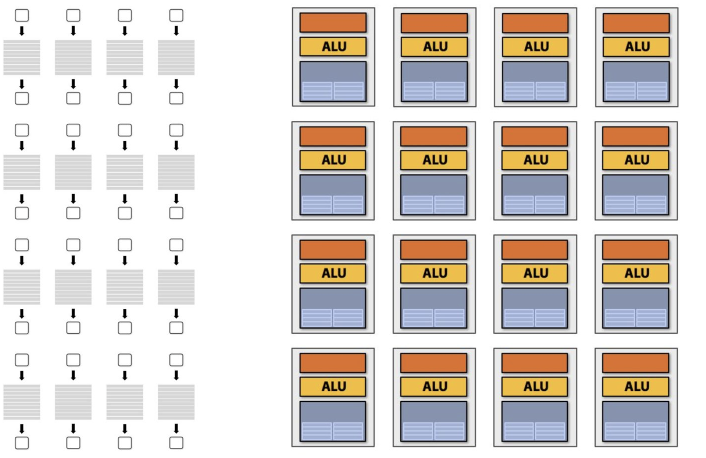

---

## Spawning Multiple Threads

Parallelism is across iterations of the loop. The iterations of the loop carry out the **exact same sequence of instructions** (defined by the loop body).

But on **different input data** given by x.


---

## Data-Level Parallelism (DLP) with SIMD

**Key Concept: Parallelism Across Loop Iterations**
- Executes the **same instructions** for each loop iteration.
- Operates on **different input data** (e.g., array `x[i]`).

**SIMD Architecture:**
- **Fetch/Decode Unit:** Fetches and decodes the instructions once for all iterations.
- **ALUs (Arithmetic Logic Units):** Execute the same operation (e.g., multiplication) on multiple data points in parallel.
- **Execution Context:** Stores the input data and states for all ALUs.

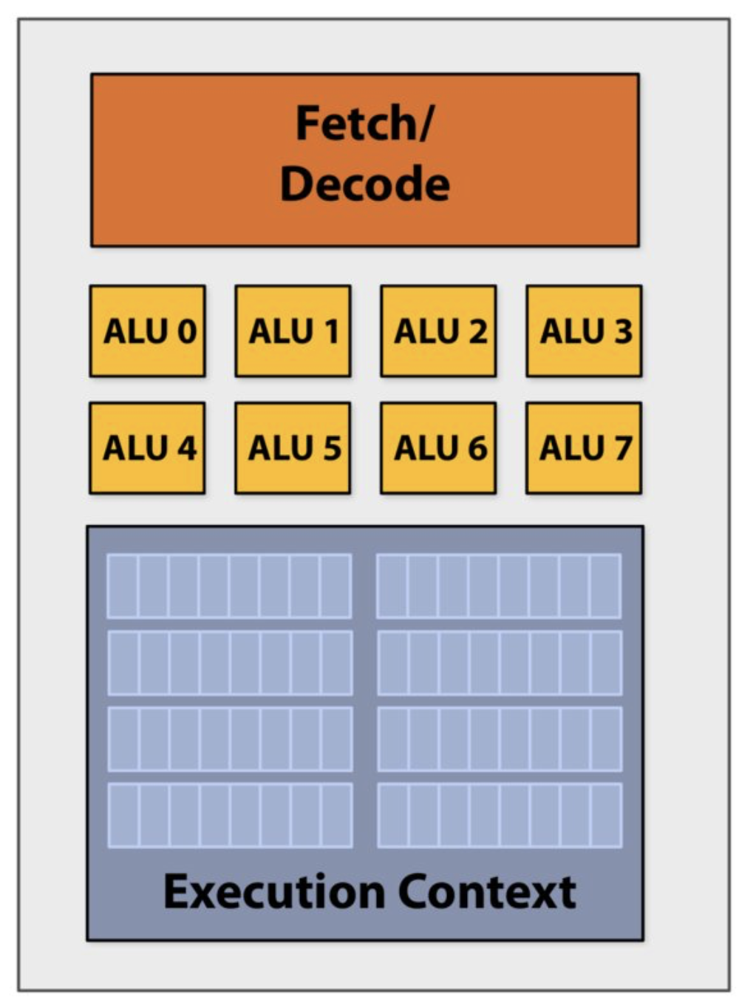

---

## Single-Core vs. Data-Parallel

**Sequential** vs **Vector Program**

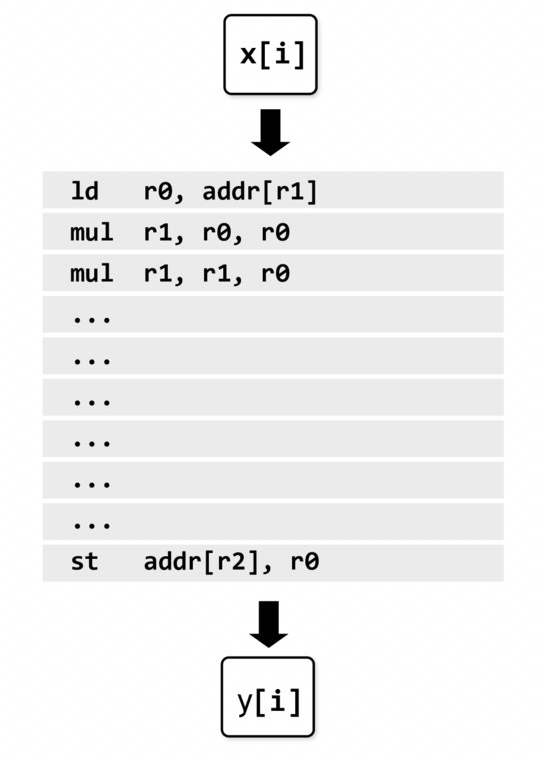

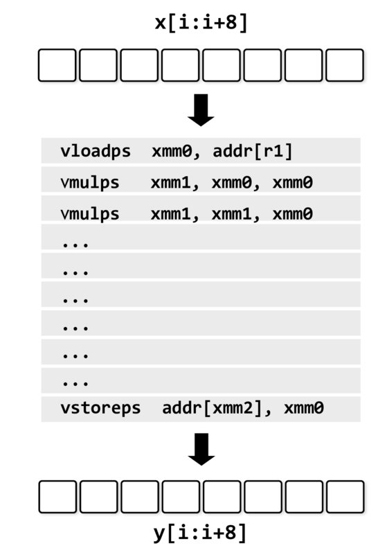

---

## Single-Core vs. Data-Parallel

**Sequential** vs **Vector program (using AVX intrinsics)**

- **AVX Parallelism:** Processes 8 floating-point values simultaneously using 256-bit registers, significantly accelerating operations like multiplication and addition.
- **Loop Vectorization:** Replaces the inner loop with SIMD instructions to compute kinetic energy for multiple particles in parallel, reducing iterations and improving efficiency.

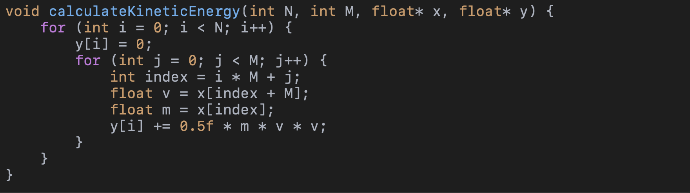

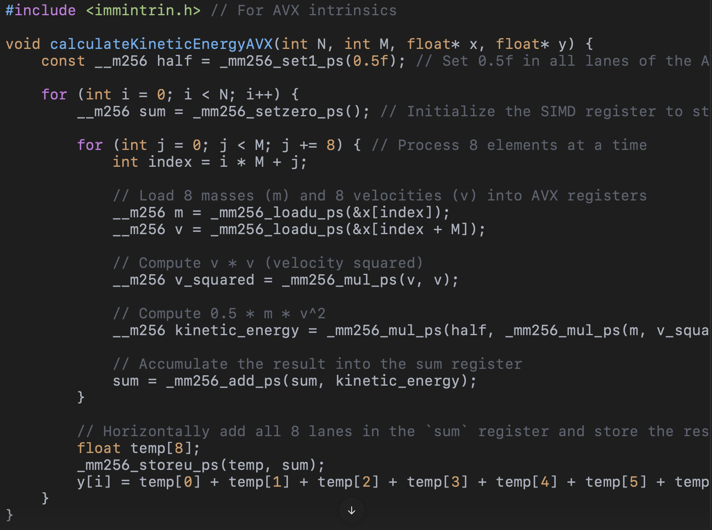

---

## Intel Multi-Core: Alder Lake 2022

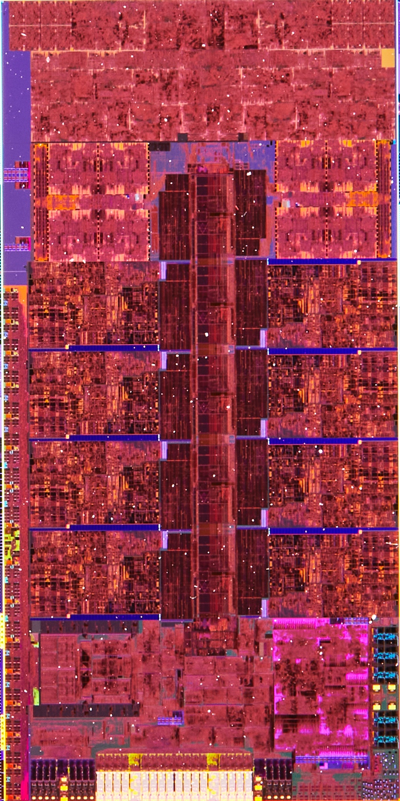

*Source: https://x.com/aschilling/status/1453391035577495553/photo/2*

---

## Intel Multi-Core: Alder Lake 2022

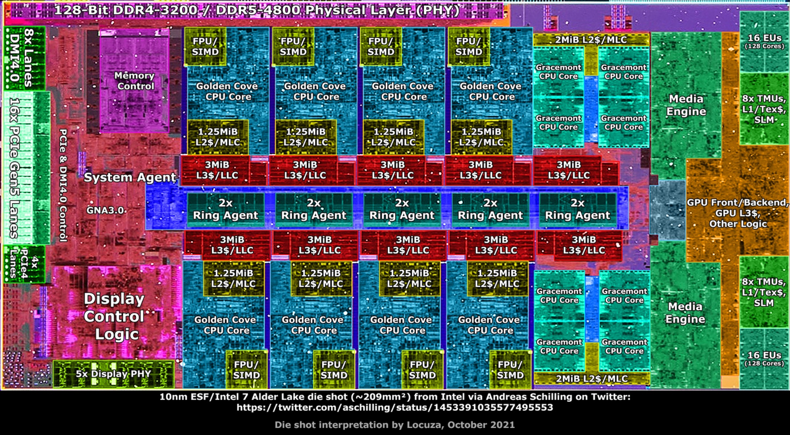

*Source: https://x.com/aschilling/status/1453391035577495553/photo/2*

---

## NVIDIA V100 Architecture

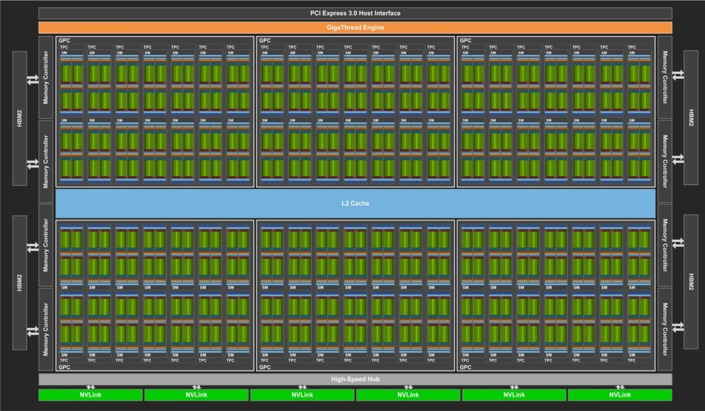

*Source: https://images.nvidia.com/content/volta-architecture/pdf/volta-architecture-whitepaper.pdf*

---

## Apple A18 Pro

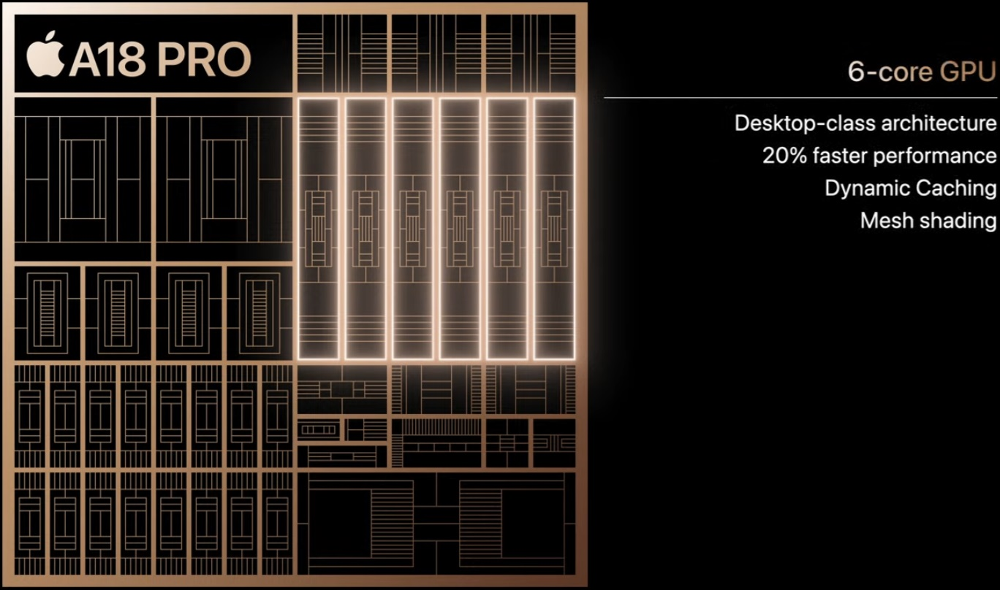

*Source: https://images.nvidia.com/content/volta-architecture/pdf/volta-architecture-whitepaper.pdf*

---

## 16 SIMD Cores: 128 Elements in Parallel

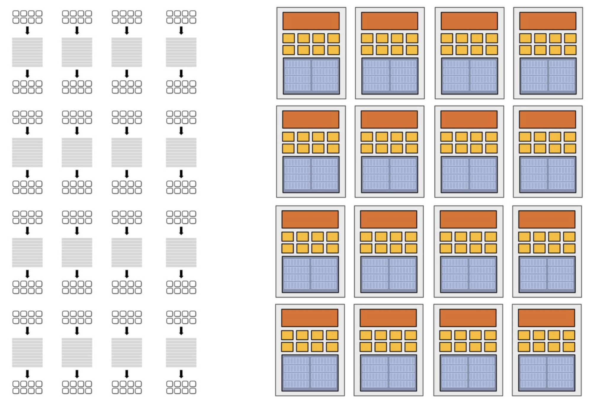

---

## Modern Multi-Core Examples

**SIMD Instruction Sets:**
- **Intel AVX2:** 256-bit operations
  - Handles 8×32-bit floats or 4×64-bit doubles per instruction.
- **Intel AVX-512:** 512-bit operations
  - Processes 16×32-bit floats or 8×64-bit doubles.
- **ARM NEON:** 128-bit operations
  - Supports 4×32-bit floats or 2×64-bit doubles.

**Compiler-Generated SIMD:**
- **Programmer-Controlled Parallelism:** Explicit SIMD via intrinsics (e.g., `_mm256_mul_ps`). Parallel languages like forall convey intent.
- **Auto-Vectorization:** Compilers analyze loops for dependencies and generate SIMD instructions automatically.

---

## Implicit vs Explicit SIMD

| Aspect | Implicit SIMD | Explicit SIMD |
|--------|---------------|---------------|
| **Definition** | Compiler generates scalar instructions; hardware executes SIMD | Programmer explicitly requests SIMD using intrinsics or vectorized code |
| **Control** | Managed by the **hardware** at runtime | Managed by the **programmer** at compile time |
| **Parallelism** | Executes the same instruction for multiple program instances on different data | SIMD registers (e.g., AVX, Neon) operate on multiple data points in parallel |
| **Examples** | Used in **GPUs** (e.g., NVIDIA, AMD) with wide SIMD lanes | Used in **CPUs** with AVX, AVX-512, or ARM Neon intrinsics |
| **Optimization** | Performance depends on the hardware's ability to manage **divergence** | Programmer optimizes **loop unrolling and vector operations** for performance |
| **Key Advantage** | Easier for programmers but can lose efficiency due to **thread divergence** | **Higher efficiency** if optimized correctly for the architecture |

---

## Three Forms of Parallelism

**Superscalar Processing:**
- Executes multiple instructions from the same instruction stream in parallel within a single core.
- The hardware dynamically identifies and exploits instruction-level parallelism (ILP) during execution.

**SIMD (Single Instruction, Multiple Data):**
- Uses multiple ALUs that operate under the control of a single instruction, executing the same operation on multiple data points in parallel within a core.
- Well-suited for data-parallel workloads, reducing control overhead across many ALUs.
- Vectorization can be performed by the compiler (explicit SIMD) or by the hardware at runtime (implicit SIMD).

**Multi-Core Processing:**
- Employs multiple processor cores to execute different instruction streams concurrently.
- Enables thread-level parallelism, where software creates and manages threads to expose parallelism to the hardware (e.g., via threading APIs).

**YOU CAN COMBINE ALL THREE FOR MORE PARALLELISM**

---

## Hiding Stall With Multi-Threading

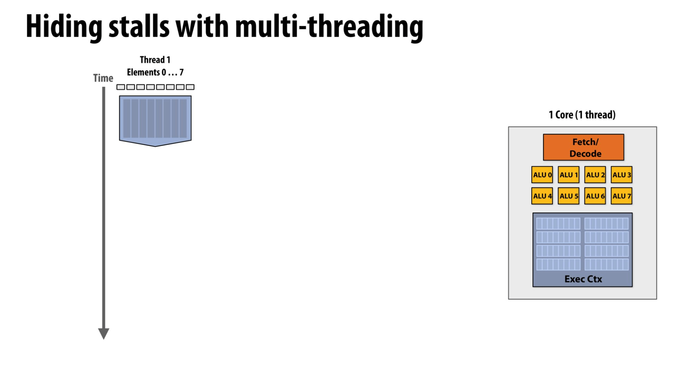

---

## Hiding Stall With Multi-Threading

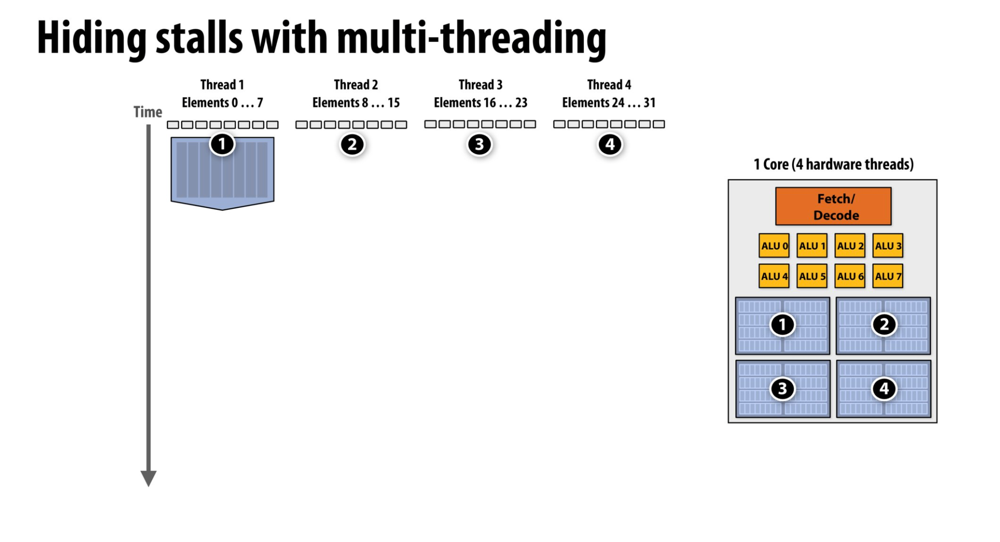

---

## Hiding Stall With Multi-Threading

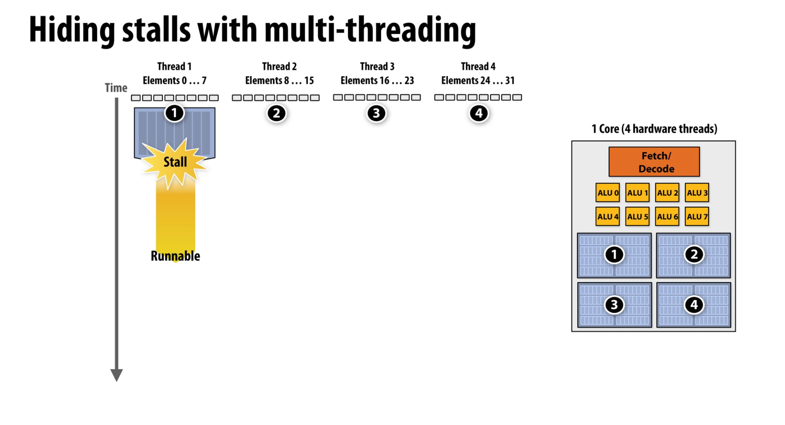

---

## Hiding Stall With Multi-Threading

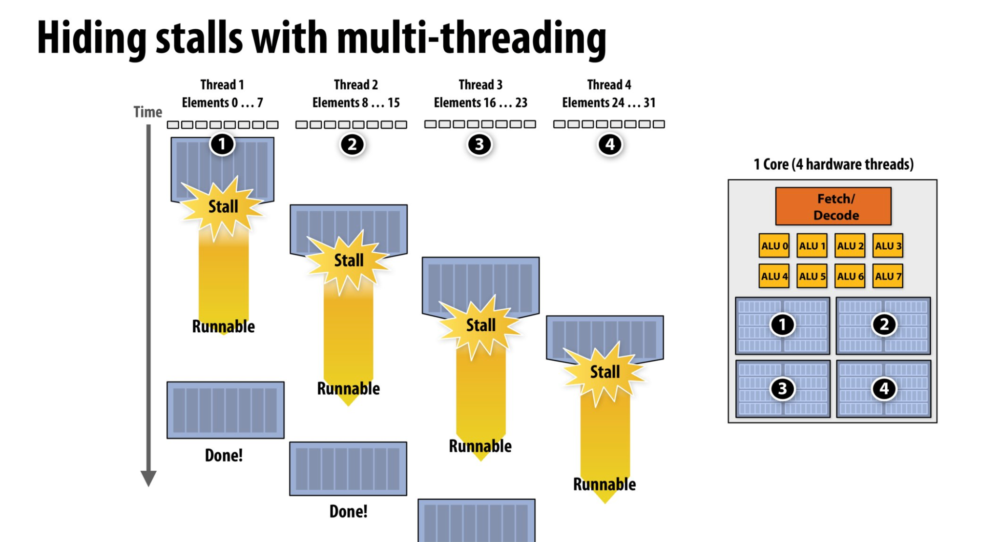

---

## Hiding Stall With Multi-Threading

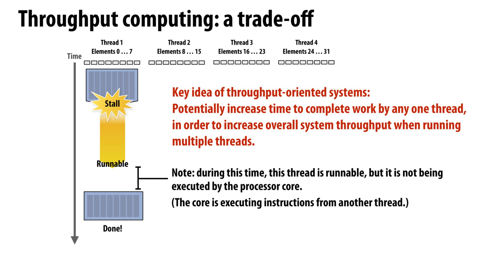

---

## Expanding the Execution Context

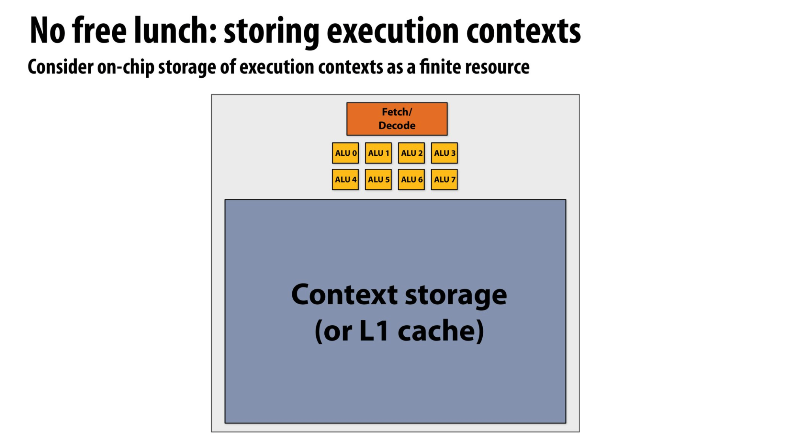

---

## Large Context vs. Many Small Contexts

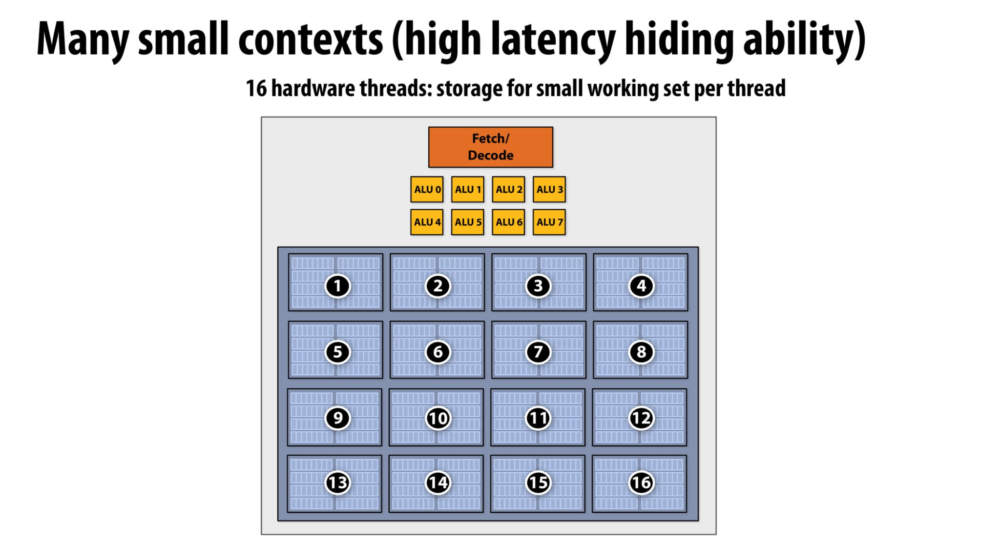

---

## Utilizing One Core: One Thread

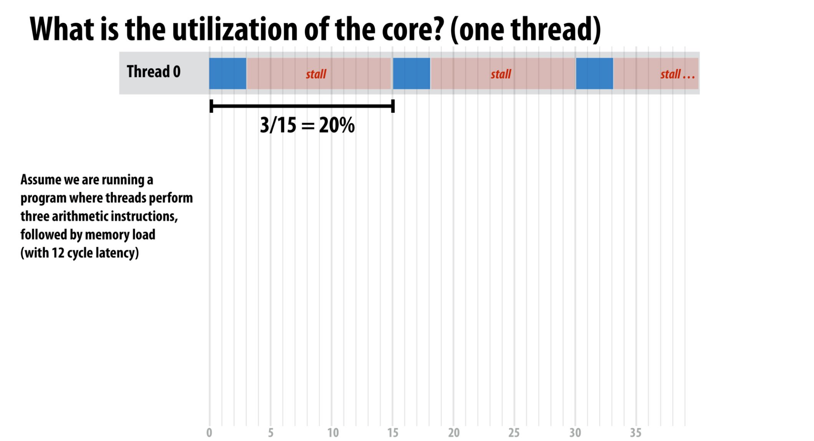

---

## Utilizing One Core: Two Threads

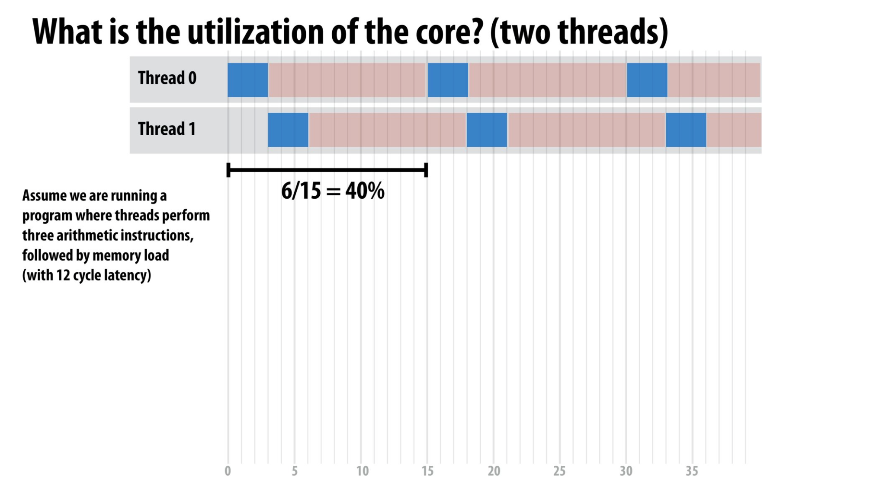

---

## Utilizing One Core: Five Threads

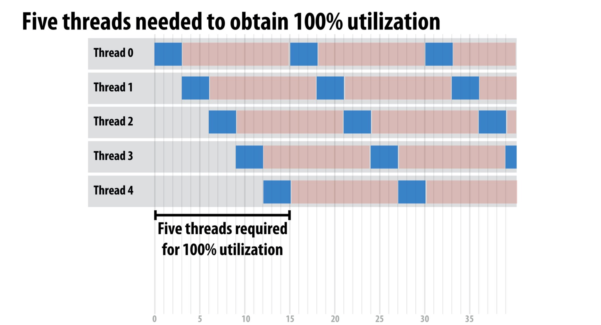

---

## Utilizing One Core: Thread > 5

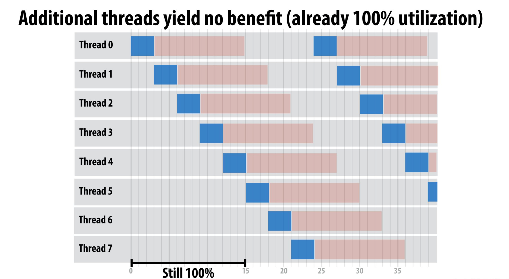

---

## Utilization of Compute-Heavy Computation

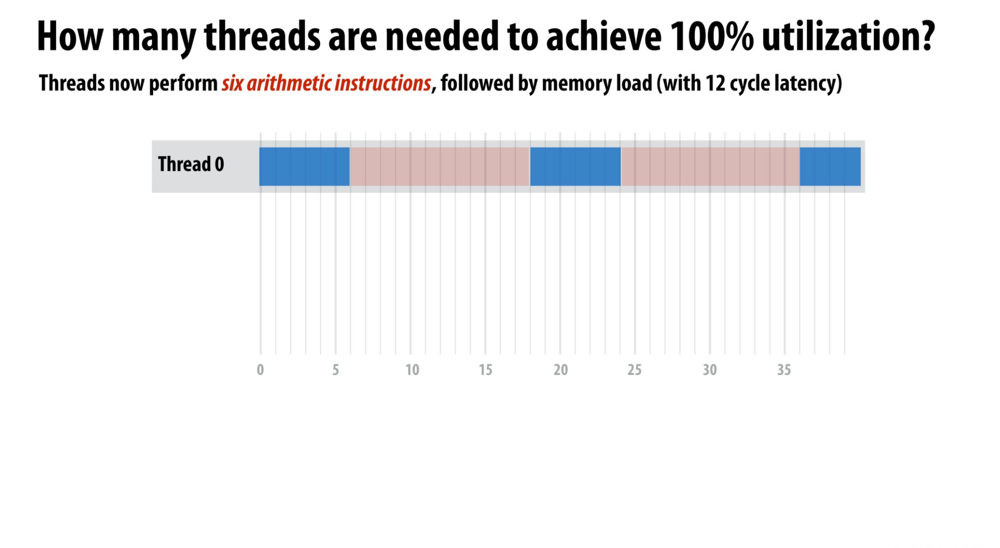

---

## Utilization of Compute-Heavy Computation

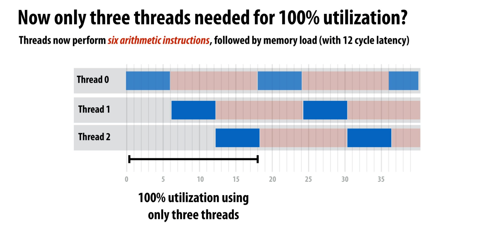

---

## Multithreading and Stalls

A processor equipped with multiple hardware threads can **reduce idle time (stalls)** by executing instructions from other threads while one thread is waiting for a high-latency operation, such as a memory access.

Importantly, **multithreading does not decrease the latency** of the operation itself; multithreading ensures that the processor's resources remain **utilized** by switching to other ready-to-run threads.

**Problem Without Multithreading:**
- In single-threaded processors, when a thread encounters a **high-latency operation** (e.g., fetching data from memory), the processor sits idle, wasting valuable resources.

**How Multithreading Solves This:**
- By maintaining **multiple active threads**, the processor can switch to another thread and continue executing instructions while waiting for the stalled thread to resume.
- This technique improves **processor utilization** and reduces the impact of stalls.

---

## Compute vs. Memory

A multi-threaded processor reduces the impact of memory latency by performing arithmetic operations from other active threads while waiting for memory access to complete.

Programs with a **higher ratio of compute to memory** require fewer threads to effectively hide memory stalls, as they spend more time computing and less time waiting for memory.

**Memory Latency and Stalls:**
- Accessing data from memory can introduce significant delays, stalling the processor.

**Compute-to-Memory Ratio:**
- Programs with **intensive arithmetic computations** per memory access are naturally less affected by memory latency.

**Implication:**
- For memory-bound programs, adding more threads is crucial to hide latency effectively.
- For compute-heavy programs, fewer threads can achieve high processor utilization.

---

## Hardware-Supported Multi-Threading

**1. Core Manages Multiple Threads**
- The core still has the same **ALU resources**, but multi-threading helps utilize them more efficiently by mitigating high-latency operations like memory access.
- The **processor decides** which thread to run in each clock cycle, ensuring better resource utilization.

**2. Interleaved Multithreading (Temporal Multi-Threading)**
- At every clock cycle, the core **switches between threads**, selecting one to run its instructions on the ALUs.
- Example: **Rotating thread scheduling** where one thread runs while others wait.

**3. Simultaneous Multithreading (SMT)**
- At each clock cycle, the core executes instructions from **multiple threads simultaneously** on available ALUs.
- Example: **Intel Hyper-Threading** enables **2 threads per core** to share resources and execute concurrently.

---

## Intel Skylake

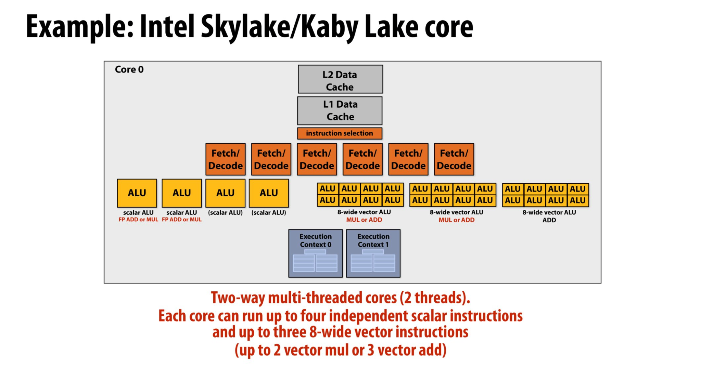

---

## NVIDIA Tesla V100

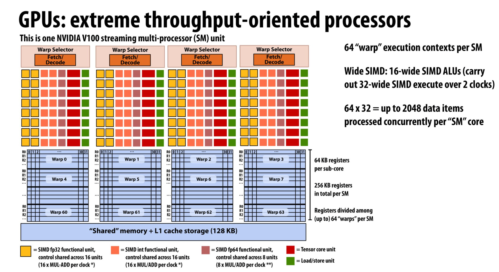

---

## References

- "Introduction to Parallel Computing" by Ananth Grama, Anshul Gupta, George Karypis, and Vipin Kumar
- "Computer Architecture: A Quantitative Approach" by John L. Hennessy and David A. Patterson
- Stanford CS149
- Highly recommended: https://www.youtube.com/watch?v=V1tINV2-9p4&list=PLoROMvodv4rMp7MTFr4hQsDEcX7Bx6Odp
