# Parallel Computer Architecture
## Lecture 3: Interconnect Networks 1
### Basics & Topology
### GWU ECE 6125 | Armin Mehrabian | Spring 2026

---

## Scalable Interconnect Network

**Key Issues:**

- **Topology:** Network structure and its impact on performance
- **Mathematical Formulation & Properties**
- **Self-routing capability:** Packets determine their own path dynamically
- **Partitioning strategies:** Dividing network resources for efficiency and fault tolerance
- **Algorithm mapping & embedding:** Placing computational tasks onto the network to optimize communication
- **Traffic Flow Management:** Handling congestion and efficient data movement
- **Link Technologies:** Electrical vs. Optical links and their trade-offs

**Evaluation Metrics:**
- **Performance:** Latency, bandwidth, scalability, fault tolerance
- **Cost:** Trade-offs in complexity, power, and implementation

---

## Scalable Interconnect Network

**Communication Overhead:** Must be minimized for efficiency

**Communication-to-Computation Ratio:**
- Should remain low to maximize computational efficiency
- Determines network bandwidth requirements
- Affected by workload patterns (localized vs. dispersed, bursty vs. uniform)

**Key Trade-offs in Programming Models:**
- **Granularity of Transfer:** Impacts efficiency; smaller transfers increase overhead
- **Amortization:** Cost distribution over multiple operations
- **Bandwidth vs. Latency:** Balancing data transfer rate and response time
- **Communication & Computation Overlap:** Hiding latency through concurrent execution

---

## Basic Definitions: Network Interface Controller (NIC)

The **Network Interface Controller (NIC)**, also called the **Host Interface**, is the gateway between a compute node and the interconnect network.

**Primary Responsibilities:**
- Connects a computer node (CPU, memory) to the network fabric
- Manages **bidirectional traffic** -- data flows both to and from the network
- Offloads communication tasks from the CPU, improving overall system efficiency

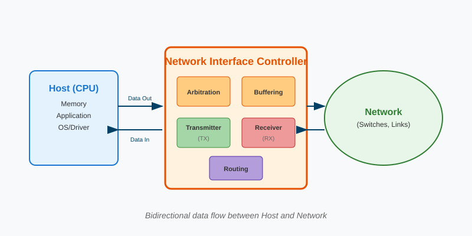

---

## NIC Key Functions

**1. Arbitration**
- Decides **when** and **which** data gets access to shared network resources
- Prevents collisions when multiple requests compete for the same output port
- Uses policies like round-robin, priority-based, or age-based scheduling

**2. Buffering**
- Temporarily stores incoming/outgoing data in queues
- Absorbs **burst traffic** to prevent data loss during congestion
- Enables **rate matching** between fast CPUs and slower network links

**3. Routing**
- Determines the **path** packets take through the network
- May perform simple table lookups or complex adaptive routing decisions
- In some designs, routing is handled by switches instead of the NIC

---

## Basic Definitions: Links / Channels / Cables

**Links / Channels / Cables**

- Physical connections between two hardware units
- Typically a **bundle of wires or optical fibers** carrying signals
- **Transmitter** converts digital data into an analog signal
- **Receiver** converts analog signals back into digital data
- Collectively form a **channel** for digital information flow

---

## Basic Definitions: Switches

**Switches** are the traffic directors of the network -- they receive packets and forward them toward their destination.

- Connect a fixed number of **input** and **output** channels/links
- Each **input port** has a **receiver (RX)** and **input buffer** to hold incoming data
- Each **output port** has a **transmitter (TX)** to send data out
- The **switching fabric** (often a crossbar) steers packets from any input to any output

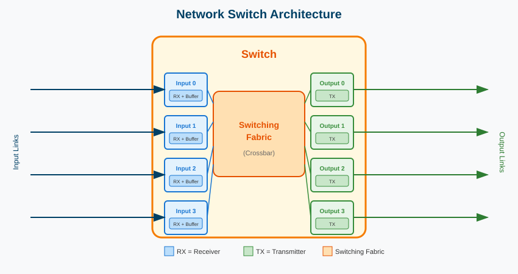

---

## Basic Definitions: Protocol Layers

**Key Networking Concepts:**

- **Network Composition:** Links & switches enable routing from source to destination
- **Physical Layer Protocol:** Converts digital symbols into electrical/optical signals for transmission
- **Link-Level Protocol:** Segments data streams into packets/messages; adds headers for switch interpretation
- **Node-Level Protocol:** Embeds remote communication commands (read, write, etc.) within packets

---

## Protocol Layers: Example

**Scenario:** Node A wants to read memory address 0x1000 from Node B

| Layer | At Source (Node A) | At Destination (Node B) |
|-------|-------------------|------------------------|
| **Node-Level** | Creates command: "READ 0x1000" | Interprets command, executes read |
| **Link-Level** | Adds header [Dest=B, Src=A], splits into flits | Reassembles flits, strips header |
| **Physical** | Converts bits → electrical signals | Receives signals → converts to bits |

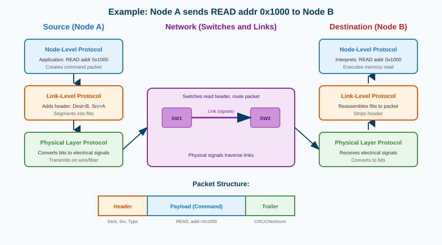

---

## Formalism of Interconnect Networks

**Graph Representation**

- **Network as a Graph:** V = {switches, nodes}, connected by communication channels C ⊆ V × V

**Channel Properties:**
- **Width w:** Number of bits transmitted in parallel
- **Signaling Rate f = 1/t:** Data transfer frequency
- **Bandwidth b = w · f:** Effective data transfer rate

**Basic Network Concepts:**
- **Flit/Phit (Physical Unit):** Smallest data unit transferred per cycle across a link
- **Switch Degree / Node Degree:** Number of input or output channels at a switch or node
- **Route:** Sequence of switches and links followed by a message from source to destination

**Street Analogy for Routing:**
- **Street (Channel):** Has a speed limit (signaling rate) and lanes (width)
- **Intersection (Switch):** Directs traffic between multiple streets
- **Traffic Flow & Routing:** Multiple concurrent trips (messages) share or cross paths; various route options exist, with different congestion levels

---

## What Characterizes a Network?

**1. Topology (What?)**

Defines the **physical interconnection structure** of the network graph

- **Direct Networks:** Every switch is connected to a host node (e.g., meshes, tori)
- **Indirect Networks:** Hosts connect to only a subset of switches, forming a multi-stage network (e.g., Omega, fat trees, Clos networks)

**Key Property:** **Network Diameter** – maximum shortest path between any two nodes

---

## What Characterizes a Network?

**2. Switching Strategy (How?)**

Determines **how data in a message moves through the network**

**Circuit Switching:**
- Establishes and reserves a dedicated path before transmission
- Efficient for large, continuous data transfers but requires setup time
- *Analogy: Parade route reservation*

**Packet Switching:**
- Breaks messages into packets that are individually routed
- Utilizes network resources more efficiently
- *Analogy: Traveling in individual cars*

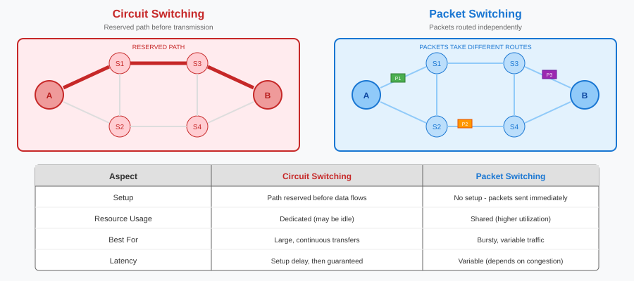

---

## What Characterizes a Network?

**3. Flow Control Mechanism (When?)**

Controls **when messages or portions of them traverse the network**

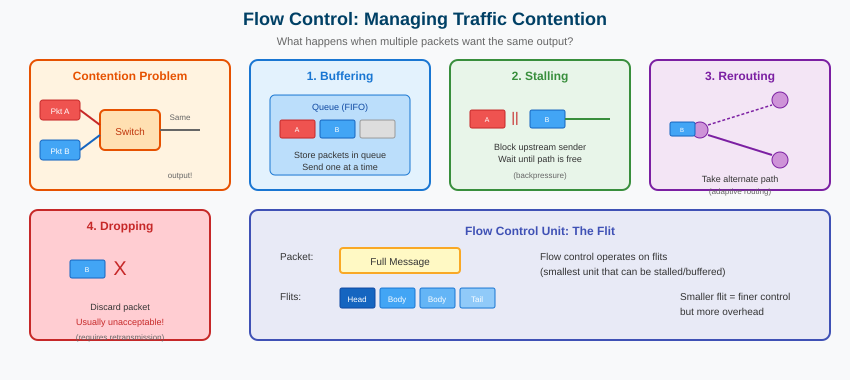

---

## Routing Algorithm (Which Paths to Take?)

**1. Role of a Routing Algorithm**
- Determines **which paths messages can take** through the network
- Restricts the set of possible routes to avoid contention and improve efficiency
- Impacts **performance, congestion, and fault tolerance**

**2. Key Properties of Routing Algorithms**

**Deterministic vs. Adaptive:**
- **Deterministic:** Always chooses the same path for a given source-destination pair (e.g., XY routing in meshes)
- **Adaptive:** Dynamically selects paths based on network conditions (e.g., minimal adaptive routing)

**Minimal vs. Non-minimal:**
- **Minimal:** Always takes the shortest possible path
- **Non-minimal:** May take longer paths to balance load and avoid congestion

**Deadlock and Gridlock Avoidance:**
- Deadlocks occur when packets cyclically block each other
- Strategies include **virtual channels** and **deadlock-free routing rules**

---

## Routing Algorithm (Which Paths to Take?)

**3. Routing and Data Movement Strategies**

**Store-and-Forward:**
- Entire packet is received before being forwarded
- Higher latency but simpler control

**Wormhole Routing:**
- Packet is split into small **flits** that move in a pipeline-like fashion
- Reduces buffer requirements and improves latency

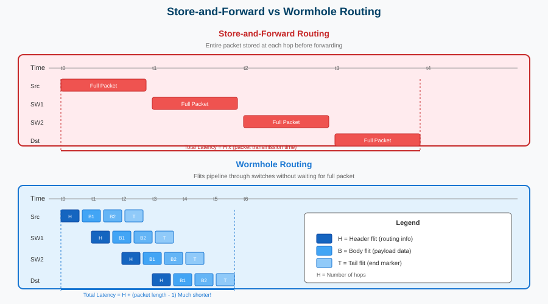

---

## Direct vs Indirect Networks

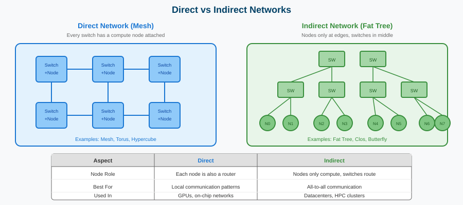

---

## Direct vs Indirect: Key Differences

**Direct Networks** (Mesh, Torus, Hypercube)
- Every node is also a router -- participates in forwarding traffic
- Fixed topology with predictable routes
- Great for **local communication** (nearby nodes)

**Indirect Networks** (Fat Tree, Clos, Butterfly)
- Nodes only compute -- dedicated switches handle all routing
- More flexible paths, often multiple routes between nodes
- Great for **all-to-all communication** (any node to any node)

---

## Why Interconnect Network?

- **Scalability:** Avoids bottlenecks of a shared bus system
- **Cost-Efficiency:** Reduces the prohibitive cost of full connectivity
- **Performance:** Provides better balance between delay and cost

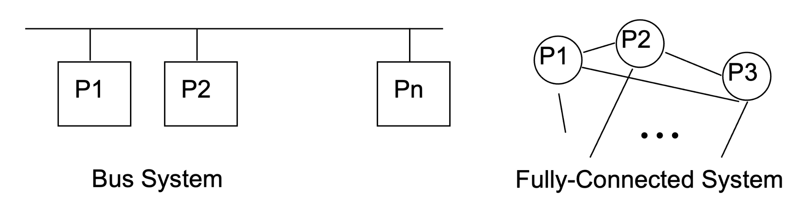

---

## Why Interconnect Network?

| System Type | Delay | Cost | Characteristics |
|-------------|-------|------|-----------------|
| **Bus System** | O(n) | O(1) | Simple, low cost, but performance degrades with more nodes (contention & scalability issues) |
| **Fully Connected** | O(1) | O(n²) | Fast, direct communication, but impractical for large-scale systems due to excessive wiring cost |
| **Interconnection Network** | Optimized | Balanced | Offers scalable communication with a trade-off between cost and performance |

- **Scalability:** Avoids bottlenecks of a shared bus system
- **Cost-Efficiency:** Reduces the prohibitive cost of full connectivity
- **Performance:** Provides better balance between delay and cost

---

## Why Interconnects Matter: Prefix Sum Example

**Prefix Sum** (Running Total): Given [1, 2, 3, 4], compute [1, 3, 6, 10]

| Approach | Steps for N=4 | Steps for N=1000 |
|----------|---------------|------------------|
| **Sequential** | 3 steps | 999 steps |
| **Parallel** | 2 steps | 10 steps |

**The catch:** Parallel requires processors to communicate!

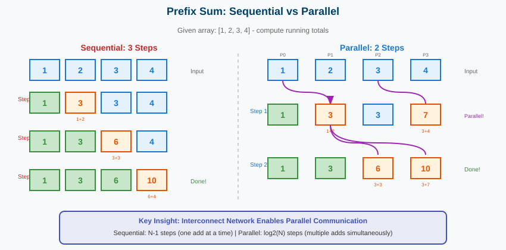

---

## Why Interconnects Matter: The Network Connection

**Without a good interconnect network:**
- Processors cannot share intermediate results
- Parallel algorithm becomes sequential

**With the right interconnect:**
- Multiple processors communicate simultaneously
- O(log N) speedup becomes possible

**This is why interconnect design matters for parallel computing!**

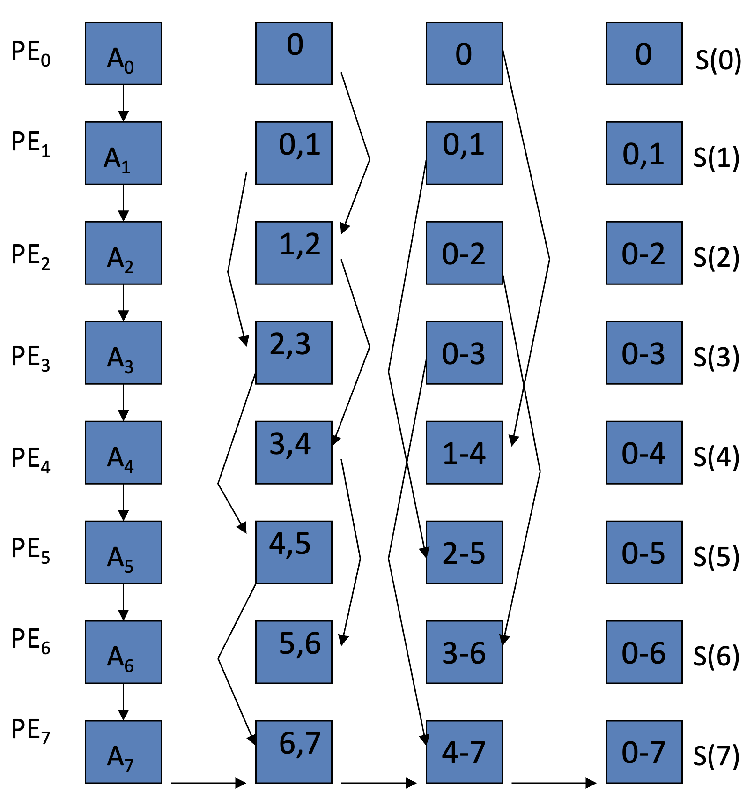

---

## Interconnect Networks: Performance and Cost Metrics

**1. Key Metrics**

**Distance Between Nodes:**
- Number of hops to reach one node from another

**Network Diameter:**
- Maximum distance (hops) between any two nodes
- Determines the **maximum delay** in the network

**Average Distance:**
- Average number of hops between all node pairs
- Impacts the **average communication delay**

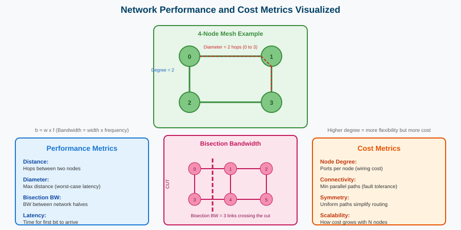

---

## Interconnect Networks: Performance and Cost Metrics

**2. Performance Metrics**

**Latency:**
- Time from the request to when the first bit of data is received
- Depends on distance, routing, and flow control

**Bandwidth:**
- Data transmission rate when all processors are sending and receiving

**Bisection Bandwidth:**
- Maximum data transfer rate (or number of wires) between two halves of the network

---

## Interconnect Networks: Performance and Cost Metrics

**3. Cost Metrics**

**Node Degree:**
- Number of ports per node (affects cost)
- **Fixed degree** is desirable for scalability

**Connectivity:**
- Minimum number of parallel paths between any two nodes
- Higher connectivity improves fault tolerance

**Symmetry & Scalability:**
- Symmetric networks simplify routing and balance performance
- Scalable designs allow efficient expansion

---

## Fixed Interconnect Networks

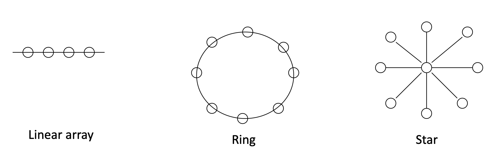

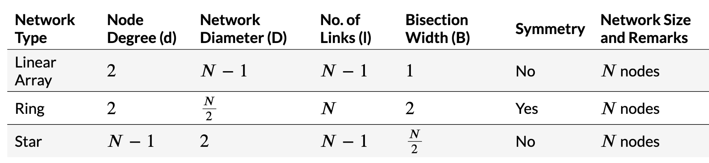

---

## Increasing Node Degree and Connectivity

The fundamental trade-off: **more connections reduce diameter but increase cost**

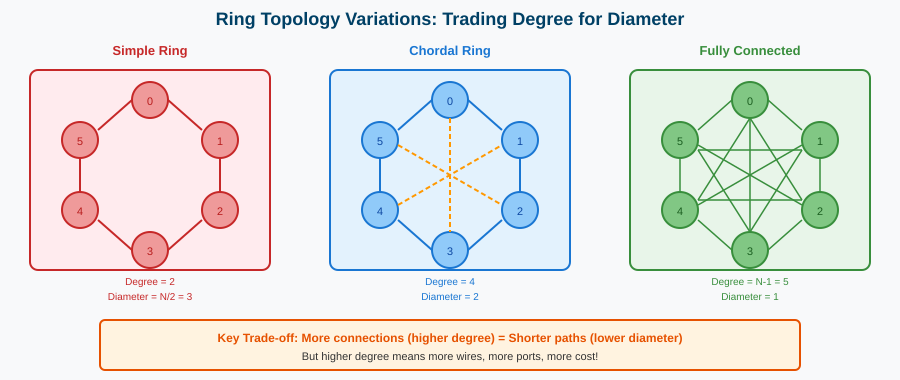

---

## Ring Topology Variations

**Ring:** Degree=2, simplest but highest diameter (N/2 hops worst case)

**Chordal Ring:** Add "shortcut" chords to reduce diameter while keeping degree moderate

**Barrel Shifter:** Connections at powers of 2 (1, 2, 4, 8...) for efficient shifting operations

**Fully Connected:** Degree=N-1, diameter=1, but O(N²) wires -- impractical for large N

---

## Fixed Interconnect Networks

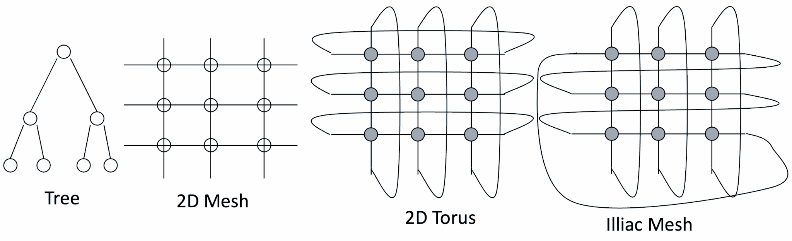

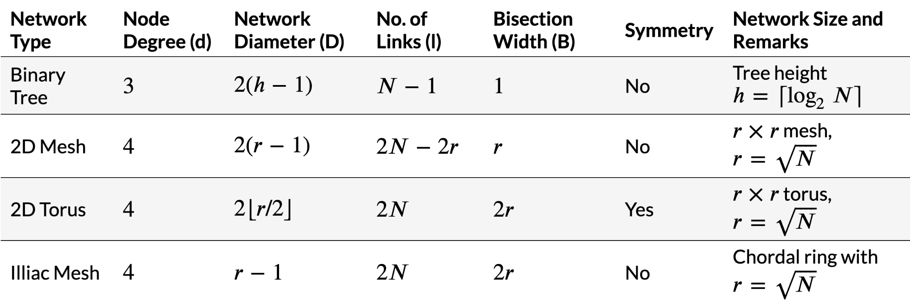

---

## Bus Interconnect Network

**Definition:** All nodes are connected to a single shared communication link.

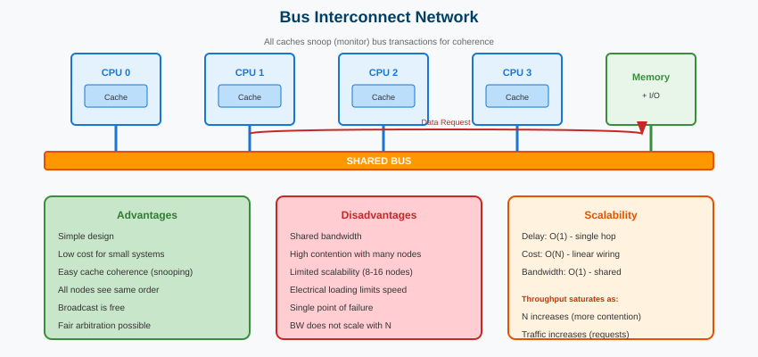

---

## Bus Interconnect Network

**Advantages:**
- **Simple:** Straightforward design and easy to implement.
- **Cost-Effective:** Ideal for systems with a small number of nodes.
- **Coherence Management:** Simplifies cache coherence through **snooping** and serialization mechanisms.

**Disadvantages:**
- **Limited Scalability:** Bandwidth is shared among all nodes. Electrical loading reduces operating frequency as more nodes are added.
- **High Contention:** Shared link leads to frequent contention for access. Saturates quickly as the number of nodes or traffic increases.

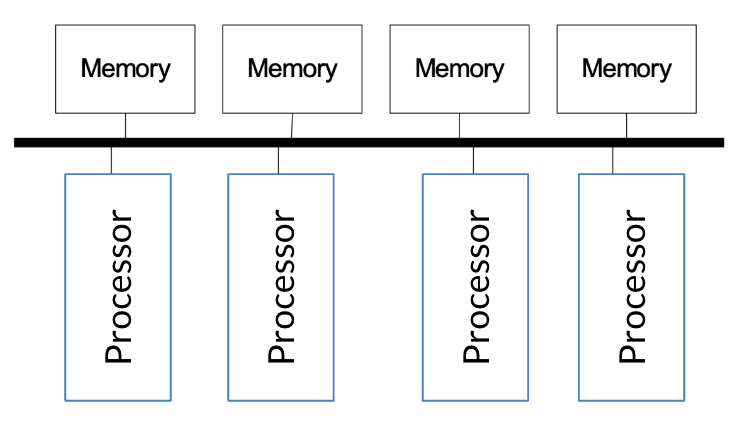

---

## Point to Point Networks

**Definition:** Every node is connected directly to every other node using dedicated links.

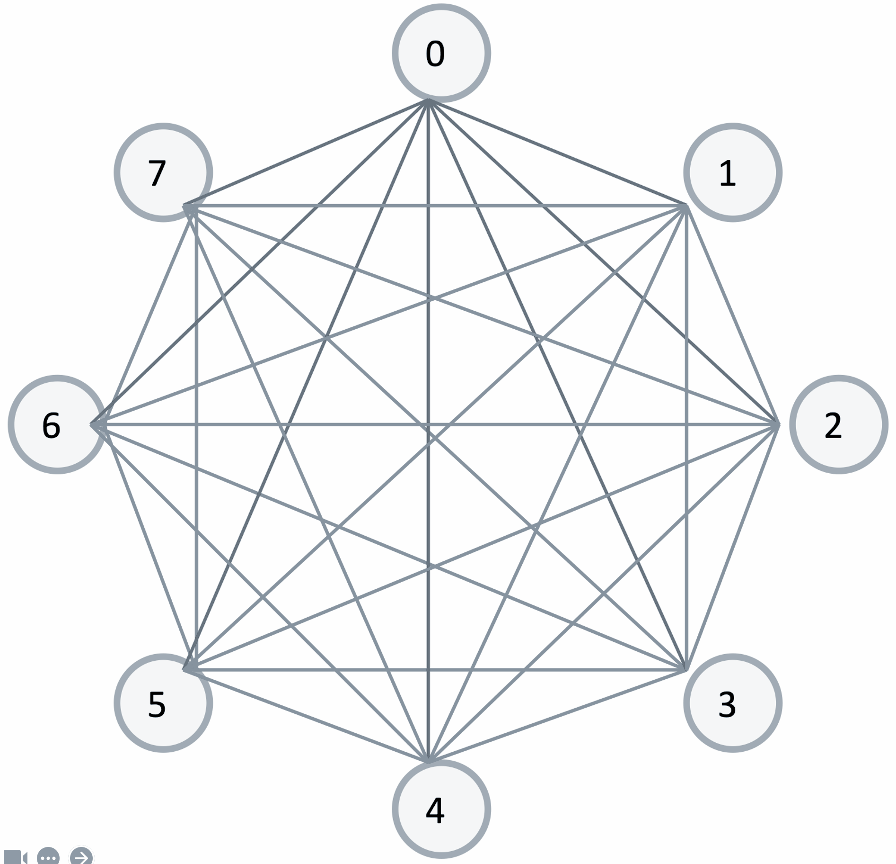

---

## Point to Point Networks

**Advantages:**
- **Lowest Contention:** No sharing of links, eliminating contention for resources.
- **Lowest Latency:** Direct connections ensure minimal communication delay.
- **Ideal Performance:** Perfect for systems where cost is not a constraint.

**Disadvantages:**
- **High Cost:** O(N) ports per node. O(N²) links required for N nodes.
- **Not Scalable:** Exponential growth in hardware cost makes it impractical for large systems.
- **Layout Challenges:** Difficult to physically lay out all the connections on a chip.

---

## Crossbar Interconnect Networks

**Definition:** Every node is connected to every other node via a shared link for each destination.

**Key Feature:** Enables concurrent transfers to non-conflicting destinations.

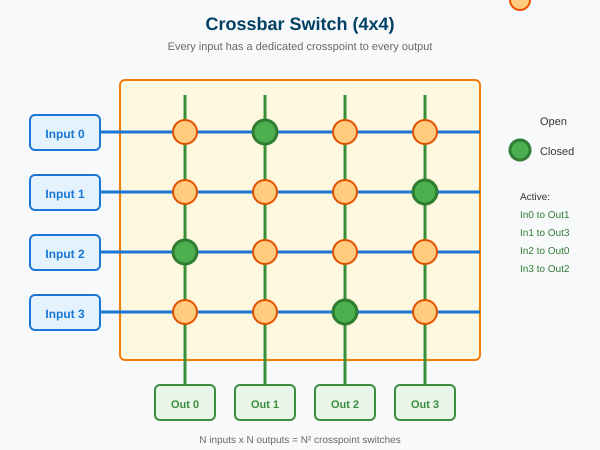

---

## Crossbar Interconnect Networks

**Advantages:**
- **Low Latency:** Direct connections ensure minimal communication delays.
- **High Throughput:** Supports multiple simultaneous data transfers without interference.
- **Cost-Effective (Small Systems):** Works well for systems with a small number of nodes.

**Disadvantages:**
- **High Cost:** O(N²) connections, leading to exponential growth in cost as the number of nodes increases.
- **Poor Scalability:** Unsuitable for large systems due to link and hardware complexity.
- **Arbitration Complexity:** Managing access to shared links becomes challenging as N grows.

**Applications:** Used in **core-to-cache-bank networks**

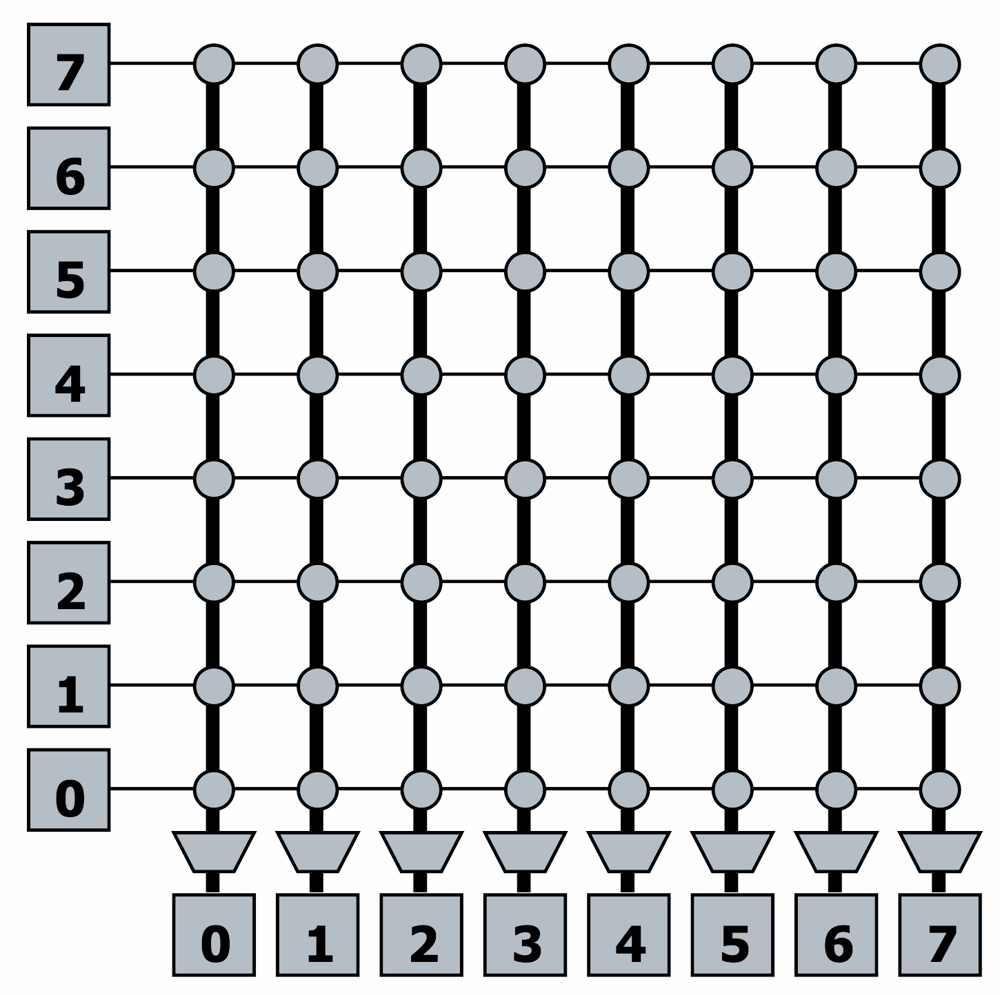

---

## Buffered vs. Bufferless Crossbars

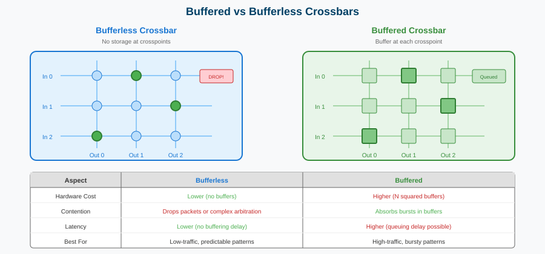

---

## Buffered Xbars

**Advantages of Buffered Crossbars:**
- **Simpler Arbitration/Scheduling:** Buffers reduce contention, simplifying the need for complex arbitration mechanisms.
- **Support for Variable-Size Packets:** Packets of different sizes can be stored in buffers, enabling flexible communication.

**Disadvantages of Buffered Crossbars:**
- **Higher Hardware Cost:** Requires N² buffers, where N is the number of input/output ports.
- **Increased Latency:** Buffering packets can introduce additional delays.

---

## Bufferless Xbars

**Advantages of Bufferless Crossbars:**
- **Lower Complexity:** No need for N² buffers or associated control logic.
- **Energy-Efficient:** Eliminates power consumption associated with managing buffers.

**Disadvantages of Bufferless Crossbars:**
- **Complex Arbitration:** Requires sophisticated arbitration mechanisms to resolve output contention.
- **Packet Drops:** Packets are dropped when contention occurs due to lack of buffering.

---

## NVIDIA NVSwitch: A High-Performance Interconnect

Designed for large-scale GPU communication.

It is a critical component in NVIDIA's data center and high-performance computing (HPC) solutions, such as the **NVIDIA DGX systems**.

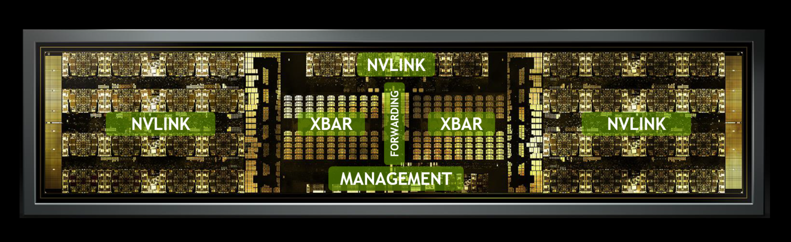

---

## NVIDIA NVSwitch: A High-Performance Interconnect

**NVLink Interconnects:**
- **NVLink** is NVIDIA's proprietary high-speed, point-to-point interconnect for GPUs.
- The NVSwitch integrates multiple NVLink connections to enable direct communication between GPUs in a system.
- Each NVSwitch supports **NVLink 3.0**, with up to **900 GB/s of aggregate bandwidth**.

---

## NVIDIA NVSwitch: A High-Performance Interconnect

**Crossbar (XBAR):**
- The **crossbar** is the core switching fabric within the NVSwitch.
- It connects GPUs to one another by routing data packets from one NVLink interface to another with minimal latency.
- The XBAR facilitates **non-blocking concurrent data transfers** across all GPUs in the system.

---

## NVIDIA NVSwitch: A High-Performance Interconnect

**Management Module:**
- Responsible for coordinating the NVSwitch's operations, such as routing, arbitration, and load balancing.
- Ensures efficient utilization of the interconnect bandwidth.

**Forwarding Logic:**
- Optimized packet forwarding between NVLinks based on source and destination GPU.
- Enables multi-hop communication between GPUs not directly connected by NVLinks.

---

## How NVSwitch Works

In systems with multiple GPUs (e.g., NVIDIA DGX A100 or H100), NVSwitch acts as a central interconnect, allowing any GPU to communicate with any other GPU at full bandwidth.

The crossbar within the NVSwitch enables **full-bandwidth, all-to-all GPU communication**, avoiding bottlenecks typical in other interconnect topologies.

---

## Can We Get Lower Cost than A Crossbar and Yet Still Have Low Contention Compared to a Bus?

*Coming next: Multi-stage interconnection networks...*

---

## References

- "Introduction to Parallel Computing" by Ananth Grama, Anshul Gupta, George Karypis, and Vipin Kumar
- "Computer Architecture: A Quantitative Approach" by John L. Hennessy and David A. Patterson
- ETH Zurich - Computer Architecture Lectures
