# Parallel Computer Architecture
## Lecture 4: Interconnect Networks 2
### Advanced Topologies, Multistage Networks & Routing
### GWU ECE 6125 | Armin Mehrabian | Spring 2026

---

## Lecture Roadmap

**Where we left off:** Bus → Crossbar → "We need something in between"

**Today we answer that challenge:**

1. **Multistage Logarithmic Networks** — Omega, Butterfly, Benes
2. **Circuit vs. Packet Switching** in multistage context
3. **Fat Tree / Clos Networks** — the backbone of modern HPC
4. **Ring Interconnects** — unidirectional, bidirectional, hierarchical
5. **Mesh & Torus Networks** — on-chip workhorses
6. **Cube & Hypercube Networks** — elegant math, real trade-offs
7. **Topology Comparison** — how to choose

---

## Quick Recap: The Cost-Performance Dilemma

| Network | Cost | Latency | Problem |
|---------|------|---------|---------|
| **Bus** | O(1) | O(N) | Doesn't scale — contention grows |
| **Crossbar** | O(N²) | O(1) | Too expensive — 1024 nodes = 1M switches |
| **???** | O(N log N) | O(log N) | **This is what we want!** |

**The insight:** We don't need *every possible* connection *simultaneously*
We just need to efficiently *route* any source to any destination through a network of small, cheap switches.

---

## The Central Question

### Can we get lower cost than a Crossbar and yet still have low contention compared to a Bus?

**Answer: YES — Multistage Logarithmic Networks**

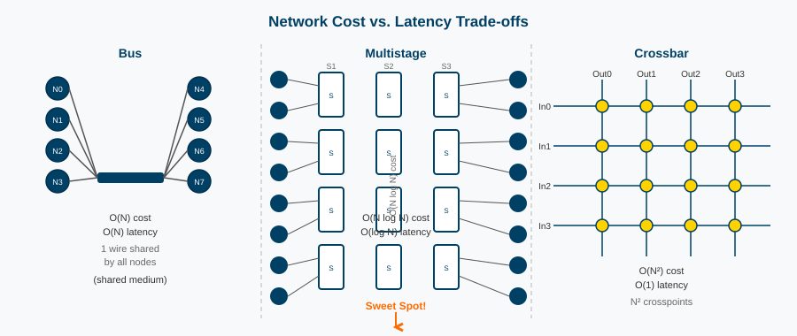

The key idea: replace one giant N×N crossbar with **log₂(N) stages of N/2 tiny 2×2 switches**

- **Cost:** (N/2) × log₂(N) = **O(N log N)** ← dramatic improvement
- **Latency:** log₂(N) hops = **O(log N)** ← nearly as good as crossbar

For **N = 1024:** Crossbar needs **1,048,576 switches** — Multistage needs only **5,120**

---

## The 2×2 Switch: The Building Block

Every multistage network is built from **2×2 switches** — the simplest possible routing element.

A 2×2 switch has:
- **2 inputs**, **2 outputs**
- **2 configurations:** straight (pass-through) or cross (swap)

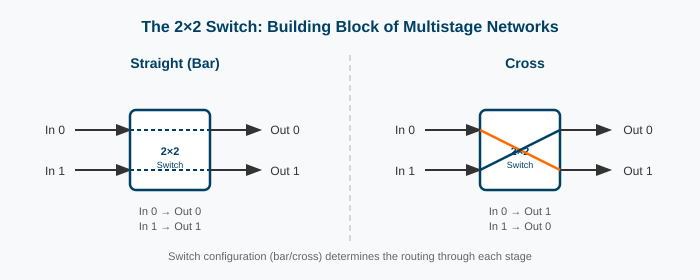

**Why 2×2?**
- Minimal hardware — just one control bit per switch
- Self-routing: the destination address *bit* directly controls the switch
- Easy to cascade into larger networks

---

## The Omega Network

**Invented by D. Lawrie, 1975** — a landmark in interconnect design

**Structure for N = 8 nodes:**
- **3 stages** (= log₂8) of **4 switches each** (= N/2)
- Total: **12 switches** vs. 64 for a crossbar!
- **Between stages:** "Perfect Shuffle" interconnect

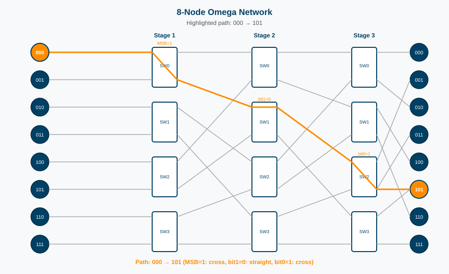

**Key property:** There is **exactly one path** from any input to any output — self-routing using destination address bits.

---

## The Perfect Shuffle Interconnect

**How stages are connected:** a "perfect shuffle" of wires

Think of **shuffling a deck of 8 cards:**
1. Split the deck in half: [0,1,2,3] | [4,5,6,7]
2. Interleave perfectly: **0, 4, 1, 5, 2, 6, 3, 7**

| Wire Out | Shuffle → | Wire In (next stage) |
|----------|-----------|----------------------|
| 0 (000)  | → | 0 (000) |
| 1 (001)  | → | 2 (010) |
| 2 (010)  | → | 4 (100) |
| 3 (011)  | → | 6 (110) |
| 4 (100)  | → | 1 (001) |
| 5 (101)  | → | 3 (011) |
| 6 (110)  | → | 5 (101) |
| 7 (111)  | → | 7 (111) |

**In binary:** a left-rotate of the address bits! (001 → 010 → 100 → 001...)

---

## Self-Routing in Omega Networks

**Routing algorithm:** at each stage k, examine **bit k** of the destination address

- If bit k = **0** → take the **upper output**
- If bit k = **1** → take the **lower output**

**Example: Route to destination 101 (node 5)**

| Stage | Bit Examined | Decision | Wire Taken |
|-------|-------------|----------|------------|
| Stage 1 | bit 0 (MSB) = **1** | Lower output | → lower |
| Stage 2 | bit 1 = **0** | Upper output | → upper |
| Stage 3 | bit 2 (LSB) = **1** | Lower output | → lower |

**Result: arrives at output 101 = node 5 ✓**

> **No routing tables needed!** The destination address IS the routing instruction. This is called **destination-tag routing** or **self-routing**.

---

## Self-Routing: Why It's Elegant

**Traditional routing:** each switch looks up a table to decide where to forward a packet

**Self-routing:** the packet carries its own forwarding instructions — the destination address

At **Stage k**: look at **bit k** of destination → use as the switch control signal

**Benefits:**
- Zero lookup time — routing decision is a single bit read
- No state to maintain in switches
- Works identically regardless of traffic patterns
- Scales to any N = 2ⁿ without change to algorithm

**Limitation:** exactly one path per source-destination pair — this causes **blocking**

---

## Blocking in Omega Networks

**Omega networks are blocking** — certain traffic patterns cause congestion even if destinations are distinct.

**Why?** Only **one path** from source i to destination j.
If two packets share any switch output port → **one must wait.**

**Concrete blocking example:** Sources 000 and 010 send to 101 and 111

- Both destinations have MSB = **1** → both packets go to the **lower output** of their Stage 1 switch
- If they happen to be in the *same* Stage 1 switch → they **collide!**

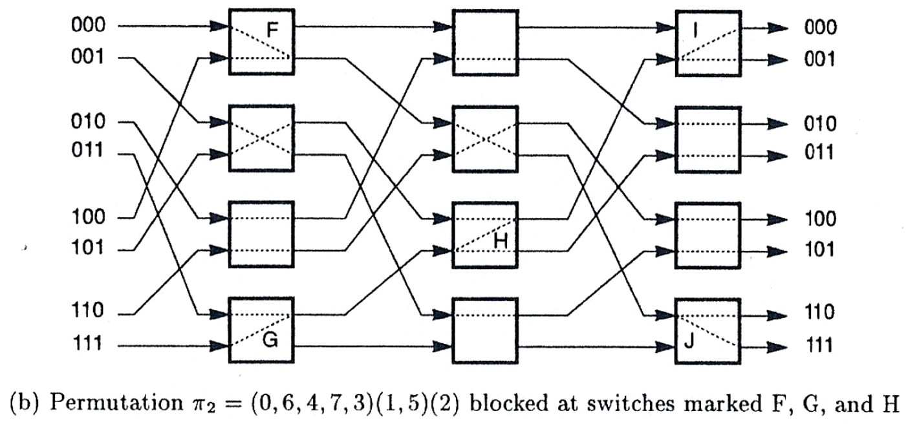

**Mathematical proof:**
- 12 switches, each with 2 settings → 2¹² = **4,096** reachable permutations
- Total possible permutations of 8 items = 8! = **40,320**
- 4,096 << 40,320 → majority of permutations **cannot be simultaneously routed**

---

## Blocking vs. Non-Blocking Permutations

Not all permutations cause blocking. Some can be routed without conflict:

**Blocking Permutation** π₂ — conflicts at switches F, G, H:

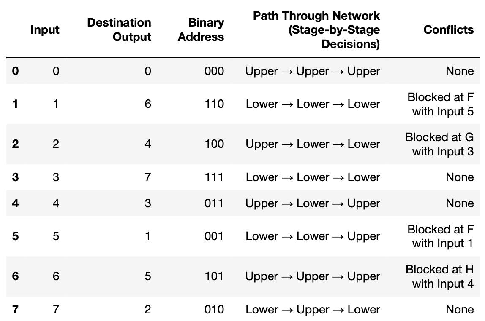

**Non-Blocking Permutation** π₁ — all paths conflict-free:

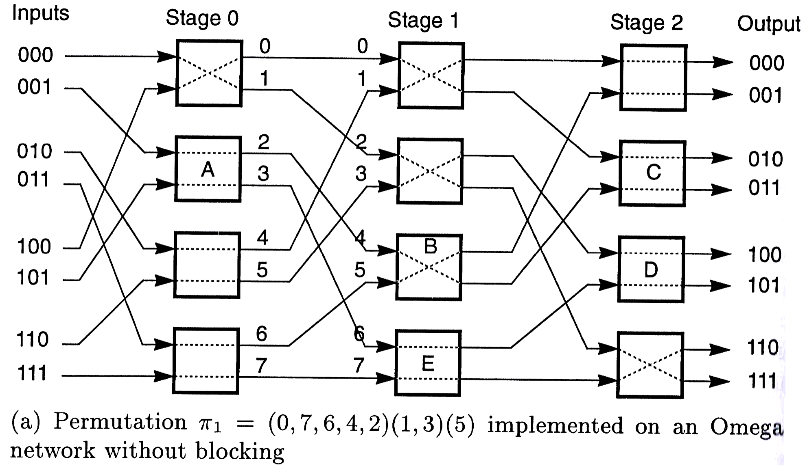

---

## Circuit-Switched Omega

**Circuit switching in a multistage network:**

1. **Setup phase:** send a probe packet through the network, configuring each switch as it passes
2. **Data phase:** once path is established, data flows without any per-switch decisions
3. **Teardown:** release all switch reservations

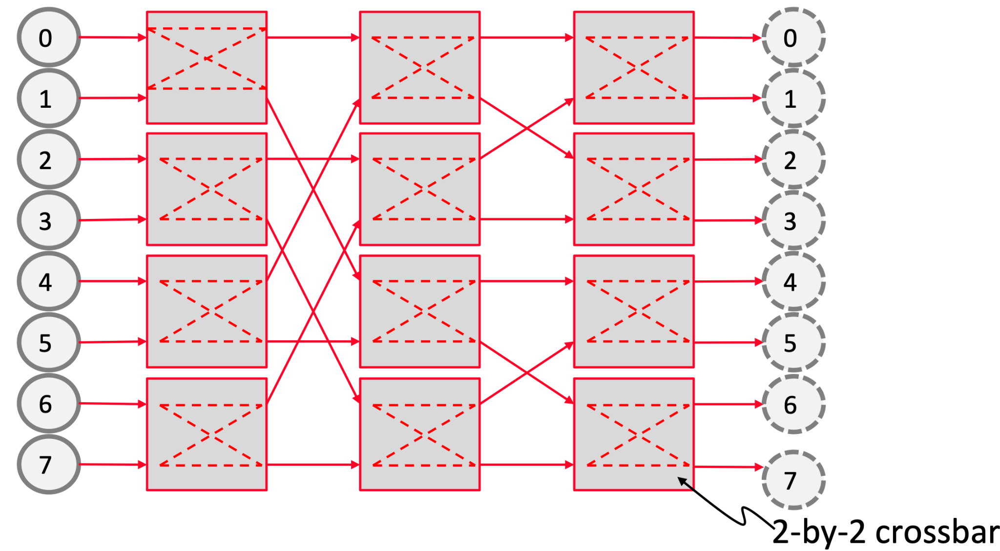

**Advantages:**
- No buffering required once circuit is set up
- Lowest possible data-transfer latency (no per-hop decisions)
- Predictable, deterministic behavior

**Disadvantages:**
- Setup latency before any data flows
- If path is blocked → entire transfer waits
- Links are idle when no data is sent (wasted bandwidth)

---

## Packet-Switched Omega

**Packet switching in a multistage network:**

- Each packet is **self-routing** — carries destination address
- Packets **hop** from switch to switch, waiting at buffers if needed
- No pre-configuration; packets can be in-flight simultaneously

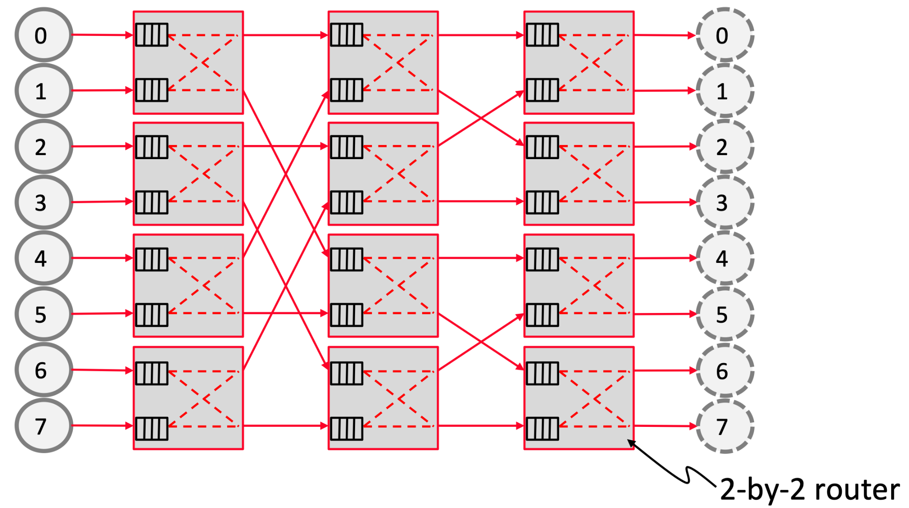

**Advantages:**
- No setup latency — packets immediately enter the network
- Better link utilization — links can carry packets from many sources
- Natural handling of dynamic, unpredictable traffic

**Disadvantages:**
- Buffers needed at each switch — area and power cost
- Variable, unpredictable latency
- Head-of-line blocking: a stalled packet blocks those behind it

---

## Switching & Topology Are Independent

**Important design principle:** The switching method (circuit vs. packet) is completely independent of the network topology.

| | Circuit Switching | Packet Switching |
|-|------------------|-----------------|
| **Omega** | Pre-configure path, then stream | Self-routing flits |
| **Butterfly** | Pre-configure path, then stream | Self-routing flits |
| **Mesh** | Reserve all hops before sending | XY routing, buffered |
| **Fat Tree** | Rare (legacy telco) | Most common |

**The separation of concerns:**
- **Topology** defines *which* connections exist (the hardware)
- **Switching** defines *how* data moves through those connections (the protocol)

The same road network can be used by both scheduled convoys (circuit) or individual drivers with GPS (packet).

---

## Butterfly Networks

**Similar to Omega but with different inter-stage wiring**

- Same cost: **O(N log N)**
- Same latency: **O(log N)**
- Same self-routing: destination-tag routing

**Key difference:** Butterfly is **rearrangeably non-blocking**
- *Any* permutation can be realized...
- ...but may require re-configuring existing connections

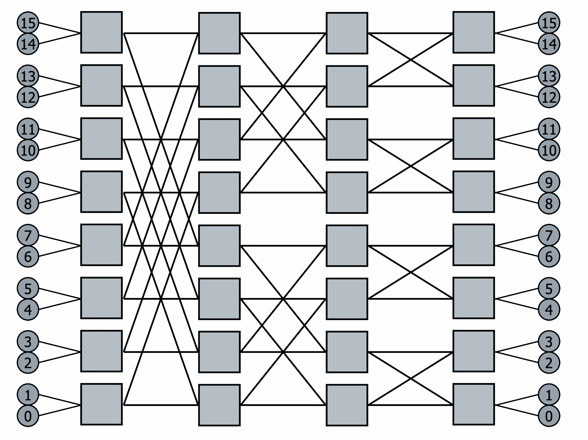

**Critical problem: Tree Saturation**
- Switches at higher stages carry traffic for exponentially more pairs
- In an N-node butterfly, the top switch carries traffic for ALL N/2 pairs
- This creates a **hotspot** — the top becomes a bottleneck regardless of traffic!

**Real use:** BBN Butterfly parallel computer (1980s), CM-5 data network

---

## Tree Saturation: The Core Problem

In any tree-based network, **traffic concentration increases toward the root:**

```
Level 2 (root):     ████████████████  (handles ALL traffic)
Level 1:            ████████  ████████  (each handles half)
Level 0 (leaves):   ████ ████ ████ ████  (each handles quarter)
```

If each of N leaves sends traffic, the root switch must handle **N/2 times** more traffic than leaf switches → **bottleneck**

**Solutions:**
1. **Fat Trees** — add more bandwidth at higher levels
2. **Randomized routing** — spread traffic before sending to destination (Valiant's algorithm)
3. **Adaptive routing** — route around congested switches

> This is why the elegant simplicity of the butterfly network doesn't translate to practical deployments — the tree saturation problem is fundamental to its topology.

---

## The Benes Network: Rearrangeably Non-Blocking

**Problem:** Omega blocks. Butterfly saturates at root.
**Solution (Václav Beneš, 1965):** back-to-back butterfly networks

**Structure:** Two butterfly networks connected in reverse — 2 log₂N − 1 stages total

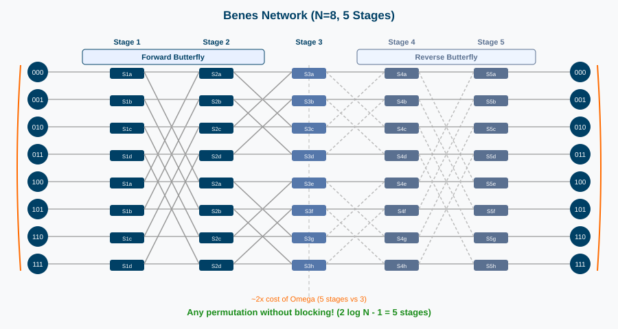

**Key property:** **Any** permutation can be routed without blocking *and* without rearranging existing connections

**Cost:** O(N log N) — roughly 2× stages compared to Omega

**Proof intuition:** The extra stages provide alternative paths — if one path is blocked, packets can take a "detour" through the second half.

**Real use:** telephone switching (Bell Labs original), optical crossconnects, FPGAs

---

## Fat Trees / Clos Networks

**The dominant topology in modern HPC and cloud computing**

**Insight from Charles Leiserson (1985):** Fix tree saturation by making links at higher levels "fatter" — i.e., have **more bandwidth**

**Modern implementation:** same link width everywhere, but **more parallel links** at higher levels

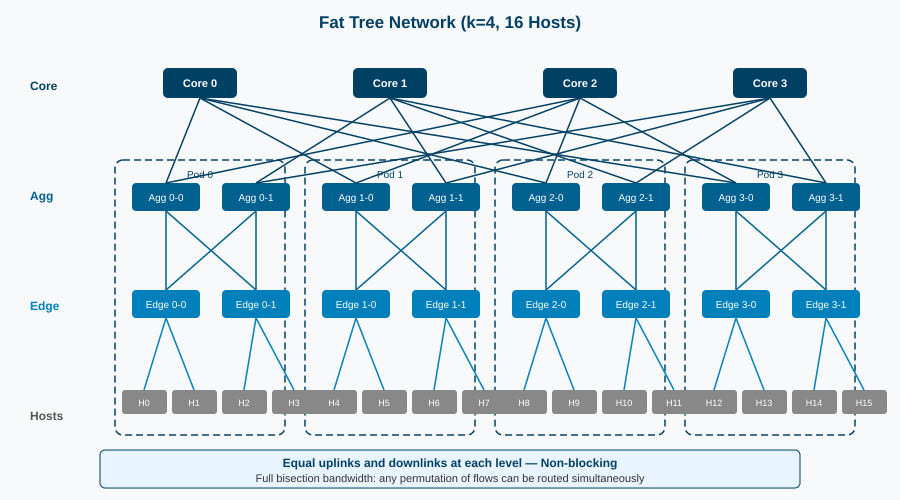

**Properties:**
- **Non-blocking** (with full provisioning): any source can reach any destination at full bandwidth
- **Full bisection bandwidth**: aggregate bandwidth = sum of all host link bandwidths
- **Cost:** O(N log N) — same as Omega/Butterfly, but non-blocking!
- **Multiple paths**: many shortest paths between any two nodes → load balance + fault tolerance

**Used in:** AWS, Google Cloud, Meta, NVIDIA SuperPOD, IBM Summit, Frontier, virtually every modern data center

---

## Fat Tree: How It Achieves Non-Blocking

**Key invariant:** every switch has equal number of uplinks and downlinks (except leaf switches)

For a **3-level fat tree** with k-port switches connecting k² hosts:
- **Edge layer:** k/2 hosts, k/2 uplinks to aggregation
- **Aggregation layer:** k/2 downlinks to edge, k/2 uplinks to core
- **Core layer:** each core switch has one downlink per pod

**Mathematical result:**
At each level, the number of uplinks = number of downlinks → **no bottleneck at any level**

This is the **Clos non-blocking condition**: m ≥ n where m = uplinks, n = inputs per switch per stage

---

## Ring Interconnects

**The simplest topology that scales**

- **Unidirectional Ring:** data flows in one direction around a loop
  - Average path: **N/4** hops, worst case **N/2**
  - Cost: O(N), easy to implement

- **Bidirectional Ring:** data flows in either direction (take shortest path)
  - Average path: **N/4** hops, worst case **N/4** — effectively halves diameter

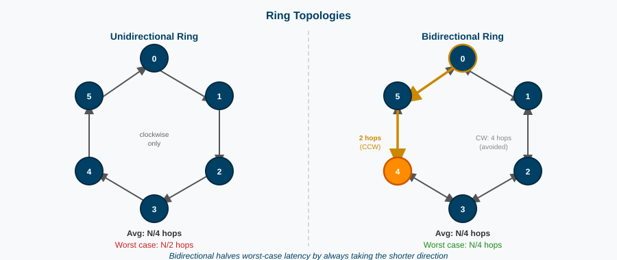

**Real examples:**
- **Intel Haswell, Ivy Bridge, Sandy Bridge** — ring bus connecting cores, LLC, memory controller
- **Intel Larrabee** — many-core ring
- **IBM Cell Processor** — Element Interconnect Bus (ring)

**When rings win:** small N, simple implementation, low cost, sufficient bandwidth

---

## Unidirectional vs. Bidirectional Rings

**Unidirectional Ring:**

```
  ┌→ 0 → 1 → 2 → 3 ┐
  └←←←←←←←←←←←←←←←┘
  Average hops: N/4  Worst case: N/2
```

**Bidirectional Ring:**

```
  ┌→ 0 → 1 → 2 → 3 ┐
  └← 0 ← 1 ← 2 ← 3 ┘
  Average hops: N/4  Worst case: N/4
  (always take shorter direction!)
```

**The bisection bandwidth difference:**
- Unidirectional: cut anywhere → 1 wire crosses the cut
- Bidirectional: cut anywhere → 2 wires cross the cut
- Bidirectional doubles bisection bandwidth — critical for workloads with global communication

**Injection policy** for bidirectional ring: when injecting a packet, choose the direction that reaches the destination in fewer hops.

---

## The Scalability Problem of Rings

As N grows, the ring becomes a bottleneck:

| N nodes | Diameter (hops) | Avg. latency |
|---------|----------------|--------------|
| 4 | 2 | 1.25 |
| 8 | 4 | 2.5 |
| 16 | 8 | 5 |
| 32 | 16 | 10 |
| 64 | 32 | 20 |

**Latency grows linearly with N** — unacceptable for large systems

**Solution: Hierarchical Rings** — break the O(N) latency into O(√N)

---

## Hierarchical Rings

**Observation:** a ring of rings can dramatically reduce latency

**Structure:**
- **Local rings** of k nodes each — fast, small-diameter
- **Global ring** connecting one node from each local ring ("bridge nodes")
- Bridge nodes forward traffic between local and global ring

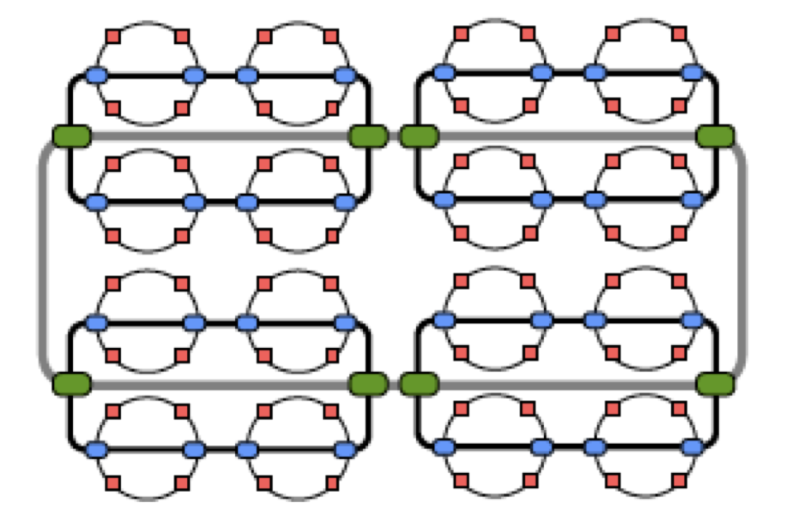

**Latency analysis for N = k² nodes:**
- Within a local ring: at most k/2 hops
- Across local rings: at most k/2 hops on global ring
- Total: at most **k hops = √N hops** — much better than O(N)!

**Cost:** still O(N) links — we just add a few bridge connections

**Example:** Intel Sandy Bridge-EP (Xeon E5) — 8-core ring with bidirectional links bridging to memory/I/O

---

## Path Diversity Through Hierarchy

**The key insight behind hierarchical networks:**

Without hierarchy:
- A single ring: **one path** from any source to destination

With hierarchy:
- Multiple paths through different bridge nodes
- Traffic distributes across the hierarchy
- Fault tolerance improves

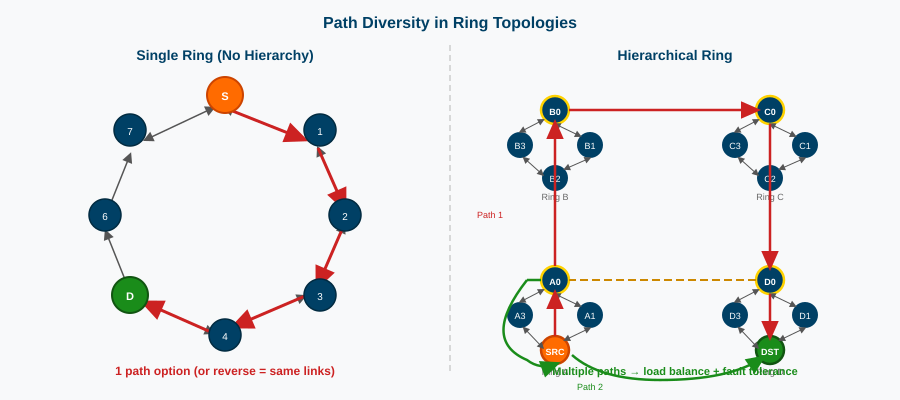

Hierarchical rings give us:
1. **Lower diameter:** O(√N) instead of O(N)
2. **Higher bisection bandwidth:** more paths between halves
3. **Better fault tolerance:** failure of one ring doesn't block all traffic

---

## Intel Alder Lake (2022): Ring Bus in Production

**Intel's 12th-gen Alder Lake uses a ring bus** — proving rings remain viable in 2022


The ring connects P-cores, E-cores, shared L3 cache banks, memory controller, and I/O hubs.

*Source: Intel via Andreas Schilling / @aschilling, Oct 2021*

**Why still a ring?** For ~20-30 nodes, a ring provides:
- Predictable latency
- Simple physical layout on a 2D die
- Full bandwidth with pipelined transfers
- Low design complexity

The mesh only makes sense when you have enough nodes that the ring latency becomes unacceptable.

---

## Mesh Interconnect Networks

**The workhorse of many-core on-chip networks**

**Structure:** nodes arranged in a 2D grid, each connected to 4 neighbors (N, S, E, W)

- **Cost:** O(N) links
- **Diameter:** 2(√N − 1) hops for √N × √N mesh
- **Average distance:** ~(2/3)√N hops

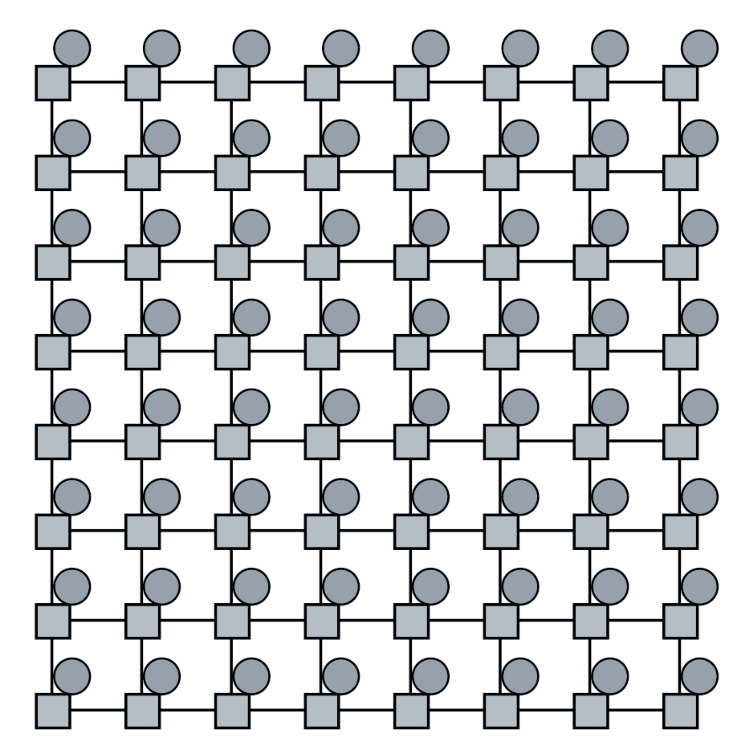

**XY Routing (most common):**
1. Route in X (East/West) direction until aligned with destination
2. Then route in Y (North/South) direction
3. Simple, deadlock-free, deterministic

**Why meshes win for on-chip:**
- **Regular layout** maps directly to 2D chip topology
- **Equal wire lengths** → uniform timing, no signal integrity issues
- **Modular** — easy to add more nodes

---

## Mesh: Real-World Examples

**Intel Xeon Scalable (Skylake-SP, 2017):**
- Up to 28 cores connected via 2D mesh
- Also connects last-level cache (LLC) banks, memory controllers, PCIe
- Replaced the legacy ring bus for high core-count Xeons

**ARM Neoverse N1/N2:**
- Mesh interconnect for server SoC designs
- Connects up to 128 cores + caches + memory

**Epiphany-V:**
- 1024-core RISC SoC
- 32×32 mesh of simple cores
- Optimized for energy-efficient parallel computing

**Intel Xeon Scalable mesh example:**

```
[Core][LLC][Core][LLC][Core][LLC]
  |    |    |    |    |    |
[Core][LLC][Core][LLC][Core][LLC]
  |    |    |    |    |    |
[IMC] [PCIe][   ][   ][IMC][...  ]
```

---

## Torus Interconnect Networks

**Mesh + wraparound links = Torus**

**What changes:** edge nodes connect to the opposite side — like the surface of a donut (torus)

- **Diameter:** √N hops (vs. 2√N for mesh — roughly half!)
- **Average distance:** ~√N/2 hops
- **Bisection bandwidth:** 2×√N wires cross any cut (vs. √N for mesh)
- **Cost:** same O(N) nodes, slightly more links for wraparound

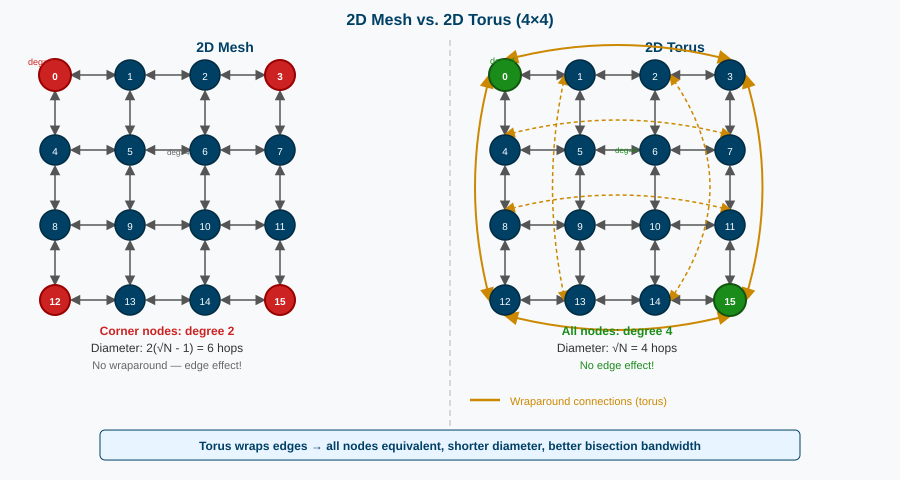

**Key advantage:** No "edge effect" — all nodes are equivalent
A mesh node at the corner is disadvantaged vs. a center node; a torus has no corners.

---

## Torus: Real-World HPC Examples

**Torus topologies dominate supercomputers:**

| System | Year | Topology |
|--------|------|----------|
| IBM Blue Gene/L | 2004 | 3D Torus (512K nodes) |
| IBM Blue Gene/P | 2007 | 3D Torus |
| IBM Blue Gene/Q | 2011 | 5D Torus |
| Cray XT3/XT4 | 2005-8 | 3D Torus |
| Cray XE6 | 2010 | 3D Torus (Gemini NIC) |
| K Computer (Fujitsu) | 2011 | 6D Mesh/Torus (Tofu) |
| Fugaku | 2020 | 6D Mesh/Torus (Tofu-D) |

**Why torus for supercomputers?**
- HPC workloads have heavy **nearest-neighbor communication** (stencil codes, PDE solvers)
- Torus minimizes latency for local communication
- Scalable to hundreds of thousands of nodes with predictable performance

---

## Folded Torus

**Problem with physical torus:** wraparound links span the entire chip/board — **very long wires!**
Long wires = high capacitance = slower signals and more power.

**Solution: Fold the torus**

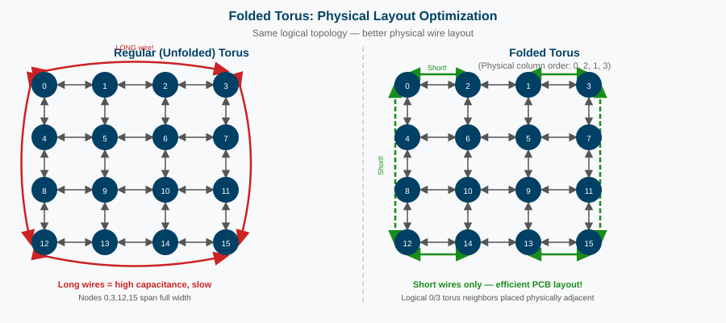

**How it works:** rearrange nodes so that logically-distant nodes that need wraparound links are physically adjacent

- **Same logical topology** (a torus)
- **Much shorter wraparound wires**
- Particularly important for on-chip 2D torus implementations

**Tradeoff:** physical layout is less intuitive, but wire lengths are uniform — important for timing closure in chip design

---

## Illiac Mesh (Illiac IV, 1966)

**Historical significance:** The Illiac IV was one of the first massively parallel computers

**64 processors** arranged in an 8×8 grid with **diagonal wraparound:**
- Rather than wrapping row 0 to row 7 straight across (standard torus)
- Row i wraps to column i of the next row — a **skewed** or **diagonal** wrap

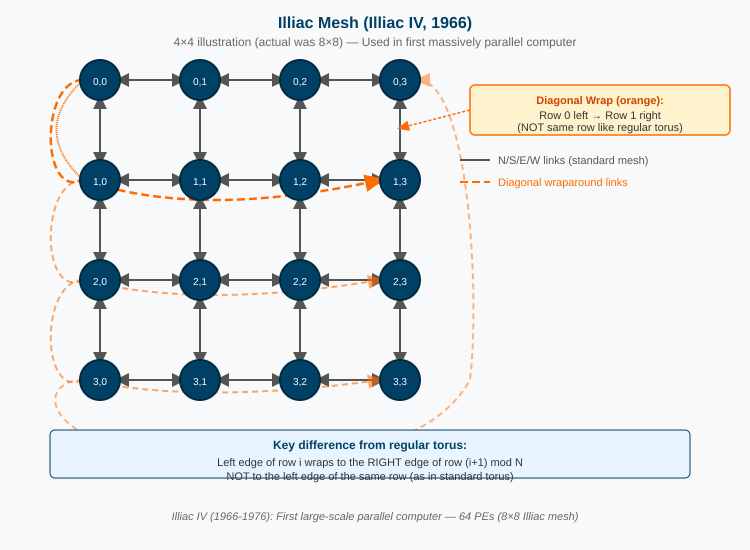

**Effect:** creates a different set of "short paths" than a standard torus — certain communication patterns (matrix operations, sorting) are much more efficient

**Modern relevance:** the Illiac mesh is topologically related to certain **Benes network** configurations — it demonstrates that there are many valid "mesh with wraparound" designs, each optimizing for different communication patterns.

---

## Cube Networks: Building Intuition

**Key idea:** generalize a square to higher dimensions

| Dimension | Nodes | Degree | Links |
|-----------|-------|--------|-------|
| 0D (point) | 1 | 0 | 0 |
| 1D (line) | 2 | 1 | 1 |
| 2D (square) | 4 | 2 | 4 |
| 3D (cube) | 8 | 3 | 12 |
| 4D (hypercube) | 16 | 4 | 32 |
| nD | 2ⁿ | n | n × 2ⁿ⁻¹ |

**Construction rule:** To go from n-D to (n+1)-D:
1. Take **two copies** of the n-D hypercube
2. Connect each node in copy 0 to the corresponding node in copy 1
3. Label: original nodes get prefix 0, new nodes get prefix 1

**Addressing:** two nodes are neighbors if and only if their addresses differ in **exactly 1 bit** (Hamming distance = 1)

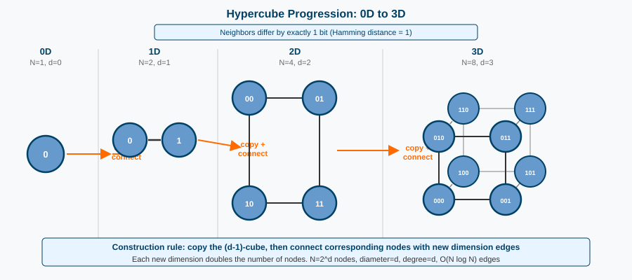

---

## 4D Hypercube Construction

**Step by step: from 3D cube to 4D hypercube**

Take two 3D cubes, connect corresponding nodes:

```
  3D Cube A (prefix 0):        3D Cube B (prefix 1):

  0000──0001                  1000──1001
   |  ╲   |                    |  ╲   |
  0010──0011                  1010──1011
   |    |  |                   |    |  |
  0100──0101                  1100──1101
       ╲   |                        ╲  |
       0110──0111                  1110──1111

  Cubes A and B connected: 0xyz ↔ 1xyz (4th dimension links)
```

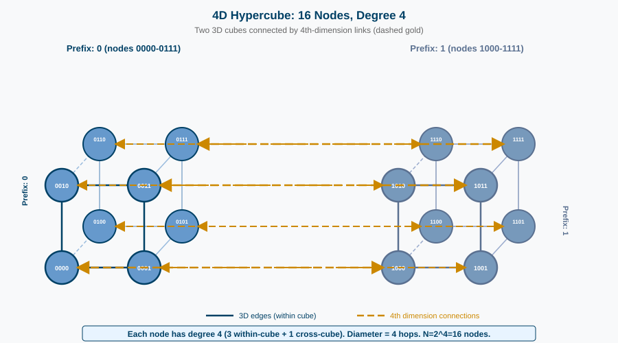

**Each node has exactly 4 links** — one to each neighbor differing in one bit:
Node **0101** connects to: **1**101, 0**0**01, 01**1**1, 010**0**

---

## Hypercube Routing: E-Cube Algorithm

**E-cube (Dimension-order) routing:** simple, deadlock-free, elegant

**Algorithm:**
1. Compute `diff = source XOR destination`
2. For each bit i that is set in `diff` (from highest to lowest dimension):
   - Traverse dimension i (flip bit i in current address)
3. Continue until `diff = 0` (arrived!)

**Example:** from 0010 to 1101

```
diff = 0010 XOR 1101 = 1111  (all 4 bits differ)

Dimension 3: 0010 → 1010  (flip bit 3)
Dimension 2: 1010 → 1110  (flip bit 2)
Dimension 1: 1110 → 1100  (flip bit 1)
Dimension 0: 1100 → 1101  (flip bit 0)
```

Path length = number of differing bits = **Hamming distance**

**Path diversity:** for Hamming distance d, there are **d!** minimal paths (all dimension orderings)

---

## Hypercube: Why It Fell Out of Favor

**Despite beautiful properties, hypercubes are rarely used today**

**The growing degree problem:**

| N nodes | Degree per node | Total port count |
|---------|----------------|-----------------|
| 16 | 4 | 64 |
| 64 | 6 | 384 |
| 256 | 8 | 2,048 |
| 1024 | **10** | 10,240 |
| 1M | **20** | 20M |

**Node degree grows with N** — each new node requires more pins, more cables, more ports

Compare to **mesh/torus:** fixed degree of 4 (2D) or 6 (3D) regardless of N

**Physical layout challenge:**
- High-dimensional cross-links are difficult to route on a chip or PCB
- Link lengths vary wildly — timing non-uniform

**Conclusion:** Fixed-degree networks (mesh, torus, fat tree) are preferred at scale

---

## Network Topology Comparison

| Topology | Degree | Diameter | Bisection BW | Cost |
|----------|--------|----------|-------------|------|
| Bus | N | 1 | 1 | O(N) |
| Ring (uni) | 2 | N/2 | 1 | O(N) |
| Ring (bi) | 2 | N/4 | 2 | O(N) |
| 2D Mesh | 4 | 2√N | √N | O(N) |
| 2D Torus | 4 | √N | 2√N | O(N) |
| Hypercube | log N | log N | N/2 | O(N log N) |
| Omega/Butterfly | log N | log N | N/2 | O(N log N) |
| Benes | 2 log N | 2 log N | N/2 | O(N log N) |
| Fat Tree | ~log N | 2 log N | N/2 | O(N log N) |
| Crossbar | N | 1 | N | O(N²) |

**Observations:**
- Cost O(N log N) achieves near-crossbar latency
- Fixed degree (4) and O(N) cost is possible with mesh/torus — pay with latency
- Fat tree achieves non-blocking at O(N log N) cost

---

## How to Choose a Network Topology?

**There is no universally best topology.** The right choice depends on:

**1. Scale (How many nodes?)**
- Small (≤32): Ring or Bus often sufficient
- Medium (32–1K): Mesh, Torus, or Multistage
- Large (1K+): Fat Tree or Torus

**2. Traffic pattern**
- Nearest-neighbor (stencil, PDE): **Mesh/Torus** — local traffic stays local
- All-to-all (FFT, reductions): **Fat Tree** — any-to-any at full bandwidth
- Random/mixed: **Multistage** or **Fat Tree**

**3. Physical constraints**
- On-chip (regular, 2D): **Mesh**
- Rack-to-rack: **Fat Tree** (InfiniBand)
- Entire supercomputer: **Torus** (predictable scaling)

**4. Cost vs. performance**
- Budget-constrained: **Ring or Mesh** — O(N) cost
- Non-blocking required: **Fat Tree** (higher cost justified by utilization)

---

## Modern Interconnects in Production

**Today's systems mix topologies for different purposes:**

**HPC Clusters:**
- **InfiniBand HDR/NDR (200 Gb/s)** — fat tree topology, non-blocking
- Used by: Frontier (#1 supercomputer 2022), Aurora, most top-500 systems

**GPU Clusters (AI/ML):**
- **NVLink 4.0 + NVSwitch** — all-to-all crossbar topology within a node (900 GB/s)
- Between nodes: **InfiniBand** fat tree (400 Gb/s with NVLink 5.0)
- NVIDIA DGX H100, SuperPOD

**On-Chip (CPU):**
- **Mesh:** Intel Xeon Scalable, AMD EPYC (Infinity Fabric)
- **Ring:** Intel Core desktop chips (up to 8 cores)

**Emerging:**
- **CXL (Compute Express Link):** PCIe-based coherent memory interconnect — connects CPU, GPU, memory pools
- **Optical interconnects:** photonic chips for multi-rack high-bandwidth connectivity

---

## Key Takeaways

**Multistage Networks:**
- O(N log N) cost bridges the gap between O(N) bus and O(N²) crossbar
- Omega: simple, self-routing, but **blocking**
- Butterfly: rearrangeably non-blocking, but **tree saturation**
- Benes: fully non-blocking, **2× cost**
- Fat Tree: non-blocking, **dominant in production**

**Direct Networks:**
- Ring: simplest, fine for small N
- Hierarchical ring: O(√N) latency trick
- Mesh: on-chip standard, fixed degree 4
- Torus: mesh + wraparound → halves diameter
- Hypercube: great routing, but degree grows with N

**Universal Truths:**
1. There is **no free lunch** — every topology trades cost for performance
2. **Traffic pattern** is the most important factor in choosing topology
3. **Physical constraints** (chip layout, wire length) often override theoretical optimums

---

## References

- D. Lawrie, "Access and Alignment of Data in an Array Processor," IEEE Trans. Computers, 1975 (Omega network)
- V. Beneš, "Optimal Rearrangeable Multistage Connecting Networks," Bell System Technical Journal, 1964
- C. Leiserson, "Fat-Trees: Universal Networks for Hardware-Efficient Supercomputing," IEEE Trans. Computers, 1985
- "Introduction to Parallel Computing" — Grama, Gupta, Karypis, Kumar
- "Computer Architecture: A Quantitative Approach" — Hennessy & Patterson
- Patterson & Hennessy, "Computer Organization and Design"
- CMU 15-418/15-618: Parallel Computer Architecture and Programming
- ETH Zurich: Computer Architecture Lectures
- [Intel Xeon Scalable Mesh Architecture](https://www.servethehome.com/the-new-intel-mesh-interconnect-architecture-and-platform-implications/)
- [NVIDIA NVSwitch & NVLink](https://www.nvidia.com/en-us/data-center/nvlink/)
