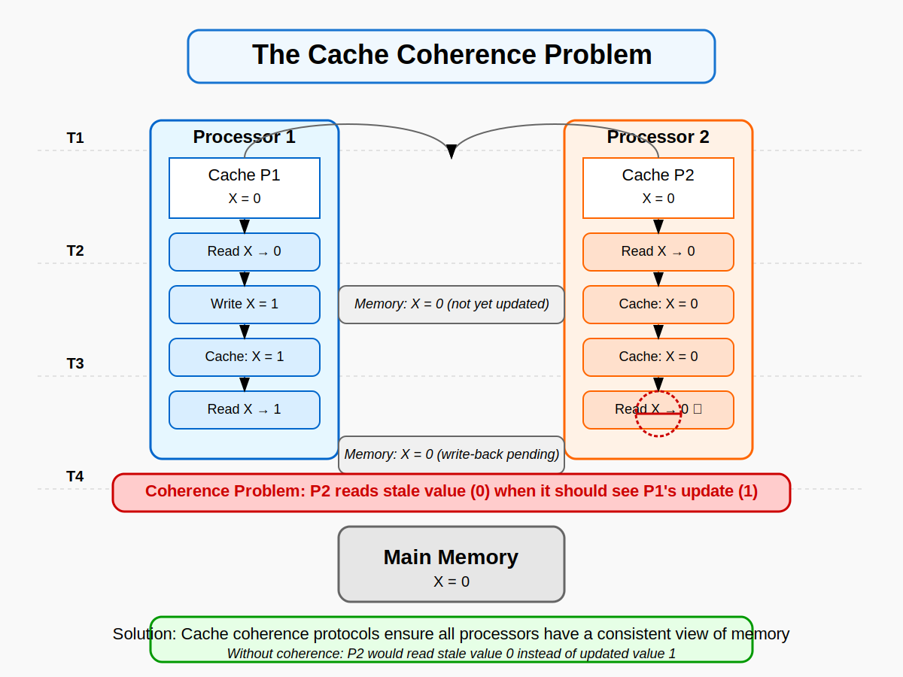
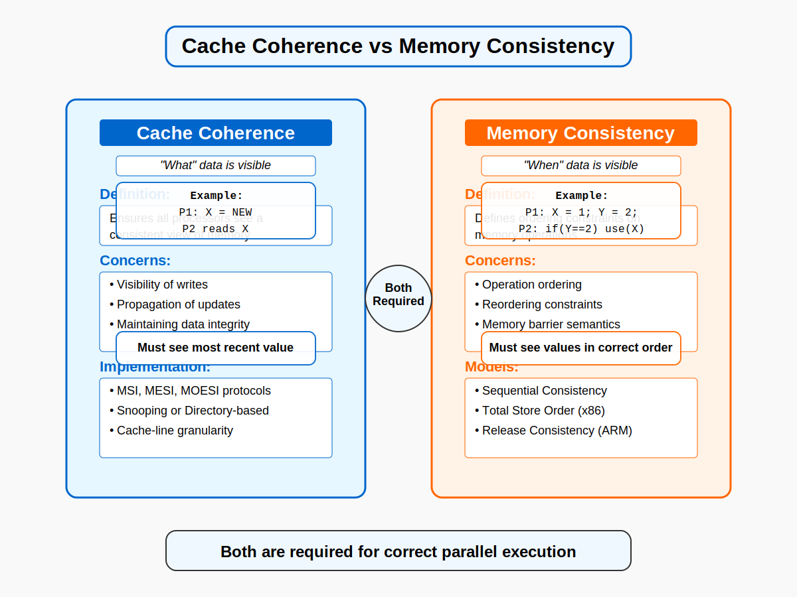
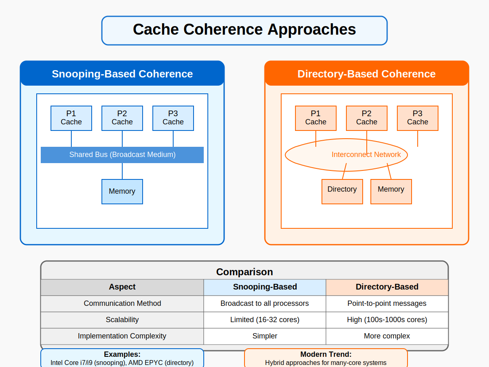
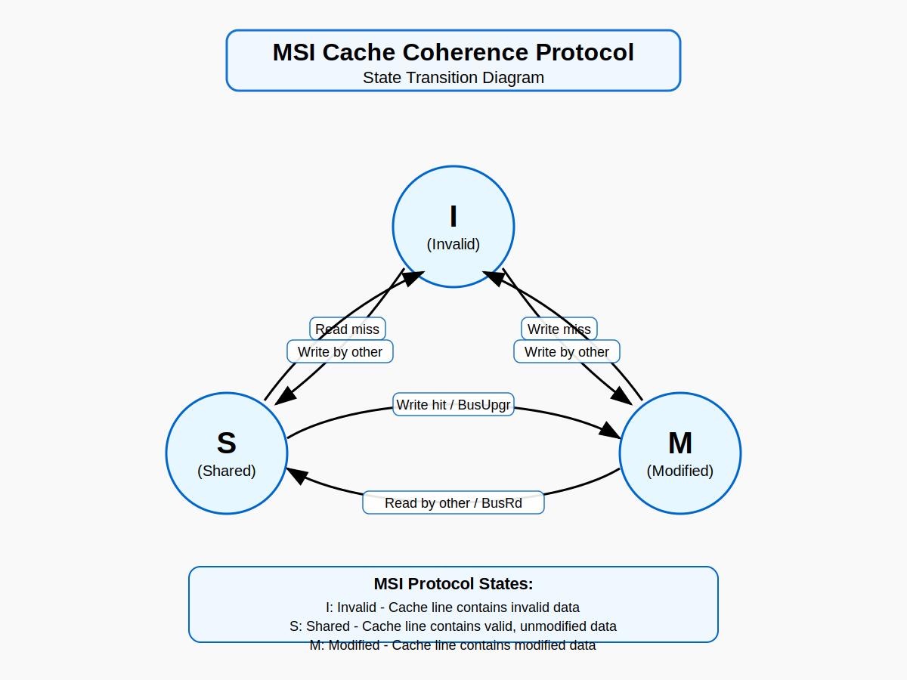
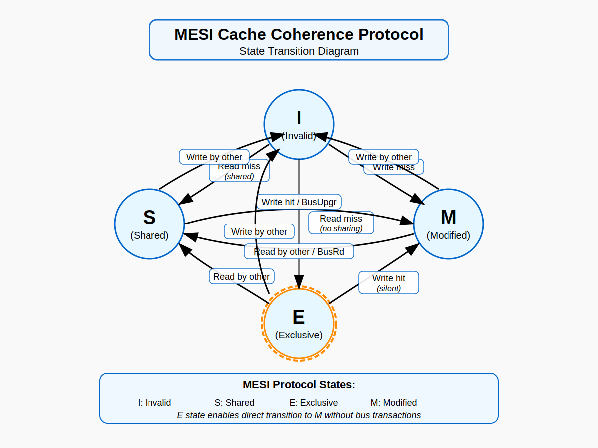
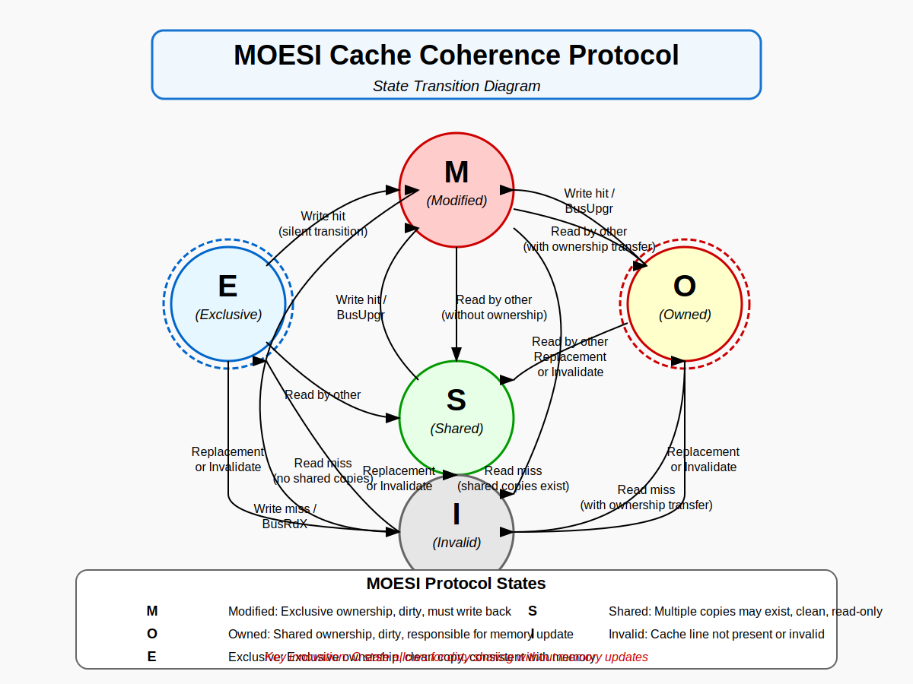
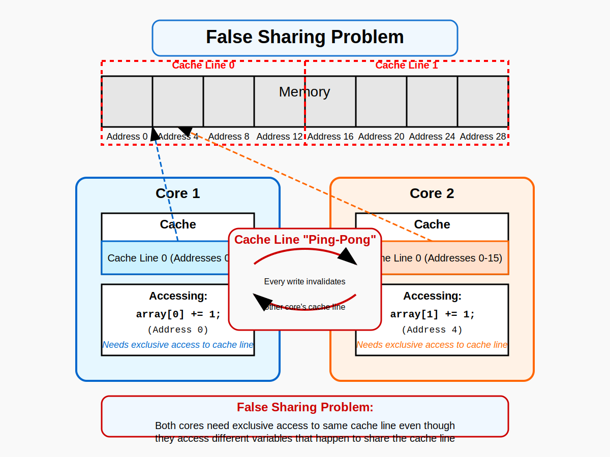

# Cache Coherence in Parallel Computer Architecture
## GWU ECE 6125: Parallel Computer Architecture

<!-- The logo is already in the index.html -->

---

## Introduction to Cache Coherence
- **Definition**: Cache coherence refers to the consistency of shared data stored in multiple local caches
- **Problem**: In multiprocessor systems, multiple copies of the same data can exist in different caches
- **Challenge**: Ensuring that all processors see a consistent view of memory
- **Importance**: Fundamental to correct parallel program execution



---

## Why Cache Coherence Matters
- Enables **correct execution** of parallel algorithms
- Allows for **efficient parallel processing**
- Enforces memory consistency models
- Critical for maintaining **data integrity**
- Foundation for shared-memory multiprocessing

---

## Course Overview
- **Objectives**: Understand cache coherence principles, protocols, and implementations
- **Topics**:
  - Fundamentals of cache memory
  - Cache coherence protocols
  - Directory-based and snooping-based approaches
  - Performance implications
  - Modern implementations
- **Learning outcomes**: Design and analyze cache coherence solutions

---

## Historical Context
- **Early multiprocessors**: Limited sharing, simple coherence
- **1980s**: Bus-based multiprocessor systems emerge
- **1990s**: Directory protocols for larger systems
- **2000s**: On-chip coherence for multicore processors
- **2010s**: Heterogeneous coherence and scalability focus
- **2020s**: Domain-specific coherence optimizations

---

## Review of Cache Memory Basics
- **Purpose**: Bridge the processor-memory speed gap
- **Principle**: Temporal and spatial locality
- **Organization**: Sets, ways, blocks/lines
- **Mapping**: Direct mapped, set associative, fully associative
- **Operations**: Read/write hits and misses

---

## Cache Memory Hierarchy
- **L1 Cache**: Smallest, fastest, closest to processor
- **L2 Cache**: Larger, slightly slower, shared or private
- **L3 Cache**: Largest on-chip cache, typically shared
- **Inclusive vs. Exclusive Hierarchies**
- **Impact on Coherence**: Multiple levels complicate coherence

---

## Shared Memory Multiprocessors
- **Definition**: Multiple processors accessing common memory space
- **Organization**:
  - Centralized shared memory (UMA)
  - Distributed shared memory (NUMA)
- **Challenges**: Memory contention, coherence, consistency

---

## Shared Memory Access Patterns
- **Read-only data**: No coherence issues
- **Migratory data**: Moves between processors
- **Producer-consumer data**: One writes, others read
- **Read-write shared data**: Multiple writers, most challenging
- **Privately accessed data**: Dynamic assignment to processors

---

## The Cache Coherence Problem
- Example scenario:
  - Processor P1 reads value X from memory into its cache
  - Processor P2 reads value X from memory into its cache
  - P1 updates X to X' in its cache
  - P2 reads X (still has old value)
  - **Inconsistency**: P2 doesn't see P1's update


---

## Cache Coherence Problem - Detailed Example
- Initial state: Memory location X contains value 0
- P1 reads X (P1 cache: X=0)
- P2 reads X (P2 cache: X=0)
- P1 writes X=1 (P1 cache: X=1)
- P1 writes to memory (Memory: X=1)
- P2 reads X again (P2 cache still has X=0) ← STALE DATA!
- P2 never sees the update unless coherence is maintained

---

## Cache Coherence Conditions
1. **Write Propagation**: Updates to data in one cache must be propagated to other caches
2. **Transaction Serialization**: All processors must observe memory operations in a consistent order
3. **Write Serialization**: All writes to the same memory location must be seen in the same order by all processors

---

## Cache Coherence Conditions - Write Propagation
- **Definition**: Changes to data in one cache must eventually be visible to other caches
- **Implementation mechanisms**:
  - Update-based: Write updates sent to all copies
  - Invalidation-based: Other copies invalidated upon write
- **Tradeoffs**: Traffic vs. latency

---

## Cache Coherence Conditions - Transaction Serialization
- **Definition**: All processors must observe a consistent global order of operations
- **Challenge**: Different processors may observe operations in different orders
- **Requirement**: Coherence protocol must enforce a serialized view
- **Example**: If P1 writes X then Y, other processors might see Y update before X

---

## Cache Coherence Conditions - Write Serialization
- **Definition**: All writes to the same location must be seen in the same order by all processors
- **Problem**: Without write serialization, different processors may observe different final values
- **Solution**: Coherence protocol ensures all processors agree on the sequence of writes

---

## Coherence vs. Consistency
- **Cache Coherence**: Ensures visibility of memory updates
- **Memory Consistency**: Defines the order of memory operations
- Coherence addresses the "what" of memory updates
- Consistency addresses the "when" of memory updates
- Both are required for correct parallel execution



---

## Coherence vs. Consistency - Detailed Example
- **Program example**:
  ```
  Initially: X=0, Y=0
  Processor 1: X=1; Y=1;
  Processor 2: while(Y==0){}; r1=X;
  ```
- **Coherence guarantees**: Eventually P2 will see X=1 and Y=1
- **Consistency determines**: Whether P2 can read Y=1 but still see X=0 temporarily
- **Outcome depends on both**: Coherence ensures updates are visible, consistency determines when

---

## Basic Approaches to Cache Coherence
- **Snooping-based protocols**: Broadcast-based, suitable for bus-based systems
- **Directory-based protocols**: Scalable for larger systems
- **Software-based approaches**: Explicit coherence management in software
- **Hybrid approaches**: Combining hardware and software techniques



---

## Hardware vs. Software Coherence
- **Hardware coherence**:
  - Transparent to programmer
  - Lower latency
  - Higher hardware complexity
- **Software coherence**:
  - Programmer/compiler managed
  - Lower hardware cost
  - Potentially higher performance overhead
  - Used in specific domains (e.g., some GPUs)

---

## Update vs. Invalidation Protocols
- **Update protocols**:
  - Broadcast updates to all copies
  - Advantages: Reduces miss latency for subsequent reads
  - Disadvantages: Higher bandwidth consumption
- **Invalidation protocols**:
  - Invalidate all other copies on write
  - Advantages: Less traffic for multiple writes
  - Disadvantages: Read misses after invalidation
- Modern systems predominantly use invalidation protocols

---

## Snooping-Based Coherence - Principles
- **Fundamental mechanism**: All caches "snoop" on a shared bus
- **Broadcasting**: Coherence messages sent to all processors
- **Bus arbitration**: Serializes access requests
- **Implementation**: Cache controllers observe all bus transactions
- **Advantage**: Simple implementation
- **Disadvantage**: Limited scalability due to bus bandwidth

---

## Snooping-Based Coherence - Operation
- **Bus transactions**: Read, ReadX (read exclusive), Invalidate, WriteBk (write back)
- **Snooping process**:
  1. Cache controller issues bus transaction
  2. All cache controllers observe the transaction
  3. Each controller takes appropriate action based on local state
- **Example**: On ReadX, other caches invalidate their copies

---

## Snooping Protocol Challenges
- **Bus bandwidth limitations**: Becomes bottleneck with many processors
- **Arbitration overhead**: Increases with processor count
- **Energy consumption**: Broadcasting is power-intensive
- **Snoop filter optimizations**: Reduce unnecessary snooping
- **Typical scale limit**: ~16-32 cores before performance degradation

---

## Directory-Based Coherence - Principles
- **Fundamental mechanism**: Central directory tracks cache line sharing status
- **Targeted messages**: Coherence messages sent only to relevant processors
- **Scalability**: Supports larger numbers of processors
- **Components**: Directory controller, coherence controllers at each node
- **Directory entry fields**: Presence bits, state information, owner identification

---

## Directory-Based Coherence - Operation
- **Basic operations**:
  1. Request sent to directory
  2. Directory consults sharing records
  3. Directory forwards request to relevant nodes
  4. Nodes respond to requester or directory
- **Advantage**: Scales to many processors
- **Disadvantage**: Higher latency for coherence operations

---

## Directory Organization
- **Full-map directories**: One bit per processor per block
- **Limited directories**: Track a limited number of sharers
- **Sparse directories**: Only track cached blocks
- **Hierarchical directories**: Multi-level tracking
- **Tradeoffs**: Memory overhead vs. precision

---

## Cache Coherence Protocol Classifications
- **State-based**: Cache block states determine actions
- **Ownership-based**: Tracks who owns write permission
- **Invalidation vs. Update**: How writes are propagated
- **Blocking vs. Non-blocking**: Protocol handling of concurrent requests
- **Silent vs. Non-silent**: Whether clean evictions are reported

---

## Cache Coherence Protocol Models
- **State transition system**:
  - States for each cache block
  - Events that trigger transitions
  - Actions taken during transitions
- **Finite state machines (FSMs)**:
  - Formal way to represent protocols
  - Enables verification and analysis

---

## Cache States - Basic Concepts
- **Valid/Invalid**: Whether data can be used
- **Clean/Dirty**: Whether data matches memory
- **Exclusive/Shared**: Whether others have copies
- **Owned**: Responsibility for providing data to others
- **Different protocols use different combinations of these concepts**

---

## Basic MSI Protocol
- Three states:
  - **Modified (M)**: Cache has the only valid copy, dirty
  - **Shared (S)**: Cache has a valid copy, clean, others may have copies
  - **Invalid (I)**: Cache does not have a valid copy
- Simplest coherence protocol that works correctly
- Foundation for more complex protocols



---

## MSI Protocol - State Transitions
- **I→S**: Read miss, no other cache has copy
- **I→M**: Write miss
- **S→M**: Write hit, invalidate other copies
- **M→S**: Another processor reads the block
- **M→I**: Another processor writes to the block
- **S→I**: Another processor writes to the block

---

## MSI Protocol - Detailed Operation (1)
- **Cache Read Miss, Block Invalid (I)**:
  1. Send Read request on bus
  2. If another cache has M, it provides data and moves to S
  3. Memory provides data if no cache has M
  4. Requesting cache moves to S

---

## MSI Protocol - Detailed Operation (2)
- **Cache Write Miss, Block Invalid (I)**:
  1. Send ReadX (read exclusive) request on bus
  2. If another cache has M, it provides data and moves to I
  3. All other caches with S move to I
  4. Requesting cache moves to M

---

## MSI Protocol - Detailed Operation (3)
- **Cache Write Hit, Block Shared (S)**:
  1. Send Invalidate on bus
  2. All other caches with S move to I
  3. Requesting cache moves to M
- **Cache Write Hit, Block Modified (M)**:
  1. No bus transaction needed
  2. Write directly to cache

---

## MSI Protocol - Example Scenario
- **Initial state**: Memory X=0, all caches have X in I state
- **Sequence**:
  1. P1 reads X: P1:S(0), Memory X=0
  2. P2 reads X: P1:S(0), P2:S(0), Memory X=0
  3. P1 writes X=1: P1:M(1), P2:I, Memory X=0
  4. P2 reads X: P1:S(1), P2:S(1), Memory X=1
- **Note**: Memory updated when M transitions to S

---

## MSI Protocol - Strengths and Weaknesses
- **Strengths**:
  - Simple implementation
  - Correctly maintains coherence
  - Works for both snooping and directory protocols
- **Weaknesses**:
  - Extra bus transactions for read-to-write transitions
  - No distinction between exclusive clean and shared clean
  - Write-back on all replacements of M state blocks

---

## MESI Protocol - Overview
- Adds an **Exclusive (E)** state to MSI
- **Exclusive**: Block is only in one cache, is clean (matches memory)
- Optimization to reduce bus traffic
- Allows direct transition to M without bus invalidation if already in E
- Common in commercial processors (Intel Core series, AMD Zen architecture)



---

## MESI Protocol - State Transitions
- **I→E**: Read miss, no other cache has copy
- **I→S**: Read miss, other cache(s) have copy
- **I→M**: Write miss
- **E→M**: Write hit (silent transition, no bus traffic)
- **E→S**: Another processor reads the block
- **E→I**: Another processor writes to the block
- **Plus all MSI transitions**

---

## MESI Protocol - Benefits
- **Reduced write-invalidate traffic**: E→M requires no bus transaction
- **Cleaner eviction**: E state blocks can be silently evicted (no write-back)
- **Performance impact**: Can reduce bus traffic by 30-40% over MSI
- **Real-world example**: Intel processors show significant performance improvement

---

## MESI Protocol - Implementation Challenges
- **Detecting exclusive access**: Requires bus or directory support
- **Upgrade operation**: Specialized transition from S to E
- **Silent transitions**: Complicate protocol verification
- **Race conditions**: More complex protocol increases verification complexity

---

## MESI Protocol - Example Scenario
- **Initial state**: Memory X=0, all caches have X in I state
- **Sequence**:
  1. P1 reads X (no other copies): P1:E(0), Memory X=0
  2. P1 writes X=1: P1:M(1), Memory X=0 (No bus transaction!)
  3. P2 reads X: P1:S(1), P2:S(1), Memory X=1
  4. P3 writes X=2: P1:I, P2:I, P3:M(2), Memory X=1

---

## MOESI Protocol - Overview
- Adds **Owned (O)** state to MESI
- **Owned**: Cache has a dirty copy, responsible for updating memory, shared with others
- Allows sharing of modified data without writing back to memory
- Reduces memory traffic for shared writable data
- Common in AMD processors (Zen architecture family)
- Critical for performance in multi-socket AMD EPYC servers



---

## MOESI Protocol - State Transitions
- **M→O**: Another processor reads a modified block
- **O→M**: Write hit on an owned block
- **O→I**: Another processor takes exclusive ownership
- **O→S**: Memory updated, responsibility released
- **Plus all MESI transitions**

---

## MOESI Protocol - Benefits
- **Reduced memory traffic**: Dirty data shared without memory write-back
- **Faster read sharing**: Data provided directly by owner cache
- **Cache-to-cache transfers**: Optimized for multi-socket systems
- **Performance impact**: Significant for workloads with shared writes followed by multiple reads

---

## MOESI Protocol - Implementation Challenges
- **Tracking ownership**: Additional hardware for owner identification
- **Replacement complexity**: Owner must write back before eviction
- **Protocol complexity**: More states and transitions increase verification challenge
- **Hardware overhead**: Additional state bits and control logic

---

## MOESI Protocol - Example Scenario
- **Initial state**: Memory X=0, all caches have X in I state
- **Sequence**:
  1. P1 reads X: P1:E(0), Memory X=0
  2. P1 writes X=1: P1:M(1), Memory X=0
  3. P2 reads X: P1:O(1), P2:S(1), Memory X=0 (Memory not updated!)
  4. P3 reads X: P1:O(1), P2:S(1), P3:S(1), Memory X=0
  5. P1 evicts block: P2:S(1), P3:S(1), Memory X=1 (Now memory updated)

---

## Other Protocol Variants
- **MESIF** (Intel): Adds Forward state for efficient cache-to-cache transfers
- **MERSI** (IBM): Adds Recent state for pseudo-LRU optimization
- **Dragon Protocol**: Update-based rather than invalidation-based
- **Firefly Protocol**: Early directory protocol
- **Customized variants**: Many systems implement proprietary variations

---

## MESIF Protocol (Intel)
- Adds **Forward (F)** state to MESI
- **Forward**: Special shared state designating which cache responds to reads
- Only one cache can be in F state for a block
- Reduces cache-to-cache transfer latency
- Eliminates duplicate responses
- Used in Intel QuickPath Interconnect and UltraPath Interconnect

---

## Protocol Comparison - State Space
- **MSI**: Minimal functional protocol (3 states)
- **MESI**: Adds optimization for exclusive reads (4 states)
- **MOESI**: Adds optimization for shared dirty data (5 states)
- **MESIF**: Alternative to MOESI, optimizes for multiple readers (5 states)
- **Tradeoff**: More states = better performance but higher complexity

---

## Protocol Comparison - Performance
| Protocol | Write After Read | Read After Write | RMW Operations | Memory Traffic |
|----------|------------------|------------------|----------------|---------------|
| MSI      | High             | Medium           | High           | High          |
| MESI     | Medium           | Medium           | Medium         | Medium        |
| MOESI    | Medium           | Low              | Medium         | Low           |
| MESIF    | Medium           | Medium           | Medium         | Medium        |

---

## Snooping Protocol Implementation
- **Bus-side interface**: Monitors all bus transactions
- **Processor-side interface**: Handles processor requests
- **Cache controller logic**: Maintains coherence state bits with cache tags
- **Bus arbitration**: Resolves contention for bus access
- **Write buffer**: Queues writes to reduce processor stalls

---

## Directory Protocol Implementation
- **Directory memory**: Stores sharing information
- **Home node**: Manages directory entry for a memory block
- **Request forwarding**: Routes coherence messages
- **Serialization point**: Directory controller orders concurrent requests
- **Reply collection**: Gathers responses from sharers

---

## Directory Protocol - Message Types
- **Request messages**: GetS (get shared), GetX (get exclusive), Putx (writeback)
- **Forward messages**: Fwd_GetS, Fwd_GetX, Invalidate
- **Response messages**: Data, Ack (acknowledgment), Ack_Count (counter)
- **Example message flow**: Request → Directory → Forwards → Responses → Completion

---

## Directory Storage Overheads
- **Full-map directory**: O(P × M/B) bits (P=processors, M=memory, B=block size)
- **Limited pointer**: Fixed number of sharers tracked, O(log P) per entry
- **Coarse vector**: Groups of processors tracked together
- **Sparse directory**: Only tracks blocks in caches
- **Example**: 64-processor system with full-map requires 64 bits per block

---

## Inclusive vs. Non-Inclusive Caches
- **Inclusive caches**:
  - Higher level includes all blocks in lower levels
  - Simplifies coherence (snoop filter effect)
  - Wastes capacity with duplication
- **Non-inclusive caches**:
  - No guarantee of inclusion
  - Better cache utilization
  - More complex coherence management
- **Exclusive caches**: Guarantee no duplication across levels

---

## Hierarchical Cache Coherence
- **Multi-level coherence protocols**: Match cache hierarchy
- **Inner level coherence**: Within a core or cluster
- **Outer level coherence**: Between clusters or sockets
- **Filtering approaches**: Reduce outer level traffic
- **Examples**: Intel mesh interconnect, AMD Infinity Fabric

---

## False Sharing
- Multiple processors access different variables in the same cache line
- Cache coherence operates at cache line granularity
- Results in unnecessary invalidations and transfers
- Example:
  - Array[0] accessed by P1, Array[1] accessed by P2
  - Both in same cache line → ping-pong effect
- Can significantly degrade performance
- Real measurements show up to 10x slowdown in extreme cases



---

## False Sharing - Detection and Mitigation
- **Detection tools**: Intel VTune, AMD CodeAnalyst, performance counters
- **Mitigation strategies**:
  - Padding data structures
  - Aligning variables to cache line boundaries
  - Thread-local storage for hot variables
  - Restructuring algorithms to improve access patterns
- **Example code**: `struct { char data; char padding[63]; } aligned_data;`

---

## Synchronization and Coherence
- **Atomic operations**: Require coherence for correctness
- **Lock implementations**: Depend on coherent view of lock variables
- **Barriers**: All participants must see consistent memory state
- **Hardware primitives**: Test-and-set, compare-and-swap, load-linked/store-conditional
- **Interaction**: Memory consistency models define synchronization semantics

---

## Memory Consistency Models
- **Sequential consistency**: Operations appear in a global order preserving program order
- **Relaxed models**: Allow reordering of operations for performance
- **TSO (Total Store Order)**: Used in x86 processors
- **Release consistency**: Operations ordered only relative to synchronization
- **Coherence as foundation**: All consistency models assume coherent memory

---

## Coherence Performance Metrics
- **Coherence miss rate**: Portion of misses due to coherence
- **Cache-to-cache transfer latency**: Time for one cache to get data from another
- **Bus/network utilization**: Coherence traffic as percentage of capacity
- **Invalidation count**: Frequency of coherence-related invalidations
- **Write-back traffic**: Memory updates due to coherence

---

## Performance Optimization Techniques
- **Coherence controllers**: Hardware optimization for common cases
- **Coherence prefetching**: Anticipate coherence misses
- **Update coalescing**: Combine multiple updates to same line
- **Adaptive protocols**: Change behavior based on access patterns
- **Victim caches**: Reduce cost of conflict misses

---

## Multi-socket System Coherence
- **Cross-socket coherence**: Higher latency, bandwidth constraints
- **Directory-based approaches**: Typically used between sockets
- **NUMA considerations**: Local vs. remote memory access costs
- **Coherence domains**: Different protocols for intra- vs. inter-socket
- **Examples**: Intel UPI, AMD Infinity Fabric, ARM CCIX

---

## Cache Coherence in Intel Processors
- **Ring interconnect** (pre-Skylake): Connected cores and LLC slices
- **Mesh interconnect** (Skylake and later): Grid topology for better scalability
- **Snoop filtering**: Home node with presence bits reduces broadcasts
- **MESIF protocol**: Forward state optimizes for shared reads
- **Inclusive last-level cache**: Simplifies coherence implementation

---

## Cache Coherence in AMD Processors
- **Infinity Fabric**: Scalable coherent interconnect
- **MOESI protocol**: Optimized for shared dirty data
- **Chiplet architecture**: Multiple CCXs (Core Complexes)
- **Directory-based coherence**: Between chiplets and sockets
- **Probe filter**: AMD's directory implementation
- **Non-inclusive caches**: Better capacity utilization

---

## Cache Coherence in ARM Systems
- **AMBA CHI (Coherent Hub Interface)**: Standard coherent interconnect
- **Distributed directory**: Scales with system size
- **Snoop filter**: Reduces broadcast traffic
- **ACE (AXI Coherency Extensions)**: Protocol for coherent transfers
- **Heterogeneous coherence**: CPU, GPU, accelerator coherence

---

## GPU Cache Coherence
- **Traditional GPUs**: Limited or no coherence with CPU
- **Modern approaches**:
  - AMD hUMA: Heterogeneous Uniform Memory Access
  - NVIDIA Unified Memory: Software-managed coherence
  - Intel Xe: Hardware coherent GPU caches
- **Challenges**: Massive parallelism, different access patterns

---

## Heterogeneous System Coherence
- **CPU-GPU coherence**: Different cache designs, access patterns
- **Accelerator coherence**: AI/ML processors, FPGAs, custom ASICs
- **Selective coherence domains**: Not all components need full coherence
- **Hardware-software co-design**: Some coherence managed in software
- **Example**: Apple M1/M2 unified memory architecture

---

## Non-Volatile Memory and Coherence
- **Persistent memory**: Intel Optane, future technologies
- **New challenges**:
  - Persistence ordering guarantees
  - Crash consistency requirements
  - Power failure considerations
- **Extended protocols**: Additional states and operations
- **Research area**: Active development for emerging memory technologies

---

## Scalability Challenges
- **Directory storage overhead**: Grows with processor count
- **Verification complexity**: Grows exponentially with states
- **Network congestion**: Hotspots in coherence traffic
- **Latency concerns**: Multiple hops for coherence operations
- **Energy consumption**: Coherence messages consume significant power

---

## Coherence Protocol Verification
- **Verification challenges**: Race conditions, deadlocks, livelocks
- **Model checking**: Formal verification of protocol correctness
- **Simulation-based validation**: Test corner cases and common operations
- **Formal methods**: Mathematical proof of correctness properties
- **Testing**: Stress tests, random testing, directed test cases

---

## Advanced Research Directions
- **Self-invalidation protocols**: Reduce directory storage
- **Region-based coherence**: Coarser granularity for reduced overhead
- **Temporal coherence**: Time-based invalidation instead of explicit messages
- **Machine learning optimizations**: Predict coherence patterns
- **Near-data computing**: Reduce coherence requirements by moving computation

---

## Token Coherence
- **Key idea**: Distribute tokens representing permission to access data
- **Properties**:
  - Fixed number of tokens per block
  - Write requires all tokens
  - Read requires at least one token
- **Advantages**: Avoids races, supports direct cache-to-cache transfers
- **Fallback mechanism**: For starvation avoidance
- **Research status**: Advanced protocol with good scalability properties

---

## Timestamp-Based Coherence
- **Key idea**: Use logical timestamps to order operations
- **Implementation**:
  - Attach timestamps to memory operations
  - Enforce coherence based on timestamp ordering
  - Self-invalidate based on time bounds
- **Advantages**: Reduced directory storage, lower message counts
- **Disadvantages**: Additional timestamp storage, clock synchronization

---

## Software-Defined Coherence
- **Key idea**: Dynamically adjust coherence protocols based on workload
- **Implementation**:
  - Runtime monitoring of access patterns
  - Protocol switching for different phases
  - Compiler hints for coherence optimization
- **Advantages**: Better adaptation to program behavior
- **Research status**: Active area with promising results

---

## Cloud Computing and Coherence
- **Distributed shared memory systems**: Software coherence across nodes
- **RDMA (Remote Direct Memory Access)**: Hardware support for remote memory
- **Consistency as a service**: Relaxed coherence guarantees for scalability
- **Application-specific coherence**: Tailor coherence to application needs
- **Examples**: Amazon Nitro, Google TPU interconnect

---

## Industry Case Study: Intel Sapphire Rapids
- **Mesh architecture**: Grid interconnect for core-to-core communication
- **UPI (Ultra Path Interconnect)**: For multi-socket coherence
- **Enhanced directory**: Reduced snoop traffic
- **Coherence domains**: Different handling for on-die vs. cross-socket
- **Performance improvements**: Optimized for data center workloads

---

## Industry Case Study: AMD EPYC
- **Chiplet architecture**: Multiple CCDs (Core Complex Dies)
- **Infinity Architecture**: Coherent fabric connecting chiplets
- **Scalable directory**: Supports up to 4 sockets natively
- **NUMA optimizations**: Locality-aware coherence
- **Coherence impact**: Critical for database and virtualization performance

---

## Measuring Coherence Performance
- **Performance counters**: Hardware monitors for coherence events
- **Tools**:
  - Intel VTune
  - AMD uProf
  - ARM Performance Monitor Unit
- **Metrics to monitor**:
  - Coherence misses
  - Snoop hit rates
  - Directory access latency
  - Cache-to-cache transfer counts

---

## Future Trends
- **Disaggregated memory**: Coherence across memory pools
- **Photonic interconnects**: Higher bandwidth for coherence traffic
- **Accelerator coherence**: Specialized protocols for AI/ML
- **Post-Moore optimizations**: Energy-efficient coherence
- **Coherent heterogeneous systems**: CPU, GPU, NPU, FPGA coherence
- **Quantum computing memory coherence**: New frontier

---

## Best Practices for Developers
- **Awareness of coherence impacts**: Understand performance implications
- **Avoiding false sharing**: Proper data alignment and padding
- **Locality optimization**: Minimize cross-core communication
- **Profiling techniques**: Identify coherence bottlenecks
- **Algorithm design**: Coherence-friendly data structures and access patterns

---

## Review and Takeaways
- Cache coherence is fundamental to shared memory multiprocessing
- Protocols range from simple MSI to complex MOESI and beyond
- Implementation approaches include snooping and directories
- Performance depends on hardware design and software patterns
- Modern systems use custom coherence solutions for specific domains
- Future systems face challenges of scale and heterogeneity

---

## Research Project Ideas
1. Coherence protocol verification using formal methods
2. Measuring false sharing impacts in parallel applications
3. Implementing a custom coherence protocol in simulation
4. Evaluating coherence overhead in different workloads
5. Designing coherence-aware data structures
6. Exploring coherence in heterogeneous systems

---

## References
1. Sorin, D. J., Hill, M. D., & Wood, D. A. (2011). A Primer on Memory Consistency and Cache Coherence. Morgan & Claypool Publishers.
2. Hennessy, J. L., & Patterson, D. A. (2019). Computer Architecture: A Quantitative Approach (6th ed.). Morgan Kaufmann.
3. Culler, D. E., Singh, J. P., & Gupta, A. (1999). Parallel Computer Architecture: A Hardware/Software Approach. Morgan Kaufmann.
4. Martin, M. M., Hill, M. D., & Wood, D. A. (2012). Token Coherence: Decoupling Performance and Correctness. Proceedings of the 30th Annual International Symposium on Computer Architecture, 182-193.
5. Conway, P., Kalyanasundharam, N., Donley, G., Lepak, K., & Hughes, B. (2010). Cache Hierarchy and Memory Subsystem of the AMD Opteron Processor. IEEE Micro, 30(2), 16-29.
6. Intel Corporation. (2021). Intel® 64 and IA-32 Architectures Optimization Reference Manual.
7. ARM Ltd. (2020). ARM Architecture Reference Manual: ARMv8, for ARMv8-A architecture profile.
8. Ros, A., Kaxiras, S. (2015). Callback: Efficient Synchronization without Invalidation with a Directory Just for Spin-Waiting. Proceedings of the 42nd Annual International Symposium on Computer Architecture, 427-438.
9. Kaxiras, S., & Keramidas, G. (2010). SARC Coherence: Scaling Directory Cache Coherence in Performance and Power. IEEE Micro, 30(5), 54-65.
10. Choi, B., Komuravelli, R., Sung, H., Smolinski, R., Honarmand, N., Adve, S. V., Adve, V. S., Ooi, N., & Ceze, L. (2011). DeNovo: Rethinking the Memory Hierarchy for Disciplined Parallelism. Proceedings of the 20th International Conference on Parallel Architectures and Compilation Techniques, 155-166.
11. Bakhoda, A., Yuan, G. L., Fung, W. W., Wong, H., & Aamodt, T. M. (2009). Analyzing CUDA Workloads Using a Detailed GPU Simulator. Proceedings of the 2009 IEEE International Symposium on Performance Analysis of Systems and Software, 163-174.
12. Zhao, H., Shriraman, A., Dwarkadas, S., & Snoeren, A. C. (2010). SPACE: Sharing Pattern-based Directory Coherence for Multicore Scalability. Proceedings of the 19th International Conference on Parallel Architectures and Compilation Techniques, 135-146.
