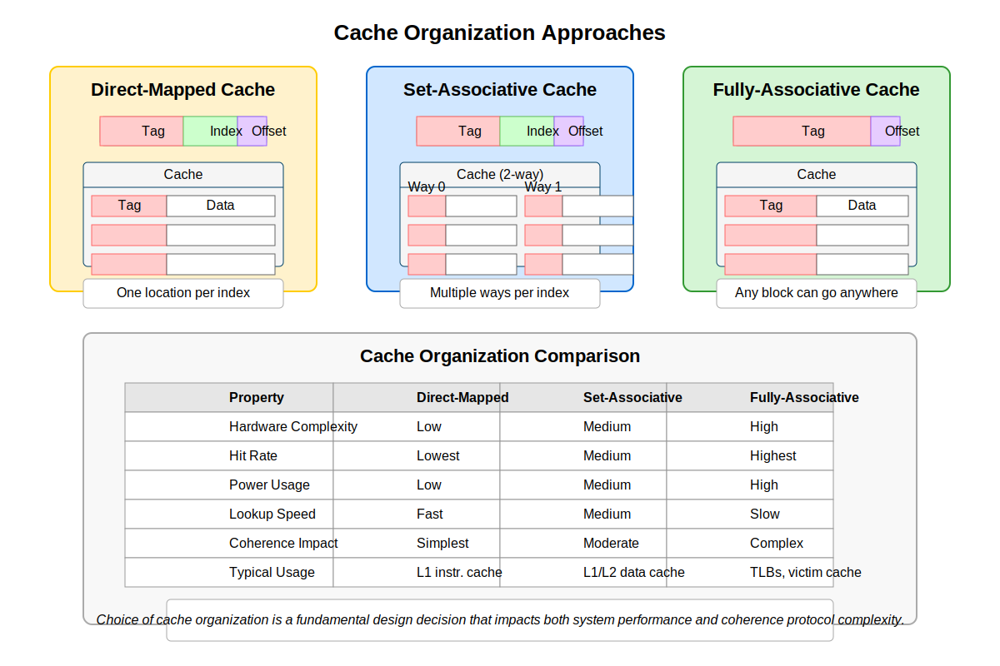
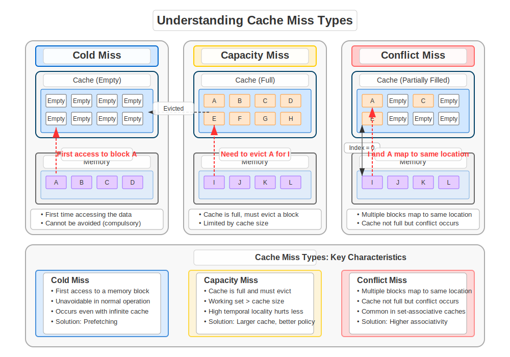
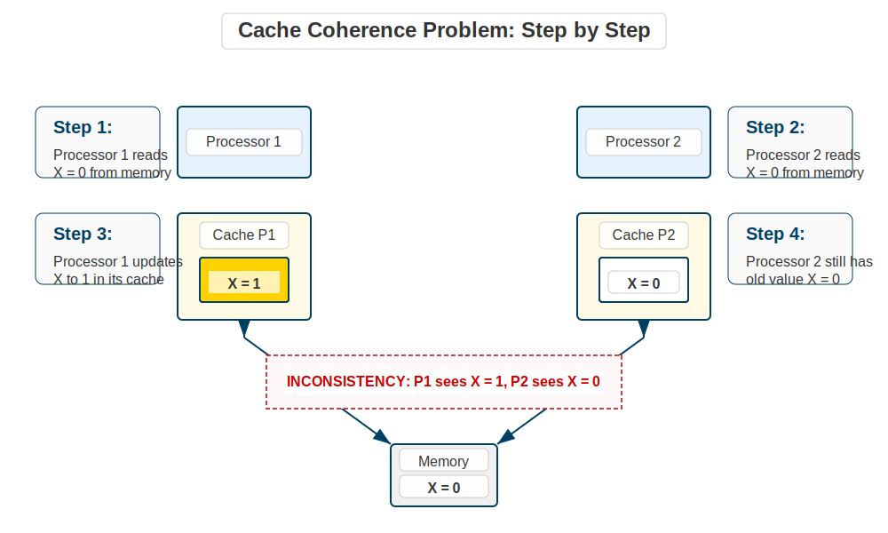
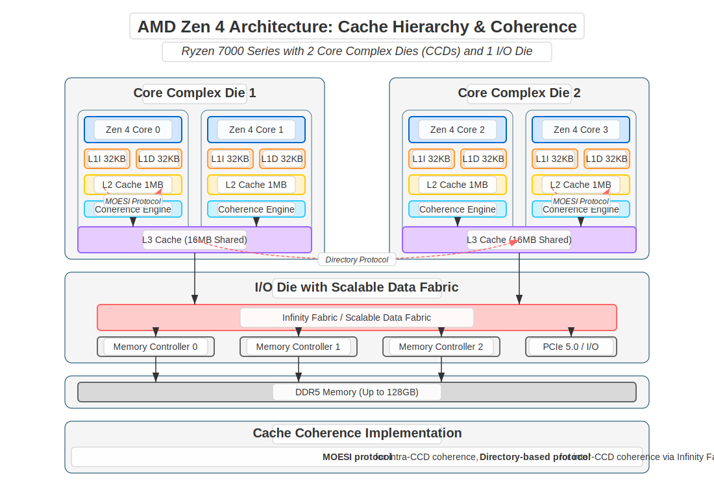

# Cache Coherence in Parallel Computer Architecture
## GWU ECE 6125: Parallel Computer Architecture

---

## 1. Introduction to Shared Memory Systems
- **What is Shared Memory?**
  - Multiple processors can access the same memory
  - Each processor has its own cache
  - All processors see the same data
- **Why is it Important?**
  - Enables parallel processing
  - Allows data sharing between processors
  - Simplifies programming compared to message passing


---

## 2. Shared Memory System Examples
- **Desktop/Laptop Computers**
  - Intel Core i7/i9: 8-16 cores, shared L3 cache
  - AMD Ryzen: Multiple CCX modules sharing memory
- **Servers**
  - Intel Xeon: Multiple sockets, shared memory
  - IBM POWER: Enterprise systems with shared memory
- **Supercomputers**
  - Multiple nodes with shared memory within nodes
  - Hybrid shared/distributed memory across nodes

---

## 3. The Memory Access Problem
- **Speed Gap**
  - Processors are very fast (1ns per operation)
  - Memory is much slower (100ns per access)
  - This gap is growing every year
- **Why This Matters**
  - Programs spend most time waiting for memory
  - Slow memory limits processor performance
  - Need a solution to bridge this gap

---

## 4. Memory Access Speed: The Numbers
- **Typical Access Times**:
  - CPU Register: 0.3-1 ns
  - L1 Cache: 1-3 ns
  - L2 Cache: 3-10 ns
  - L3 Cache: 10-20 ns
  - Main Memory: 100-300 ns
  - Disk/SSD: 10,000-100,000 ns
- **Real-World Impact**:
  - 100-cycle stall on memory access
  - Thousands of instructions could execute in this time

---

## 5. Memory Access Patterns
- **Temporal Locality**
  - If you access data once, you'll likely access it again soon
  - Example: Variables in a loop
  - Why: Programs often reuse data
- **Spatial Locality**
  - If you access data at address X, you'll likely access data near X
  - Example: Array elements
  - Why: Programs often access data sequentially

---

## 6. Memory Access Pattern Examples
- **Temporal Locality Example**:
  ```
  // Variable 'sum' is accessed repeatedly
  int sum = 0;
  for (int i = 0; i < 1000; i++) {
    sum += array[i];  // sum reused each iteration
  }
  ```
- **Spatial Locality Example**:
  ```
  // Array elements accessed sequentially
  for (int i = 0; i < 1000; i++) {
    process(array[i]);  // adjacent memory locations
  }
  ```

---

## 7. Cache Basics (Refresher)
- **What is a Cache?**
  - Fast memory close to the processor
  - Stores frequently accessed data
  - Much smaller than main memory
- **Why Use Caches?**
  - Faster than main memory
  - Reduces memory access time
  - Improves processor performance

---

## 8. Cache Hierarchy (Refresher)
- **Typical Modern Hierarchy**:
  - L1 Cache: Smallest, fastest (32-64KB)
    - Often split into instruction and data caches
  - L2 Cache: Medium size/speed (256KB-1MB)
    - Usually private to each core
  - L3 Cache: Largest, slowest cache (8-32MB)
    - Often shared between cores
- **Why Multiple Levels?**
  - Tradeoff between size, speed, and cost
  - Step-by-step bridging of the speed gap

---

## 9. Shared vs. Private Caches
- **Private Caches**
  - Each processor has its own cache
  - No coherence needed within cache
  - Better for single-thread performance
  - Example: L1/L2 caches in modern CPUs

- **Shared Caches**
  - Multiple processors share one cache
  - No coherence needed between processors
  - Better for multi-thread performance
  - Example: L3 cache in some systems

---

## 10. Shared Cache Advantages
- **No Coherence Overhead**
  - All processors see same data
  - No need for invalidation
  - No cache-to-cache transfers
  - Like everyone reading from same book

- **Better Resource Utilization**
  - No duplicate data across caches
  - More effective cache capacity
  - Better for shared data
  - Like sharing one large library instead of many small ones

---

## 11. Shared Cache Disadvantages
- **Access Contention**
  - Multiple processors compete for cache
  - Increased access latency
  - Cache thrashing possible
  - Like too many people trying to use same library

- **Scalability Issues**
  - Cache becomes bottleneck
  - Limited by single cache bandwidth
  - Hard to scale to many processors
  - Like library getting too crowded

---

## 12. Why Private Caches Dominate
- **Better Single-Thread Performance**
  - No contention for local data
  - Lower access latency
  - Better for most workloads
  - Like having your own personal library

- **Easier to Scale**
  - Add more processors easily
  - No single cache bottleneck
  - Better for modern multi-core
  - Like having multiple libraries instead of one huge one

---

## 13. Modern Hybrid Approaches
- **Multi-Level Cache Design**
  - Private L1/L2 for performance
  - Shared L3 for capacity
  - Best of both worlds
  - Like personal books + shared library

- **Example: Intel Core i7**
  - Private 32KB L1 per core
  - Private 256KB L2 per core
  - Shared 8-16MB L3
  - Optimized for common workloads

---

## 14. Cache Line Basics (Refresher)
- **What is a Cache Line?**
  - Basic unit of cache storage
  - Usually 64 bytes
  - Contains multiple words of data
- **Cache Line Structure**
  - Tag: Identifies which memory block this is
  - State bits: Tracks if data is valid/modified
  - Data: The actual memory contents

---

## 15. Cache Line: Detailed Example (Refresher)
- **64-byte Cache Line**:
  - Can hold 16 integers (4 bytes each)
  - Or 8 doubles (8 bytes each)
- **Structure Breakdown**:
  ```
  |--- Tag (24 bits) ---|-- State (2-5 bits) --|------ Data (64 bytes) ------|
  ```
- **Why This Matters**:
  - When one byte is accessed, entire line is fetched
  - Modifications happen at line granularity
  - Coherence is tracked per line, not per byte

---

## 16. Cache Memory Addressing (Refresher)
- **Parts of a Memory Address**:
  - Tag: Which block in memory
  - Index: Which set in cache
  - Offset: Which byte in cache line
- **Example: 32-bit Address, 64-byte Lines, 4-way cache with 1024 sets**:
  ```
  |-- Tag (16 bits) --|-- Index (10 bits) --|-- Offset (6 bits) --|
  ```
- **How It Works**:
  - Offset selects byte within line (2^6 = 64 bytes)
  - Index selects set (2^10 = 1024 sets)
  - Tag checked against stored tags to find match

---

## 17. Cache Organization Types (Refresher)
- **Direct-mapped Cache**
  - Each memory block has one possible location
  - Simple but can cause conflicts
  - Like a parking lot with assigned spots
- **Set-associative Cache**
  - Each block has several possible locations
  - Better but more complex
  - Like a parking lot with multiple spots per section

---

## 18. More Cache Organization Types (Refresher)
- **Fully-associative Cache**
  - Block can go anywhere
  - Best but most complex
  - Like a parking lot with any spot available
- **Comparison**:
  - Direct-mapped: Simple hardware, high conflict rate
  - Set-associative: Balance of complexity and performance
  - Fully-associative: Best hit rate, most expensive hardware



---

## 19. Cache Organization: Detailed Example (Refresher)
- **Direct-mapped Cache Example**:
  - 4KB cache with 64-byte lines = 64 lines
  - Memory address 0x12345678 maps to line (0x78/64) % 64 = line 29
  - Only one place it can go
- **4-way Set-associative Example**:
  - Same 4KB cache = 16 sets of 4 lines each
  - Address 0x12345678 maps to set (0x78/64) % 16 = set 7
  - Can go in any of the 4 ways in set 7
  - Need replacement policy to choose which way

---

## 20. Cache Miss Types Explained (Refresher)
- **Cold Miss**
  - First time accessing data
  - Cannot be avoided
  - Like opening a new book
- **Capacity Miss**
  - Cache is too small for all needed data
  - Like trying to fit too many books on a small shelf
  - Solution: Bigger cache

---

## 21. More Cache Miss Types (Refresher)
- **Conflict Miss**
  - Data blocks compete for same location
  - Like two cars wanting same parking spot
  - Solution: More associative cache
- **Coherence Miss**
  - Another processor modified the data
  - Like someone changing a page while you're reading
  - Solution: Efficient coherence protocol



---

## 22. Cache Miss Example (Refresher)
- **Program Accessing Matrix**:
  ```
  // Accessing 1024x1024 matrix (4MB)
  // With 64KB cache
  for (int i = 0; i < 1024; i++)
    for (int j = 0; j < 1024; j++)
      sum += matrix[i][j];
  ```
- **What Happens**:
  - Cold misses: First access to each cache line
  - Capacity misses: Matrix (4MB) > cache (64KB)
  - Conflict misses: If direct-mapped, rows collide
  - Result: Many cache misses, poor performance

---

## 23. The Cache Coherence Problem
- **What is Cache Coherence?**
  - Ensuring all processors see the same data
  - When one processor updates data, others must see the change
  - Like everyone reading the same book
- **Why is it Hard?**
  - Each processor has its own cache
  - Updates in one cache aren't visible to others
  - Like multiple people reading different copies

---

## 24. Cache Coherence Problem: Example
- **Simple Example**:
  ```
  // Initially: Memory X = 0, all caches empty
  
  P1: Read X   // P1's cache now has X = 0
  P2: Read X   // P2's cache now has X = 0
  P1: Write X = 1  // P1's cache now has X = 1
  P2: Read X   // Without coherence, P2 still sees X = 0!
  ```
- **Problem**:
  - P2 has stale data
  - Different processors see different values
  - Program correctness compromised



---

## 25. Cache Coherence Requirements
- **Write Propagation**
  - When one processor writes, others must see the change
  - Like updating a shared document
  - Example: If P1 writes X=1, P2 must eventually see X=1

---

## 26. Cache Coherence Requirements (continued)
- **Write Serialization**
  - All processors must see writes in the same order
  - Like agreeing on the sequence of events
  - Example: If P1 writes X=1, then P2 writes X=2, all processors must see X=1 before X=2
  - Critical for correctness in parallel programs

---

## 27. Cache Coherence Requirements (continued)
- **Read Value**
  - Reading must get the most recent value
  - Like reading the latest version of a document
  - Example: After P1 writes X=1, any processor that reads X should get 1 not 0
  - Defines what "most recent" means in terms of program order

---

## 28. Coherence vs. Consistency
- **Cache Coherence**
  - About single memory location
  - All processors see same value for one address
  - Like everyone seeing same text on one page
  - Ensures updates to single location are visible

---

## 29. Coherence vs. Consistency (continued)
- **Memory Consistency**
  - About multiple memory locations
  - Order of operations across different addresses
  - Like reading multiple pages in order
  - Ensures updates to different locations follow ordering rules


---

## 30. Memory Consistency Models
- **Sequential Consistency**
  - All processors see operations in same order
  - Like watching a movie together
  - Simple but slow
  - Maintains the illusion of a single global order

---

## 31. Memory Consistency Models (continued)
- **Relaxed Consistency**
  - Allows reordering for performance
  - Like reading chapters in different order
  - Faster but more complex
  - Requires explicit synchronization

---

## 32. Memory Consistency Example Explained
- **Sequential Consistency Example**:
  ```
  // Initially X=0, Y=0
  
  Processor 1    |    Processor 2
  ---------------|----------------
  Write X=1      |    Read Y (gets 1)
  Write Y=1      |    Read X (gets 0)
  ```
- **This outcome is impossible with sequential consistency**
- **Why?** If P2 saw Y=1, then it must have seen P1's write to Y
- **Therefore** P2 must also see P1's write to X (since X was written before Y)
- **In sequential consistency**, if P2 reads Y=1, it must read X=1 also

---

## 33. Relaxed Consistency Example
- **Relaxed Consistency Models Allow This**:
  ```
  // Initially X=0, Y=0
  
  Processor 1    |    Processor 2
  ---------------|----------------
  Write X=1      |    Read Y (gets 1)
  Write Y=1      |    Read X (gets 0)
  ```
- **Why?** Relaxed models allow writes to be reordered
- **Result**: P2 can see the write to Y but not to X
- **Real-world impact**: Better performance but harder to reason about

---

## 34. Basic Approaches to Cache Coherence
- **Snooping Protocols**
  - Use a shared bus that all caches monitor
  - Simple to implement
  - Limited scalability
  - Common in small-scale systems (2-16 cores)

- **Directory-Based Protocols**
  - Use a central directory to track cache states
  - More complex to implement
  - Better scalability
  - Common in large-scale systems (16+ cores)

---

## 35. Snooping Protocols Explained
- **What is Snooping?**
  - Caches watch a shared bus
  - Like listening to a radio broadcast
  - All caches hear all messages
- **How it Works**
  - When one cache writes, it broadcasts
  - Other caches hear and update
  - Like announcing changes over a PA system

---

## 36. Snooping Protocol: Detailed Example
- **Example Scenario**:
  1. Processor 1 wants to write to address X
  2. P1 broadcasts "I want exclusive access to X" on bus
  3. All other processors with X in their cache invalidate it
  4. P1 performs the write
  5. Later, if P2 reads X, it will miss and get current value
- **Like**: Announcing in a library "I'm taking book X to make notes"
  - Everyone returns their copies
  - Only you have the book while writing


---

## 37. Snooping Protocol Advantages
- **Advantages**:
  - Simple to implement
  - Low latency for small systems
  - Works well for bus-based systems
  - Natural broadcast medium matches protocol
- **Common Uses**:
  - Desktop/laptop processors
  - Small-scale multiprocessors
  - Within a single CPU socket

---

## 38. Snooping Protocol Limitations
- **Limitations**:
  - Requires broadcast medium (usually a bus)
  - Bus becomes bottleneck as system scales
  - Bus bandwidth limits number of processors
  - Like too many people trying to speak at once
- **Typical Scaling Limit**:
  - Becomes inefficient beyond 8-16 processors
  - Bus saturation causes performance collapse

---

## 39. Directory-Based Protocols Explained
- **What is a Directory?**
  - Central record of who has what data
  - Like a library catalog system
  - Tracks all cache copies
- **How it Works**
  - Before writing, check directory
  - Directory tells who needs updating
  - Like asking the librarian who has books checked out

---

## 40. Directory Protocol: Detailed Example
- **Example Scenario**:
  1. Processor 1 wants to write to address X
  2. P1 sends request to directory
  3. Directory checks its records for X
  4. Directory sends invalidate messages only to processors with X (say P3 and P4)
  5. P3 and P4 invalidate their copies and acknowledge
  6. Directory grants write permission to P1
- **Like**: Asking the librarian "Who has book X?" then only notifying those people

---

## 41. Directory Structure Details Explained
- **Presence Bits**:
  - One bit per processor in the system
  - Each bit shows if that processor has the data
  - **Example**: In 8-processor system, bits 00100110 means processors 2, 3, and 6 have copies
  - **Real-world analogy**: Library sign-out sheet showing who has each book

---

## 42. Directory Structure Details (continued)
- **State Information**:
  - Tracks the state of the cache line in the system
  - Common states: Uncached, Shared, Exclusive
  - **Example**: 
    - Uncached: No processor has the data
    - Shared: Multiple processors have read-only copies
    - Exclusive: One processor has the only copy (may be modified)
  - **Real-world analogy**: Book status (available, checked out, reference only)

---

## 43. Directory Structure Details (continued)
- **Owner Pointer**:
  - Points to processor with exclusive/modified copy
  - Used when data needs to be fetched from a cache
  - **Example**: If processor 5 has exclusive copy, owner = 5
  - **Real-world analogy**: Library record showing who has the master copy of a document
  - Important for performance: Get data directly from owner rather than going to memory

---

## 44. Directory Protocol Advantages
- **Advantages**:
  - Scales to large numbers of processors
  - Reduces unnecessary traffic
  - Works with any network topology
  - Only affected processors receive messages
- **Common Uses**:
  - Large-scale servers
  - Supercomputers
  - Multi-socket systems
  - Distributed shared memory systems

---

## 45. Directory Protocol Limitations
- **Limitations**:
  - More complex to implement
  - Directory storage overhead
  - Indirection adds latency
  - Multiple network hops required
- **Storage Overhead**:
  - For N processors, each memory block needs N+2 bits
  - 64-processor system: 66 bits per cache line
  - Can be significant for large systems
  - Various compression techniques exist

---

## 46. Coherence Protocol States Introduction
- **What are Protocol States?**
  - Define the status of a cache line
  - Determine allowed operations
  - Control transitions based on events
  - Like rules for handling a book
- **Basic States**:
  - Valid/Invalid: Can the data be used?
  - Clean/Dirty: Has the data been modified?
  - Exclusive/Shared: Do others have copies?

---

## 47. MSI Protocol Explained
- **What is MSI?**
  - Three states: Modified, Shared, Invalid
  - Fundamental protocol for cache coherence
  - Like three book states: checked-out with notes, reading copy, not available
- **States Explained**:
  - Modified (M): Only copy, has been changed, must write back
  - Shared (S): Clean copy, others may have it too
  - Invalid (I): No valid copy, must fetch from elsewhere

---

## 48. MSI Protocol State Details
- **Modified State**:
  - Only this cache has a valid copy
  - Data has been changed from memory value
  - Cache is responsible for providing data to others
  - Must write back to memory eventually
  - **Like**: Having the only copy of a book with your notes in it

---

## 49. MSI Protocol State Details (continued)
- **Shared State**:
  - This cache has a valid copy
  - Data matches what's in memory
  - Other caches may also have copies
  - Read-only state (must transition to M to write)
  - **Like**: Having a clean copy of a book that others might also be reading

---

## 50. MSI Protocol State Details (continued)
- **Invalid State**:
  - This cache does not have a valid copy
  - Must fetch data from memory or another cache to use it
  - Default state for all cache lines initially
  - **Like**: Not having a book at all, must check it out from library

---

## 51. MSI Protocol Example
- **Starting State**: 
  - All caches have X in Invalid state
  - Memory has X = 0
- **Example Scenario**:
  ```
  P1: Read X  → S(0)   // P1 gets shared copy with value 0
  P2: Read X  → S(0)   // P2 also gets shared copy
  P1: Write X=1 → M(1) // P1 gets exclusive modified copy
                      // P2's copy invalidated
  P2: Read X  → S(1)   // P2 gets new value from P1
                      // P1 moves to Shared
  ```


---

## 52. MESI Protocol Explained
- **What is MESI?**
  - Adds Exclusive state to MSI
  - Four states: Modified, Exclusive, Shared, Invalid
  - Like adding "reserved for you only" state
- **Why Add Exclusive State?**
  - Optimization for common case
  - Reduces bus traffic for private data
  - Allows direct M transition without bus traffic

---

## 53. MESI Protocol State Details
- **Exclusive State**:
  - Only this cache has a valid copy
  - Data matches what's in memory (clean)
  - No need to broadcast when writing
  - Can silently transition to Modified
  - **Like**: Having the only copy of a book, but haven't written in it yet
  - When you start writing, no need to tell anyone

---

## 54. MESI Protocol Example
- **Example Scenario**:
  ```
  // All caches start with X in Invalid state
  // Memory has X = 0
  
  P1: Read X  → E(0)   // P1 gets exclusive copy (no other copies)
  P1: Write X=1 → M(1) // P1 changes to Modified WITHOUT bus transaction
  P2: Read X  → S(1)   // P2 gets shared copy
                      // P1 changes to Shared
  P3: Write X=2 → M(2) // P3 gets modified copy
                      // P1 and P2 invalidated
  ```
- **Key Benefit**: P1's write didn't need bus transaction (silent E→M transition)


---

## 55. MOESI Protocol Explained
- **What is MOESI?**
  - Adds Owned state to MESI
  - Five states: Modified, Owned, Exclusive, Shared, Invalid
  - Like adding "master copy with sharing" state
- **Why Add Owned State?**
  - Allow sharing of modified data
  - Defer write-back to memory
  - Reduce memory traffic
  - One cache owns responsibility for updates

---

## 56. MOESI Protocol State Details
- **Owned State**:
  - This cache has a modified copy
  - Other caches may have shared copies
  - This cache is responsible for providing data
  - Memory is not up-to-date
  - **Like**: Having the annotated master copy of a book that others can read
  - You're responsible for tracking your changes

---

## 57. MOESI Protocol Example
- **Example Scenario**:
  ```
  // All caches start with X in Invalid state
  // Memory has X = 0
  
  P1: Read X  → E(0)   // P1 gets exclusive copy
  P1: Write X=1 → M(1) // P1 changes to Modified
  P2: Read X  → P1:O(1), P2:S(1) // P1 moves to Owned
                                // P2 gets Shared copy
                                // Memory still has X=0!
  P3: Read X  → P1:O(1), P2:S(1), P3:S(1) // Another shared copy
                                         // P1 still responsible
  ```
- **Key Benefit**: No write-back to memory needed when sharing modified data


---

## 58. Protocol Comparison
- **MSI**: Basic protocol, 3 states
  - Simplest to implement
  - Higher bus traffic
  - Used in early systems

- **MESI**: Adds Exclusive state, 4 states
  - Reduces write traffic
  - Better performance for private data
  - Used in Intel processors

- **MOESI**: Adds Owned state, 5 states
  - Reduces memory traffic
  - Better for shared modified data
  - Used in AMD processors

---

## 59. Write Policies and Protocols
- **Write-Through vs. Write-Back**:
  - Write-Through: All writes go to memory immediately
  - Write-Back: Writes stay in cache until eviction
  - Most coherent systems use write-back for performance

- **Update vs. Invalidate**:
  - Update: Send new data to all sharers
  - Invalidate: Tell sharers their copy is invalid
  - Most systems use invalidate (less bandwidth)

---

## 60. False Sharing Explained
- **What is False Sharing?**
  - Different processors access different variables
  - But variables are in the same cache line
  - Causes unnecessary coherence traffic
  - Like sharing a textbook when each person needs a different chapter

---

## 61. False Sharing Detailed Example
- **Example Code**:
  ```
  // Array of counters on same cache line
  int counters[16]; // 64 bytes = 16 integers
  
  // Thread 1 updates counters[0]
  while(running) counters[0]++;
  
  // Thread 2 updates counters[1]
  while(running) counters[1]++;
  ```
- **Problem**:
  - Both threads modify same cache line
  - Each modification invalidates other's copy
  - Cache line bounces between processors
  - Massive performance degradation (10-100x slower)


---

## 62. False Sharing Solutions
- **How to Fix False Sharing**
  - Separate variables to different cache lines
  - Use padding between variables
  - Align data to cache line boundaries
  - Like giving each person their own copy of the book

---

## 63. False Sharing Solution Example
- **Fixed Code**:
  ```
  // Padded structure to avoid false sharing
  struct PaddedCounter {
      int value;
      char padding[60]; // Fill rest of 64-byte cache line
  };
  
  PaddedCounter counters[16]; // Each counter on separate line
  
  // Thread 1 updates counters[0].value
  // Thread 2 updates counters[1].value
  // No false sharing!
  ```
- **Result**: Each counter on its own cache line
- **Performance Impact**: Can be 10-100x faster in extreme cases

---

## 64. Modern CPU Cache Coherence
- **Multi-level Coherence**
  - Different protocols at different levels
  - Like different rules for different buildings
- **Hybrid Approaches**
  - Snooping within processor socket
  - Directory between sockets
  - Like local meetings vs. conference calls

---

## 65. Modern CPU Architecture Example
- **Intel Xeon Multi-Socket System**:
  - Within socket: Ring or mesh interconnect with snooping
  - L3 cache acts as snoop filter
  - Between sockets: Directory protocol over QPI/UPI
  - Inclusive L3 cache simplifies coherence
  - MESIF protocol (F=Forward state for cache-to-cache transfers)



---

## 66. AMD CPU Architecture Example
- **AMD EPYC Architecture**:
  - Multiple chiplets connected by Infinity Fabric
  - Each chiplet has multiple cores with L1/L2
  - L3 cache slices per chiplet
  - MOESI protocol
  - Directory-based coherence between chiplets
  - Non-inclusive L3 cache for better capacity

---

## 67. Performance Impact
- **How Much Does Coherence Cost?**
  - 10-30% of cache misses are coherence misses
  - False sharing can slow things down 5-10x
  - Cache-to-cache transfers add latency
  - Directory lookups add indirection

---

## 68. Performance Numbers
- **Typical Latencies**:
  ```
  Local L1 hit: 1-3 cycles
  Local L2 hit: 10-15 cycles
  Local L3 hit: 30-50 cycles
  Remote cache (same socket): 50-80 cycles
  Remote cache (different socket): 150-300 cycles
  Memory access: 200-400 cycles
  ```
- **Coherence Impact**:
  - Local coherence traffic can double latency
  - Cross-socket coherence can triple latency
  - False sharing can add 10x overhead

---

## 69. Best Practices
1. **Avoid False Sharing**
   - Keep frequently accessed data separate
   - Use padding when needed
   - Align data structures to cache lines

2. **Minimize Sharing**
   - Keep data private when possible
   - Use local copies when practical
   - Share read-only data when possible

---

## 70. More Best Practices
3. **Understand Access Patterns**
   - Sequential access is better than random
   - Read sharing is cheaper than write sharing
   - Producer-consumer better than ping-pong

4. **Use Appropriate Synchronization**
   - Don't over-synchronize
   - Batch updates to shared data
   - Consider lock-free techniques for hot data

---

## 71. Future Trends
- **Disaggregated Memory**
  - Memory separate from processors
  - New coherence challenges across network
  - Software-managed coherence domains

- **Heterogeneous Systems**
  - CPU, GPU, FPGA, accelerators
  - Different coherence needs and capabilities
  - Domain-specific coherence protocols

---

## 72. Summary
- Cache coherence ensures consistent view of memory
- Protocols range from simple MSI to complex MOESI
- Implementations use snooping, directories, or hybrids
- Performance impact is significant
- Best practices can help avoid coherence bottlenecks
- Future systems face new coherence challenges

---

## 73. Key Takeaways
1. **Concepts**
   - Coherence vs. consistency
   - Protocol states and transitions
   - Performance implications

2. **Implementation**
   - Hardware protocols
   - Software optimizations
   - Monitoring tools

---

## 74. References
1. Hennessy & Patterson: Computer Architecture
2. Sorin, Hill, Wood: A Primer on Memory Consistency and Cache Coherence
3. Intel Architecture Manuals
4. AMD Architecture Manuals
5. Recent research papers on coherence
6. Industry white papers and case studies

---


