# Post-Moore Ideas
## Neuromorphic Computing · Photonic Computing and Communication
### Armin Mehrabian · Spring 2026

---

## Outline

1. Background & Motivations
2. Problem Statement & Objectives
3. Related Work
4. Approach, Accomplishments & Results
5. Conclusion

---

## Background & Motivations

### The End of Moore's Law

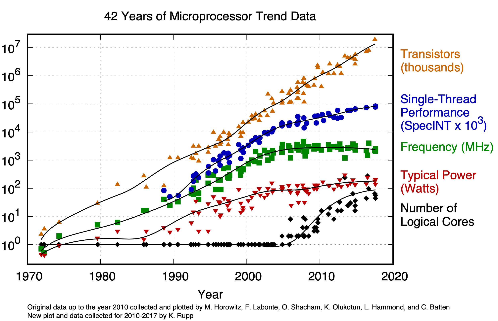

- Computing performance has been challenged by the **end of Dennard scaling** (~2004–2005)
- "Will need non-traditional computing models and accelerators, such as **neuro-inspired** and **quantum** accelerators"
- As of 2025, TSMC's **2 nm node** (N2) enters high-volume production — but each generation now yields only **10–15% performance gains**, vs. 2× every 2 years historically

> *Source: researchcomputingservices.github.io/parallel-computing, July 2020*

Note:
Moore's Law predicted transistor count doubling every ~2 years. Dennard scaling — which kept power density constant as transistors shrank — broke down around 2004-2005. Clock frequencies stalled; the industry pivoted to multi-core. Today, 2nm nodes require Gate-All-Around (GAA) transistors and extreme ultraviolet (EUV) lithography — signs that we are extracting the last gains from silicon scaling. IMEC projects that metal-pitch scaling — the most fundamental measure of density — will effectively end around 2030.

---

## Background & Motivations

### Fundamental & Architectural Limits of Electronics

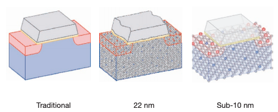

**Physical limits:**
- Components approaching **atomic scale** — 2 nm nodes have gate lengths of just ~10 atoms
- Excessive **thermal noise** and **quantum tunneling** — electrons tunnel through barriers uncontrollably
- Capacitive effects become prohibitive — wires are slower and more energy-hungry than transistors

**Architectural limits:**
- **Von Neumann bottleneck** — memory and compute are separated; every operation requires data movement
- Data movement now dominates: **moving 1 bit costs ~200× more energy than computing on it**
- Bandwidth and fan-out constraints worsen as compute density increases

Note:
The memory-compute separation in Von Neumann architecture means every operation requires moving data — increasingly expensive in energy and latency at scale. This is often called the "memory wall." As AI workloads require processing terabytes of model weights, the bottleneck is not compute — it's getting data to the compute.

---

## Background & Motivations

### Computation–Communication Disparity

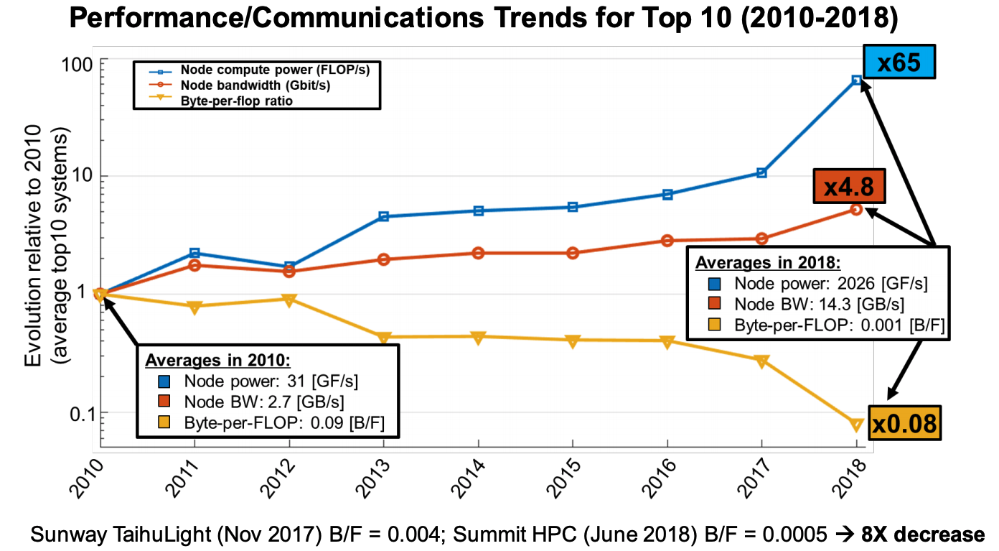

- Node **computation capacity** increasing rapidly (GPU FLOPS: V100 → H100 is 16× in 5 years)
- Node **bandwidth** increasing — but more slowly
- The disparity between compute and communication bandwidth **grows over time**
- Photonics can address **both** — it offers high-bandwidth, low-latency, energy-efficient interconnects

> Sunway TaihuLight (Nov 2017): B/F = 0.004 · Summit HPC (June 2018): B/F = 0.0005

*Bergman, K. "Empowering Flexible and Scalable High Performance Architectures with Embedded Photonics." IPDPS, 2018.*

Note:
The B/F ratio (Bytes/FLOP) measures how much memory bandwidth a system has per unit of compute. As GPUs get faster, this ratio keeps falling. The H100 has >2,000 TFLOPS FP16 but only ~3.35 TB/s HBM3 bandwidth — B/F ≈ 0.0002. Without photonic interconnects, systems increasingly starve for data.

---

## Background & Motivations

### Computational Fundamentals from Biology

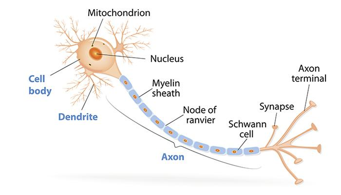

- **Processing/memory proximity** — brain integrates memory and compute; contrary to Von Neumann
- **Heterogeneity in neurons** — sensory, motor, interneuron each with millions of variations
- **Large fan-in/fan-out** — ~10⁴ connections per neuron → photonics (WDM) handles this naturally
- **Long neurons** — optic nerve ~50 mm, motor nerves up to 1 m → photonics offers flat communication cost
- The brain runs on **~20 Watts** — today's leading AI training clusters consume **~50–100 MegaWatts**

> *"World is my cache"* — distance-agnostic optical communication

*Sources: faculty.washington.edu/chudler/facts.html · courses.lumenlearning.com*

Note:
The 5-million-fold gap in power efficiency between the human brain and modern AI compute is one of the strongest motivations for neuromorphic and photonic computing. It suggests we are using deeply wrong computational primitives.

---

## Background & Motivations

### Potential for Photonic Neuromorphic

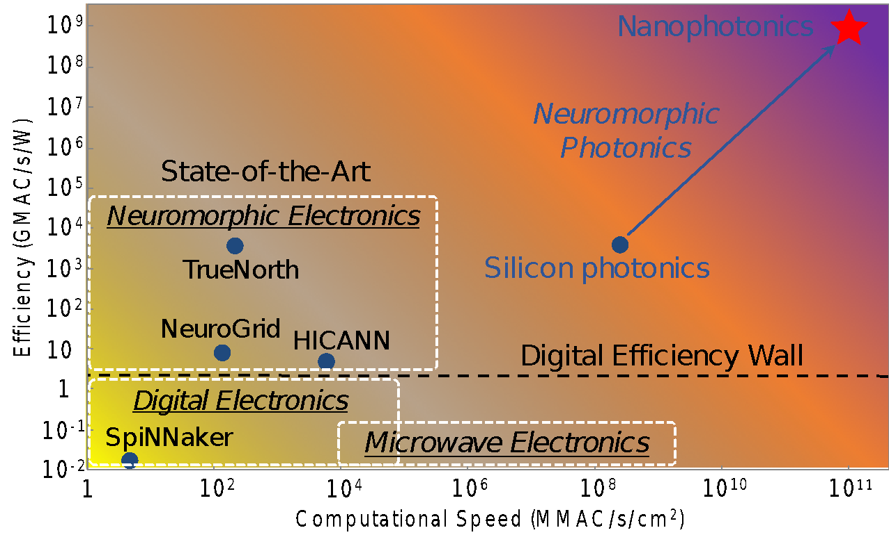

- Neuromorphic hardware (IBM TrueNorth, SpiNNaker) dramatically improves MAC efficiency
- Photonic integration can push this further — **attojoule/MAC** regime (10⁻¹⁸ J per operation)
- MAC = Multiply and Accumulate (the core operation in neural networks)

**2023–2024 milestones validating this direction:**
- **IBM NorthPole** (2023): 25× more energy-efficient than an H100 GPU at the same 12 nm node for inference
- **Intel Hala Point** (2024): World's largest neuromorphic system — 1.15 billion neurons, 128 billion synapses, running at ~2,600 Watts

*Prucnal & Shastri, Neuromorphic Photonics, CRC Press, 2017 · Merolla et al. Science 345 (2014) · Furber et al. Proc. IEEE 102 (2014)*

Note:
IBM NorthPole's key architectural insight is that it eliminates off-chip DRAM entirely — all weights live on-chip. This is only feasible for inference of moderately-sized networks, but the result is dramatic: 22× lower latency and 25× better energy efficiency vs. GPU at the same process node. It's not spiking — it's near-memory digital compute, showing that even simple departures from Von Neumann provide massive gains.

---

## What Photonics Brings to the Table

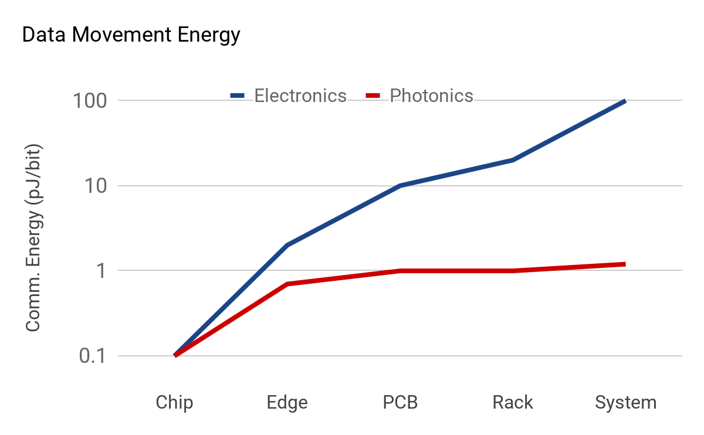

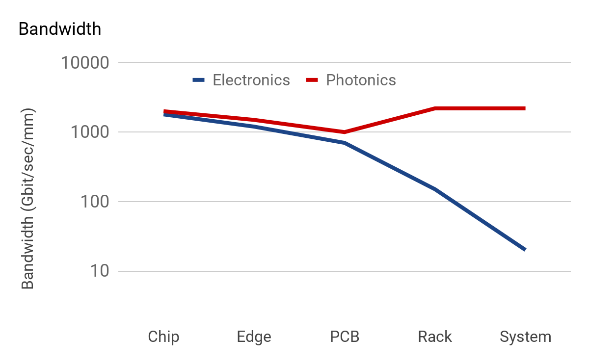

- **Distance-agnostic communication** — energy cost does not grow with distance (unlike copper)
- Flattens the energy curve for chip-to-chip and rack-to-rack links
- **In 2024:** Lightmatter's Passage M1000 photonic interposer integrates up to 34 chiplets with 114 Tbps total bandwidth — early commercial deployment of photonic interconnects

*Cheng, Q. et al. "Recent advances in optical technologies for data centers." Optica 5.11 (2018): 1354–1370.*

Note:
Copper interconnects scale poorly: as bandwidth increases, energy-per-bit on copper actually increases. Optical links have a fixed energy cost dominated by the laser source, largely independent of distance. This is why data center operators (Google, Microsoft, Meta) have been migrating to optical transceivers for years — and now photonic integration is moving inside the package itself.

---

## Background & Motivations

### Three Ways Photonics Can Assist

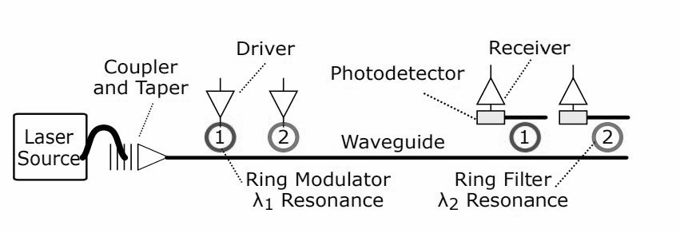

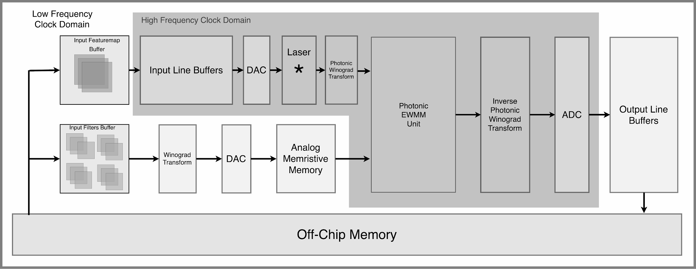

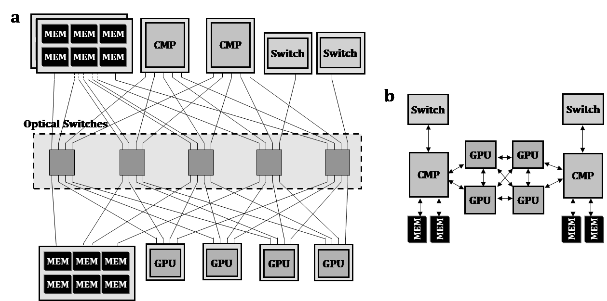

1. **Photonic Links** — replacing copper wires for energy-efficient data movement *(commercially deployed today)*
2. **Bandwidth Steering** — dynamic optical circuit switching *(early deployment: Lightmatter Passage)*
3. **Photonic Processors** — all-optical compute for MAC operations *(active research, pre-commercial)*

Note:
It is important to be honest about where the field stands. Photonic interconnects are commercially real. Photonic processors for AI compute are still research. The commercial success of (1) funds and motivates research into (3).

---

## Background & Motivations

### Top Green500 Energy Efficiency

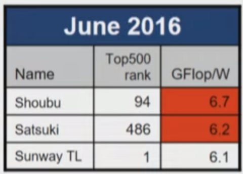

- Energy efficiency increasing rapidly from June 2016 to June 2018, driven by GPU adoption
- **November 2024 update:** Green500 #1 is **JEDI** (Forschungszentrum Jülich, Germany) — **72.7 GFLOPS/W** using NVIDIA Grace Hopper Superchips
- **El Capitan** (#1 on Top500 at 1.742 ExaFLOPS): 58.89 GFLOPS/W — a >10× improvement from the 2018 era
- **Fundamental question:** can we continue improving efficiency beyond electronics?

Note:
The JEDI system (part of the JUPITER cluster) achieves 72.7 GFLOPS/W using NVIDIA's Grace Hopper Superchips — which co-package an ARM CPU and H100 GPU with HBM3 memory using NVLink-C2C chip-to-chip interconnect. Even this efficiency improvement is largely driven by reducing data movement between CPU and GPU — validating the core argument that the bottleneck is communication, not compute.

---

## Background & Motivations

### Scaling Under Tight Energy Budget

- Increase **hit rates** of close memory banks (Cache, DRAM, ...)
- Improve **memory access energy efficiency**
- Improve **data movement energy efficiency**
- Decrease data movement through **locality exploitation**
- Increase **computing energy efficiency** — attojoule/MAC with photonics

**Context: LLM training costs are spiraling**
- GPT-4 training estimated at ~$100M; next-generation models: $1B+
- Energy, not transistor count, is now the primary constraint on AI progress

*Miller, D. A. B. "Attojoule optoelectronics for low-energy information processing and communications." Journal of Lightwave Technology 35.3 (2017): 346–396.*

---

## Background & Motivations

### Machine Learning Workloads Dominating

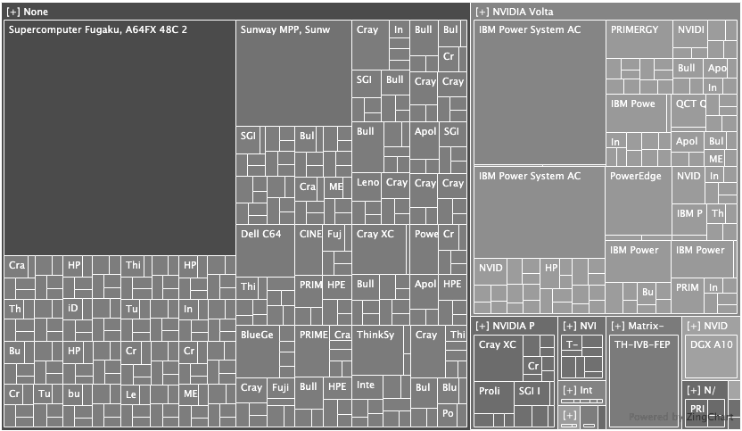

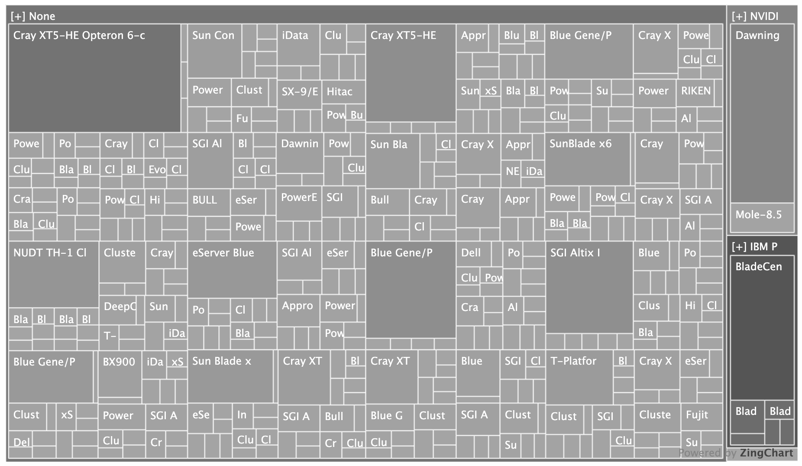

- Workloads are changing dramatically in favor of **Neural Networks**
- GPU design follows suit — NVIDIA introduced **Tensor Cores** in V100 (2017)
- **Generational Tensor Core scaling:**

| GPU | Year | FP16 TFLOPS | vs. V100 |
|---|---|---|---|
| V100 (Volta) | 2017 | 120 | 1× |
| A100 (Ampere) | 2020 | 312 | 2.6× |
| H100 (Hopper) | 2022 | 1,979 | 16.5× |
| B200 (Blackwell) | 2024 | ~5,000 | ~42× |

- As of **November 2024**: 42% of Top500 systems use GPU/accelerator co-processors; AMD GPU systems (El Capitan) contribute **44.9% of all Top500 aggregate peak FP64 capacity**

*NVIDIA News Center, Oct. 2017 · Top500 November 2024*

Note:
The B200 at 5 PFLOPS FP16 represents a 42x gain over the V100 in 7 years — driven almost entirely by Tensor Core architectural innovation, not just transistor scaling. This validates that architecture (specialization) is the new driver of performance, exactly the argument of this lecture.

---

## Motivation Summary

- **Electronics approaching limits** — Dennard scaling ended ~2004-2005; 2nm nodes are extracting the last gains from silicon at high cost
- **Optical advancements** bring significant promise in energy and bandwidth — photonic interconnects are already commercially deployed
- **Neuromorphic computing** is a viable alternative to Von Neumann architectures — IBM NorthPole (2023) showed 25× efficiency over GPU at same process node
- **Workloads are changing** — LLM training and inference now consume datacenter-scale power budgets
- Moving from **homogeneous** to **heterogeneous** specialization — no one-size-fits-all solution
- The **next frontier**: systems that blend photonic interconnects + neuromorphic compute + conventional accelerators

---

## State of the Art: 2025–2026

A snapshot of how far the field has come since this research was published:

| System | Year | Key Achievement |
|---|---|---|
| **El Capitan** (AMD MI300A) | 2024 | 1.742 ExaFLOPS HPL — world's fastest supercomputer |
| **IBM NorthPole** | 2023 | 25× better energy efficiency than H100; eliminates off-chip DRAM |
| **Intel Hala Point** | 2024 | 1.15 billion neurons, 128B synapses, 2,600W total |
| **NVIDIA B200** | 2024 | 5 PFLOPS FP16, 10 PFLOPS FP8 — 42× over V100 |
| **TSMC N2** | 2025 | 2 nm GAA in high-volume production — likely last "conventional" node |
| **Lightmatter Passage** | 2024 | 114 Tbps photonic interposer, 34-chiplet integration — commercial |

**The core thesis of this lecture holds:** Each of these systems succeeds by departing from conventional Von Neumann principles — eliminating DRAM, co-locating memory and compute, or replacing copper with photonics.

Note:
El Capitan uses AMD's MI300A — an APU that integrates CPU + GPU + 128 GB HBM3 on a single package. This is fundamentally a near-memory architecture: there is no separate DRAM chip accessed over a PCIe bus. The result is 5× better memory bandwidth than a discrete GPU, at lower energy per byte. IBM NorthPole takes this further — literally eliminating DRAM entirely for inference.

---

## Problem Statement

**Given:**
- Advances in **nanophotonics** and **neuromorphics** providing good energy efficiency (attojoule/MAC), high speed, and high bandwidth (WDM)
- Prior research focused only on **device-level or small circuit-level** neuromorphic nanophotonics

**Goals:**
- Explore design of **efficient specialized neuromorphic photonic computing systems** that:
  - Execute state-of-the-art neural networks
  - Exhibit great energy efficiency and speed
  - Are **weight programmable**
- Develop a **design and simulation framework** for neuromorphic photonics
- Highlight potentials, pitfalls, and limitations

---

## Related Work

### Evolution of Neuromorphic Computing

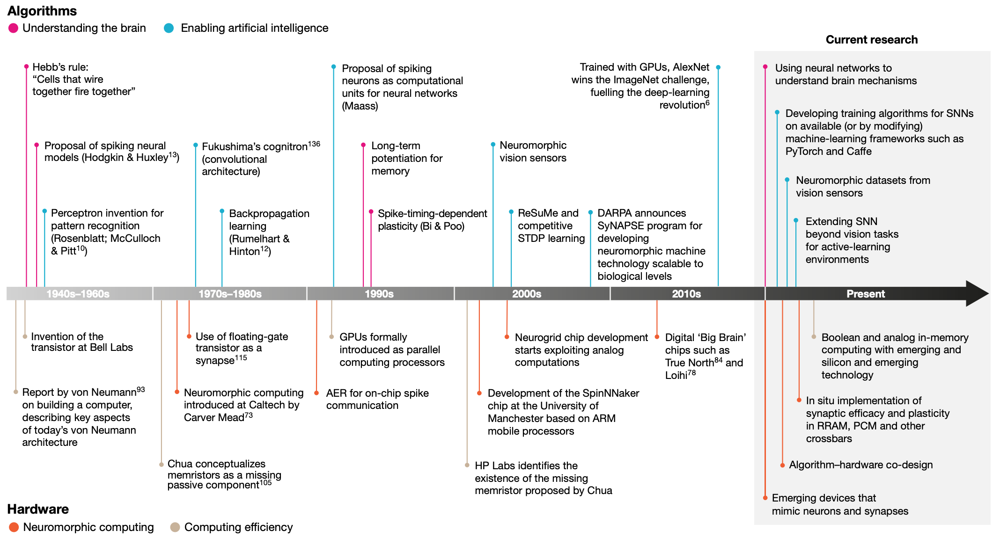

From early spiking models to modern neuromorphic hardware — a 40-year trajectory toward brain-inspired computation.

---

## Related Work

### Biological Plausibility Spectrum

Different neuron models trade off **computational accuracy vs. hardware cost**:

| Model | Biological Plausibility (BP) |
|---|---|
| Artificial Neural Network | BP = 0 |
| Leaky Integrate-and-Fire (LI&F) | BP = 0.2 |
| FitzHugh-Nagumo | BP = 0.5 |
| Single-compartment Hodgkin-Huxley | BP = 0.6 |
| Full spiking model with membrane dynamics | BP = 1.0 |

Higher BP → more accurate, but **exponentially more compute** per neuron.

Note:
Most deployed neuromorphic chips (Loihi 2, TrueNorth) use LIF (BP ≈ 0.2) because it's computationally tractable. They sacrifice biological realism for efficiency. The interesting research question: can photonics enable higher-BP models at reasonable energy cost, since it operates in analog at the speed of light?

---

## Related Work

### Brain Neuron vs. Artificial Neuron

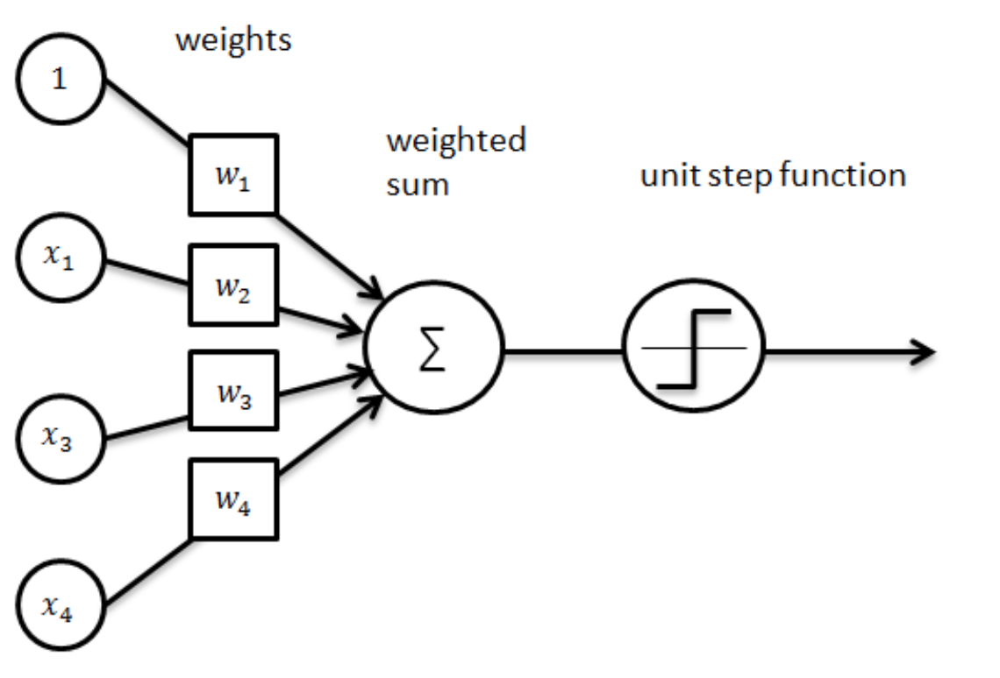

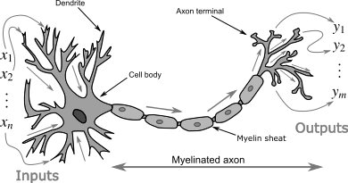

- **Dendrites** receive electrical signals from axons of other neurons
- Signals are modulated — neuron fires only when total input **exceeds a threshold** → nonlinear activation
- In the **perceptron**, this maps to: weighted inputs + nonlinear activation function

*Kendall & Kumar. "The building blocks of a brain-inspired computer." Applied Physics Reviews 7.1 (2020).*

---

## Related Work

### Photonic MAC Operator (Neuron)

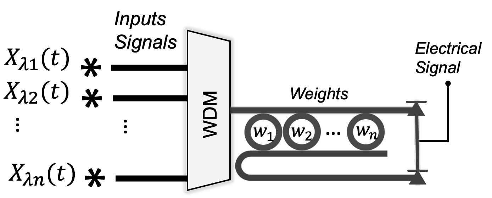

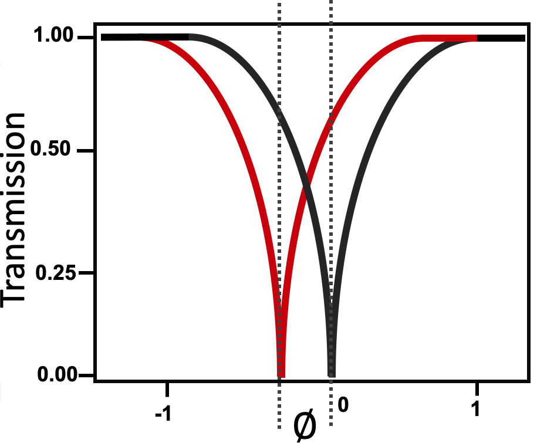

- Photonic MAC using **Microring Resonators (MRR)**
- Wavelength-sensitive → can benefit from **WDM** (Wavelength Division Multiplexing)
- MRR weight banks implement the weighted sum; photodetectors + electronics handle nonlinear activation
- **Key insight:** the multiply-accumulate operation happens at the speed of light, in analog, at potentially attojoule-level energy

*Tait et al. "Neuromorphic photonic networks using silicon photonic weight banks." Scientific Reports 7 (2017).*

---

## Related Work

### Coherent 2-Layer Fully Connected Neural Network

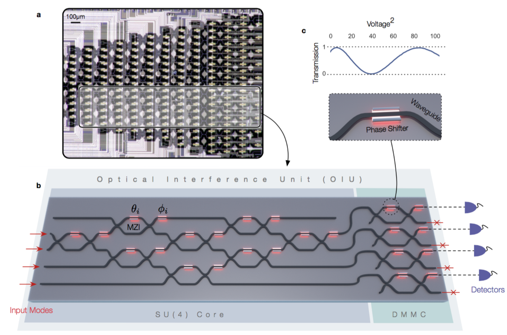

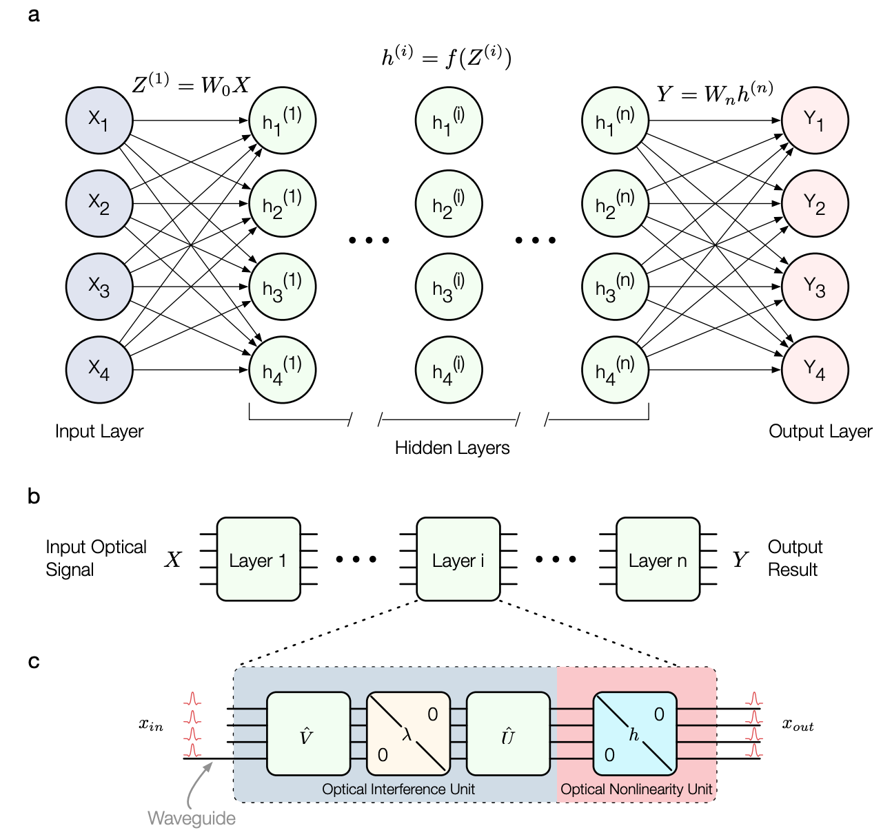

- **Matrix decomposition** M = UΣVᵀ using optical Mach-Zehnder interferometer (MZI) meshes
- U, Σ, V implemented as separate optical matrix multiply cores
- First experimental demonstration of **deep learning with coherent nanophotonic circuits**

*Shen, Y. et al. "Deep learning with coherent nanophotonic circuits." Nature Photonics 11.7 (2017): 441.*

Note:
This 2017 MIT/Princeton paper is the landmark result that showed optical neural networks are physically realizable. It demonstrated on a small vowel recognition task. The key limitation was that the MZI mesh size scales as O(N²) in chip area for N neurons — making large networks impractical without the kind of architectural innovations this lecture's research addresses (CNNs instead of FC networks, Winograd to reduce operations, etc.).

---

## Approach

### Architecture Design Principles

- Seeking **architecturally efficient** neural network designs through:
  - **Specialization** for common cases
  - **Transformations** to reduce hardware
  - Leveraging **novel devices**

**Photonic constraints to design around:**

| Property | Status (2018–2020) | Status (2025) |
|---|---|---|
| Footprint | Bulky | Shrinking — silicon photonics at 300mm wafers |
| Power | Extremely low, length-agnostic | Validated commercially |
| Speed | Very high | Confirmed; DAC/ADC remain bottleneck |
| Bandwidth | WDM ~10–100× | WDM 100+ channels demonstrated |
| Memory | Research only | PCM/memristor 6–8 bit precision demonstrated |
| Interfacing | Requires DAC/ADC | Still requires conversion; ADC power dominates |

---

## Approach

### Specialization: Fully-Connected vs. Convolutional Networks

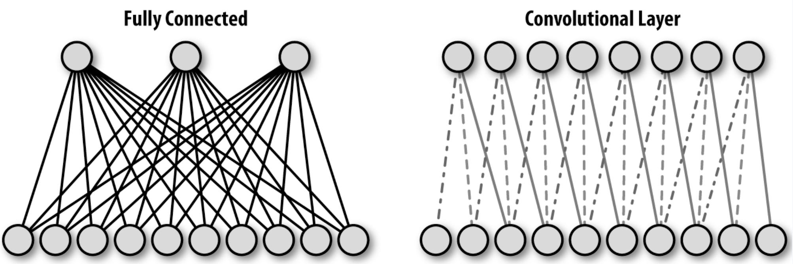

**Fully-Connected (FC):**
- All-to-all connections — impractical at scale
- Hard to train, poor for locally-structured data

**Convolutional (CNN):**
- Sparse connections between inputs and filters — far fewer MRRs needed
- Dominates modern architectures (vision, NLP backbone layers)
- Good at **feature detection** in structured data

→ **CNNs are the target** for photonic specialization

Note:
An important 2025 update: Transformers (attention mechanisms) have largely displaced CNNs in NLP and are gaining ground in vision (ViT). Attention requires dense matrix-matrix multiplications. The WDM parallelism of photonic systems maps well to attention heads — an interesting open direction for future photonic accelerator design.

---

## Approach

### Parallelism Opportunities in CNNs

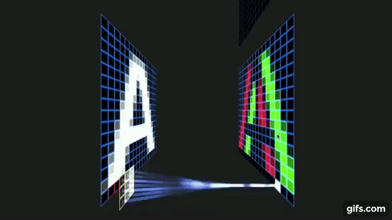

- A **kernel** scans an input searching for a feature
- Multiple kernels (~hundreds) per CNN layer, each **independent** → parallelizable with WDM
- Kernel operations are small (3×3, 5×5) → fits naturally into photonic weight banks

---

## Approach

### Less Photonic Hardware with CNNs

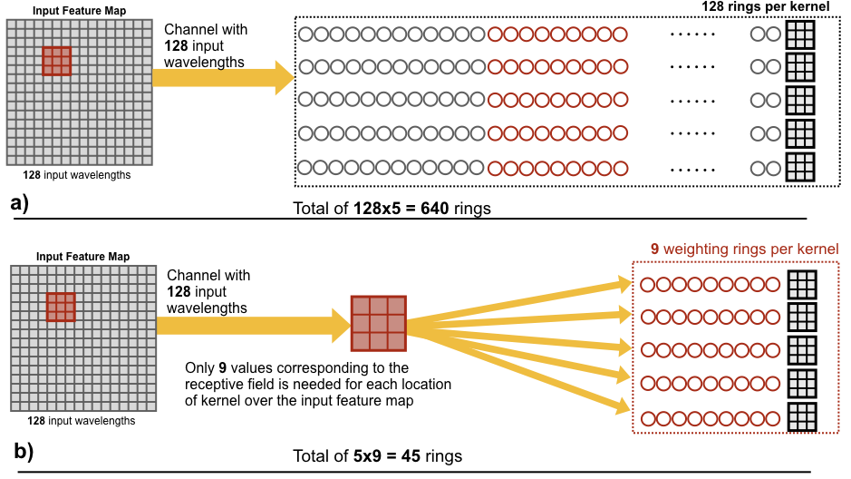

- Sparse connections → **fewer MRRs** needed
- Small kernel sizes → weight banks fit in realistic photonic chip areas
- Makes realization of full CNNs **feasible** with current photonic technology

---

## Approach

### Photonics Potential for CNNs — PCNNA

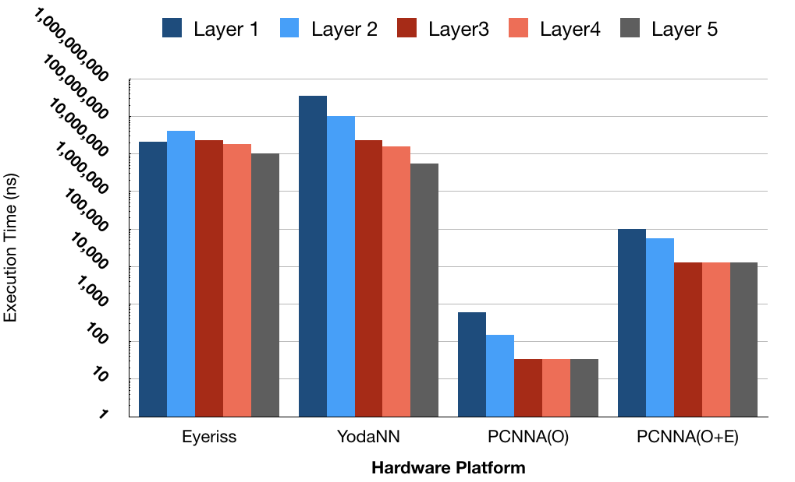

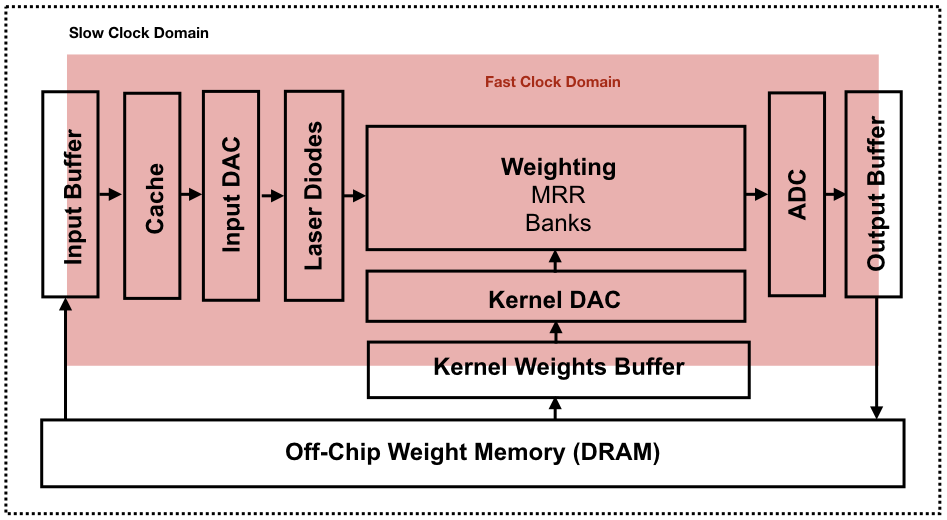

- 10–100 WDM wavelengths map small kernel operations in a CNN layer
- Potential **3 orders of magnitude speedup** in execution time
- Input DAC and output ADC conversions are the **primary bottleneck** — an active research area in 2025

*Mehrabian et al. "PCNNA: a photonic convolutional neural network accelerator." IEEE SOCC 2018.*

Note:
The DAC/ADC bottleneck is real and well-recognized. A 56 GS/s, 8-bit ADC consumes ~1W. If a photonic chip requires thousands of such converters, the conversion overhead dominates. Current research directions include: (1) lower-precision (4-bit, 2-bit) ADCs; (2) direct optical detection thresholding; (3) stochastic computing approaches that avoid hard quantization.

---

## Approach

### Transformations to Reduce Hardware Cost

Three algorithms for convolution — each with different hardware trade-offs:

| Algorithm | Best for | Trade-off |
|---|---|---|
| **GEMM (Toeplitz)** | Simple, general | Bloats matrix size → more overhead |
| **FFT** | Large kernels | Efficient for large kernel sizes |
| **Winograd** | Small kernels (3×3) | Trades multiplications for additions |

→ **Winograd** chosen: reduces multiplications at the cost of more additions, and **additions are cheap in photonics** (passive optical splitters/combiners)

---

## Approach

### Winograd Filtering Algorithm

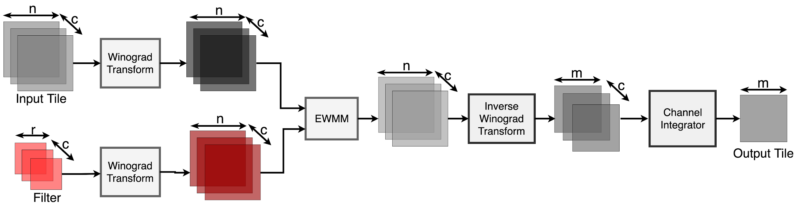

- Adopted to **perform convolution** with reduced computational complexity
- Reduces the number of **multiplications** (expensive in photonics) at the cost of increased additions
- For a 3×3 kernel with output tile F(2×2, 3×3): Winograd requires only **4 multiplications** vs. **9 for direct convolution** — a 2.25× reduction in the most hardware-expensive operation

Note:
Why are multiplications expensive in photonics but additions cheap? A photonic addition is just a waveguide coupler — a passive Y-junction that combines two optical signals. A photonic multiplication requires a modulator that varies the amplitude of one signal based on another — an active device requiring voltage control and consuming energy. Winograd's transformation exploits exactly this asymmetry.

---

## Accomplishment

### A CNN Photonic Accelerator Architecture

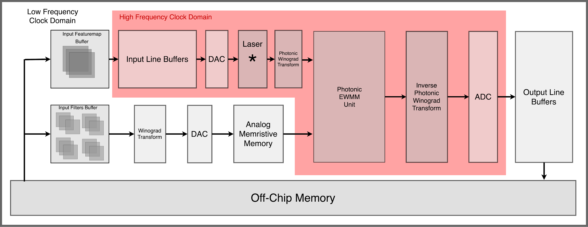

- **Weights Path:** analog configurable memory (memristors) stores trained weights
- **Inputs Path:** optical signals carry input activations via WDM
- Winograd transform pre-processes weights and inputs before optical multiply

> Patent: *Mehrabian, A., Sorger, V. J., El-Ghazawi, T., & Miscuglio, M. "Optical convolutional neural network accelerator." U.S. Patent App. 16/507,854 (2020).*

*Mehrabian et al. "A Winograd-based Integrated Photonics Accelerator for CNNs." IEEE J. Sel. Topics Quantum Electron. 2019.*

---

## Approach

### Novel Devices: Memristors as Analog Memory

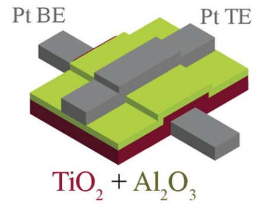

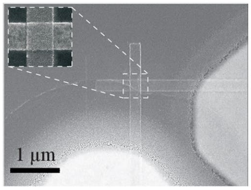

- **Memristors** (memory + resistors) — resistance is a function of charge history
- Serve as **analog, non-volatile** weight storage for photonic networks
- **6.5-bit** effective resolution demonstrated in metal-oxide bi-layer memristors
- Programmed by modulating pulse count, duration, or amplitude

**2023 state of the art:** IBM's 64-core mixed-signal PCM chip integrates 35 million phase-change memory devices; achieved 92.81% on CIFAR-10 — the highest accuracy for any resistive-memory inference chip at the time. Still research-phase; device variability and endurance remain engineering barriers.

*Stathopoulos et al. "Multibit memory operation of metal-oxide bi-layer memristors." Scientific Reports (2017).*

Note:
The fundamental challenge for memristors is that their resistance values drift over time and vary with temperature — making precise weight storage difficult. Techniques like "write-verify" programming (measure, adjust, measure again) and noise-aware training (exactly what this lecture's research developed) are the main mitigation strategies.

---

## Approach

### Lack of Design and Simulation Tools

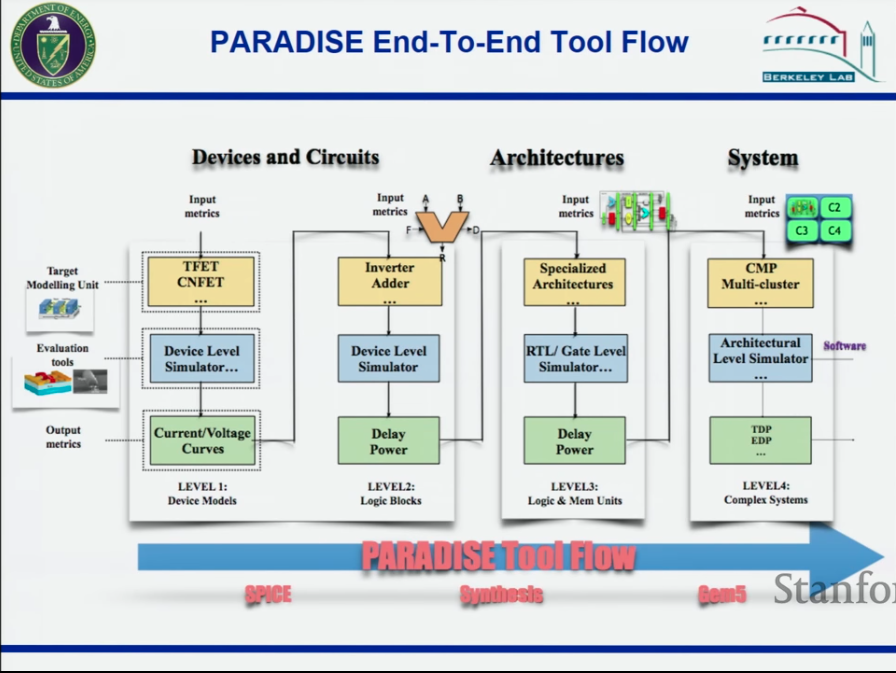

**The gap:** Photonic device simulators and deep learning frameworks (TensorFlow, PyTorch) do not speak the same language.

- Photonics tools model optical components (MRR transfer functions, noise, modulators)
- Deep learning tools model tensor operations

→ Need a **unified design methodology** bridging both worlds

Note:
This simulation gap remains a bottleneck in 2025. Tools like PhotonTorch and Neuroptica have emerged as open-source bridges, but they lack the production robustness of TensorFlow/PyTorch. The research methodology described here — inserting photonic models as custom ops into TensorFlow — was ahead of its time and directly influenced subsequent tooling efforts.

---

## Accomplishment

### Design Methodology & Simulation Framework

A TensorFlow-integrated photonic neural network simulator:

- **Photonic Models** inserted as custom ops into TensorFlow's dataflow executor
- Models: MRR transfer functions, modulator nonlinearity, photodiode response, noise
- Enables **hardware-aware training** — train with photonic noise in the loop
- Benchmarked with VGG16 and AlexNet

Note:
Hardware-aware training is now a standard technique in ML for quantized and noisy hardware (used in Quantization-Aware Training, or QAT, for edge deployment). The photonic case is more extreme: not just quantization noise but systematic device non-idealities (thermal drift, fabrication variation, coherent crosstalk). The "noise injection during training" technique from this work maps directly to what practitioners now call "noise-aware training."

*Mehrabian et al. "A Design Methodology for Post-Moore's Law Accelerators: The Case of a Photonic Neuromorphic Processor." IEEE ASAP 2020.*

---

## Results

### Design Space Exploration: MRR vs. MZI

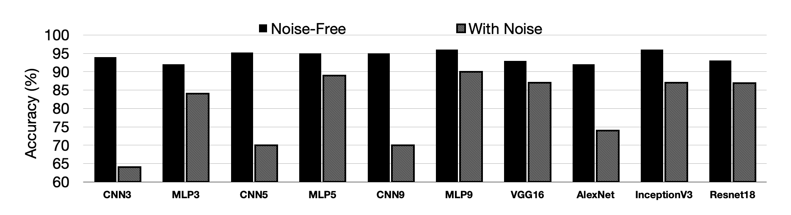

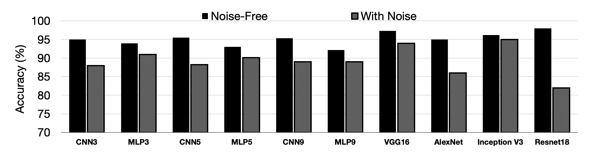

- **MRR (Microring Resonator):** compact, wavelength-selective, suitable for WDM — but **sensitive to temperature** (~80 pm/°C wavelength shift); requires active thermal tuning (~1 mW/ring)
- **MZI (Mach-Zehnder Interferometer):** robust and broadband — but larger footprint and no inherent WDM capability
- Benchmark the performance of photonic neural networks using both devices on state-of-the-art networks

Note:
The thermal sensitivity of MRRs is one of the most practical challenges in silicon photonic chip deployment. In a data center environment with varying power dissipation, keeping rings thermally locked to within ~0.1°C requires continuous feedback control. This is feasible but consumes non-trivial power — potentially eroding the energy efficiency advantage. MZI meshes avoid this at the cost of chip area.

---

## Results

### Nonlinear Activation Functions

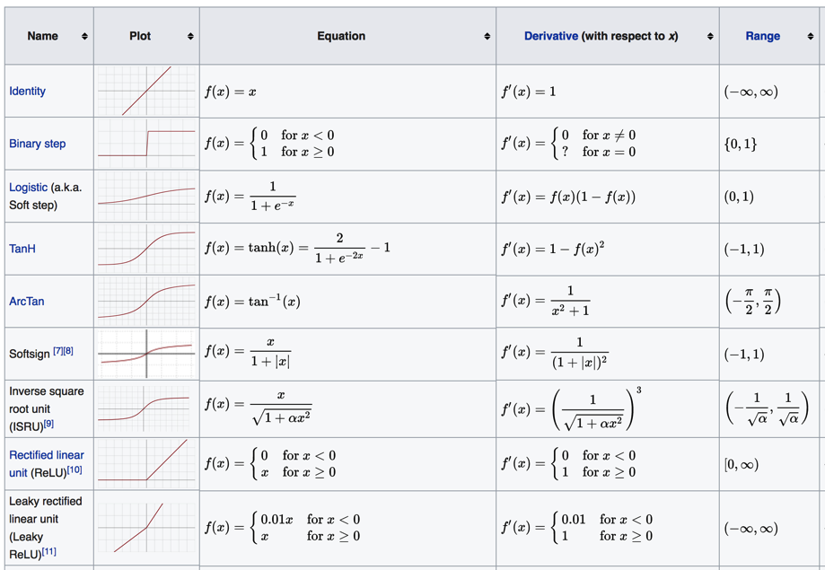

Commonly used functions: ReLU, sigmoid, tanh — each implemented using electro-absorption modulators (EAMs)

Note:
ReLU (max(0,x)) is the most common activation in digital networks because it's trivially cheap to compute. In photonics, implementing ReLU optically is non-trivial — it requires a device that blocks light below a threshold and passes it above. EAMs can approximate this but with a smooth, sigmoid-like transfer function. This is not a limitation — smooth activations (GELU, SiLU) now dominate in transformer architectures anyway.

---

## Results

### Optimizing Nonlinear Activation Functions

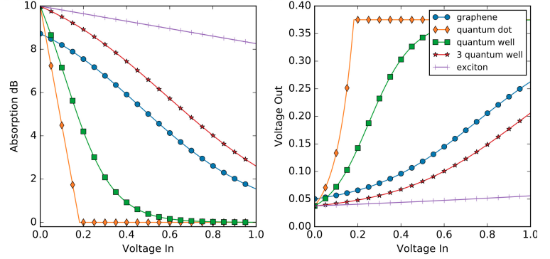

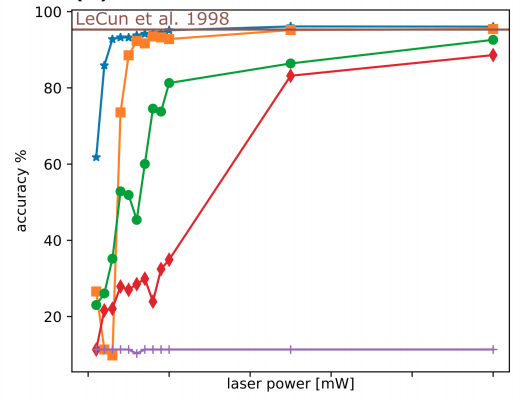

- Dynamic range of voltage depends on **modulator length** and **laser power**
- Modulator length determines light absorption → shapes the activation curve
- Trade-off between **linearity**, **dynamic range**, and **energy consumption**

*George et al. "Neuromorphic photonics with electro-absorption modulators." Optics Express 27.4 (2019).*

---

## Results

### Performance of the Winograd CNN Accelerator

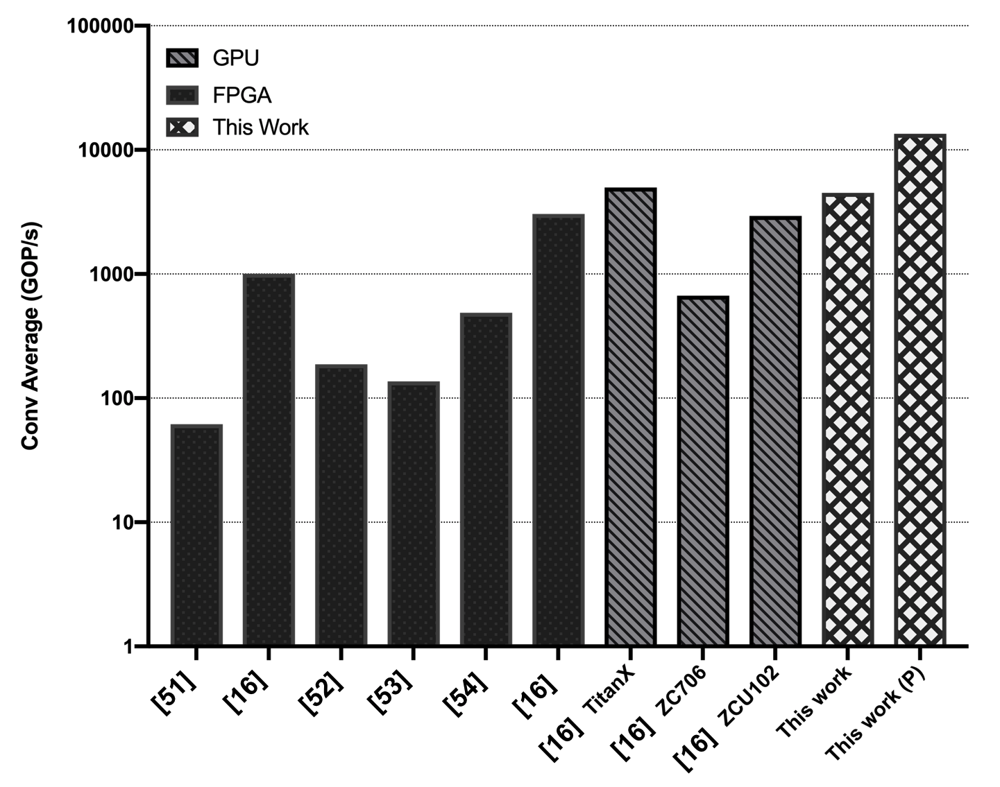

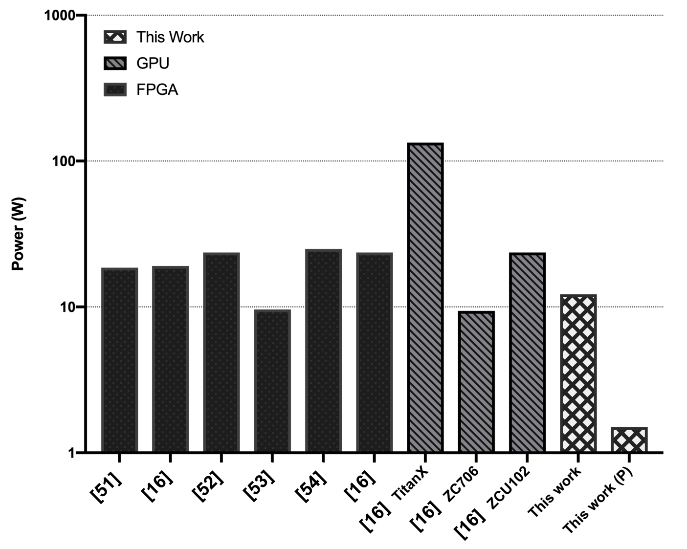

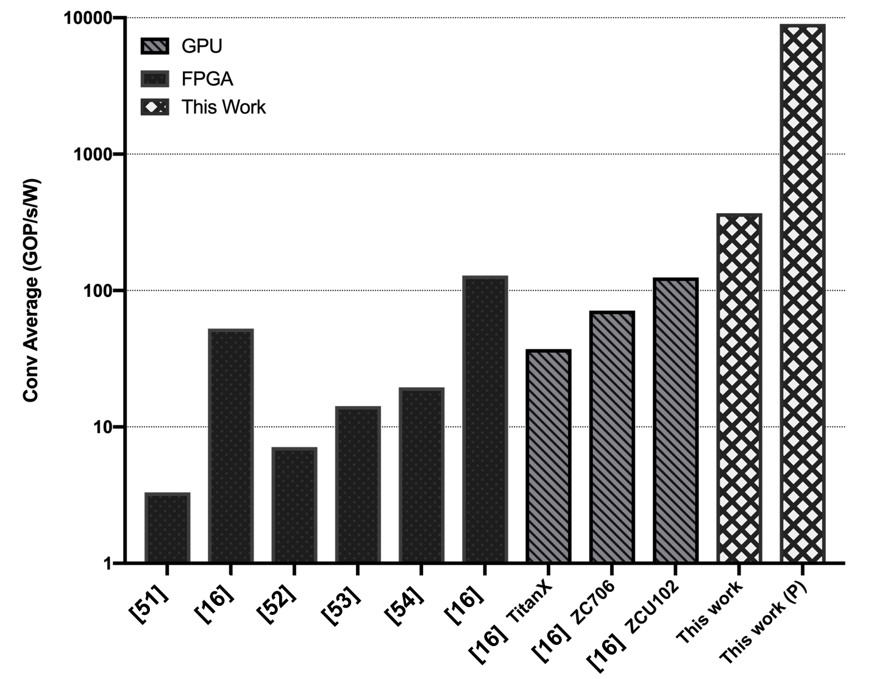

- Benchmarked with **VGG16** (all convolutional layers)
- Metrics: Speed (GOP/s), Power (W), Speed/Power efficiency ((GOP/s)/W)
- Photonic implementation achieves significant efficiency advantages over electronic baselines
- **2023 context:** IBM NorthPole reported 15 TOPS/W for inference — photonic systems target exceeding this by orders of magnitude in the energy-per-MAC domain

---

## Results

### Hardware-Aware Software Design: Effect of Noise

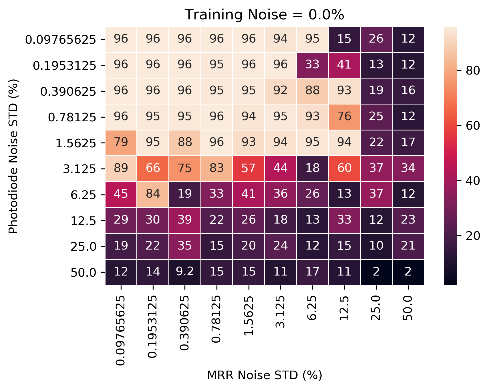

- Gaussian noise (mean=0, sweeping standard deviation) injected only at **inference time**
- Photodiode and MRR noise degrade prediction accuracy as noise increases
- Baseline: trained on clean data, tested with noisy hardware

Note:
This experiment mimics what happens when you take a neural network trained in software and run it on real photonic hardware. The accuracy degrades, sometimes catastrophically, because the training assumed ideal operations but hardware introduces shot noise, thermal noise, and fabrication variations. The solution in the next slide.

---

## Results

### Noise-Resilient Training

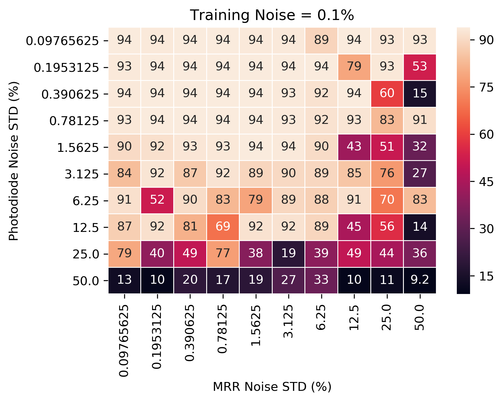

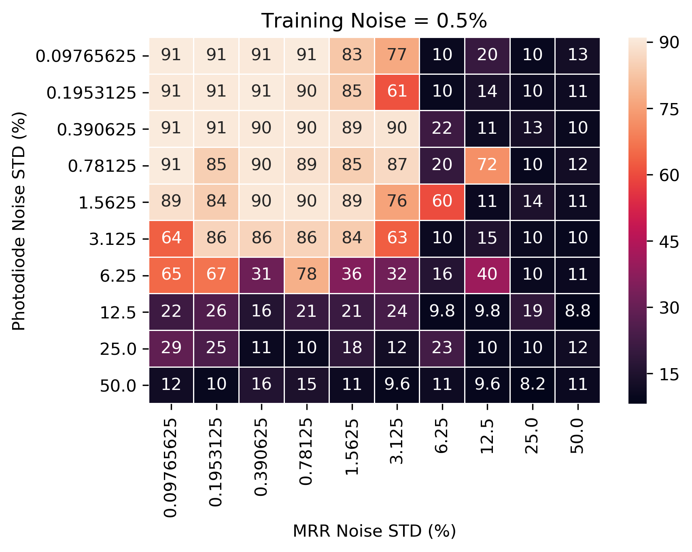

- Adding a **small amount of noise during training** makes the network more resilient
- The network learns to be robust against hardware-level photonic noise
- Too much noise during training **deteriorates** inference performance → optimal "noise temperature" exists

Note:
This finding parallels "dropout" in deep learning — injecting noise during training acts as a regularizer and also makes the learned weights more tolerant of hardware imperfections. The key insight is that the network must be co-designed with the hardware noise model, not designed first and then deployed. This is the central philosophy of hardware-aware AI.

---

## Approach

### Envisioning an Optical Brain Simulator

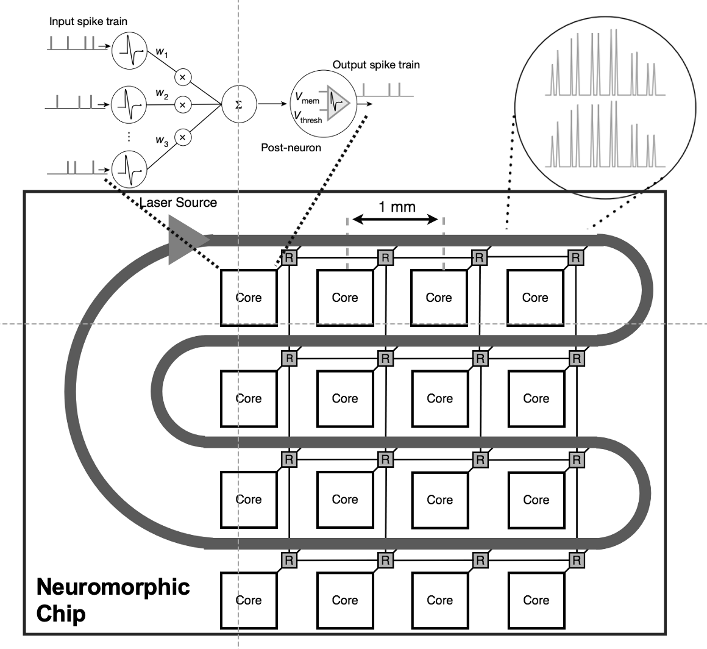

**Brain simulators** (NEURON, Genesis, BRIAN, NEST) model neuronal networks — but are communication-bound.

**Proposed approach:** Adaptive many-core brain simulator on a **hybrid reconfigurable optical NoC**

Key features:
- Simple photonic processing cores
- Custom optical interconnect fabric
- Departure from conventional parallel machine principles
- **Fault-tolerant** design

Note:
The Human Brain Project (Europe) and the BRAIN Initiative (US) have made full-scale brain simulation an explicit scientific goal. The European project runs on petascale HPC systems and is fundamentally communication-bound — 86 billion neurons, each with ~10,000 synaptic connections, must exchange spike signals in real time. This is a textbook case where the compute is cheap (a spike is 1 bit) but the interconnect is the bottleneck. Photonics addresses exactly this.

---

## Approach

### Simulation of the Hill-Tononi Model

The Hill-Tononi model models the brain's **wakefulness-to-sleep transition**:

- Two visual areas with associated thalamic and reticular thalamic nuclei
- **Wakefulness:** cortical neurons fire at irregular intervals
- **Slow-wave sleep:** all cortical neurons undergo slow oscillation (<1 Hz)
- Followed by burst firing even **higher** than wakefulness

A realistic benchmark for optical brain simulator design — chosen because it exercises both dense communication bursts (wakefulness) and synchronized patterns (sleep).

---

## Approach

### Hill-Tononi on Optical NoC

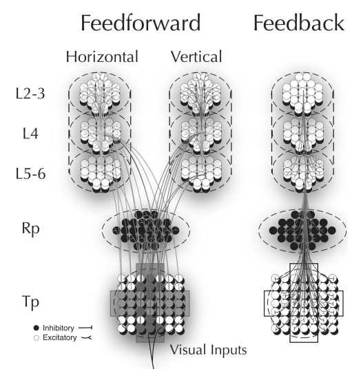

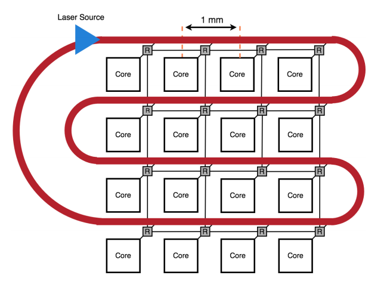

- Each neuron processed on a **single core**
- Inter-layer neurons connect through **HyPPI** (Hybrid Plasmonics-Photonics Interconnect)
- Scales to large neuron counts with optical bandwidth

---

## Results

### Power Simulations: HyPPI vs. Electrical

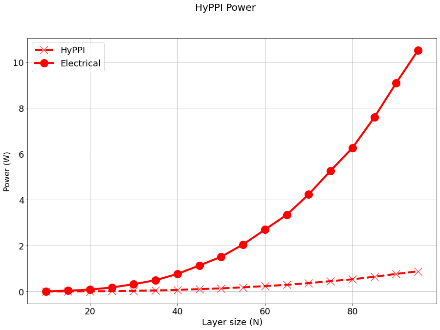

- Comparison: HyPPI optical interconnect vs. conventional electrical (SpiNNaker: 18 cores, 1 Watt)
- Optical interconnect shows substantial **power savings** for brain simulation workloads
- Benefit grows as simulation scale increases — critical, since full-brain simulation requires many orders of magnitude more neurons than SpiNNaker

Note:
SpiNNaker (Manchester) was the dominant neuromorphic platform at the time of this research. Its successor, SpiNNaker-2 (2023), scales to 70,000 chips and 10 million neurons. Even at this scale it remains electrically interconnected and communication-bound. The case for optical interconnects in neuromorphic systems only strengthens at scale.

---

## Results

### Further Enhancements: Adaptive HyPPI NoC (D3NoC)

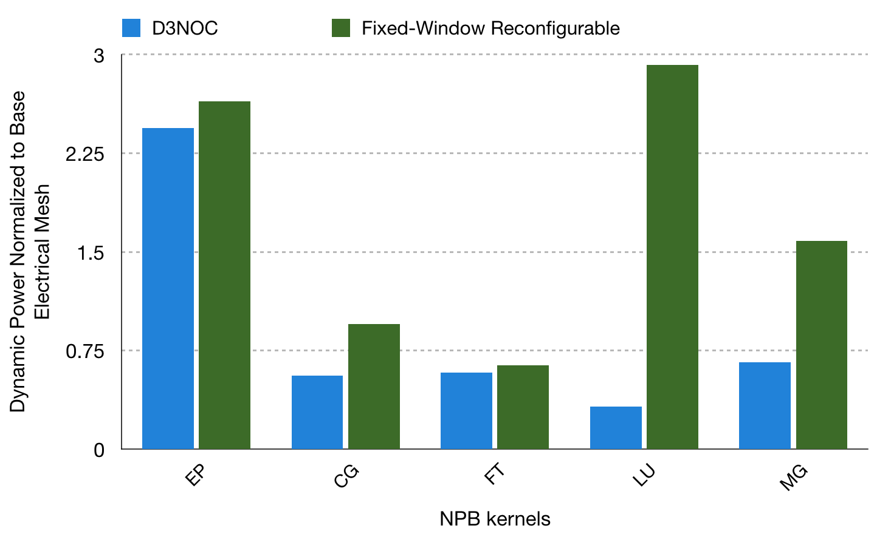

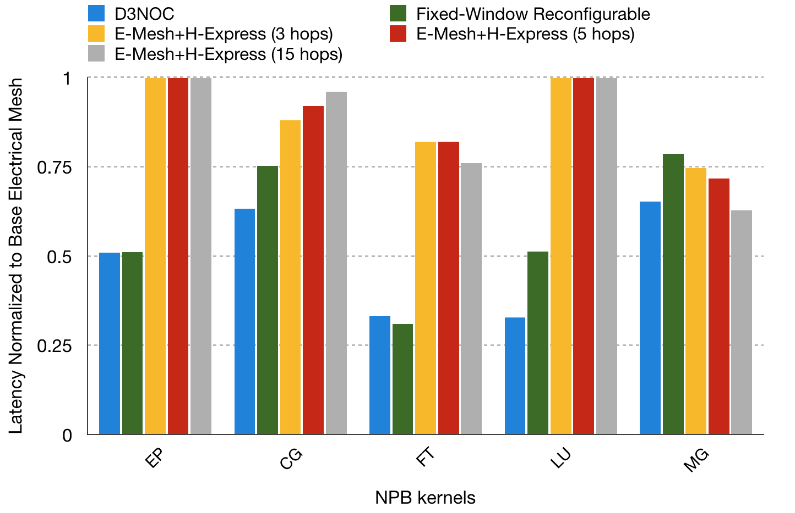

- **D3NoC:** Dynamic Data-Driven hybrid photonic-plasmonic NoC
- Monitors and **predicts traffic**, augments topology with express optical bus
- Results:
  - Up to **67% savings in latency**
  - Up to **69% savings in power**

*Mehrabian et al. "D3NoC: a dynamic data-driven hybrid photonic plasmonic NoC." ACM Computing Frontiers, 2018.*

---

## Conclusion

- Physical node scaling continues — **2 nm nodes in production as of 2025** — but gains are incremental (10–15%/generation) and costs are escalating; the age of "free" scaling is over
- **Neuromorphic computing** is validated: IBM NorthPole (2023) shows 25× efficiency over GPU at same process node; Intel Hala Point (2024) runs 1.15 billion neurons at 2,600W
- **Photonic interconnects** are commercially deployed (Lightmatter); photonic compute remains the frontier
- The **synergy between neuromorphic and photonic computing** is the target for the next generation of computers
- To realize full-scale photonic neural networks: need **mathematical transforms** (Winograd), **novel devices** (memristors, EAMs), and **co-design of hardware and training**
- Brain simulation is **communication-bound** — optical interconnects are the path forward; and the same argument applies to any AI workload at scale

---

## Selected Publications & Patent

**Journal Papers:**
- Mehrabian et al. "A Winograd-based Integrated Photonics Accelerator for CNNs." *IEEE J. Sel. Topics Quantum Electron.* 26.1 (2019).
- George et al. "Neuromorphic photonics with electro-absorption modulators." *Optics Express* 27.4 (2019): 5181–5191.
- Miscuglio et al. "All-optical nonlinear activation function for photonic neural networks." *Optical Materials Express* 8.12 (2018): 3851–3863.

**Conference Papers:**
- Mehrabian et al. "PCNNA: a photonic convolutional neural network accelerator." IEEE SOCC 2018.
- Mehrabian et al. "A Design Methodology for Post-Moore's Law Accelerators." IEEE ASAP 2020.
- Mehrabian et al. "D3NoC: a dynamic data-driven hybrid photonic plasmonic NoC." ACM Computing Frontiers 2018.

**Patent:**
- Mehrabian, A., Sorger, V. J., El-Ghazawi, T., & Miscuglio, M. "Optical convolutional neural network accelerator." *U.S. Patent App. 16/507,854* (2020).

**Key Recent Milestones (for context):**
- IBM NorthPole. *Science* 382, 329–332 (2023). DOI: 10.1126/science.adh1174
- Intel Hala Point. Intel Newsroom, April 2024.
- El Capitan (#1 Top500). SC24, November 2024 — 1.742 ExaFLOPS.
