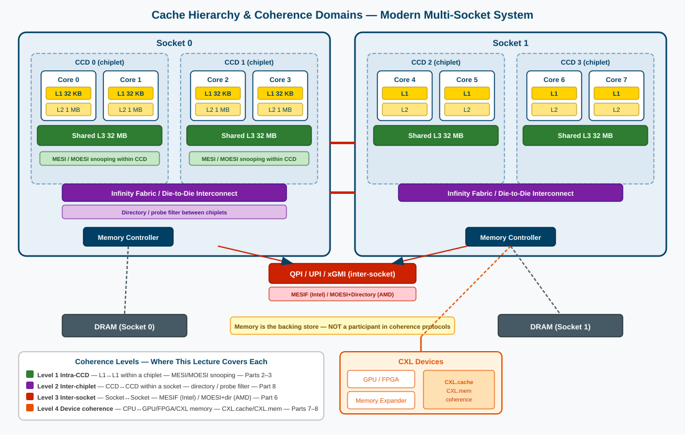
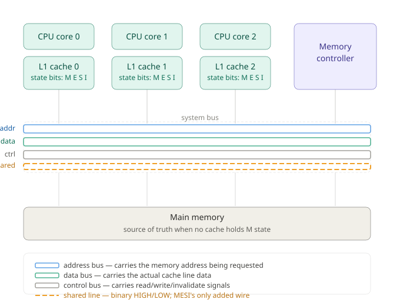
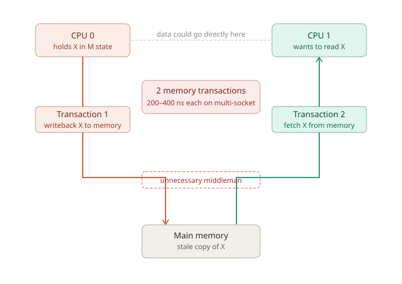
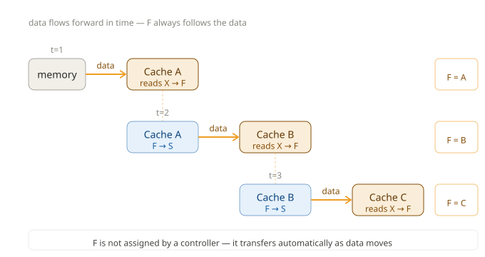

# Cache Coherence
## Keeping Multiple Caches Consistent in Parallel Systems
### GWU ECE 6125: Parallel Computer Architecture

Note: Today we dive into one of the most critical problems in parallel architecture: ensuring that when multiple processors each have their own cache, they all agree on what the "current" value of shared data is. This problem has driven decades of hardware innovation — from the simple MSI protocol to the complex SCD directories in today's 192-core server chips.

---

## Lecture Roadmap

| Part | Topic |
|------|-------|
| 1 | **The Coherence Problem** — what goes wrong with caches? |
| 2 | **Snooping Protocols** — MSI → MESI → MOESI → MESIF |
| 3 | **Directory-Based Coherence** — scaling beyond the bus |
| 4 | **Memory Consistency Models** — SC (Sequential Consistency), TSO (Total Store Order), relaxed ordering |
| 5 | **False Sharing** — the hidden performance killer |
| 6 | **Modern CPU Implementations** — AMD Zen 5, Intel, Apple |
| 7 | **Heterogeneous Coherence** — CPU + GPU |
| 8 | **Emerging Topics** — CXL, chiplets |

Note: We go from fundamentals to state-of-the-art. By the end, you'll understand the design decisions behind every modern processor's cache subsystem — and why each one made different choices.

---

## Part 1: The Coherence Problem

---

## The Stale Data Problem

Consider two processors sharing a variable X in memory:

| Time | CPU 0 | CPU 1 | Memory[X] |
|------|-------|-------|-----------|
| t₀ | — | — | **0** |
| t₁ | Read X → **0** | — | 0 |
| t₂ | — | Read X → **0** | 0 |
| t₃ | Write X = **1** | — | stale |
| t₄ | — | Read X → **0** ← WRONG! | 1 |

CPU 1's cache holds a **stale copy**. Without coherence, parallel programs produce incorrect results — silently.

> **Think of it like Google Docs:** if two people have the same document open and one edits it, the other's tab can briefly show stale content. Cache coherence is the hardware equivalent of Google's sync mechanism — except it must resolve in nanoseconds, not seconds.


Note: This isn't a theoretical edge case. Before hardware coherence protocols, programmers had to manually flush caches before reading shared data. Operating system kernels, databases, and any code that shared memory across cores would fail. The hardware must handle this automatically and efficiently — programmers cannot be trusted to flush caches correctly in every case.

---

## Why This is Hard: The Speed-Correctness Tension

- Main memory is **~100× slower** than the processor
- **Private caches** keep hot data nearby → low latency, high performance
- But private copies can **diverge** when one processor writes

> "Cache coherence is the price we pay for making parallel systems fast with private caches."

**The fundamental dilemma:**
- No private caches → correct but slow (every access waits for memory)
- Private caches + no coherence → fast but wrong
- Private caches + coherence protocol → fast AND correct

Note: If every processor shared a single, monolithic cache, there'd be no coherence problem — but also terrible performance and scalability. Private caches at each core are the right answer for performance. Coherence protocols are what make private caches safe.

---

## Two Requirements for Coherence

A memory system is **coherent** if it satisfies:

**1. Write Propagation**
> A write by any processor must eventually become visible to all other processors.

**2. Write Serialization**
> All processors must observe **all** writes to the same address in the **same order**.

**Example — why serialization is essential:**

P1 writes X=1, then P2 writes X=2 (nearly simultaneously)

- **Without serialization:** P3 sees X=1 → X=2 (reads 2), P4 sees X=2 → X=1 (reads 1) — inconsistent!
- **With serialization:** one agreed-upon global order for all writes to X.

Note: Write propagation alone isn't enough. Even if every write eventually reaches every cache, if different caches see writes in different orders, programs can behave incorrectly. A lock-free queue relies on both propagation AND serialization. Serialization is what lets us reason about "who wrote last."

---

## Write-Invalidate vs. Write-Update

When a processor writes to a shared line, what should happen to other copies?

| Strategy | Action on Write | Analogy |
|----------|----------------|---------|
| **Write-Invalidate** | Send "your copy is stale, discard it" to all sharers | Google Docs marks other tabs as out of date — they reload on next access |
| **Write-Update** | Send the new value to all sharers immediately | Google Docs pushes every keystroke live to all open tabs |

**Modern processors almost universally use write-invalidate. Why?**


Note: Write-update seems more helpful — sharers immediately have the new value. But it consumes bus bandwidth on EVERY write, even for data that other caches won't read for a while. Write-invalidate pays a one-time cost to force a future cache miss, and that miss only occurs if someone actually reads the data. If a value is written 10 times before anyone reads it, write-update sends 10 updates; write-invalidate sends 1 invalidation.

---

## The Write-Invalidate Win Condition

**Write-invalidate is optimal when:**
- A location is written **≥2 times** before the next read — after the first write, all other copies are already invalidated, so subsequent writes cost zero messages
- This is the common case in real programs (loop accumulators, local counters, flag updates)

**Write-update wins when:**
- A consumer reads immediately after every single producer write (tight producer-consumer pipelines)
- Very few sharers (broadcast overhead is low)

**The quantitative argument:**
- Write-invalidate: 1 invalidation on the first write, then **0 messages** for every subsequent write (others already invalid)
- Write-update: **1 broadcast per write**, every time, regardless of whether anyone will read

> Think of Google Docs: write-update is like syncing every single keystroke to all open tabs — wasteful if the reader only opens the doc once an hour.

> Intel, AMD, ARM, RISC-V, and IBM all chose write-invalidate for general-purpose coherence.

Note: The Dragon protocol (Xerox PARC, 1982) and Firefly protocol (DEC, 1987) were serious write-update implementations. Both were eventually abandoned for the same reason — bus bandwidth could not keep up. Write-update survives only in specialized GPU contexts where access patterns are known to be tightly coupled producer-consumer.

---

## Coherence vs. Consistency: Two Separate Guarantees

These are two distinct properties of a shared memory system — and confusing them is the most common mistake in parallel programming.

| Property | Question it answers | Scope |
|----------|---------------------|-------|
| **Cache Coherence** | Do all CPUs agree on the *value* of address X? | Single address |
| **Memory Consistency** | In what *order* do CPUs observe writes to *different* addresses? | Multiple addresses |

**Analogy:** Think of a shared Google Doc.
- **Coherence** guarantees: "Everyone's copy eventually shows the same text" — no stale reads forever.
- **Consistency** guarantees: "If I first edited paragraph 1, then paragraph 2, you see them update in that order" — not paragraph 2 first.

> Coherence is about **accuracy** per address. Consistency is about **ordering** across addresses.

A system can be perfectly coherent yet still give surprising results when writes to different addresses appear out of order.

Note: Both properties are required for a correct shared-memory system. Coherence is handled entirely in hardware (the protocols we study in this lecture). Consistency requires hardware support AND explicit programmer annotations — memory fences, acquire/release semantics. The next slide shows why with a concrete example.

---

## Why the Distinction Matters — The Flag/Data Trap

A classic pattern that looks correct but can silently fail:

```c
// Initially: data = 0, flag = 0
// CPU 0:          // CPU 1:
data = 42;         while (flag == 0);  // wait for signal
flag = 1;          print(data);        // what prints here?
```

**What coherence guarantees:**
- CPU 1 *will* eventually see `flag = 1` ✓
- CPU 1 *will* eventually see `data = 42` ✓

**What coherence does NOT guarantee:**
- That CPU 1 sees `data = 42` *before* or *at the same time as* `flag = 1`

On some processors, `flag = 1` can become visible to CPU 1 *before* `data = 42` does.
`print(data)` prints **0** — even though the hardware is fully coherent.

> The ordering of writes across *two different addresses* is a **consistency** question, not a coherence question.
> **Fix:** a memory fence between CPU 0's writes, and an acquire load on CPU 1's spin.

Memory consistency models (SC — Sequential Consistency, TSO — Total Store Order, ARM weak ordering) and how fences restore ordering are covered later in this lecture.

Note: Students often blame "cache bugs" when they see this failure. The hardware is doing exactly what it's designed to do — coherence is satisfied. The missing piece is a memory ordering guarantee, which requires explicit programmer annotations on weakly-ordered architectures. On x86 (TSO), this pattern happens to work without fences — which is why the bug is often discovered only when porting to ARM or RISC-V.

---

## Fences vs. Locks — What's the Difference?

The natural reaction to the flag/data trap is: *"why not just use a lock?"* They are related but solve different problems.

| | **Lock** | **Fence** |
|---|---|---|
| **Purpose** | Mutual exclusion — only one thread in the critical section | Ordering — my writes appear to others in the right sequence |
| **Blocks execution?** | Yes — other threads wait outside | No — both threads keep running |
| **Overhead** | High (contention, OS involvement on slow path) | Medium (pipeline stall, store buffer drain) |
| **Prevents data races?** | Yes | No — races are still possible |
| **Contains fences?** | Yes — internally | It *is* the primitive |

**A lock secretly wraps fences inside it:**
- `lock()` → implicit **acquire fence**: "I will see all writes committed before I enter"
- `unlock()` → implicit **release fence**: "all my writes are visible before I signal I'm done"

So if you use locks correctly, **you never need to think about fences.** The lock library handles ordering for you.

**Then when do you use fences directly?**

When you want the *ordering guarantee* of a lock but **without the mutual exclusion cost.** In the flag/data pattern there is only one writer and one reader — they never conflict. A lock would unnecessarily serialize them. A fence gives you the ordering at lower cost:

```c
// CPU 0 — writer:          // CPU 1 — reader:
data = 42;                  while (flag == 0);
// release fence            // acquire fence
flag = 1;                   print(data);  // guaranteed to see 42
```

> **Rule of thumb:** Use a lock when two threads must not run concurrently. Use a fence (or atomics) when they can run concurrently but need to agree on the order of what they see.

Note: In C++11 and later, you rarely write raw fences. Instead you use std::atomic with memory_order_acquire and memory_order_release — which compile down to the correct fence instructions per architecture. The compiler and hardware together handle the rest. Raw fences (std::atomic_thread_fence) exist for advanced cases like seqlocks or lock-free data structures.

---

## Sequential Consistency: The Intuitive Model

**SC is the memory model you naturally assume when writing parallel code.**

Two rules, both must hold simultaneously:

1. **Each CPU's operations happen in the order it issued them** — no CPU skips ahead or reorders its own instructions
2. **All CPUs agree on one global order** — every CPU sees the same interleaving of everyone's operations

Rule 1 is easy to understand. Rule 2 is the hard one.

**What "one global order" means:**

Think of two decks of cards — CPU 0's operations and CPU 1's operations. Each deck must keep its internal order. But the two decks can be shuffled together in any way. SC says: **every CPU must see the same shuffle result.** Not just their own cards in order — the same complete sequence of all cards from all CPUs.

> If CPU 0 sees: write X, write Y, read Z — then CPU 1 must also see those operations in exactly that position in the global sequence. No CPU gets a different view.

This is what makes SC powerful — and what makes it expensive to implement in hardware.

Note: SC is the model most programmers implicitly assume. When you write parallel code and reason about it on paper, you're almost certainly assuming SC. The surprising fact is that almost no modern hardware actually provides SC by default — because enforcing it would require stalling the pipeline every time a write is issued, waiting for it to become visible globally before moving on.

---

## Sequential Consistency: The (0, 0) Litmus Test

The classic test for whether a system is SC:

```c
// Initially: X = 0, Y = 0
// CPU 0:    // CPU 1:
X = 1;       Y = 1;
print(Y);    print(X);
```

| Outcome (Y, X) | Under SC? | Why |
|----------------|-----------|-----|
| (1, 1) | ✓ | Both writes committed before either read |
| (0, 1) | ✓ | CPU 0 ran entirely before CPU 1's write reached it |
| (1, 0) | ✓ | CPU 1 ran entirely before CPU 0's write reached it |
| **(0, 0)** | **✗ Never** | No valid interleaving of the two programs can produce this |

**(0, 0) is impossible under SC** — if CPU 0 sees Y=0, then Y=1 hasn't happened yet, which means CPU 0's entire sequence runs before CPU 1's write, which means CPU 1 must see X=1. You cannot have both reads return 0 in any single consistent ordering.

> Real hardware **can** produce (0, 0) — because stores sit in a buffer and are not immediately visible. This is covered in Part 4.

Note: The (0,0) outcome is the canonical fingerprint of a non-SC system. If you ever observe it, the hardware is definitely not SC. This test (called a "litmus test") is the standard tool for probing memory model behavior — researchers run millions of these on real hardware to map out exactly what orderings a given CPU permits.

---

## So How Do We Keep Caches in Sync?

We now know the problem: multiple CPUs each have a private cache, and any of them can write to the same memory address — leaving other caches holding a stale copy.

**Hardware solves this with a coherence protocol.** Two fundamental approaches exist:

| Approach | Core idea | Works best at |
|---|---|---|
| **Snooping** | Every cache watches every memory transaction on a shared bus. If a write affects your copy, you act on it. | Small systems — few cores |
| **Directory** | A central directory tracks which caches hold each block. Only the relevant caches are notified on a write. | Large systems — many cores |

Both approaches enforce the same guarantee: **no cache holds a stale value indefinitely.**

They differ in *how* they communicate that guarantee — broadcast vs. targeted messaging.

**We start with snooping** — it is simpler, and understanding it deeply makes directory protocols much easier to follow.

Note: The snooping vs. directory split is one of the most important architectural decisions in parallel system design. Snooping dominated from the 1980s through the early 2000s when core counts were low (2–8 cores). As core counts grew beyond ~16, the broadcast overhead of snooping became a bottleneck and directory protocols took over. Modern chips often use a hybrid — snooping within a cluster of cores, directory between clusters.

---

## The Cache Hierarchy — What Are We Keeping in Sync?

Before diving into protocols, let's ground ourselves in the **physical hardware**. A modern multi-socket server has multiple cache levels, each owned by a different scope:

| Level | Typical size | Latency | Owned by | Shared? |
|-------|-------------|---------|----------|---------|
| **L1** (data + instruction) | 32–64 KB | ~1 ns (4 cycles) | One core | No — strictly private |
| **L2** | 256 KB – 2 MB | ~4 ns (12 cycles) | One core | No — strictly private |
| **L3** (LLC — Last Level Cache) | 16–96 MB | ~10–15 ns (40 cycles) | One chiplet or socket | Yes — shared among cores |
| **DRAM** | 64–512 GB | ~70–100 ns | One socket's memory controller | Accessible by all, slow |

**Cache coherence is always between caches** — never between a cache and memory. Memory is just the backing store: it gets written to when dirty data is evicted, not as part of the protocol itself.

> When Core 0's L1 and Core 1's L1 both hold address X, coherence is the hardware mechanism that keeps them consistent. Memory has no role in that — it's not watching, not participating, not voting. It's a passive bystander.

Note: This is a crucial mental model. Students often think coherence is "between cache and memory." It is not. Coherence is between caches at the same level — L1s with each other, L3s with each other across sockets. Memory only enters the picture on evictions (writeback of dirty data) or cold misses (fetching data nobody has cached yet).

---

## Where Coherence Happens — A 4-Level Map

In a modern chiplet-based multi-socket server, coherence is enforced at **four distinct levels**, each using a different protocol:

| Level | What's being kept in sync | Protocol used | Covered in |
|-------|--------------------------|---------------|------------|
| **1. Intra-chiplet** | L1↔L1 within one CCD (Core Complex Die — AMD's term for a chiplet, typically 4–8 cores + shared L3) | MESI or MOESI snooping | Parts 2–3 |
| **2. Inter-chiplet** | CCD↔CCD within one socket (e.g., 12 CCDs in AMD EPYC) | Directory + probe filter over Infinity Fabric | Part 8 |
| **3. Inter-socket** | Socket↔Socket over QPI/UPI (Intel) or xGMI (AMD) | MESIF (Intel) / MOESI+directory (AMD) | Parts 3 & 6 |
| **4. Device coherence** | CPU↔GPU, CPU↔FPGA, CPU↔CXL memory expander | CXL.cache / CXL.mem protocols | Parts 7–8 |

**Why different protocols at each level?**
- Level 1 has few caches (4–8) → snooping works: everyone listens to a shared bus
- Level 2 has many caches (96+) → snooping would flood the bus; directory tracks who has what
- Level 3 crosses chip boundaries → slow interconnect, so Intel added the F state (MESIF) to avoid memory round-trips
- Level 4 crosses PCIe → CXL adds coherence to a bus that was never designed for it



Note: This 4-level map is the mental model for the rest of the lecture. Parts 2–3 focus on Level 1 (snooping protocols, how MSI/MESI/MOESI/MESIF work). Part 3 introduces directory-based coherence for Level 2. Part 6 covers modern CPU implementations and how they combine these levels. Parts 7–8 extend to GPU coherence and CXL/chiplets. Every protocol we cover fits into one of these four levels.

---

## Part 2: Snooping Protocols

### Bus-Based Coherence — Simplicity Through Broadcast

> Every cache watches every transaction. Coherence emerges from universal visibility.

Note: Snooping protocols exploit the broadcast property of a shared bus. If every memory transaction is visible to every cache controller simultaneously, each controller can independently determine whether it needs to act — invalidate, update, or supply data. No central coordinator required. The bus does the work.

---

## How Snooping Works

**Hardware setup:**
- All caches connect to a **shared bus**
- Every bus transaction is seen by **all caches simultaneously**
- Each cache controller "snoops" (monitors) all transactions

**When CPU 0 writes to address X:**
1. CPU 0 puts `BusRdX(address=X)` on the bus
2. All other caches see this transaction immediately
3. Any cache with X in its cache **invalidates** that line
4. CPU 0 receives data and ownership


Note: The bus provides two critical properties: (1) broadcast — every controller sees every transaction, and (2) total order — the bus arbiter ensures all caches see transactions in exactly the same order. Property 2 provides write serialization for free. The bus arbiter IS the serialization point. This is elegant, but the bus becomes the bottleneck as core count grows.

---

## MSI: The Foundational Protocol

Every cache line is always in exactly one of three states:

| State | What it means | This cache can read? | This cache can write? | Other caches can hold a copy? |
|-------|--------------|----------------------|-----------------------|-------------------------------|
| **M**odified | This cache has the only copy, and it has been written — memory is stale | ✓ | ✓ | No |
| **S**hared | This cache has a clean copy — identical to what is in memory | ✓ | ✗ | Yes |
| **I**nvalid | This cache has no usable copy — must fetch before use | ✗ | ✗ | Unknown |

**Google Docs analogy:**
- **M** = You have the doc open and have typed unsaved changes. Your version is the latest. No one else has it.
- **S** = Multiple people have the doc open in view-only mode. Everyone sees the same saved version.
- **I** = Your tab is closed. You have nothing.


**MSI in the real world:**

| System | Years | Notes |
|---|---|---|
| SGI Challenge (MIPS R4400) | 1993–1997 | Early commercial multiprocessor; pure MSI over a shared bus |
| Sun UltraSPARC II systems | 1997–2001 | Used MSI-based snooping before moving to MESI |
| Early IBM POWER systems | 1990s | MSI with bus-based coherence on 2–8 socket servers |
| Academic research platforms | 1980s–present | MSI is the standard teaching and verification baseline |

No modern high-volume processor ships with pure MSI today — they all use MESI or beyond. But MSI remains the **reference protocol**: every coherence proof, textbook, and formal verification tool starts here.

Note: MSI is the minimal coherent protocol. Every more complex protocol (MESI, MOESI, MESIF) is just MSI with extra states added to avoid unnecessary bus traffic. Understand MSI and the rest follow naturally.

---

## MSI: What Triggers a State Change?

Two types of events cause a cache line to change state:

**1. This CPU wants to read or write the line:**

| Current State | This CPU reads | This CPU writes |
|---------------|----------------|-----------------|
| **M** | Serve from cache — no bus needed | Serve from cache — no bus needed |
| **S** | Serve from cache — no bus needed | Broadcast **BusUpgr**: "everyone else invalidate your copy" |
| **I** | Broadcast **BusRd**: "someone give me a copy" | Broadcast **BusRdX**: "give me a copy AND everyone else invalidate" |

**2. This cache sees another CPU's request on the bus:**

| Current State | Another CPU reads (BusRd) | Another CPU writes (BusRdX or BusUpgr) |
|---------------|---------------------------|----------------------------------------|
| **M** | Give them the data, go to **S** | Give them the data, go to **I** |
| **S** | Stay **S** — they can share | Go to **I** — my copy is now stale |
| **I** | Do nothing | Do nothing |

Note: The S→M transition sends BusUpgr even if this cache is the ONLY reader. That wasted broadcast is the key inefficiency MSI has — and exactly what the E (Exclusive) state in MESI eliminates.

**"If I'm in M and forced to go to S or I — are my changes lost?"**

No — and this is critical to understand. A cache in M state is the sole owner of the most recent copy of that data. The hardware will NEVER silently discard it. Before any M→S or M→I transition completes, the cache must first supply the data:

- **M → S** (another CPU reads): your cache writes the data back to memory (or supplies it directly to the requester via a cache-to-cache transfer). Memory is now up to date. Both you and the requester hold clean S copies. Your changes are preserved.

- **M → I** (another CPU writes): your cache again supplies the data — either writing back to memory or handing it directly to the requester. Memory and the requester both get the latest value. Your copy is then invalidated. Your changes are preserved — just no longer in your cache.

The phrase "supply data" in the transition table is not optional or cosmetic. It is the writeback step that makes the protocol correct. Without it, the requester would get stale data from memory and the write your cache did would be lost forever.

---

## MSI: Example Trace

| Step | Event | CPU 0 | CPU 1 | Memory | Bus transaction |
|------|-------|-------|-------|--------|-----------------|
| Start | — | **I** | **I** | X = 0 | — |
| 1 | CPU 0 reads X | **S** | I | X = 0 | BusRd → memory supplies X = 0 |
| 2 | CPU 1 reads X | S | **S** | X = 0 | BusRd → memory supplies X = 0 |
| 3 | CPU 0 writes X = 1 | **M** | **I** | X = 0 ⚠️ stale | BusUpgr → CPU 1 must invalidate |
| 4 | CPU 1 reads X | **S** | **S** | X = 1 | BusRd → **CPU 0** supplies X = 1 |

**Two things to notice:**

- **Step 3:** CPU 0 was already the only writer, yet it still had to broadcast BusUpgr to invalidate CPU 1. The bus was used even though CPU 0 knew it wanted to write all along. This is the wasted transaction MESI eliminates with the E state.

- **Step 4:** Memory did not supply the data — CPU 0's cache did. This is a **cache-to-cache transfer**. CPU 0 held the only up-to-date copy (memory was stale at X=0), so it intervenes on the bus and hands X=1 directly to CPU 1.

Note: Cache-to-cache transfers are faster than going to memory and are essential for correctness — if memory had supplied X=0 in step 4, CPU 1 would have read a stale value. The M-state cache intercepts the BusRd and overrides memory.

---

## The MSI Tax on Private Writes

In Step 3 of the trace, CPU 0 was **already the only cache holding X** — yet it still had to broadcast a BusUpgr and wait for acks before writing.

| What happened | Why it's wasteful |
|---|---|
| CPU 0 read X → S (shared) | Makes sense — maybe others will read too |
| CPU 0 wants to write X | Forces BusUpgr onto the bus |
| CPU 1 must invalidate and ack | But CPU 1 was never going to write! |
| CPU 0 finally writes X | After burning a round-trip bus transaction |

**The insight:** if the hardware had known at read time that no other cache had X, it could have given CPU 0 an **exclusive** copy — and the write would have been silent, no bus message at all.

> ~60-70% of cache lines are private (stack frames, local variables, thread-local data). MSI charges a bus transaction for every write to every one of them.

Note: This isn't a corner case — it's the common case. Most data in a program is private. The MSI protocol was designed for correctness first, and it achieves that, but it pays a heavy tax on the most frequent operation. MESI was designed specifically to eliminate this tax by adding a fourth state that says "I have the only copy."

---

## MESI: The Shared Wire

**The Exclusive (E) state:** "I have the only copy, and it's clean (matches memory)."

**How E is granted:** On a BusRd, if **no other cache** signals it has the line, the miss is granted as E instead of S. The only hardware cost: one extra "shared" wire on the bus.



When a cache fetches a line and no other cache pulls the shared wire low → it concludes "I'm the only one" → records **E**. Without that wire, it must conservatively assume **S** every time — which is exactly what MSI does.

Note: E is the only state that makes a claim about what other caches do NOT have. M says "I modified it, memory is stale" — a fact about this cache alone. S says "I have a clean copy, others might too" — also local. I says "I don't have it" — trivially local. But E says "I have it, it's clean, AND nobody else has it" — that last part requires knowledge about every other cache in the system. A cache can't know that by looking at itself. It needs external evidence, which is what the shared line on the bus provides. Without that wire, the cache must conservatively assume S every time — which is exactly what MSI does, and exactly why MSI wastes bus traffic on upgrades. The hardware cost of E is just one wire plus one state bit per line, but it eliminates 60-70% of upgrade transactions because most cache lines (stack, locals, thread-private data) are touched by only one core.

---

## MESI: The Payoff — Silent E→M

| | MSI (before) | MESI (after) |
|---|---|---|
| CPU 0 reads X (only copy) | → **S** | → **E** |
| CPU 0 writes X | BusUpgr → wait for acks → **M** | Silent → **M** (no bus message) |
| Bus transactions | **2** (BusRd + BusUpgr) | **1** (BusRd only) |


Note: The E→M transition is completely invisible to the bus — no message, no ack, no latency. The cache simply flips its state bits from E to M. This is why MESI reduces bus traffic by 15-30% in real workloads: 60-70% of cache lines are private (stack frames, local variables, thread-local data), and every write to private data that MSI would charge a BusUpgr for is now free.

---

## MESI: Workload Breakdown

| Data Type | Protocol State | Coherence Overhead |
|-----------|---------------|-------------------|
| Local variables, stack | E → M | **Zero** (silent transition) |
| Read-only shared data | S | Zero (read-only) |
| Producer writes, consumer reads | M/S exchange | 1 transaction per write-then-read |
| Write-shared "hot" data | M ping-pong | 1 transaction per write |

**Why MESI replaced MSI everywhere:**
- ~60-70% of lines are private → E eliminates their upgrade traffic
- Remaining ~30-40% benefit equally from MSI and MESI
- Net result: **15-30% fewer bus transactions** in real workloads

Note: The top two rows — private data and read-only shared data — account for the vast majority of cache accesses in typical programs. Both have zero coherence overhead under MESI. The bottom two rows (producer-consumer and write-shared) are the expensive cases, but they're also the minority. This is why MESI is such a clear win: it optimizes the common case to zero cost.

---

## MESI: Real-World Systems

| System | Years | Notes |
|--------|-------|-------|
| Intel i486 | 1989–1995 | First commercial MESI implementation — Intel invented the E state |
| Intel Pentium / Pentium Pro | 1993–1999 | MESI at L1; Pentium Pro added L2 bus coherence |
| Intel Core / Xeon (all generations) | 2006–present | MESI at L1/L2 between cores; MESIF added at socket level |
| ARM Cortex-A (A9, A15, A53, A72…) | 2007–present | MESI at L1/L2 in all multi-core Cortex-A configurations |
| IBM Cell Broadband Engine | 2006–2012 | Used by PS3; MESI between SPE local stores and main memory |
| RISC-V (SiFive, Rocket Chip) | 2016–present | Reference implementations default to MESI |

> MESI is the **baseline** for almost every coherence protocol in use today. AMD extended it to MOESI; Intel extended it to MESIF. But the M, E, S, I states are in every one of them.

Note: The i486 (1989) was the turning point. Before it, every processor used MSI and paid the upgrade tax on private writes. After the i486 proved the E state worked with minimal hardware cost (one wire + one bit per line), no serious design went back to pure MSI. Today, even AMD's MOESI and Intel's MESIF include the E state — they just add O or F on top of it.

---

## MESI's Remaining Weakness: The Dirty-Data Round-Trip

MESI solved private writes. It did not solve **shared dirty data**.

Consider what happens when CPU 0 has X in M state and CPU 1 wants to read it:

| Step | MESI |
|------|------|
| 1 | CPU 0 must **write back** X to memory (memory was stale) |
| 2 | CPU 1 fetches X from memory |
| Result | **2 memory transactions** — one to write stale memory, one to read it back |

The second transaction is reading data that was just written a moment ago. Memory is acting as an unnecessary middleman.



> In a producer–consumer pattern where CPU 0 repeatedly writes X and CPU 1 reads it, every single read burns two memory transactions. On a 4-socket server, each memory transaction can cost 200–400 ns. This adds up fast.

**The insight:** if CPU 0 can hand X directly to CPU 1 and simply *stay responsible* for writing it back later, both memory transactions are eliminated.

Note: This is the classic "dirty sharing" problem. It's most painful in producer-consumer workloads, streaming data pipelines, and any pattern where one core writes data that another must immediately read. The Owner state in MOESI is the direct answer.

---

## MOESI: Eliminating the Memory Writeback

**Problem with MESI:** When a Modified line is requested by another cache:
1. Owner must write back dirty data to memory
2. Requester fetches from memory
→ 2 slow memory transactions, one of which writes data that's about to be read

**MOESI solution — the O (Owner) state:**

> "I have a modified copy, and I'm sharing it. I'm responsible for supplying it to anyone who asks. Memory does NOT need to be updated yet."

**MESI path** (what we want to eliminate):

| Step | What happens | Cost |
|------|-------------|------|
| 1 | CPU 0 writes back X=5 to memory | 1 memory write (~200 ns) |
| 2 | CPU 1 fetches X=5 from memory | 1 memory read (~200 ns) |
| | **Total: 2 memory transactions** | **~400 ns** |

**MOESI path** (with Owner state):

| Step | What happens | Cost |
|------|-------------|------|
| 1 | CPU 0 hands X=5 directly to CPU 1 | 1 cache-to-cache (~30 ns) |
| 2 | CPU 0 → **O** state (still responsible for writeback later) | Free |
| | **Total: 0 memory transactions** | **~30 ns** |

Note: The Owner state is AMD's signature innovation. The owner is the cache responsible for maintaining the coherent view — it supplies data to any requester and writes back to memory when it finally evicts the line. The trade-off: the owner must track that it's the authoritative source, and the directory/other caches must know to ask the owner, not memory.

---

## MOESI: State Machine


Note: The orange M→O arrow is the key addition. When another cache wants to read a line that this cache holds in M, instead of writing back to memory (MESI) the cache transitions to O and supplies the data directly. Blue arrows are CPU-initiated transitions, red arrows are snooped bus messages, gold is the silent E→M (inherited from MESI), and orange highlights the new Owner-state transitions.

---

## MOESI in Practice

**Owner state transitions:**

| Transition | Trigger | What happens |
|------------|---------|-------------|
| M → O | Another cache reads this line | Owner supplies data directly, keeps responsibility. Memory NOT updated. |
| O → M | Owner wants to write again | BusUpgr invalidates all sharers. Owner has exclusive dirty copy again. |
| O → I | Line evicted from owner's cache | **Must** write back to memory now — no one else has the authoritative copy. |

**Benefit:** In workloads with heavy shared modified data, MOESI reduces memory traffic by **20-40%**. On multi-socket systems where memory access crosses the inter-socket interconnect (200-400 ns), cache-to-cache transfer at L3 speed (30-50 ns) is a **4-8× latency reduction**.

**AMD uses MOESI in:** Zen 1 through Zen 5, EPYC, Threadripper — all AMD processor families.

**Why AMD and not Intel?** Intel chose a different path — MESIF (next slide) — which adds an F (Forward) state instead of O. MOESI keeps dirty data in caches as long as possible, avoiding memory writebacks entirely. MESIF designates one clean sharer as the responder, keeping memory up-to-date more eagerly. Neither is strictly better:

| | MOESI (AMD) | MESIF (Intel) |
|---|---|---|
| Solves | Dirty-data round-trip | "Who responds?" for shared clean data |
| Biggest win | Memory bandwidth-constrained workloads | Many-reader sharing patterns |
| Trade-off | Memory stays stale longer | Still writes back on M→S |

AMD leaned into MOESI because EPYC and Threadripper target exactly the multi-socket, memory-bandwidth-constrained environments where avoiding writebacks matters most.

Note: The Owner state is especially valuable on multi-socket systems. Consider a 2-socket EPYC server: going to memory on the remote socket costs 200-400 ns (crossing the xGMI link). With MOESI, the owner cache supplies the data at L3 speed (30-50 ns) — the requester never waits for memory. The 4-8× latency reduction is often the difference between a scalable workload and a memory-bound one. Intel's MESIF solves a different problem (which of many clean sharers should respond?) and we cover it next.

---

## MESIF: Intel's Forward State

**The problem MESIF solves:** Imagine 8 caches all hold X in Shared state. A 9th cache wants to read X. Who responds?

| Option | What happens | Problem |
|--------|-------------|---------|
| All sharers respond | 8 caches all send data at once | Thundering herd — wastes bandwidth, bus contention |
| Memory responds | One response, no contention | Slow — ~200 ns round-trip to memory controller |
| **F-cache responds** | Exactly one cache sends data | Fast (cache-to-cache) + no contention |

**The Forward (F) state:** exactly one cache among the sharers is designated **Forward** — the most recent reader. Only the F-cache responds to new read requests.

| Step | CPU 0 (F) | CPU 1 (S) | CPU 2 (S) | CPU 3 |
|------|-----------|-----------|-----------|-------|
| Before | **F** | S | S | **I** |
| CPU 3 reads X | Supplies data → CPU 3 | Does nothing | Does nothing | Gets data |
| After | **S** | S | S | **F** |

The F "token" migrates to the newest reader — always exactly one F, never zero, never two.

**MOESI vs MESIF — two solutions to two different problems:**

| | MOESI (AMD) | MESIF (Intel) |
|---|---|---|
| New state | O (Owner) | F (Forward) |
| Solves | Dirty sharing without writeback | Clean sharing without thundering herd |
| Key scenario | CPU 0 has dirty data, CPU 1 reads it | 8 caches share clean data, CPU 9 reads it |
| Memory access | **Eliminated** (owner supplies dirty data) | **Eliminated** (F-cache supplies clean data) |
| Used in | AMD Zen / EPYC / Threadripper | Intel Nehalem+ / Xeon (QPI, UPI interconnects) |

Note: MESIF is Intel's answer to read-sharing scalability in multi-socket Xeon systems. In a 4-socket server with 128+ cores, popular read-only data (page tables, shared libraries, read-heavy database indices) can be cached in dozens of S-state copies. Without F, every new reader either triggers a thundering herd or goes to slow memory. With F, exactly one cache responds at cache-to-cache speed (~30 ns instead of ~200 ns). Benchmarks show MESIF reduces average read latency by 10-20% in multi-socket workloads vs. MESI.

---

## MESIF: State Machine


Note: The purple F→S arrow is the key MESIF mechanism: when another cache reads X, the F-cache supplies data and drops to S, while the new reader becomes the new F. The F token always migrates to the most recent reader. Blue arrows are CPU-initiated, red are snoop-triggered, gold is the silent E→M (inherited from MESI), and purple highlights the new Forward-state transitions.

---

## MESIF: How the F Token Rotates

The F state is not assigned by a central controller — it **transfers automatically** as data moves from cache to cache.



Each time a new cache reads X, the current F-holder supplies the data and drops to S. The new reader becomes F. The token always points to the **most recent reader** — which is statistically the most likely to still have the line cached.

> No extra hardware tracker is needed. The F token is just a state bit that migrates with the data. Zero overhead beyond the existing coherence messages.

Note: This self-maintaining property is what makes MESIF elegant. The protocol doesn't need a directory or central arbiter to decide who the responder is — the F bit travels with the data itself. The most recent reader is also the cache most likely to still be warm (not yet evicted), so F naturally gravitates to the best responder. If the F-holder does evict the line, the system falls back to memory responding — a graceful degradation, not a failure.

---

## Protocol Comparison: The Full Picture

| Protocol | States | Key Addition | Eliminates |
|----------|--------|-------------|------------|
| MSI | 3 | — (baseline) | — |
| MESI | 4 | Exclusive (E) | BusUpgr for private data |
| MOESI | 5 | Owner (O) | Memory writeback on sharing |
| MESIF | 6 | Forward (F) | Memory on read-sharing response |
| MOESIF | 6 | Owner + Forward | Both writebacks and memory reads |

**Design philosophy:** Each state addition trades hardware complexity (more state bits, more protocol logic, more verification effort) for eliminating a class of redundant transactions.

Note: You'll sometimes see MOSI (early AMD), MESIF (Intel), MOESI (AMD), and MOESIF (theoretical / some research processors). The trend is always: add states to eliminate waste. But more states means more complex verification hardware and more coverage needed in simulation. MESIF and MOESI represent pragmatic stopping points where the cost-benefit ratio is favorable.

---

## Snooping: The Scalability Wall

**The bus is snooping's strength and its fatal weakness:**

| | Strength | Weakness |
|---|---|---|
| **Broadcast bus** | Total order → write serialization for free | One bus = one bottleneck for ALL coherence traffic |
| **Simple protocol** | Every cache sees every transaction | Every cache must process every transaction |

**Bus bandwidth math:**

| | Value |
|---|---|
| Typical bus bandwidth | 1600 MHz × 64-bit = **12.8 GB/s** |
| Coherence traffic per core | ~1–2 GB/s |
| Cores to saturate the bus | **8–12 cores** |
| Practical snooping limit | **16–32 cores** (coherence + data share the bus) |

**Modern core counts:** AMD EPYC: 96–192 cores. Intel Xeon: 60+ cores. ARM Neoverse: 128 cores. None of these can fit on a single snooping bus.

**Conclusion:** every server-class chip needs **directory-based coherence** for inter-cluster communication. Snooping still works within small clusters (4–8 cores sharing an L3 slice), but the bus cannot scale beyond that.

Note: The bus bandwidth wall was well understood by the late 1980s. Stanford DASH (1992) demonstrated that directory protocols could scale to hundreds of processors. SGI Origin (1996) used directory coherence at commercial scale. Today, every chip with more than ~16 cores uses a hybrid: snooping within a small cluster of cores, directory protocols between clusters. This is exactly the Level 1 vs Level 2 distinction from the cache hierarchy slide earlier.

---

## Part 3: Directory-Based Coherence

### Scaling Coherence Beyond the Bus

> Instead of broadcasting to everyone, track exactly who has what — and message only them.

Note: Directory protocols replace the broadcast medium with targeted point-to-point messages. A directory entry for each memory block tracks exactly which caches hold copies. When coherence action is needed, the directory sends messages to only the affected caches — not to everyone. This is the key scalability insight.

---

## Directory Structure: Tracking Sharers

Each memory block has a **directory entry** stored alongside it in memory:

| Field | Size | Purpose |
|-------|------|---------|
| **State** | 2 bits | U (Uncached), S (Shared), or M (Modified) |
| **Owner / Sharers** | N bits (for N cores) | Which cache(s) hold copies of this block |

**What each state means:**

| State | Who has the block | What the directory knows |
|-------|-------------------|------------------------|
| **Uncached (U)** | No cache | Block only lives in memory |
| **Shared (S)** | ≥1 caches, all clean | Sharer bitmap says which ones |
| **Modified (M)** | Exactly 1 cache, dirty | Owner pointer says which one |


Note: Storage overhead is the core scalability problem with directories. For N=64 cores with 64-byte cache lines, full-map adds 64 bits = 8 bytes per line — 12.5% overhead. Acceptable. For N=1024 cores, full-map adds 1024 bits = 128 bytes per 64-byte line — 200% overhead. Unacceptable. This is why limited-pointer and sparse directories exist — covered in the SCD slide later.

---

## Directory: Sharer Tracking Approaches

As core counts grow, the sharer bitmap becomes the bottleneck. Three approaches exist:

| Approach | Storage per block | Tracks up to | Trade-off |
|----------|------------------|-------------|-----------|
| **Full-map bitmap** | N bits (1 bit per core) | All N caches | Simple but 200% overhead at 1024 cores |
| **Limited pointer** | k × log₂N bits | Exactly k sharers | Compact, but must evict a sharer if k+1th arrives |
| **Sparse directory** | Variable (hash/list) | Unlimited | Flexible, but complex and variable latency |

**The storage problem in numbers:**

| Core count | Full-map overhead per 64B block | Acceptable? |
|------------|-------------------------------|-------------|
| 16 cores | 2 bytes (3%) | Yes |
| 64 cores | 8 bytes (12.5%) | Borderline |
| 1024 cores | 128 bytes (200%) | No — more metadata than data! |

Note: The full-map bitmap is the simplest and fastest approach — a single bit-test tells you whether a core shares the block. But it doesn't scale. Limited pointers (typically k=4 or k=8) cover the common case well: most blocks are shared by fewer than 4 cores. When the k+1th sharer arrives, the protocol must either evict one of the existing sharers or fall back to broadcast. AMD's Infinity Fabric uses a variant of limited pointers with coarse grouping.

---

## Directory: Sharer Tracking — By Example

Suppose block B is shared by cores 2, 5, and 11 in a 16-core system.

**1. Full-map bitmap** — one bit per core:

| Core | 0 | 1 | **2** | 3 | 4 | **5** | 6 | 7 | 8 | 9 | 10 | **11** | 12 | 13 | 14 | 15 |
|------|---|---|---|---|---|---|---|---|---|---|---|---|---|---|---|---|
| Bit | 0 | 0 | **1** | 0 | 0 | **1** | 0 | 0 | 0 | 0 | 0 | **1** | 0 | 0 | 0 | 0 |

Storage: 16 bits. To invalidate all sharers, scan the bitmap and message every 1-bit. Simple and fast — but at 1024 cores this bitmap is 128 bytes per block.

**2. Limited pointer** (k=2 pointers, 4 bits each for 16 cores):

Step-by-step — watch the pointers fill up and overflow:

| Event | Pointer 1 | Pointer 2 | Status |
|-------|-----------|-----------|--------|
| Core 2 reads B | Core 2 (0010) | *empty* | 1 slot left |
| Core 5 reads B | Core 2 (0010) | Core 5 (0101) | **Full** — both slots used |
| Core 11 reads B | ??? | ??? | **Overflow!** No slot for core 11 |

Only 8 bits total — much smaller than 16-bit bitmap. But when core 11 arrives and both pointers are full, the hardware must choose:

| Option | What happens | Cost |
|--------|-------------|------|
| **Evict a sharer** | Force core 2 or 5 to invalidate, give their slot to core 11 | Lost work — evicted core must re-fetch later |
| **Broadcast invalidate** | Invalidate ALL sharers, give the block exclusively to core 11 | Even worse — everyone re-fetches |

This overflow problem is rare (most blocks have 1–2 sharers) but painful when it hits. **SCD** (next section) solves this with variable-size encoding that adapts to the actual sharing pattern.

**3. Sparse directory** (linked list in a separate SRAM table):

Each block's directory entry points to a chain of SRAM nodes — one per sharer:

| Directory entry | Node 1 | Node 2 | Node 3 | End |
|----------------|--------|--------|--------|-----|
| Block B head → | Core 2, next → | Core 5, next → | Core 11, next → | NULL |

To invalidate all sharers: walk the list, messaging each node. To add core 9: allocate a new SRAM node, link it in.

No overflow problem — the list grows as needed. But the trade-offs are real: **pointer chasing** (each hop is an SRAM read, so invalidating 3 sharers = 3 serial lookups vs. 1 bitmap scan), and the shared SRAM pool can **run out of entries** under heavy sharing pressure.

Note: In practice, most systems use full-map for small core counts (≤64) and limited pointers or hybrid schemes for larger systems. AMD EPYC Genoa uses a probe filter in L3 that acts like a limited-pointer directory — it tracks the common cases (1-2 sharers) cheaply and falls back to broadcast for the rare many-sharer case. Intel uses a similar approach with their snoop filter in the LLC.

---

## Directory Protocol: Read Miss (Uncached)

CPU 2 wants to read block B. No cache has it.

| Step | From → To | Message | What happens |
|------|-----------|---------|-------------|
| 1 | CPU 2 → Directory | ReadReq(B) | "I need block B" |
| 2 | Directory checks | — | State = Uncached → fetch from memory |
| 3 | Memory → CPU 2 | Data(B) | CPU 2 gets the data |
| 4 | Directory updates | — | State = **Shared**, Sharers = {CPU 2} |

This is the simple case — identical to a snooping read miss, just routed through the directory instead of broadcast.

Note: In the uncached case, directory coherence adds one extra hop (CPU→Directory→Memory→CPU) compared to snooping (CPU→Bus→Memory→CPU). The latency is slightly higher for this case. Directory protocols pay a small latency tax on cold misses in exchange for massive bandwidth savings on everything else.

---

## Directory Protocol: Read Miss (Modified)

CPU 2 wants to read block B. CPU 5 holds it in Modified state.

| Step | From → To | Message | What happens |
|------|-----------|---------|-------------|
| 1 | CPU 2 → Directory | ReadReq(B) | "I need block B" |
| 2 | Directory checks | — | State = Modified, Owner = CPU 5 |
| 3 | Directory → CPU 5 | Intervention | "Supply B to CPU 2, drop to Shared" |
| 4 | CPU 5 → CPU 2 | Data(B) | **Cache-to-cache transfer** — memory bypassed |
| 5 | CPU 5 → Directory | Ack | "Done, I'm now Shared" |
| 6 | Directory updates | — | State = **Shared**, Sharers = {CPU 2, CPU 5} |

**Why is this better than snooping?** Think of a **library checkout system:**
- **Snooping:** the librarian pages the entire building over the intercom — "Does anyone have *Parallel Architecture*?" All 96 people stop, check their desk, 95 say "nope." One person brings the book.
- **Directory:** the librarian checks the checkout card — "CPU 5 has it." One phone call. Nobody else is disturbed.

At 8 cores, paging the building is fine. At 96 cores, the intercom (bus) is constantly jammed with messages that 95% of cores don't care about.

Note: This is where directory protocols shine. The directory knows exactly who has the block and in what state. At 64+ cores, this is the difference between O(1) targeted messages and O(N) broadcast. Step 4 is a cache-to-cache transfer — same mechanism as MOESI's owner supply, but coordinated by the directory rather than bus snooping. The library analogy maps precisely: the checkout card is the directory entry, the librarian is the directory controller, and paging the building is a bus broadcast.

---

## Directory Protocol: Write Miss

CPU 3 wants to write block B. CPUs 1, 4, 7 currently hold it in Shared state.

| Step | From → To | Message | What happens |
|------|-----------|---------|-------------|
| 1 | CPU 3 → Directory | WriteReq(B) | "I need exclusive access to B" |
| 2 | Directory checks | — | State = Shared, Sharers = {1, 4, 7} |
| 3 | Directory → CPUs 1, 4, 7 | Invalidate(B) | "Drop your copies of B" (3 targeted messages) |
| 4 | CPUs 1, 4, 7 → Directory | AckInval | All three confirm they've invalidated |
| 5 | Directory → CPU 3 | WriteAck + Data(B) | CPU 3 can now write |
| 6 | Directory updates | — | State = **Modified**, Owner = CPU 3 |

**Critical:** CPU 3 must wait for **all** AckInval messages before writing. If even one sharer hasn't invalidated yet, it could serve stale data to a future reader — violating coherence.


Note: Compare to snooping: BusRdX broadcasts to ALL cores. With 96 cores, that's 95 unnecessary messages to cores that don't have block B. The directory sends exactly 3 invalidations — only to the sharers. This is O(k) where k is the number of sharers, vs. O(N) for snooping. The directory acts as a serialization point: it processes one request per block at a time, naturally providing the same total order the bus provided in snooping.

---

## Directory Protocol: Eviction

When a cache needs to free a line, it must notify the directory — otherwise the directory's metadata goes stale.

**Dirty eviction** (CPU 3 is Owner):

| Step | From → To | What happens |
|------|-----------|-------------|
| 1 | CPU 3 → Directory | WritebackReq(B) + dirty data |
| 2 | Directory → Memory | Writes data back to memory |
| 3 | Directory updates | State = **Uncached** |
| 4 | Directory → CPU 3 | WritebackAck — "safe to reuse the line" |

**Clean eviction** (CPU 1, one of several Shared copies):

| Step | From → To | What happens |
|------|-----------|-------------|
| 1 | CPU 1 → Directory | EvictShare(B) — "I dropped my copy" |
| 2 | Directory updates | Remove CPU 1 from Sharers bitmap |
| 3 | If Sharers = {} | State = **Uncached** |

**Why does the dirty writeback need an Ack?** Without it, a race is possible: CPU 3 evicts B, then CPU 4 reads B before the writeback reaches memory. The directory must not serve the old value to CPU 4. The Ack serializes the eviction — CPU 3 isn't considered "done" until the directory confirms.

Note: **Directory message glossary** (used across these slides): **ReadReq(B)** — "I want to read block B" (sent by a cache to the directory). **WriteReq(B)** — "I want exclusive/write access to block B." **Intervention** — directory tells the current owner to supply data directly to the requester. **Invalidate(B)** — directory tells a sharer to drop its copy. **AckInval** — sharer confirms it invalidated. **WritebackReq(B)** — "I'm evicting a dirty line, here's the data" (cache → directory). **WritebackAck** — directory confirms it received the writeback and updated memory. **EvictShare(B)** — "I'm dropping a clean shared copy" (cache → directory, no data needed since it's clean). These names vary by implementation (AMD uses different naming than Intel), but the semantics are universal across all directory protocols. — Evictions are one of the harder parts of directory protocol implementation. The directory must handle races between simultaneous requests and evictions for the same block. Real implementations use "transient states" (IMAD, IMAD-WB, etc.) to track these race conditions.

---

## SCD: Scalable Coherence Directory

**The limited pointer problem:** Fixed k=2 pointers work great for 1–2 sharers, but overflow forces costly evictions or broadcasts when a third sharer arrives.

**Why not just use full-map?** At 1024 cores, full-map = 128 bytes overhead per 64-byte block (200% storage tax). Impractical.

**SCD's key insight (Sanchez & Kozyrakis, 2012):** Sharing is **bimodal** — most blocks are either **private** (1 sharer) or **broadcast** (many sharers). The "2–16 sharers" middle region is rare. So don't use one fixed format — **adapt the encoding to the actual sharing pattern:**

| Sharing pattern | Encoding | Bits (1024 cores) | Example |
|----------------|----------|-------------------|---------|
| 1 sharer (most common) | Single pointer | 10 bits | Core 11 only |
| 2 sharers (producer-consumer) | Pair of pointers | 20 bits | Cores 2 and 5 |
| 3+ sharers (rare) | Coarse group vector | N/G bits | Group bitmap, G=16 → 64 bits |
| All sharers (barrier/lock) | Broadcast flag | 1 bit | Everyone has it |

**Result at 1024 cores:** ~5% storage overhead vs. 200% for full-map — and **no overflow problem** because the encoding grows to fit.


Note: SCD was demonstrated at 1024 cores with 5% storage overhead and less than 2% increase in coherence latency vs. full-map. AMD uses similar ideas in their Infinity Fabric directory. Intel's scalable socket architecture uses compressed sharer lists. The bimodal sharing distribution is universal: most data is either truly private or truly broadcast-shared. Applications that have large numbers of sharers in the 3-32 range are the edge case SCD handles with coarse vectors.

---

## Scalability Comparison

| Protocol | Max Practical Cores | Message Pattern | Directory Storage |
|----------|--------------------|-----------------|--------------------|
| Bus snooping | 8–32 | O(N) broadcast | None |
| Snooping (ring) | 32–64 | O(N) traversal | None |
| Directory (full-map) | 64–128 | O(1) targeted | O(N bits/block) |
| Directory (limited ptr) | 128–512 | O(k) targeted | O(k × log N) |
| SCD variable | 512–1024+ | O(1) targeted | ~5% |
| CXL fabric | Multi-socket, multi-device | O(1) targeted | Distributed |

Note: This is why every server CPU uses directory protocols between clusters. Modern AMD EPYC (96-192 cores) and Intel Xeon (60 cores) always use directory-based coherence at the inter-chiplet or inter-socket level. Snooping may be used within a small cluster of 8-16 cores sharing an L3 slice, but not across clusters. Understanding this hierarchy is key to understanding modern CPU performance.

---

## Part 4: Memory Consistency Models

### How Relaxed Can We Get Without Breaking Programs?

> Coherence ensures everyone agrees on the order of writes to a single address. Consistency defines what ordering guarantees exist across DIFFERENT addresses.

Note: This is where things get subtle. Coherence is a hardware property — the hardware either guarantees it or not. Consistency is a contract between hardware and software. The programming language (C11, Java, CUDA) maps to hardware instructions, and the hardware's consistency model determines what the programmer must add (fences, atomics) to get correct behavior.

---

## Sequential Consistency: What Programmers Want

**Lamport's SC:**
1. Operations of each processor appear in program order
2. The complete execution looks like some interleaving of all processors' program orders

**Why SC is desirable — Dekker's mutex works without fences:**
```c
// Initially: flag0=0, flag1=0
// CPU 0:                         // CPU 1:
flag0 = 1;                        flag1 = 1;
if (flag1 == 0) enter_CS();       if (flag0 == 0) enter_CS();
// Under SC: at most one enters. ✓
```

**Under relaxed models (ARM, without fences):** Both could read 0 → both enter. Mutual exclusion fails! ✗

Note: This is the canonical example of why consistency models matter. The algorithm is logically correct. With SC, it's practically correct. With a relaxed model, it fails — and the failure is silent. No crash, no error — just two threads both "safely" in the critical section at once. Memory model bugs are notorious for being hard to reproduce and hard to debug.

---

## Why SC is Too Strict for Performance

**SC forbids hardware optimizations that all modern CPUs use:**

| Optimization | Violates SC? | Typical Performance Gain |
|--------------|-------------|--------------------------|
| Store buffer (write queue) | Yes — loads can bypass stores | 10–30% IPC |
| Out-of-order load execution | Yes — loads may not wait for prior stores | 20–40% IPC |
| Non-blocking caches | Yes — multiple outstanding misses | 15–25% IPC |
| Speculative loads | Yes — load before branch resolved | 10–20% IPC |

**The store buffer is the key culprit:**

| CPU 0 | CPU 1 | What happens |
|-------|-------|-------------|
| store X=1 | | Goes into store buffer, not yet visible to others |
| | load X → **0** | Sees old value from cache — CPU 0's buffer is invisible |

This violates SC. But the store buffer gives 10–30% speedup — no modern CPU omits it.

Note: Every modern high-performance processor has a store buffer. Every modern high-performance processor is NOT sequentially consistent by default. The question is: how far do we relax, and what does the programmer need to add back to get correct behavior?

---

## TSO: Total Store Order (x86's Model)

**TSO is SC with one relaxation:** Stores can be delayed in a per-processor FIFO write buffer before becoming globally visible.

**What TSO permits that SC forbids** (initially X=0, Y=0):

| CPU 0 | CPU 1 |
|-------|-------|
| store X=1 *(enters buffer)* | store Y=1 *(enters buffer)* |
| load Y → **0** | load X → **0** |

Both see 0 for the other's write — impossible under SC, allowed under TSO because each load bypasses the other CPU's store buffer.

**What TSO still guarantees:**
- Stores become globally visible in order (total store order)
- A load sees all prior stores from the **same** processor (via store-to-load forwarding)
- `MFENCE` drains the store buffer completely

Note: x86-TSO was formalized by Owens, Sarkar, and Sewell in 2009 — surprising that x86's memory model wasn't formally specified until then! TSO is one of the strongest relaxed models in practice, which is why x86 code is often more portable across architectures. The store buffer is the minimal relaxation needed for good performance.

---

## Relaxed Models: ARM and RISC-V

Both ARM and RISC-V use **WO (Weak Ordering)** — the most relaxed end of the spectrum. Unlike TSO, which relaxes only Store→Load, WO relaxes **all four** operation pairs by default.

**ARM's memory model:**
- Loads and stores can be reordered in almost any way
- Only restrictions: data dependencies, explicit barriers, and acquire/release atomics

**RISC-V's memory model (RVWMO — RISC-V Weak Memory Ordering):**
- Similar to ARM: aggressively relaxed
- `FENCE r,w` instructions provide ordering guarantees

**Why such aggressive relaxation?**
- ARM targets everything from IoT devices to supercomputers
- Weak ordering allows maximum hardware optimization at every power/performance point
- The compiler and programmer are responsible for inserting barriers

**Memory barrier instructions:**

| Architecture | Full Barrier | Store Barrier | Load Barrier |
|-------------|--------------|---------------|--------------|
| x86 | `MFENCE` | `SFENCE` | `LFENCE` |
| ARM | `DMB ISH` | `DMB ISHST` | `DMB ISHLD` |
| RISC-V | `FENCE rw,rw` | `FENCE w,w` | `FENCE r,r` |


Note: RISC-V's RVWMO is actually more carefully specified than ARM's model — RISC-V provides a formal axiomatic model in the ISA specification. Both allow significant reordering. In practice, the C11/C++11 memory model provides the best abstraction: `memory_order_acquire`, `memory_order_release`, and `memory_order_seq_cst` map to the minimum necessary barriers on each architecture.

---

## Part 5: False Sharing

### The Hidden Performance Killer

> Two processors, two different variables, one cache line — catastrophic performance, silently correct results.

Note: False sharing is insidious because the code is correct — it produces the right answers. But it can run 10-100× slower than expected, and there's no error to alert you. It's one of the most common parallel programming pitfalls discovered during performance optimization.

---

## What is False Sharing?

**Cache coherence operates at cache-line granularity (64 bytes on all modern x86/ARM).**

If two processors access **different variables** that happen to share a **64-byte cache line**, the coherence protocol treats the whole line as shared — even though no data is actually shared.

```c
struct {
    long counter_A;   // Thread 0 writes this   ─┐ same 64-byte
    long counter_B;   // Thread 1 writes this   ─┘ cache line!
} data;
```

**What the hardware sees:**
1. Thread 0 writes `counter_A` → cache line enters M state on CPU 0
2. Thread 1 writes `counter_B` → sends WriteReq for the same cache line
3. CPU 0's line is invalidated; CPU 1 gets the line in M state
4. Thread 0 writes `counter_A` again → sends WriteReq again
5. **The cache line ping-pongs between CPUs indefinitely**


Note: In the worst case, false sharing reduces performance to *below* sequential speed — you have the overhead of constant cache-line invalidation on top of the serial computation. I've seen production systems show 50× slowdown from a single false-sharing struct. It's the most common cause of "parallel code that's slower than single-threaded code."

---

## False Sharing: Quantified Performance Impact

**Benchmark: Two threads increment adjacent counters, 1 billion iterations each**

| Configuration | Time | vs. Sequential |
|---------------|------|----------------|
| Single thread (no parallelism) | 2.1 s | 1.0× |
| Two threads — **false sharing** | 9.8 s | **0.2× (5× SLOWER)** |
| Two threads — padded to separate lines | 1.1 s | 1.9× |
| Two threads — completely separate arrays | 1.0 s | 2.1× |

**The false-sharing case is 4.7× slower than single-threaded.**

The constant cache-line invalidation traffic completely dominates, consuming all available memory bandwidth.

Note: The 5× slowdown relative to sequential is striking. You're not just failing to parallelize — you're actively making it worse. Every time Thread 0 writes, Thread 1's copy is invalidated. Thread 1 must fetch the line, write, and then Thread 0's copy is invalidated. The two CPUs are serializing each other's memory access through the coherence protocol.

---

## Detecting False Sharing

**Linux `perf c2c` — designed specifically for this:**
```bash
# Record cache-to-cache (c2c) events
perf c2c record ./program

# Report: shows lines with high HITM counts
perf c2c report --call-graph

# Key metric: HITM = Hit In The other processor's Modified cache line
# High HITM count → false sharing
```

**What to look for:**
- High `HITM` event count (accesses that hit a Modified line in another core)
- High cache miss rate but most misses are cache-to-cache (not main memory)
- Two specific cache line addresses bouncing between specific CPUs

**Intel VTune:** Shows "Memory Access" issues, highlights false sharing automatically in the GUI.

Note: `perf c2c` has been available since Linux 4.10 and was specifically designed to detect false sharing. It tracks HITM events — accesses that find a Modified line in another core's cache. Normal cache misses go to memory (slow). HITM misses go to another core's cache (also slow, and bandwidth-intensive). A cluster of HITM events on the same cache line address is the fingerprint of false sharing.

---

## Fixing False Sharing: Padding and Alignment

```c
// ❌ BEFORE: False sharing (counter_A and counter_B share a cache line)
struct {
    long counter_A;
    long counter_B;
} data;

// ✓ AFTER: Each counter on its own 64-byte cache line
#define CACHE_LINE 64

struct {
    alignas(CACHE_LINE) long counter_A;
    char _pad_A[CACHE_LINE - sizeof(long)];  // 56 bytes padding
    alignas(CACHE_LINE) long counter_B;
    char _pad_B[CACHE_LINE - sizeof(long)];
} data;

// ✓ BEST (C++17): Portable, self-documenting
#include <new>  // for hardware_destructive_interference_size
struct alignas(std::hardware_destructive_interference_size) PerThreadCounter {
    long value;
};
PerThreadCounter counters[NUM_THREADS];
```

**Result:** Each counter resides on its own cache line. Thread 0's writes never invalidate Thread 1's copy.

Note: `hardware_destructive_interference_size` is the C++17 portable way — it's defined per-platform to equal the actual cache line size. Don't hardcode 64: ARM platforms can have 64 or 128 byte cache lines. In production HPC and systems code, you'll see padding patterns everywhere in concurrent data structures: lock-free queues, thread-local storage, NUMA-aware allocators.

---

## Part 6: Modern CPU Cache Coherence

### How AMD, Intel, and Apple Actually Do It

Note: Real systems combine multiple protocols, hierarchical directories, and hardware-specific optimizations tailored to their die topology. The "correct" protocol depends on your target workload, die area budget, and interconnect topology. Let's see the three leading approaches.

---

## AMD Zen 5: Probe Filtering at Scale

**Architecture:** Up to 16 cores per CCD (Core Complex Die) connected via Infinity Fabric

**Key coherence design choices:**
- **MOESI protocol** within each CCD and across CCDs
- **L3 cache as probe filter:** Before broadcasting a coherence probe across the Infinity Fabric, the L3 checks whether it holds the line. If not → the line is private to its CCD → no need to probe other CCDs
  - Reduces inter-CCD coherence traffic by ~30-50%
- **124 outstanding L1 misses per core** (up from 44 in Zen 4) — allows aggressive latency hiding while waiting for coherence responses
- **Infinity Fabric directory:** Acts as the home node for cross-CCD coherence, with one home region per address range

Note: The probe filter is the key scalability feature. Without it, every L3 miss would broadcast to all 12 CCDs in a Genoa chip to check for dirty copies — saturating the Infinity Fabric with coherence probes. With the probe filter, only misses to lines actually in SOME L3 cache generate probes. AMD claims this reduces Infinity Fabric coherence traffic by 30-50% for typical server workloads (database, HPC, virtualization).

---

## Intel Raptor Lake: MESIF and Adaptive Snoop Modes

**Architecture:** P-cores + E-cores sharing L3 cache ring; Xeon uses mesh interconnect

**Key coherence design choices:**
- **MESIF protocol** — Forward state enables direct cache-to-cache transfers on the ring, eliminating memory from the critical path for read sharing
- **Two snoop modes:**
  - *Home Snoop:* Request goes to home LLC slice → home checks all sharers → lower bandwidth, higher latency
  - *Source Snoop:* Request broadcasts first → lower latency if nearby cache has it → higher bandwidth
- **Dynamic mode selection:** Hardware switches modes based on system load in real time
- **Snoop filter in LLC:** Tracks which cores have copies of which lines; avoids unnecessary probes

Note: The dual snoop mode is Intel's response to the latency vs. bandwidth tradeoff. Under low load, Source Snoop provides minimum latency (direct cache-to-cache). Under high load, Home Snoop reduces bandwidth. The hardware tracks which mode is more efficient. Intel's Xeon Scalable Family has been using variants of this since Skylake-SP (2017) and refined it through each generation.

---

## Apple M-Series: ARM ACE and Zero-Copy GPU

**Architecture:** CPU + GPU on same die, unified LPDDR memory, ARM AMBA ACE coherence fabric

**Key coherence design choices:**
- **ARM ACE protocol (AXI Coherency Extensions):** CPU and GPU participate in the same coherence protocol — the GPU has full read/write coherence with all CPU caches
- **Asymmetric inclusiveness:**
  - CPU L2: *Exclusive* (L1 evictions go to L2, not duplicated)
  - GPU L2: *Inclusive* of GPU L1 (simplifies CPU→GPU probes; CPU only needs to probe GPU L2)
- **Zero-copy data transfer:** GPU reads/writes CPU memory directly. No `memcpy` to GPU buffer.
- **Fabric-level coherence:** All agents (CPU, GPU, Neural Engine, DMA) connect to the interconnect with ACE ports

**Impact:** On Metal, a CPU-written texture can be read by the GPU with zero additional overhead. On discrete GPUs, this transfer typically dominates frame setup time.

Note: Apple's unified memory architecture is only possible because they designed CPU and GPU coherence domains together from scratch. x86+discrete GPU architectures must use PCI-E or NVLink for GPU coherence — both add latency and bandwidth overhead. Apple's M-series shows what's possible when the entire stack is co-designed.

---

## Modern CPU Coherence: Design Comparison

| Architecture | Protocol | Directory Location | Notable Feature |
|-------------|----------|--------------------|-----------------|
| AMD Zen 5 | MOESI | Infinity Fabric | L3 probe filter, 124 MSHRs |
| Intel Raptor Lake | MESIF | LLC slices | Dual snoop modes |
| Apple M4 | ARM ACE | Fabric-integrated | CPU+GPU unified, zero-copy |
| IBM POWER10 | MESI+ | NUMA directory | Memory Clustering Domains |
| Ampere Altra | MESI | ARM CMN-700 mesh | 128-core coherent mesh |


Note: There is no single best protocol — each company optimized for their target workload and die topology. AMD's MOESI eliminates writebacks, important for server workloads with many L3 slices. Intel's MESIF optimizes cache-to-cache latency for latency-sensitive applications in multi-socket Xeon systems. Apple's ACE prioritizes CPU-GPU zero-copy for the mobile/laptop workload where copy overhead dominates. The "right" choice is workload-dependent.

---

## Part 7: Heterogeneous Coherence — CPU + GPU

### When Bandwidth Optimization Meets Latency Optimization

> CPUs optimize for latency (single-thread response time). GPUs optimize for throughput (aggregate bandwidth). Making them coherent without destroying both is a hard engineering problem.

Note: This is one of the hottest areas of current architecture research. The GPU's memory subsystem is built for bandwidth — hundreds to thousands of GB/s, with thousands of concurrent threads to hide latency. CPU caches optimize for single-thread latency — a few nanoseconds. Making them coherent without bottlenecking either side requires new protocol designs.

---

## The CPU+GPU Coherence Problem

**CPU memory characteristics:**
- Cache hierarchy: L1/L2/L3 private caches per core
- Coherence at **64-byte line granularity**
- Optimized for **latency** (single-digit ns for L1 hit)

**GPU memory characteristics:**
- HBM (H100: 3.35 TB/s bandwidth)
- Optimized for **throughput** (thousands of threads in flight)
- Coherence typically at **128-byte or page granularity** (or none)

**The mismatch:**
- CPU-style fine-grained coherence on GPU → too many coherence messages saturate the NVLink/PCIe interconnect
- GPU-style coarse coherence on CPU → CPU latency skyrockets (must flush pages, not lines)


Note: The "two separate memory pools" model (pre-2020 GPU computing) was the industry's pragmatic answer: just don't make them coherent. CPU copies data to GPU memory, GPU computes, GPU copies results back. Zero coherence overhead, but massive data movement latency. With NVLink and CXL, we're now building systems where this copy overhead is the primary bottleneck — hence the push for hardware coherence.

---

## AMD's Approach: Selective Caching

**Key insight:** Not all GPU data needs to be coherent with the CPU.

**Selective caching (AMD CDNA architecture and APUs):**
- GPU memory pages are tagged as **coherent** or **non-coherent** in the page table
- Coherent pages: GPU uses the standard CPU coherence protocol (slower but correct for shared data)
- Non-coherent pages: GPU uses its own high-bandwidth memory subsystem (no coherence overhead for GPU-private data)

```cuda
// Non-coherent: GPU-private, maximum bandwidth
float* gpu_buf = allocate_device(size);        // non-coherent HBM

// Coherent: shared with CPU, explicit protocol
float* shared  = allocate_coherent(size);      // participates in CPU coherence
```

**Result:** ~3× bandwidth improvement vs. fully-coherent GPU for typical GPU-only compute workloads, with correct coherence for the subset that needs it.

Note: AMD's ROCm runtime and HIP handle this automatically for common patterns (host-device data transfers). The programmer doesn't need to manually tag pages in most cases. But performance-critical HPC code often does explicit management to maximize GPU bandwidth on the non-coherent allocations.

---

## Region Directories: Coarse-Grained GPU Coherence

**Problem:** Even for coherent GPU data, 64-byte line coherence is too fine for GPU access patterns (GPU threads access 128+ byte aligned, bulk sequential regions).

**Region directory approach:**
- Track coherence at **page granularity (4KB)** rather than line granularity
- If the CPU has no dirty lines in a region, the GPU can bypass coherence entirely for that region
- Only pages with recent CPU writes need invalidation before GPU access

**Message reduction:**

| Approach | Invalidations per 4 KB page | Messages |
|----------|----------------------------|----------|
| Naive fine-grained (64 B lines) | 64 lines × 1 message each | 64 |
| Region directory (4 KB pages) | 1 page-level invalidation | **1** |

**64× fewer coherence messages** for bulk GPU accesses. Trade-off: some false sharing at page granularity — a page may be partially dirty, requiring more invalidation than strictly necessary.

Note: Region directories are used in AMD's NUMA GPU systems and in Apple's M-series for CPU-GPU data sharing. The coarser granularity means some waste (a page might be 50% dirty, forcing full invalidation) but the bandwidth savings for GPU workloads usually outweigh the false-sharing cost, because GPU access patterns are typically large and regular.

---

## NVIDIA HMG: Hierarchical Multi-GPU Coherence

**Problem:** Multi-GPU nodes (DGX H100: 8 × H100 GPUs) need inter-GPU coherence. Software-managed coherence requires explicit `cudaMemcpy` between GPUs — high programmer burden and latency.

**NVIDIA HMG (Hierarchical Memory & Coherence, SC '22):**
- **Two-level directory hierarchy:**
  - Per-GPU local directory: tracks lines in that GPU's L2 cache
  - Global inter-GPU directory: tracks cross-GPU sharing over NVLink
- **Scope-based coherence:** GPU threads declare the coherence scope of their accesses (warp, CTA, device, system)

**Measured results (SC '22 paper):**
- 26% reduction in coherence traffic vs. software invalidation
- Bandwidth scales with GPU count up to 8 GPUs
- Enables GPU threads to directly read data cached in another GPU's L2

Note: HMG is significant because it brings CPU-style hardware coherence to multi-GPU systems. Previously, GPU-to-GPU data sharing required explicit memory copies — the programmer had to know the data location and issue the copy. With HMG, a CUDA thread can access data in another GPU's cache with hardware-maintained coherence, enabling new programming models like unified GPU cluster memory.

---

## Part 8: Emerging Topics

### CXL, Chiplets, and the Next Frontier

---

## CXL: Compute Express Link

**What is CXL?** An open standard (v1.0: 2019, v3.0: 2022) built on PCIe physical layer that adds three coherent protocols:

| Sub-protocol | Direction | What It Enables |
|-------------|-----------|----------------|
| `CXL.io` | Host ↔ Device | Standard PCIe I/O |
| `CXL.cache` | Device → Host | Accelerator caches host memory (coherently) |
| `CXL.mem` | Host → Device | Host accesses device-attached memory (coherently) |

**Why CXL matters:**
- Accelerators (FPGAs, AI chips, SmartNICs) join the CPU's coherence domain
- Memory pooling: multiple CPUs share a "pool" of CXL-attached DRAM
- CXL 3.0 switches: multi-host, multi-device coherence fabrics

**Practical example:** A 2TB CXL memory expander appears as regular RAM to Linux — cached by CPU caches, with full coherence — just higher latency (~100 ns additional).


Note: CXL is likely the most important architectural development of the 2020s. It breaks the assumption that coherence exists within one chip or socket. Intel Sapphire Rapids (2023) introduced CXL 1.1 support. AMD Genoa (2022) added CXL 1.1. CXL 3.0's fabric feature allows building disaggregated systems where memory is a service, accessed coherently over PCIe by any compute device on the network.

---

## CXL Coherence: Granularity Modes

**CXL.cache provides two coherence modes:**

| Mode | Granularity | Use Case |
|------|-------------|----------|
| **Fully coherent** | 64-byte cache lines | CPU ↔ AI accelerator with fine-grained sharing |
| **Memory-mapped coherent** | 4KB pages | CPU ↔ memory expander (mostly read-heavy) |

**CXL.mem host-side caching:**
- CPU can cache lines from device memory (home node = device)
- Device memory controller runs a directory protocol for cached lines
- Uncached regions are accessed like MMIO (no coherence overhead)

**Multi-host CXL (CXL 3.0):**
- Up to 16 hosts share a CXL fabric
- Each host can cache regions of pooled memory
- Hardware coherence across all hosts — without any software involvement

Note: CXL 3.0's multi-host coherence is the key differentiator. Earlier versions allowed one host to coherently access one device. CXL 3.0 allows many hosts to coherently share memory — essentially NUMA-across-boxes, enabled by hardware coherence. This enables rack-scale memory pooling: 10 servers share 10TB of CXL DRAM, each server caching the regions it accesses most.

---

## Chiplet Coherence: Inter-Die Bandwidth Contention

**Modern chiplet systems:**
- AMD EPYC Genoa: 12 CCDs + 1 I/O die → up to 96 cores
- Intel Ponte Vecchio (datacenter GPU): 47 chiplets on one package
- Apple M2 Ultra: Two M2 Max dies connected via die-to-die interconnect

**The chiplet coherence challenge:** Die-to-die interconnects have **finite bandwidth shared between coherence traffic and data traffic.**

| AMD EPYC Genoa xGMI | Bandwidth |
|----------------------|-----------|
| Total inter-CCD bandwidth | ~800 GB/s |
| Data traffic (computation results) | ~600 GB/s |
| Coherence control messages | ~200 GB/s |
| **If coherence > budget** | **Data bandwidth stolen → performance collapse** |

**AMD's solution:** L3 probe filter reduces coherence traffic by filtering out probes for privately-cached lines — preserving data bandwidth on the xGMI fabric.

Note: This is a hard real engineering constraint in chiplet design. Every coherence message sent across the die-to-die interconnect consumes bandwidth that could carry data. The probe filter, SCD-style directory compression, and careful thread/data placement are all tools for keeping coherence traffic under budget. Intel's Ponte Vecchio had to carefully partition on-package mesh bandwidth to avoid coherence traffic starving compute traffic.

---

## Why Software Must Become Topology-Aware

**In chiplet and CXL systems, performance depends on topology in new ways:**

Software must consider:
1. **Core-to-core distance:** Same CCD (fast coherence) vs. different CCDs (Infinity Fabric hop, ~200ns extra)
2. **Thread-to-data affinity:** Is shared data in a cache near both threads?
3. **Coherence domain boundaries:** Where do protocols change? (snooping within CCD, directory across CCD)
4. **CXL latency:** Is accessed memory local DRAM (~80ns) or CXL-attached (~180ns)?

**Practical tools:**
```bash
# Show NUMA topology
numactl --hardware
lstopo --of png topology.png   # hwloc: visual topology map

# Pin threads to cores near their data
numactl --cpunodebind=0 --membind=0 ./program

# Profile for cross-NUMA access
perf stat -e dtlb_load_misses.miss_causes_a_walk \
          -e offcore_requests.all_data_rd ./program
```

Note: Operating systems are increasingly topology-aware (Linux's NUMA scheduler, Windows Core Parking). But application-level optimization still matters enormously for HPC and database workloads. Libraries like MPI, OpenMP, and Intel TBB provide topology-aware task placement APIs. Understanding the hardware's coherence topology is now a first-class performance engineering skill.

---

## Part 9: Summary

---

## Cache Coherence: The Big Picture

**Protocol evolution — each step eliminates one class of waste:**

| Protocol | Added State | What It Eliminates |
|----------|------------|-------------------|
| MSI (3 states) | — | Baseline |
| MESI (+Exclusive) | E | BusUpgr for private data |
| MOESI (+Owner) | O | Memory writeback on sharing |
| MESIF (+Forward) | F | Memory read on shared response |
| MOESIF (+Owner+Forward) | O + F | Both writebacks and memory reads |

**Scaling evolution — each step reduces message complexity:**

| Approach | Max Cores | Message Pattern | Overhead |
|----------|-----------|-----------------|----------|
| Bus snooping | ≤32 | O(N) broadcast | None |
| Directory full-map | ≤128 | O(1) targeted | O(N) bits/block |
| Limited pointer | ≤512 | O(k) targeted | O(k × log N) |
| SCD variable | ≤1024+ | O(1) targeted | ~5% |
| CXL fabric | Cross-socket/device | O(1) targeted | Distributed |

**The universal design principle:**
> **No free lunch.** Every coherence protocol trades hardware complexity (extra states, protocol logic, verification effort) for eliminating a class of redundant work (bus upgrades, writebacks, broadcasts, memory reads). The best protocol minimizes total cost for your specific workload, die topology, and target core count.

Note: Every major concept in this lecture was motivated by a specific bottleneck in an earlier design. MSI→MESI to eliminate private-data upgrade traffic. Snooping→directory to eliminate broadcast at scale. Full-map→SCD to eliminate directory storage overhead. CXL to eliminate copy overhead for accelerators. The pattern is universal: identify the dominant cost, add mechanism to eliminate it, accept the added complexity. This is how computer architecture evolves.
