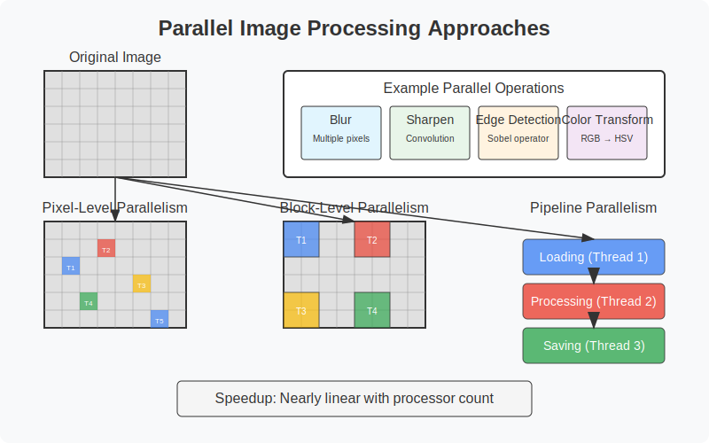

# Parallel Programming: Concepts and Strategies
## GWU ECE 6125: Parallel Computer Architecture

---

## 1. Introduction to Parallel Programming

### What is Parallel Programming?
- **Definition**: Simultaneous execution of multiple computations
- **Goal**: Increase speed and efficiency
- **Motivation**: Solve larger problems, reduce execution time
- **Core concept**: Breaking down problems into smaller parts that can run concurrently


---

## Why Parallelism? The Need for Speed

- **Performance limits in sequential processing**
  - Clock speeds have plateaued
  - Power/thermal constraints ("Power Wall")
  - Memory access bottlenecks
- **Moore's Law transitions to multi-core**
  - Transistor count still increases
  - But single-core performance has flattened
  - Multiple cores allow continued performance scaling


---

## Brief History: From Single-Core to Many-Core

- **Early processors**: Sequential execution, von Neumann architecture
- **Vector processors** (1970s): SIMD instructions
- **Superscalar processors** (1980s-90s): Instruction-level parallelism
- **Multi-core CPUs** (2000s-present): Multiple cores on a single die
- **Many-core processors** (2010s): Tens to hundreds of cores
- **GPUs for general computing**: Thousands of simple cores
- **Heterogeneous computing**: Specialized accelerators for different workloads

---

## Challenges in Parallel Programming

- **Concurrency**: Managing simultaneous execution
  - *Coordinating multiple execution streams running at the same time*
  - *Requires careful design to avoid conflicts and race conditions*

- **Synchronization**: Coordinating access to shared resources
  - *Ensuring orderly access to data that multiple processes need to use or modify*
  - *Balancing protection with performance overhead*

- **Load balancing**: Distributing work evenly
  - *Ensuring all processors have similar amounts of work to avoid idle time*
  - *Particularly challenging with irregular or unpredictable workloads*

- **Communication overhead**: Data exchange between processors
  - *Time spent transferring data instead of computing results*
  - *Can become the dominant cost in distributed systems*

---

## Challenges in Parallel Programming (Cont.)

- **Scalability**: Performance as processors increase
  - *Maintaining efficiency as you add more processors*
  - *Limited by serial portions and increasing communication costs*

- **Debugging complexity**: Non-deterministic behavior
  - *Parallel bugs may appear intermittently and be difficult to reproduce*
  - *Traditional debugging techniques often inadequate*

- **Algorithm redesign**: Many sequential algorithms don't parallelize well
  - *Sequential algorithms often rely on state that's difficult to parallelize*
  - *May need fundamentally different approaches for parallel execution*

> "Making sequential programs run in parallel is so hard that it is considered one of computer science's grand challenges." — Tim Mattson, Intel

---

## 2. Thinking in Parallel

### The Parallel Programmer's Mindset

- **Shift from sequential to parallel thinking**
  - Identify independent operations
  - Understand data and control dependencies
  - Focus on concurrent execution paths
- **Key mental shift**:
  - Sequential: "What's the next step?"
  - Parallel: "What can be done at the same time?"
- **Different design approach**:
  - Break problem into concurrent units
  - Manage coordination between units
  - Consider data access patterns carefully

---

## Identifying Parallelism Opportunities

- **Look for independent tasks or data**
  - Data elements processed independently
  - Iterations with no dependencies
  - Separate functions that can run concurrently
- **Domain-specific parallelism**:
  - **Image processing**: Pixel-level parallelism
  - **Simulations**: Spatial decomposition
  - **AI/ML**: Batch processing, matrix operations
  - **Search/Sort**: Divide and conquer
  - **Graph algorithms**: Vertex/edge parallelism

---

## Types of Parallelism

- **Data Parallelism**: Same operation on different data
  - *Performs identical operations simultaneously on multiple data elements*
  - *Example: Applying a filter to each pixel in an image*
  - *Ideal when operations are independent and uniform across data*
  - *Scales well with data size and processor count*

- **Task Parallelism**: Different operations on same or different data
  - *Executes different functions simultaneously on potentially different data*
  - *Example: Rendering different parts of a 3D scene with specialized tasks*
  - *Good for heterogeneous workloads with distinct operations*
  - *Often requires more synchronization than data parallelism*

- **Pipeline Parallelism**: Assembly line of tasks
  - *Data flows through a series of processing stages*
  - *Different elements are at different stages simultaneously*
  - *Example: Video processing stages (decode, process, encode)*
  - *Throughput limited by the slowest stage (bottleneck)*
  - *Effective for streaming data with sequential dependencies*


---

## Case Study: Parallelism in Image Processing

- **Image as a 2D array of pixels**
- **Parallel processing approaches**:
  - **Pixel-level**: Apply operations to each pixel independently
  - **Block-level**: Process blocks of pixels in parallel
  - **Pipeline**: Stages for loading, processing, saving
- **Example operations**:
  - Blur, sharpen, edge detection, color transformations
  - Each can be done in parallel across the image
- **Speedup**: Nearly linear with processor count for embarrassingly parallel operations
parallel-image-processing

---

## The SPMD Model (Single Program Multiple Data)

- **Core concept**: Same program runs on all processors, but each processes different data
- **Common implementation**: Use processor ID to determine which data to process
- **Widely used in**:
  - MPI applications
  - CUDA/GPU computing
  - OpenMP parallel sections
- **Example pseudocode**:
  ```
  function parallel_process():
    my_id = get_processor_id()
    my_data = get_data_chunk(my_id)
    result = process(my_data)
    return result
  ```

---

## 3. Decomposition

### What is Decomposition?

- **Definition**: Breaking the problem into parts that can be solved in parallel
- **Key considerations**:
  - Identify independent components
  - Balance computation across parts
  - Minimize communication between parts
  - Match problem structure to hardware capabilities
- **Goal**: Create enough parallelism to keep all processors busy
- **Importance**: Foundation of parallel algorithm design


---

## Task Decomposition vs. Data Decomposition

- **Task Decomposition**
  - Divide by functionality
  - Different tasks perform different functions
  - Can be heterogeneous (different sizes)
  - Examples: UI rendering + physics + AI in a game
  
- **Data Decomposition**
  - Divide data among processors
  - Same operation on different data elements
  - Usually homogeneous (similar sizes)
  - Examples: Matrix multiplication, image processing

---

## Choosing the Right Decomposition Strategy

Decomposition is a critical design decision that determines how effectively a parallel program will scale and perform. Choosing the wrong strategy can lead to poor load balancing, excessive communication, or underutilized resources.

- **Consider these factors**:
  - **Problem structure**: Is your problem naturally *data-centric* (e.g., matrix operations) or *task-centric* (e.g., different phases in a simulation)?
  - **Data access patterns and dependencies**: Are data elements mostly independent, or do computations frequently need to communicate intermediate results?
  - **Communication requirements**: How much data needs to be exchanged between tasks? Is minimizing communication critical to performance?
  - **Load balance**: Can work be evenly distributed, or is there a risk of some processors being idle while others are overloaded?
  - **Hardware architecture**: Does the system favor shared memory, distributed memory, or a hybrid model? What are the costs of communication and synchronization?

---

## Choosing the Right Decomposition Strategy (Cont.)

- **Decision framework**:
  - **Highly regular data operations → Data decomposition**
    - *Example*: Matrix multiplication, image processing.
    - Each processor performs the same operation on different chunks of data.
  - **Different computational phases → Task decomposition**
    - *Example*: In a physics simulation, one phase may handle collision detection, another handles rendering.
    - Best when the program can be divided into distinct, often heterogeneous tasks.
  - **Complex, irregular dependencies → Task/data hybrid**
    - *Example*: Graph processing, adaptive mesh refinement.
    - Combine both data and task decomposition to balance irregular workloads and dependencies.
  - **Streaming data → Pipeline decomposition**
    - *Example*: Video encoding, data analytics pipelines.
    - Different stages of processing operate concurrently, each working on different parts of the data stream.

---

## Example - Summing an Array

Summing an array is a classic example to illustrate parallel decomposition and reduction.

- **Serial sum**:
  ```python
  sum = 0
  for i in range(0, n):
      sum += array[i]
  ```

- **Parallel sum**:
  ```python
  # Each processor computes a partial sum
  local_sum = 0
  for i in my_chunk:
      local_sum += array[i]
  
  # Combine local sums using a tree reduction
  global_sum = reduce_sum(local_sum)
  ```

- **Tree reduction**:
  - Combines partial sums in a logarithmic number of steps.
  - Example: 8 processors → log₂(8) = 3 steps.
  - Reduces communication time compared to a sequential combination.

- **Speedup**:
  - Near-linear speedup with enough data and processors.
  - Performance depends on:
    - Array size (more data = better speedup)
    - Load balance (even work distribution)
    - Reduction overhead (logarithmic, but non-zero)

---

## Decomposition in SPMD Programs

- **Approach**:  
  Each processor works on a subset of the data.

- **Data division methods**:
  - **Block**: Contiguous chunks  
    (e.g., Processor 0 → elements 0–99)
  - **Cyclic**: Round-robin assignment  
    (e.g., Processor 0 → elements 0, 4, 8…)
  - **Block-cyclic**: Blocks assigned round-robin  
    (e.g., blocks of 4 elements distributed cyclically)

- **Example: Vector addition (SPMD)**  
  ```python
  def parallel_vector_add(A, B, C):
      my_id = get_processor_id()
      my_chunk = get_my_data_range(my_id, len(A))
      
      for i in my_chunk:
          C[i] = A[i] + B[i]
  ```

---

## Decomposition Granularity

### Fine-grained Decomposition
- Many small tasks or data chunks  
- **Advantages**:  
  - Better load balancing  
  - More flexibility in dynamic workloads  
- **Disadvantages**:  
  - Higher overhead (communication, synchronization, task management)  
- **Example**:  
  - One matrix **element** per task  

---

## Decomposition Granularity (Cont.)

### Coarse-grained Decomposition
- Fewer, larger tasks or data chunks  
- **Advantages**:  
  - Lower overhead  
  - Less frequent communication and synchronization  
- **Disadvantages**:  
  - Potential load imbalance (some processors may finish early)  
- **Example**:  
  - One matrix **row** per task  

### Optimal Granularity
- Balance overhead and parallelism  
- Goal: Maximize efficiency while minimizing management costs  

---

## 4. Assignment

### Assigning Tasks to Processors

- **Definition**:  
  Mapping decomposed tasks to physical processors.

- **Considerations**:  
  - Processor capabilities (heterogeneous systems)  
  - Communication patterns and proximity  
  - Memory access patterns  
  - Load balance  

---

## 4. Assignment (Cont.)

### Assignment Policy Impacts

- **Overall performance**  
- **Resource utilization**  
- **Communication overhead**

Assignment decisions affect how well parallel programs scale and perform.  
Choosing the right mapping strategy can minimize communication costs and maximize processor efficiency.

---

## Static vs. Dynamic Assignment

### Static Assignment
- Tasks assigned at **compile time** or **program start**  
- Fixed assignment throughout execution  
- **Low runtime overhead**  
- Best for **predictable, uniform workloads**  
- **Examples**:  
  - Regular domain decomposition in scientific simulations  
  - Matrix operations with even workload distribution  

---

## Static vs. Dynamic Assignment (Cont.)

### Dynamic Assignment
- Tasks assigned **during execution**  
- Uses **task queues** or **work stealing**  
- **Better load balancing** for irregular or unpredictable workloads  
- **Higher runtime overhead** due to scheduling and coordination  
- **Examples**:  
  - Graph algorithms with variable node processing times  
  - Recursive divide-and-conquer algorithms (e.g., parallel quicksort)

---

## Load Balancing: Ensuring Equal Workload

### Goal
- Distribute computation **equally** across all processors  
- Minimize idle time to maximize resource utilization  

### Challenges
- **Unpredictable task durations**  
- **Heterogeneous processor capabilities**  
- **Dynamic and irregular workloads**  

---

## Load Balancing: Ensuring Equal Workload (Cont.)

### Techniques
- **Work stealing**  
  - Idle processors take tasks from busy processors  
- **Task queues**  
  - Centralized or distributed queues manage pending tasks  
- **Over-decomposition**  
  - Break work into more tasks than processors to improve flexibility  
- **Self-scheduling**  
  - Processors request new work as they become available  

---

## Load Balancing Strategies

### Static Load Balancing
- Task distribution is **predetermined** before execution  
- Low runtime overhead  
- Best for **homogeneous tasks** and **predictable workloads**  

#### Examples:
- **Block distribution**  
  - Consecutive chunks of tasks assigned to each processor  
  - Example: Processor 0 → tasks 0–99, Processor 1 → tasks 100–199  
- **Cyclic distribution**  
  - Tasks are assigned in a **round-robin** fashion  
  - Example: Processor 0 → tasks 0, 4, 8...  
    Processor 1 → tasks 1, 5, 9...  
  - Useful when **task execution times vary**, as it balances load more evenly  
  - **Disadvantage**: Poor data locality, may increase communication overhead  

---

## Load Balancing Strategies (Cont.)

### Dynamic Load Balancing
- Tasks assigned **at runtime** as processors become available  
- Best for **irregular workloads** and **heterogeneous systems**  
- Adds **runtime overhead**, but improves resource utilization  

#### Techniques:
- **Work stealing**  
  - Idle processors take tasks from busy processors  
- **Centralized task queues**  
  - All processors pull work from a common task pool  

---

## Load Balancing Strategies (Cont.)

### Hybrid Approaches
- Combine **static** and **dynamic** techniques  
- Useful for **large-scale, hierarchical systems**  

#### Example:
- **Static distribution** across nodes (e.g., block distribution)  
- **Dynamic load balancing** within nodes (e.g., work stealing)  


---

## Mapping Data to Processors in Data Parallelism

### Block Distribution
- Contiguous chunks assigned to each processor  
- **Pros**: Good locality, simple indexing  
- **Example**:  
  - Processor 0 → elements 0–99  
  - Processor 1 → elements 100–199  


### Cyclic Distribution
- Assign elements round-robin  
- **Pros**: Better load balance with irregular workloads  
- **Cons**: Poor locality, complex indexing  
- **Example**:  
  - Processor 0 → elements 0, 4, 8...  
  - Processor 1 → elements 1, 5, 9...  


### Block-Cyclic Distribution
- Blocks assigned in round-robin fashion  
- Balances locality and load balancing  
- Common in **ScaLAPACK**

---

## Mapping Data to Processors in Data Parallelism (Cont.)

### Parallel Quicksort

1. **Select pivot**  
   - Partition point; splits data into two groups  
2. **Partition in parallel**  
   - Elements reorganized into subarrays  
3. **Recursively sort in parallel**  
   - Subarrays sorted independently  


### Assignment Strategies
- Fixed processors per subarray (static)  
- Dynamic reassignment to larger subarrays  
- Work stealing for better load balance  
- Over-decomposition: more tasks than processors  

---


## Granularity Revisited: Impact on Assignment

- **Too fine-grained**:
  - High task management overhead
  - Excessive communication/synchronization
  - Scheduling becomes a bottleneck

- **Too coarse-grained**:
  - Underutilized processors (idle time)
  - Poor load balancing
  - Limited scalability

- **Adaptive granularity**:
  - Start coarse, split if needed
  - Example: Parallel loops with dynamic chunk sizing

---

## 5. Orchestration

### What is Orchestration?

- **Definition**: Managing execution of parallel tasks
- **Includes**:
  - Synchronization between tasks
  - Communication mechanisms
  - Ensuring correct execution order
  - Managing shared resources
  - Handling dependencies

- **Design considerations**:
  - Minimize synchronization points
  - Balance parallelism and coordination
  - Select appropriate communication patterns


---

## Coordination Between Parallel Tasks

### Types of Dependencies

- **Data dependencies**  
  - One task produces data another needs  
  - *Example*: Task B waits for Task A’s result  

- **Control dependencies**  
  - Task order matters, even if no data is shared  
  - *Example*: Initialization must finish before processing starts  

- **Resource dependencies**  
  - Tasks need access to shared resources  
  - *Example*: Multiple threads writing to the same file  

---

## Coordination Between Parallel Tasks (Cont.)

### Coordination Mechanisms

- **Barriers**  
  - All tasks wait until every task reaches the barrier  
  - Useful for phase-based algorithms  

- **Locks / Semaphores**  
  - **Locks (mutexes)**: One thread at a time in a critical section  
  - **Semaphores**:  
    - Counting mechanism controlling access to **N** identical resources  
    - *Example*: Limit 3 threads accessing a database connection pool  
    - Can also be used to **signal** between tasks (producer-consumer patterns)  

- **Message Passing**  
  - Tasks exchange data explicitly (e.g., MPI)  
  - Synchronization happens during send/receive  

- **Futures / Promises**  
  - Placeholders for values computed asynchronously  
  - Tasks continue until they need the result  

- **Atomic Operations**  
  - Hardware-supported, indivisible updates to shared variables  
  - *Examples*:  
    - **Atomic increment**: Safely increase a counter  
    - **Compare-and-swap (CAS)**: Change a value only if it matches an expected one  
  - Useful for **lock-free programming**:  
    - Lower overhead  
    - Reduced risk of deadlock  
    - Ideal for simple updates (counters, flags)  

---

## Synchronization: Why It's Needed

### Purpose
- **Protect shared data**  
  - Prevent race conditions and data corruption  
- **Enforce ordering constraints**  
  - Ensure operations happen in the correct sequence  
- **Ensure task completion**  
  - Wait for other tasks to finish before proceeding  
- **Coordinate shared resource access**  
  - Manage access to files, memory, network, etc.

---

## Synchronization: Why It's Needed (Cont.)

### Common Situations Requiring Synchronization

- **Shared variable updates**  
  - Example: Incrementing a shared counter for task completion tracking  

- **Producer-consumer relationships**  
  - Example: One thread adds tasks to a queue, another processes them  

- **Critical sections**  
  - Example:  
    Multiple threads writing to a **shared log file**  
    - If not synchronized, log messages can be interleaved and corrupted  
    - Critical section ensures only one thread writes at a time  

- **Data aggregation points**  
  - Example: Combining partial sums into a shared result in a parallel reduction  

---

## Race Conditions: What Can Go Wrong

### Definition
- A race condition occurs when the **outcome** of a program depends on the **timing** or **interleaving** of operations between threads or processes.

### Common Causes
- **Unprotected access** to shared data  
- **Missing synchronization** (no locks or coordination)  
- **Incorrect use of locking protocols** (deadlocks, improper releases)

---

## Race Conditions: What Can Go Wrong (Cont.)

### Example – Shared Counter Problem

```c
// Incorrect parallel increment (race condition)
counter++;  // Actually three steps: load, increment, store
```

- Multiple threads can read the same value and overwrite each other.  
- Final counter value will be wrong.

### Correct Approaches

```c
// Use atomic operation
atomic_increment(counter);

// Or use a lock
lock(mutex);
counter++;
unlock(mutex);
```

### Consequences
- Incorrect results  
- Data corruption  
- Crashes or undefined behavior  

---

## Synchronization Tools

### Locks

- **Mutex (Mutual Exclusion)**  
  - Ensures **exclusive access** to a critical section  
  - One thread at a time; others wait until the lock is released  
  - Simple but can lead to contention if overused  

- **Reader-Writer Locks**  
  - Multiple readers allowed concurrently  
  - Writers require exclusive access  
  - Good when **reads are frequent** and **writes are rare**  
  - Example: Database with many read queries and few updates  

---

## Synchronization Tools (Cont.)

### Semaphores

- Control access to **multiple identical resources**  
  - Binary semaphore (0 or 1): Like a mutex  
  - Counting semaphore: Allows up to N concurrent accesses  

- Common for **producer-consumer** synchronization  
  - Producer increments the count  
  - Consumer decrements the count  
  - Consumers block when count = 0 (no items to consume)  

### Barriers

- Forces all threads to wait at a **synchronization point**  
- Used to **coordinate phases** in parallel algorithms  
  - Example: Iterative solver; all threads finish iteration N before N+1 starts  

---

## Synchronization Tools (Cont.)

### Atomic Operations

- **Hardware-supported**, indivisible instructions  
- No locks required; safe from interference by other threads  
- **Efficient** for simple shared data updates  

#### Example: Atomic Counter Increment
```c
// Non-atomic (not safe)
counter = counter + 1;

// Atomic (safe)
atomic_fetch_add(&counter, 1);
```
- Guarantees **no two threads** update the counter at the same time  
- Eliminates the risk of **race conditions**

### Deadlocks (What to Avoid)
- **Deadlock** happens when two or more threads **wait forever** for each other’s locks  
- Example:  
  - Thread A holds Lock 1, waiting for Lock 2  
  - Thread B holds Lock 2, waiting for Lock 1  
- Causes programs to hang; no thread can proceed  


## Further Learning Resources

- **Books**:
  - "Patterns for Parallel Programming" (Mattson, Sanders, Massingill)
  - "Programming Massively Parallel Processors" (Kirk, Hwu)
  - "Structured Parallel Programming" (McCool, Reinders, Robison)

- **Online courses**:
  - "Parallel Programming" on Coursera
  - "High Performance Computing" on edX

- **Documentation and tutorials**:
  - OpenMP, MPI, CUDA programming guides
  - Lawrence Livermore National Lab tutorials
  - Intel and NVIDIA developer resources 