# Parallel Programming: Concepts and Strategies
## GWU ECE 6125: Parallel Computer Architecture

---

## 1. Introduction to Parallel Programming

### What is Parallel Programming?
- **Definition**: Simultaneous execution of multiple computations
- **Goal**: Increase speed and efficiency
- **Motivation**: Solve larger problems, reduce execution time
- **Core concept**: Breaking down problems into smaller parts that can run concurrently

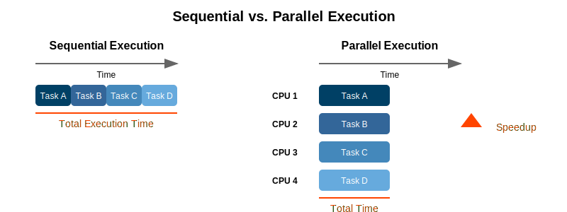

---

## Why Parallelism? The Need for Speed

- **Performance limits in sequential processing**
  - Clock speeds have plateaued
  - Power/thermal constraints ("Power Wall")
  - Memory access bottlenecks
- **Moore's Law transitions to multi-core**
  - Transistor count still increases
  - But single-core performance has flattened
  - Multiple cores allow continued performance scaling

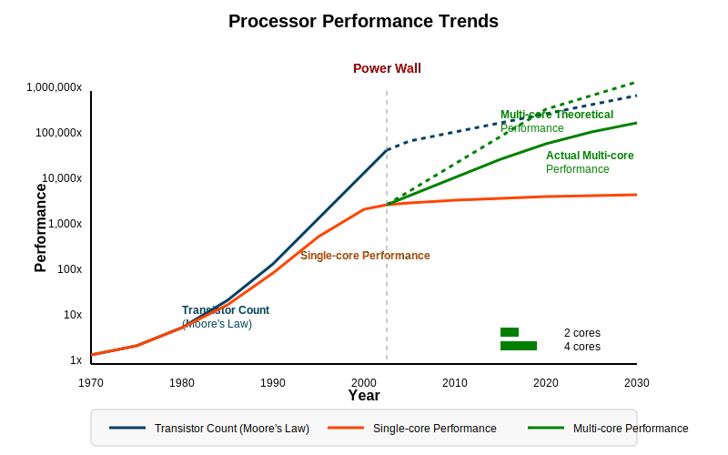

---

## Brief History: From Single-Core to Many-Core

- **Early processors**: Sequential execution, von Neumann architecture
- **Vector processors** (1970s): SIMD instructions
- **Superscalar processors** (1980s-90s): Instruction-level parallelism
- **Multi-core CPUs** (2000s-present): Multiple cores on a single die
- **Many-core processors** (2010s): Tens to hundreds of cores
- **GPUs for general computing**: Thousands of simple cores
- **Heterogeneous computing**: Specialized accelerators for different workloads

---

## Challenges in Parallel Programming

- **Concurrency**: Managing simultaneous execution
  - *Coordinating multiple execution streams running at the same time*
  - *Requires careful design to avoid conflicts and race conditions*

- **Synchronization**: Coordinating access to shared resources
  - *Ensuring orderly access to data that multiple processes need to use or modify*
  - *Balancing protection with performance overhead*

- **Load balancing**: Distributing work evenly
  - *Ensuring all processors have similar amounts of work to avoid idle time*
  - *Particularly challenging with irregular or unpredictable workloads*

- **Communication overhead**: Data exchange between processors
  - *Time spent transferring data instead of computing results*
  - *Can become the dominant cost in distributed systems*

---

## Challenges in Parallel Programming (Cont.)

- **Scalability**: Performance as processors increase
  - *Maintaining efficiency as you add more processors*
  - *Limited by serial portions and increasing communication costs*

- **Debugging complexity**: Non-deterministic behavior
  - *Parallel bugs may appear intermittently and be difficult to reproduce*
  - *Traditional debugging techniques often inadequate*

- **Algorithm redesign**: Many sequential algorithms don't parallelize well
  - *Sequential algorithms often rely on state that's difficult to parallelize*
  - *May need fundamentally different approaches for parallel execution*

> "Making sequential programs run in parallel is so hard that it is considered one of computer science's grand challenges." — Tim Mattson, Intel

---

## 2. Thinking in Parallel

### The Parallel Programmer's Mindset

- **Shift from sequential to parallel thinking**
  - Identify independent operations
  - Understand data and control dependencies
  - Focus on concurrent execution paths
- **Key mental shift**:
  - Sequential: "What's the next step?"
  - Parallel: "What can be done at the same time?"
- **Different design approach**:
  - Break problem into concurrent units
  - Manage coordination between units
  - Consider data access patterns carefully

---

## Identifying Parallelism Opportunities

- **Look for independent tasks or data**
  - Data elements processed independently
  - Iterations with no dependencies
  - Separate functions that can run concurrently
- **Domain-specific parallelism**:
  - **Image processing**: Pixel-level parallelism
  - **Simulations**: Spatial decomposition
  - **AI/ML**: Batch processing, matrix operations
  - **Search/Sort**: Divide and conquer
  - **Graph algorithms**: Vertex/edge parallelism

---

## Types of Parallelism

- **Data Parallelism**: Same operation on different data
  - *Performs identical operations simultaneously on multiple data elements*
  - *Example: Applying a filter to each pixel in an image*
  - *Ideal when operations are independent and uniform across data*
  - *Scales well with data size and processor count*

- **Task Parallelism**: Different operations on same or different data
  - *Executes different functions simultaneously on potentially different data*
  - *Example: Rendering different parts of a 3D scene with specialized tasks*
  - *Good for heterogeneous workloads with distinct operations*
  - *Often requires more synchronization than data parallelism*

- **Pipeline Parallelism**: Assembly line of tasks
  - *Data flows through a series of processing stages*
  - *Different elements are at different stages simultaneously*
  - *Example: Video processing stages (decode, process, encode)*
  - *Throughput limited by the slowest stage (bottleneck)*
  - *Effective for streaming data with sequential dependencies*


---

## Case Study: Parallelism in Image Processing

- **Image as a 2D array of pixels**
- **Parallel processing approaches**:
  - **Pixel-level**: Apply operations to each pixel independently
  - **Block-level**: Process blocks of pixels in parallel
  - **Pipeline**: Stages for loading, processing, saving
- **Example operations**:
  - Blur, sharpen, edge detection, color transformations
  - Each can be done in parallel across the image
- **Speedup**: Nearly linear with processor count for embarrassingly parallel operations
parallel-image-processing
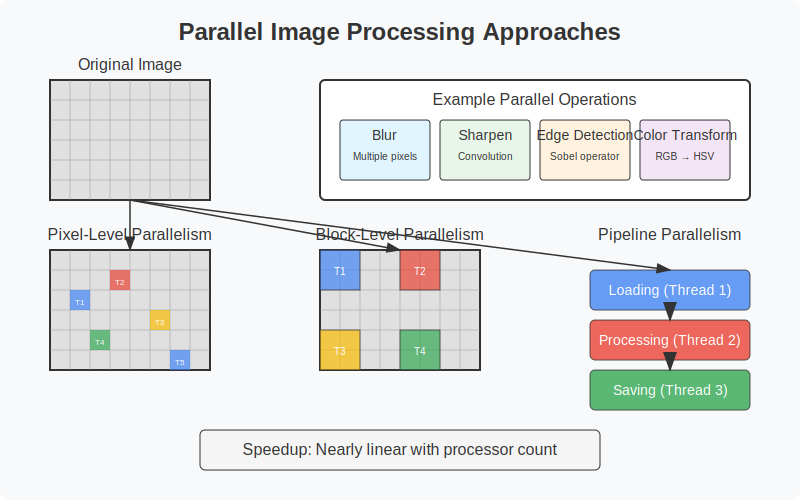
---

## The SPMD Model (Single Program Multiple Data)

- **Core concept**: Same program runs on all processors, but each processes different data
- **Common implementation**: Use processor ID to determine which data to process
- **Widely used in**:
  - MPI applications
  - CUDA/GPU computing
  - OpenMP parallel sections
- **Example pseudocode**:
  ```
  function parallel_process():
    my_id = get_processor_id()
    my_data = get_data_chunk(my_id)
    result = process(my_data)
    return result
  ```

---

## 3. Decomposition

### What is Decomposition?

- **Definition**: Breaking the problem into parts that can be solved in parallel
- **Key considerations**:
  - Identify independent components
  - Balance computation across parts
  - Minimize communication between parts
  - Match problem structure to hardware capabilities
- **Goal**: Create enough parallelism to keep all processors busy
- **Importance**: Foundation of parallel algorithm design

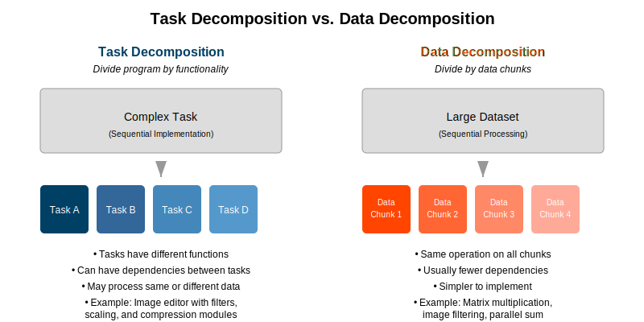

---

## Task Decomposition vs. Data Decomposition

- **Task Decomposition**
  - Divide by functionality
  - Different tasks perform different functions
  - Can be heterogeneous (different sizes)
  - Examples: UI rendering + physics + AI in a game
  
- **Data Decomposition**
  - Divide data among processors
  - Same operation on different data elements
  - Usually homogeneous (similar sizes)
  - Examples: Matrix multiplication, image processing

---

## Choosing the Right Decomposition Strategy

Decomposition is a critical design decision that determines how effectively a parallel program will scale and perform. Choosing the wrong strategy can lead to poor load balancing, excessive communication, or underutilized resources.

- **Consider these factors**:
  - **Problem structure**: Is your problem naturally *data-centric* (e.g., matrix operations) or *task-centric* (e.g., different phases in a simulation)?
  - **Data access patterns and dependencies**: Are data elements mostly independent, or do computations frequently need to communicate intermediate results?
  - **Communication requirements**: How much data needs to be exchanged between tasks? Is minimizing communication critical to performance?
  - **Load balance**: Can work be evenly distributed, or is there a risk of some processors being idle while others are overloaded?
  - **Hardware architecture**: Does the system favor shared memory, distributed memory, or a hybrid model? What are the costs of communication and synchronization?

---

## Choosing the Right Decomposition Strategy (Cont.)

- **Decision framework**:
  - **Highly regular data operations → Data decomposition**
    - *Example*: Matrix multiplication, image processing.
    - Each processor performs the same operation on different chunks of data.
  - **Different computational phases → Task decomposition**
    - *Example*: In a physics simulation, one phase may handle collision detection, another handles rendering.
    - Best when the program can be divided into distinct, often heterogeneous tasks.
  - **Complex, irregular dependencies → Task/data hybrid**
    - *Example*: Graph processing, adaptive mesh refinement.
    - Combine both data and task decomposition to balance irregular workloads and dependencies.
  - **Streaming data → Pipeline decomposition**
    - *Example*: Video encoding, data analytics pipelines.
    - Different stages of processing operate concurrently, each working on different parts of the data stream.

---

## Example - Summing an Array

Summing an array is a classic example to illustrate parallel decomposition and reduction.

- **Serial sum**:
  ```python
  sum = 0
  for i in range(0, n):
      sum += array[i]
  ```

- **Parallel sum**:
  ```python
  # Each processor computes a partial sum
  local_sum = 0
  for i in my_chunk:
      local_sum += array[i]
  
  # Combine local sums using a tree reduction
  global_sum = reduce_sum(local_sum)
  ```

- **Tree reduction**:
  - Combines partial sums in a logarithmic number of steps.
  - Example: 8 processors → log₂(8) = 3 steps.
  - Reduces communication time compared to a sequential combination.

- **Speedup**:
  - Near-linear speedup with enough data and processors.
  - Performance depends on:
    - Array size (more data = better speedup)
    - Load balance (even work distribution)
    - Reduction overhead (logarithmic, but non-zero)

---

## Decomposition in SPMD Programs

- **Approach**:  
  Each processor works on a subset of the data.

- **Data division methods**:
  - **Block**: Contiguous chunks  
    (e.g., Processor 0 → elements 0–99)
  - **Cyclic**: Round-robin assignment  
    (e.g., Processor 0 → elements 0, 4, 8…)
  - **Block-cyclic**: Blocks assigned round-robin  
    (e.g., blocks of 4 elements distributed cyclically)

- **Example: Vector addition (SPMD)**  
  ```python
  def parallel_vector_add(A, B, C):
      my_id = get_processor_id()
      my_chunk = get_my_data_range(my_id, len(A))
      
      for i in my_chunk:
          C[i] = A[i] + B[i]
  ```

---

## Decomposition Granularity

### Fine-grained Decomposition
- Many small tasks or data chunks  
- **Advantages**:  
  - Better load balancing  
  - More flexibility in dynamic workloads  
- **Disadvantages**:  
  - Higher overhead (communication, synchronization, task management)  
- **Example**:  
  - One matrix **element** per task  

---

## Decomposition Granularity (Cont.)

### Coarse-grained Decomposition
- Fewer, larger tasks or data chunks  
- **Advantages**:  
  - Lower overhead  
  - Less frequent communication and synchronization  
- **Disadvantages**:  
  - Potential load imbalance (some processors may finish early)  
- **Example**:  
  - One matrix **row** per task  

### Optimal Granularity
- Balance overhead and parallelism  
- Goal: Maximize efficiency while minimizing management costs  

---

## 4. Assignment

### Assigning Tasks to Processors

- **Definition**:  
  Mapping decomposed tasks to physical processors.

- **Considerations**:  
  - Processor capabilities (heterogeneous systems)  
  - Communication patterns and proximity  
  - Memory access patterns  
  - Load balance  

---

## 4. Assignment (Cont.)

### Assignment Policy Impacts

- **Overall performance**  
- **Resource utilization**  
- **Communication overhead**

Assignment decisions affect how well parallel programs scale and perform.  
Choosing the right mapping strategy can minimize communication costs and maximize processor efficiency.

---

## Static vs. Dynamic Assignment

### Static Assignment
- Tasks assigned at **compile time** or **program start**  
- Fixed assignment throughout execution  
- **Low runtime overhead**  
- Best for **predictable, uniform workloads**  
- **Examples**:  
  - Regular domain decomposition in scientific simulations  
  - Matrix operations with even workload distribution  

---

## Static vs. Dynamic Assignment (Cont.)

### Dynamic Assignment
- Tasks assigned **during execution**  
- Uses **task queues** or **work stealing**  
- **Better load balancing** for irregular or unpredictable workloads  
- **Higher runtime overhead** due to scheduling and coordination  
- **Examples**:  
  - Graph algorithms with variable node processing times  
  - Recursive divide-and-conquer algorithms (e.g., parallel quicksort)

---

## Load Balancing: Ensuring Equal Workload

### Goal
- Distribute computation **equally** across all processors  
- Minimize idle time to maximize resource utilization  

### Challenges
- **Unpredictable task durations**  
- **Heterogeneous processor capabilities**  
- **Dynamic and irregular workloads**  

---

## Load Balancing: Ensuring Equal Workload (Cont.)

### Techniques
- **Work stealing**  
  - Idle processors take tasks from busy processors  
- **Task queues**  
  - Centralized or distributed queues manage pending tasks  
- **Over-decomposition**  
  - Break work into more tasks than processors to improve flexibility  
- **Self-scheduling**  
  - Processors request new work as they become available  

---

## Load Balancing Strategies

### Static Load Balancing
- Task distribution is **predetermined** before execution  
- Low runtime overhead  
- Best for **homogeneous tasks** and **predictable workloads**  

#### Examples:
- **Block distribution**  
  - Consecutive chunks of tasks assigned to each processor  
  - Example: Processor 0 → tasks 0–99, Processor 1 → tasks 100–199  
- **Cyclic distribution**  
  - Tasks are assigned in a **round-robin** fashion  
  - Example: Processor 0 → tasks 0, 4, 8...  
    Processor 1 → tasks 1, 5, 9...  
  - Useful when **task execution times vary**, as it balances load more evenly  
  - **Disadvantage**: Poor data locality, may increase communication overhead  

---

## Load Balancing Strategies (Cont.)

### Dynamic Load Balancing
- Tasks assigned **at runtime** as processors become available  
- Best for **irregular workloads** and **heterogeneous systems**  
- Adds **runtime overhead**, but improves resource utilization  

#### Techniques:
- **Work stealing**  
  - Idle processors take tasks from busy processors  
- **Centralized task queues**  
  - All processors pull work from a common task pool  

---

## Load Balancing Strategies (Cont.)

### Hybrid Approaches
- Combine **static** and **dynamic** techniques  
- Useful for **large-scale, hierarchical systems**  

#### Example:
- **Static distribution** across nodes (e.g., block distribution)  
- **Dynamic load balancing** within nodes (e.g., work stealing)  

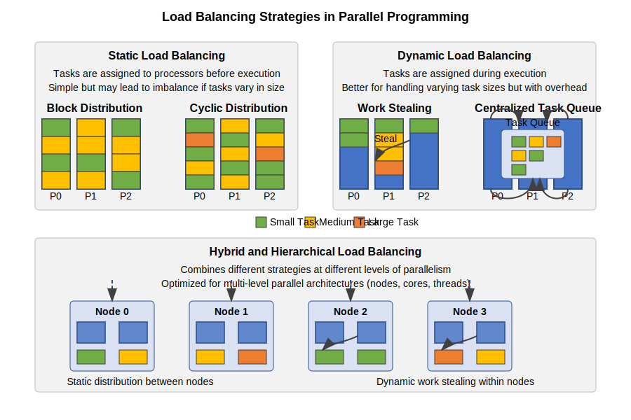

---

## Mapping Data to Processors in Data Parallelism

### Block Distribution
- Contiguous chunks assigned to each processor  
- **Pros**: Good locality, simple indexing  
- **Example**:  
  - Processor 0 → elements 0–99  
  - Processor 1 → elements 100–199  


### Cyclic Distribution
- Assign elements round-robin  
- **Pros**: Better load balance with irregular workloads  
- **Cons**: Poor locality, complex indexing  
- **Example**:  
  - Processor 0 → elements 0, 4, 8...  
  - Processor 1 → elements 1, 5, 9...  


### Block-Cyclic Distribution
- Blocks assigned in round-robin fashion  
- Balances locality and load balancing  
- Common in **ScaLAPACK**

---

## Mapping Data to Processors in Data Parallelism (Cont.)

### Parallel Quicksort

1. **Select pivot**  
   - Partition point; splits data into two groups  
2. **Partition in parallel**  
   - Elements reorganized into subarrays  
3. **Recursively sort in parallel**  
   - Subarrays sorted independently  


### Assignment Strategies
- Fixed processors per subarray (static)  
- Dynamic reassignment to larger subarrays  
- Work stealing for better load balance  
- Over-decomposition: more tasks than processors  

---


## Granularity Revisited: Impact on Assignment

- **Too fine-grained**:
  - High task management overhead
  - Excessive communication/synchronization
  - Scheduling becomes a bottleneck

- **Too coarse-grained**:
  - Underutilized processors (idle time)
  - Poor load balancing
  - Limited scalability

- **Adaptive granularity**:
  - Start coarse, split if needed
  - Example: Parallel loops with dynamic chunk sizing

---

## 5. Orchestration

### What is Orchestration?

- **Definition**: Managing execution of parallel tasks
- **Includes**:
  - Synchronization between tasks
  - Communication mechanisms
  - Ensuring correct execution order
  - Managing shared resources
  - Handling dependencies

- **Design considerations**:
  - Minimize synchronization points
  - Balance parallelism and coordination
  - Select appropriate communication patterns

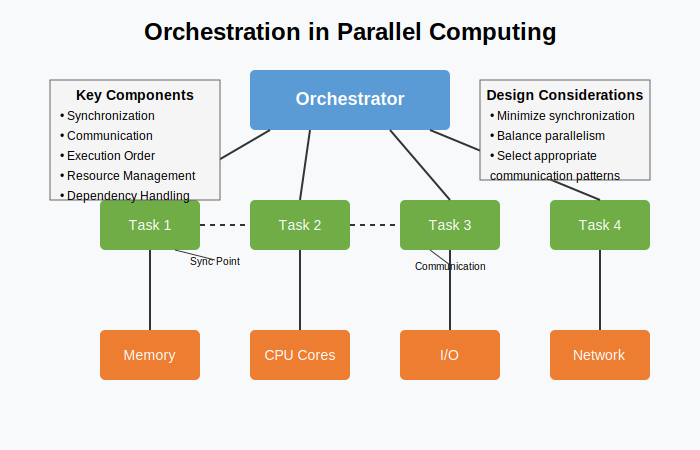

---

## Coordination Between Parallel Tasks

### Types of Dependencies

- **Data dependencies**  
  - One task produces data another needs  
  - *Example*: Task B waits for Task A’s result  

- **Control dependencies**  
  - Task order matters, even if no data is shared  
  - *Example*: Initialization must finish before processing starts  

- **Resource dependencies**  
  - Tasks need access to shared resources  
  - *Example*: Multiple threads writing to the same file  

---

## Coordination Between Parallel Tasks (Cont.)

### Coordination Mechanisms

- **Barriers**  
  - All tasks wait until every task reaches the barrier  
  - Useful for phase-based algorithms  

- **Locks / Semaphores**  
  - **Locks (mutexes)**: One thread at a time in a critical section  
  - **Semaphores**:  
    - Counting mechanism controlling access to **N** identical resources  
    - *Example*: Limit 3 threads accessing a database connection pool  
    - Can also be used to **signal** between tasks (producer-consumer patterns)  

- **Message Passing**  
  - Tasks exchange data explicitly (e.g., MPI)  
  - Synchronization happens during send/receive  

- **Futures / Promises**  
  - Placeholders for values computed asynchronously  
  - Tasks continue until they need the result  

- **Atomic Operations**  
  - Hardware-supported, indivisible updates to shared variables  
  - *Examples*:  
    - **Atomic increment**: Safely increase a counter  
    - **Compare-and-swap (CAS)**: Change a value only if it matches an expected one  
  - Useful for **lock-free programming**:  
    - Lower overhead  
    - Reduced risk of deadlock  
    - Ideal for simple updates (counters, flags)  

---

## Synchronization: Why It's Needed

### Purpose
- **Protect shared data**  
  - Prevent race conditions and data corruption  
- **Enforce ordering constraints**  
  - Ensure operations happen in the correct sequence  
- **Ensure task completion**  
  - Wait for other tasks to finish before proceeding  
- **Coordinate shared resource access**  
  - Manage access to files, memory, network, etc.

---

## Synchronization: Why It's Needed (Cont.)

### Common Situations Requiring Synchronization

- **Shared variable updates**  
  - Example: Incrementing a shared counter for task completion tracking  

- **Producer-consumer relationships**  
  - Example: One thread adds tasks to a queue, another processes them  

- **Critical sections**  
  - Example:  
    Multiple threads writing to a **shared log file**  
    - If not synchronized, log messages can be interleaved and corrupted  
    - Critical section ensures only one thread writes at a time  

- **Data aggregation points**  
  - Example: Combining partial sums into a shared result in a parallel reduction  

---

## Race Conditions: What Can Go Wrong

### Definition
- A race condition occurs when the **outcome** of a program depends on the **timing** or **interleaving** of operations between threads or processes.

### Common Causes
- **Unprotected access** to shared data  
- **Missing synchronization** (no locks or coordination)  
- **Incorrect use of locking protocols** (deadlocks, improper releases)

---

## Race Conditions: What Can Go Wrong (Cont.)

### Example – Shared Counter Problem

```c
// Incorrect parallel increment (race condition)
counter++;  // Actually three steps: load, increment, store
```

- Multiple threads can read the same value and overwrite each other.  
- Final counter value will be wrong.

### Correct Approaches

```c
// Use atomic operation
atomic_increment(counter);

// Or use a lock
lock(mutex);
counter++;
unlock(mutex);
```

### Consequences
- Incorrect results  
- Data corruption  
- Crashes or undefined behavior  

---

## Synchronization Tools

### Locks

- **Mutex (Mutual Exclusion)**  
  - Ensures **exclusive access** to a critical section  
  - One thread at a time; others wait until the lock is released  
  - Simple but can lead to contention if overused  

- **Reader-Writer Locks**  
  - Multiple readers allowed concurrently  
  - Writers require exclusive access  
  - Good when **reads are frequent** and **writes are rare**  
  - Example: Database with many read queries and few updates  

---

## Synchronization Tools (Cont.)

### Semaphores

- Control access to **multiple identical resources**  
  - Binary semaphore (0 or 1): Like a mutex  
  - Counting semaphore: Allows up to N concurrent accesses  

- Common for **producer-consumer** synchronization  
  - Producer increments the count  
  - Consumer decrements the count  
  - Consumers block when count = 0 (no items to consume)  

### Barriers

- Forces all threads to wait at a **synchronization point**  
- Used to **coordinate phases** in parallel algorithms  
  - Example: Iterative solver; all threads finish iteration N before N+1 starts  

---

## Synchronization Tools (Cont.)

### Atomic Operations

- **Hardware-supported**, indivisible instructions  
- No locks required; safe from interference by other threads  
- **Efficient** for simple shared data updates  

#### Example: Atomic Counter Increment
```c
// Non-atomic (not safe)
counter = counter + 1;

// Atomic (safe)
atomic_fetch_add(&counter, 1);
```
- Guarantees **no two threads** update the counter at the same time  
- Eliminates the risk of **race conditions**

### Deadlocks (What to Avoid)
- **Deadlock** happens when two or more threads **wait forever** for each other’s locks  
- Example:  
  - Thread A holds Lock 1, waiting for Lock 2  
  - Thread B holds Lock 2, waiting for Lock 1  
- Causes programs to hang; no thread can proceed  
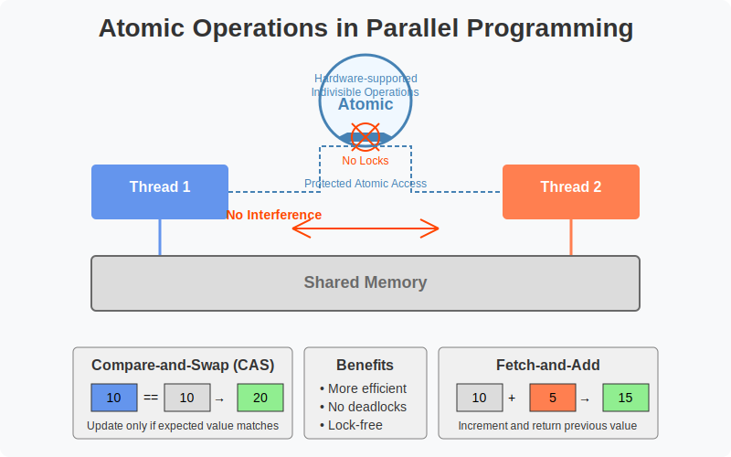

---

## Shared vs. Distributed Memory Architectures
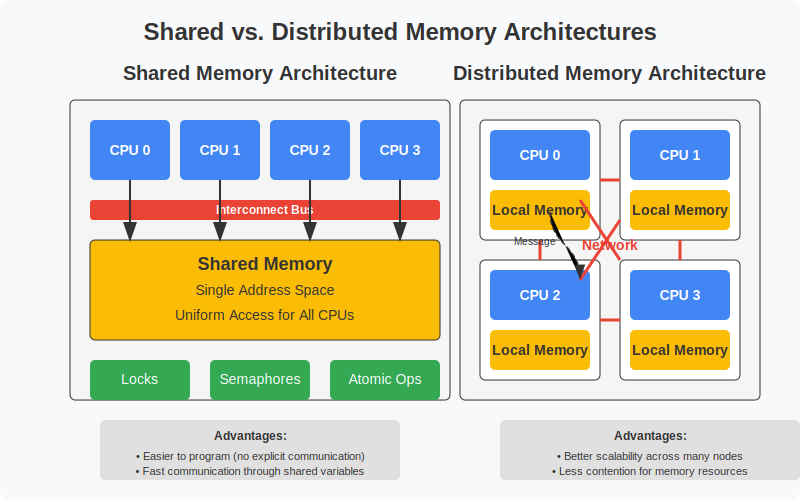

---

## Shared vs. Distributed Memory Architectures

### Shared Memory
- **Single address space** shared by all processors  
- Processors **directly read/write** shared variables  
- **Synchronization** through locks, semaphores, or atomic operations  

#### Example (Chapel)
```chapel
// Shared array across all threads
var A: [1..10] int;

// Parallel update (shared memory)
forall i in A.domain do
  A[i] = i * 2;
```
- `A.domain` refers to the index set of array `A`  
- This example runs in parallel with **shared access** to `A`

- **Advantages**  
  - Easier to program (no explicit communication)  
  - Fast communication via shared memory  

- **Challenges**  
  - Scalability limited by memory bandwidth  
  - Risk of contention and race conditions  

---

## Shared vs. Distributed Memory Architectures (Cont.)

### Distributed Memory
- Each processor has its **own private memory**  
- Communication happens via **explicit message passing** (e.g., MPI)  
- Synchronization through **message coordination**

#### Example (MPI-style pseudocode)
```c
// Each process computes a local result
local_A = compute_local_chunk();

// Send local results to process 0
MPI_Gather(local_A, global_A, root=0);
```

- **Advantages**  
  - Scales well across many nodes  
  - Clear data ownership  

- **Challenges**  
  - Requires explicit communication  
  - Higher latency and programming complexity  

---

## Hybrid Memory Architectures

### Hybrid Systems
- Combine **shared memory** (within nodes) and **distributed memory** (across nodes)  
- Typical in modern clusters and supercomputers  

#### Example: MPI + OpenMP  
- MPI distributes work across nodes  
- OpenMP runs threads on shared-memory within a node  

- **Advantages**  
  - Good **performance** and **scalability**  
  - Matches hierarchical hardware architectures  

- **Challenges**  
  - More complex programming  
  - Careful tuning needed for optimal performance  

---


## Orchestration in SPMD and Data Parallel Systems

- **SPMD orchestration**:
  - Global synchronization points (barriers)
  - Collective operations (gather, scatter, reduce)
  - Local computation phases

- **Example: MPI barrier synchronization**:
  ```
  // All processes compute locally
  local_result = compute_local_chunk();
  
  // Synchronize before communication
  MPI_Barrier(comm);
  
  // Exchange data
  MPI_Allgather(...);
  ``` 

---

## 6. Communication

### Communication in Parallel Programs

#### Purpose
- Exchange data between parallel tasks  
- Enable coordination and data sharing  

#### Types of Communication
- **Point-to-Point**  
  - Direct exchange between two tasks  
  - Examples: `MPI_Send`, `MPI_Recv`  
  - Can be **blocking** (synchronous) or **non-blocking** (asynchronous)  
  - Common in **nearest-neighbor** communication  

- **Collective**  
  - Involves a group of tasks working together  
  - Examples: broadcast, scatter, gather, reduce, all-to-all  
  - Often more **efficient** than multiple point-to-point operations  
  - Optimized with **tree-based algorithms** in libraries like MPI  

---

## 6. Communication (Cont.)

#### Types of Communication (Cont.)
- **One-Sided Communication**  
  - Direct remote memory access (RMA) without explicit participation by the target  
  - Examples: `MPI_Put`, `MPI_Get`, PGAS models (like Chapel)  
  - Reduces synchronization overhead  
  - Requires hardware/software support  

#### Performance Considerations
- **Latency**  
  - Time to initiate a communication  
  - Dominates small messages  
- **Bandwidth**  
  - Data transfer rate (bytes per second)  
  - Dominates large messages  
- **Contention**  
  - Congestion from multiple tasks communicating at once  
  - Lowers effective bandwidth and increases latency  

---

## Shared Memory Communication

### Mechanism
- Direct **read/write** access to shared variables  
- All threads/processes operate in a **common address space**  

### Advantages
- Simple programming model (easy to understand and implement)  
- **Low latency** data exchange  
- **Zero-copy**: No need to explicitly transfer data  

---

## Shared Memory Communication (Cont.)

### Challenges
- **Cache coherence overhead**  
  - Hardware ensures consistency between processor caches  
- **Synchronization required**  
  - To prevent race conditions when accessing shared data  
- **Limited scalability**  
  - Memory bandwidth becomes a bottleneck as the number of processors increases  
- **False sharing**  
  - Performance loss when threads modify different variables that reside on the same cache line  

### OpenMP Example
```c
#pragma omp parallel shared(result)
{
    // Each thread writes its result to a shared array
    result[omp_get_thread_num()] = compute();
}
```

---

## Message Passing Communication (MPI)

### Mechanism
- Communication through **explicit send/receive** operations  
- Processes have **private memory** and exchange data by messages  

### Characteristics
- Sender specifies **what to send** and **to whom**  
- Receiver provides **buffer** to store incoming data  
- Can be **synchronous** (blocking) or **asynchronous** (non-blocking)  

---

## Message Passing Communication (MPI) (Cont.)

### Communication Types
- **Point-to-Point**  
  - Direct exchange between specific processes  
  - Examples: `MPI_Send`, `MPI_Recv`  

- **Collective**  
  - Involves all processes in a group  
  - Examples: broadcast, scatter, gather, reduce  

### MPI Example (Point-to-Point)
```c
// Process 0 sends data to process 1
if (rank == 0) {
    MPI_Send(data, size, MPI_INT, 1, tag, comm);
} else if (rank == 1) {
    MPI_Recv(buffer, size, MPI_INT, 0, tag, comm, &status);
}
```

---

## Communication Patterns in SPMD Programs

- **Common patterns**:
  - **Broadcast**: One-to-all distribution
    - *Single process sends identical data to all other processes*
    - *Optimized implementations use tree-based algorithms*
    - *Examples: Distributing input parameters, configuration data*
  
  - **Scatter**: Divide and distribute data
    - *Root process divides data into chunks and sends each chunk to a different process*
    - *Each process receives distinct portion of the data*
    - *Example: Distributing array elements for parallel processing*
  
  - **Gather**: Collect distributed data
    - *Each process sends its local data to a root process*
    - *Root combines the data in a predetermined order*
    - *Example: Collecting partial results for final output*
  
  - **All-to-all**: Every process sends to every other
    - *Each process communicates with all other processes*
    - *Highest communication volume of all patterns*
    - *Examples: Matrix transpose, some FFT implementations*
  
  - **Reduction**: Combine data with operation (sum, max, etc.)
    - *Values from all processes combined using specified operation*
    - *Usually implemented as a tree-based algorithm*
    - *Examples: Finding global sum, global maximum, global minimum*
  
  - **Stencil/neighbor**: Exchange with adjacent processes
    - *Communication only between logically adjacent processes*
    - *Often used in grid/mesh-based computations*
    - *Examples: Finite difference methods, ghost/halo cell exchange*

- **Impact on performance**:
  - Communication pattern selection affects scalability
  - Different hardware may favor different patterns
  - Network topology can significantly influence performance

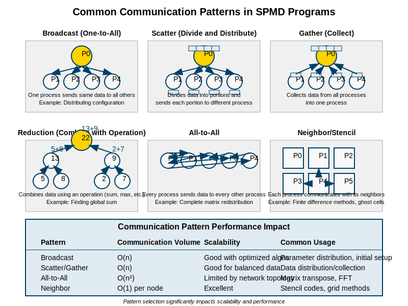

---

## Communication Overhead and Minimizing It

### Sources of Overhead
- **Latency**  
  - Time to initiate communication (setup time)  
- **Limited Bandwidth**  
  - Maximum data transfer rate  
- **Contention**  
  - Multiple tasks compete for communication channels  
- **Synchronization Delays**  
  - Waiting for coordination between tasks  
- **Protocol Processing**  
  - Extra time spent handling communication protocols  

---

## Communication Overhead and Minimizing It (Cont.)

### Minimization Strategies
- **Reduce communication frequency**  
  - Communicate only when necessary  
- **Batch communications**  
  - Group messages to minimize overhead (coarser granularity)  
- **Overlap communication with computation**  
  - Perform communication and useful work simultaneously  
- **Use asynchronous communication**  
  - Avoid blocking on message transfers  
- **Optimize data layouts**  
  - Arrange data to reduce the amount and frequency of communication  

---

## Example – Parallel Matrix Multiplication Communication

### 1D Decomposition (Row-Based)
- Each process owns a **block of rows**  
- All processes need the **entire second matrix (B)** to compute their part  
- Requires a **collective broadcast** of matrix B to all processes  

#### Communication Volume  
- O(n²), because each process requires a full copy of B 

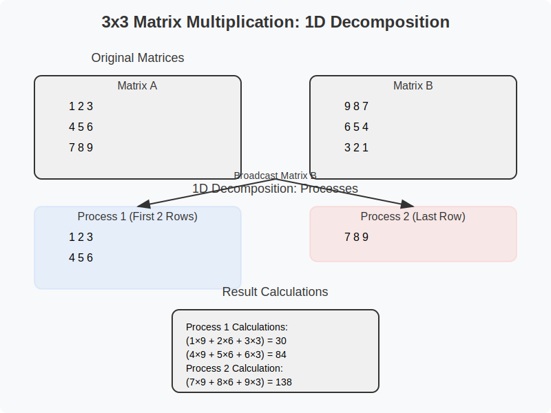

---

## Example – Parallel Matrix Multiplication Communication (Cont.)

### 2D Decomposition (Block-Based)
- Each process owns a **submatrix block**  
- Communication happens **along rows and columns** of the process grid  
- Reduces data exchange compared to 1D decomposition  

#### Communication Volume  
- O(n² / √p), where **p** is the number of processors  
- More scalable than 1D decomposition for large **p**  

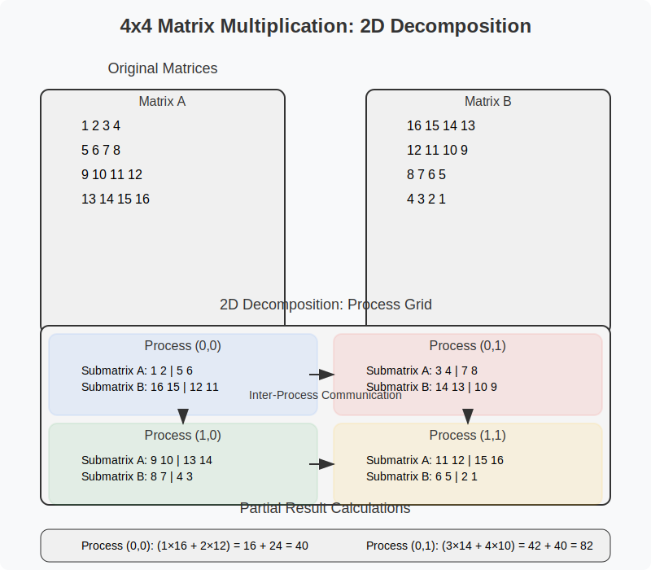

---

## 7. Performance and Efficiency

### How Do We Measure Performance?

- **Key metrics**:
  - **Speedup**: Performance gain vs. sequential
  - **Efficiency**: How well we use the processors
  - **Scalability**: Performance behavior as processors increase

- **Formulas**:
  - Speedup(n) = T₁ / Tₙ
  - Efficiency(n) = Speedup(n) / n
  - Cost = n × Tₙ

- **Performance comparison**:
  - Strong scaling: Fixed problem size
  - Weak scaling: Problem size grows with processors

---

## Performance Metrics in Parallel Computing

- **Speedup**: How much faster the parallel version is
  - *Absolute speedup*: Serial time / parallel time
  - *Relative speedup*: Best serial time / parallel time
  - *Ideal speedup*: Linear (Sp = p) - rarely achieved

- **Efficiency**: How well processors are utilized
  - *Efficiency = Speedup / Number of processors*
  - *Values range from 0 to 1 (or 0% to 100%)*
  - *Lower efficiency indicates resource underutilization*

- **Scalability**: How performance changes with system size
  - *Strong scaling*: Fixed problem size, increasing processors
  - *Weak scaling*: Increasing both problem size and processors
  - *Typically measured with efficiency at different scales*

- **Theoretical limits**:
  - *Amdahl's Law*: Speedup limited by sequential portion
    - *Speedup ≤ 1/(s + (1-s)/p) where s is sequential fraction*
  - *Gustafson's Law*: Scaled speedup with larger problems
    - *Scaled Speedup = p - α(p-1) where α is sequential fraction*

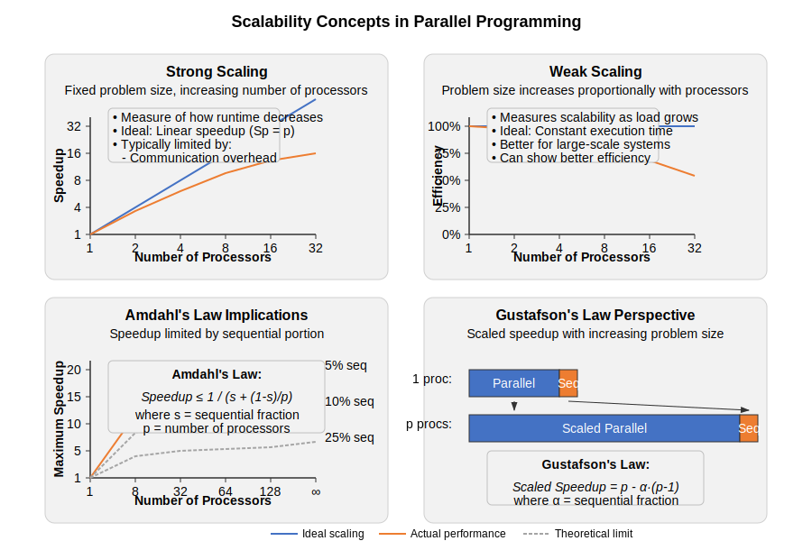

---

## Speedup and Efficiency Defined

- **Speedup**: 
  - Ratio of sequential time to parallel time
  - Speedup(n) = T₁ / Tₙ
  - Ideal speedup = n (linear)

- **Efficiency**: 
  - Ratio of speedup to number of processors
  - Efficiency(n) = Speedup(n) / n
  - Ideal efficiency = 1 (100%)

- **Factors affecting speedup**:
  - Serial portions
  - Communication overhead
  - Load imbalance
  - Resource contention

---

## Amdahl's Law

- **Formula**: Speedup(n) = 1 / (s + p/n)
  - s = serial fraction
  - p = parallel fraction (1-s)
  - n = number of processors

- **Key insight**: Serial portion limits maximum speedup
  - With 10% serial code (s=0.1), max speedup is 10x
  - With 1% serial code (s=0.01), max speedup is 100x

- **Implications**:
  - Focus on reducing serial portions
  - Diminishing returns with more processors

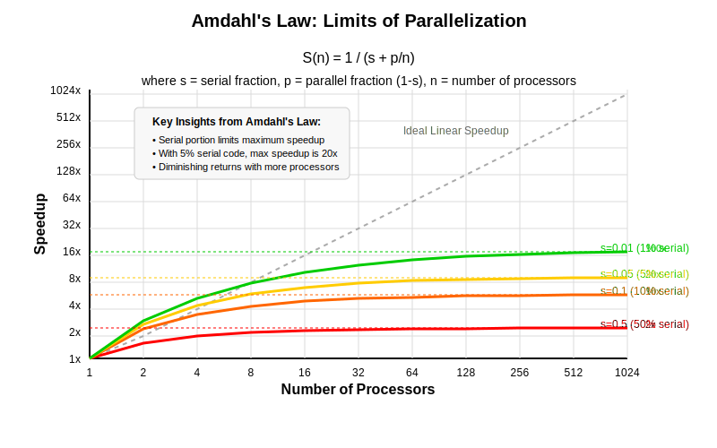

---

## Gustafson's Law

- **Alternative scaling view**:
  - Amdahl's assumes fixed problem size
  - Gustafson assumes problem size grows with processors

- **Formula**: Speedup(n) = n - s × (n - 1)
  - s = serial fraction
  - n = number of processors

- **Key insight**: Larger problems can achieve better speedup
  - Parallel portion grows with problem size
  - Serial portion stays relatively constant

- **Weak scaling**: Problem size per processor stays constant

---

## Load Imbalance and Overheads

- **Load imbalance**:
  - Some processors finish early, wait for others
  - Efficiency loss = (Tmax - Tavg) / Tmax
  - Caused by: uneven data distribution, variable task complexity

- **Parallel overhead**:
  - Communication
  - Synchronization
  - Task management
  - Contention for shared resources

- **Total parallel time**: T_parallel = T_computation + T_overhead

---

## Optimizing Parallel Program Performance

- **Minimize communication**:
  - Increase computation/communication ratio
  - Use bulk transfers
  - Optimize data placement

- **Reduce synchronization points**:
  - Eliminate unnecessary barriers
  - Use asynchronous operations
  - Relax synchronization requirements when safe

- **Improve data locality**:
  - Cache-friendly data layouts
  - Memory-hierarchy-aware algorithms

- **Load balancing techniques**:
  - Dynamic work distribution
  - Over-decomposition
  - Work stealing

---

## Profiling and Analyzing Performance Bottlenecks

- **Tools**:
  - Timing instrumentation
  - Hardware performance counters
  - Parallel profilers (Intel VTune, NVIDIA NSight, TAU)
  - Communication analyzers (Vampir, Paraver)

- **What to look for**:
  - Load imbalance
  - Excessive synchronization
  - Communication hotspots
  - Memory access patterns
  - Cache behavior

---

## 8. Common Parallel Programming Patterns

### Parallel Loops (SPMD Example)

- **Essence**: Independent loop iterations executed in parallel
- **When to use**: No dependencies between iterations
- **OpenMP example**:
  ```c
  #pragma omp parallel for
  for (int i = 0; i < N; i++) {
    results[i] = process(data[i]);
  }
  ```

- **MPI example**:
  ```c
  int chunk_size = N / num_procs;
  int start = rank * chunk_size;
  int end = (rank == num_procs-1) ? N : (rank+1) * chunk_size;
  
  for (int i = start; i < end; i++) {
    results[i] = process(data[i]);
  }
  ```

---

## Map-Reduce Pattern

- **Two phases**:
  - **Map**: Apply function to each data element (parallel)
  - **Reduce**: Combine results with associative operation

- **Example: Word count**:
  ```
  // Map phase (parallel)
  for each document in partition:
    for each word in document:
      emit(word, 1)
      
  // Reduce phase (parallel per key)
  for each unique word:
    count = sum(all 1's for this word)
    emit(word, count)
  ```

- **Properties**: Simple, scalable, fault-tolerant

---

## Fork-Join Model

- **Pattern**:
  - Main thread forks into multiple parallel tasks
  - Tasks execute concurrently
  - All tasks join (synchronize) at a barrier
  - Main thread continues

- **Example: OpenMP parallel sections**:
  ```c
  #pragma omp parallel sections
  {
    #pragma omp section
    { task_A(); }
    
    #pragma omp section
    { task_B(); }
    
    #pragma omp section
    { task_C(); }
  }
  // Implicit barrier here
  ```

- **When to use**: Heterogeneous tasks with barrier synchronization

---

## Pipeline Parallelism

- **Pattern**:
  - Split computation into ordered stages
  - Different data elements at different stages
  - Output of one stage is input to next

- **Example: Video processing**:
  ```
  Stage 1: Read video frame
  Stage 2: Apply filter
  Stage 3: Detect features
  Stage 4: Encode and save
  ```

- **Throughput**: Limited by slowest stage
- **Latency**: Sum of all stage processing times
- **When to use**: Stream processing, producer-consumer

---

## Example - Parallel Search Algorithm

- **Task**: Find element in unsorted array
- **Serial approach**: Linear scan
- **Parallel approach**:
  - Divide array into chunks
  - Each processor searches its chunk
  - If found, signal other processors to stop

- **Challenges**:
  - Early termination mechanism
  - Load balancing
  - Handling multiple matches

- **Speedup**: Nearly linear for large arrays

---

## Example - Parallel Sorting Algorithm

- **Parallel quicksort**:
  - Partition around pivot (serial or parallel)
  - Recursively sort subarrays in parallel
  - No merge step needed

- **Parallel merge sort**:
  - Divide array (serial or parallel)
  - Sort subarrays in parallel
  - Merge results (parallel merge possible)

- **Considerations**:
  - Communication overhead
  - Load balancing (pivot selection)
  - Cutoff to serial algorithm for small arrays

---

## Combining Patterns for Complex Applications

- **Example: Image processing pipeline**:
  - **Map pattern**: Process chunks of image in parallel
  - **Pipeline pattern**: Input → Filter → Analyze → Output
  - **Reduction pattern**: Aggregate analysis results

- **Benefits of combined patterns**:
  - Exploit different forms of parallelism
  - Better resource utilization
  - Handle different parallelism granularities

- **Implementation approach**:
  - Identify pattern for each application component
  - Compose patterns with appropriate interfaces
  - Consider overall synchronization and data flow

---

## 9. Case Study: End-to-End Parallel Program

### Real-World Problem Setup

- **Problem**: Large image dataset processing
- **Operations**:
  - Load images
  - Apply multiple filters
  - Extract features
  - Classify images
  - Aggregate statistics

- **Constraints**:
  - 100,000+ high-resolution images
  - Process within reasonable time
  - Utilize multi-core and multi-node environment

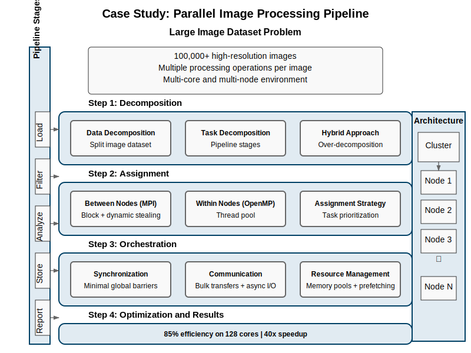

---

## Step 1: Decompose the Problem

- **Data decomposition**:
  - Split image dataset across nodes
    - *Distribute chunks of images across compute nodes*
    - *Can be done statically (equal portions) or dynamically (work queue)*
  - Further split within nodes to threads
    - *Each thread processes individual images or image tiles*
    - *Memory-conscious splitting to maximize cache utilization*

- **Task decomposition**:
  - Separate pipeline stages
    - *Input/output handling tasks*
    - *Image processing tasks*
    - *Analysis and classification tasks*
  - Specialized tasks for I/O, processing, analysis
    - *I/O threads to hide disk latency*
    - *Compute threads for CPU-intensive operations*
    - *Communication threads for network operations*

- **Hybrid approach**:
  - Data parallelism for image processing
    - *Process multiple images simultaneously*
    - *Process image regions in parallel*
  - Task parallelism for pipeline stages
    - *Different operations proceed in parallel*
    - *Producer-consumer relationships between stages*
  - Over-decomposition for load balancing
    - *Create more tasks than processors*
    - *Enables dynamic scheduling and better resource utilization*

---

## Step 2: Assign the Work

- **Between nodes (MPI)**:
  - Block distribution of images
    - *Initial static assignment of image sets to nodes*
    - *Each node gets a contiguous block of images*
  - Dynamic work stealing for better balance
    - *Nodes that finish early can request more work*
    - *Centralized master or distributed stealing protocols*
    - *Reduces impact of node-to-node performance variation*

- **Within nodes (OpenMP/threads)**:
  - Thread pool for image processing
    - *Persistent threads to avoid creation/destruction overhead*
    - *Task-based parallelism with work queues*
    - *Each thread processes multiple images over its lifetime*
  - Dedicated threads for I/O and communication
    - *Separate I/O threads prevent compute stalls*
    - *Prefetching to hide latency*
    - *Background communication threads for node coordination*

- **Assignment strategy**:
  - Initial static assignment
    - *Start with even distribution based on node capabilities*
    - *Accounts for known image size variations if available*
  - Work-stealing queue for dynamic balancing
    - *Double-ended queues for efficient stealing*
    - *Local LIFO, remote FIFO access patterns*
  - Priority for memory-intensive tasks
    - *Schedule memory-heavy tasks when bandwidth available*
    - *Group similar tasks to improve cache behavior*

---

## Step 3: Orchestrate Tasks

- **Synchronization strategy**:
  - Minimal global barriers
    - *Use only at major phase transitions if necessary*
    - *Prefer asynchronous coordination where possible*
  - Local synchronization through queues
    - *Producer-consumer queues between pipeline stages*
    - *Lock-free queues for high-throughput transfers*
  - Atomic operations for counters
    - *Track progress and completed work*
    - *Update statistics without locks when possible*

- **Communication patterns**:
  - Bulk transfers of image batches
    - *Aggregate multiple images for efficient network transfers*
    - *Amortize communication overhead across many images*
  - Reduce operation for aggregating results
    - *Hierarchical reduction for statistical results*
    - *Tree-based communication to minimize network contention*
  - Asynchronous I/O operations
    - *Non-blocking reads/writes to overlap I/O with computation*
    - *Double-buffering for continuous pipeline flow*

- **Resource management**:
  - Memory pools to reduce allocation overhead
    - *Pre-allocated buffers for images of similar sizes*
    - *Recycling of memory to avoid fragmentation*
  - Prefetching to hide I/O latency
    - *Read ahead for sequential image access patterns*
    - *Predictive prefetching based on processing order*

---

## Step 4: Optimize and Analyze

- **Initial performance**:
  - 60% efficiency on 128 cores
    - *Decent but not optimal resource utilization*
    - *Significant room for improvement*
  - I/O bottlenecks identified
    - *Disk access patterns causing contention*
    - *Network congestion during result collection*
  - Load imbalance during feature extraction
    - *Variable complexity of different images*
    - *Some nodes consistently finishing early*

- **Optimizations applied**:
  - Improved I/O with prefetching
    - *Added dedicated prefetch threads*
    - *Implemented image compression for network transfers*
  - Better work distribution algorithm
    - *Switched to work-stealing with history-based initial assignment*
    - *Implemented work chunking for better granularity control*
  - Memory layout optimization for cache utilization
    - *Reorganized image data for better spatial locality*
    - *Aligned buffers to cache line boundaries*

- **Final performance**:
  - 85% efficiency on 128 cores
    - *Significant improvement from optimizations*
    - *Most cores kept busy throughout execution*
  - Near-linear scaling up to 64 cores
    - *Almost perfect speedup until communication becomes significant*
  - 40x overall speedup
    - *From hours to minutes for the full dataset*

---

## Lessons Learned from the Case Study

- **Success factors**:
  - Hybrid decomposition approach
    - *Combined different parallelism types for maximum efficiency*
    - *Matched decomposition to problem characteristics*
  - Adaptive work assignment
    - *Dynamic adjustment prevented processor starvation*
    - *Handled unpredictable image processing times*
  - Minimizing global synchronization
    - *Local coordination reduced waiting time*
    - *Pipeline structure maintained continuous flow*
  - Careful attention to I/O and memory patterns
    - *Often the real bottleneck in data-intensive applications*
    - *Optimization focused on system-level performance*

- **Bottlenecks encountered**:
  - I/O subsystem limitations
    - *Disk bandwidth shared across processes*
    - *Network congestion during result collection*
  - Memory bandwidth contention
    - *Multiple cores competing for memory access*
    - *Cache thrashing with naive data layouts*
  - Global reduction operations
    - *Synchronization points causing idle time*
    - *Network topology affecting communication performance*
  - Task granularity tuning
    - *Finding optimal balance between overhead and parallelism*
    - *Required extensive experimentation and measurement*

- **General insights**:
  - No one-size-fits-all pattern
    - *Problem-specific considerations dominate*
    - *Combination of patterns often needed*
  - Multiple levels of parallelism needed
    - *Nodes, cores, vector units all contribute*
    - *Different strategies at each level*
  - Measurement and iteration are essential
    - *Performance analysis drove optimization decisions*
    - *Continuous refinement process yielded best results*

---

## 10. Parallel Programming Models and Tools

### Shared Memory Programming with OpenMP

- **Directive-based approach** for C, C++, Fortran
- **Programming model**:
  - Fork-join parallelism
  - Shared memory with thread-private variables
  - Implicit/explicit synchronization

- **Example: Parallel for loop**:
  ```c
  #pragma omp parallel for
  for (int i = 0; i < N; i++) {
    result[i] = compute(data[i]);
  }
  ```

- **Strengths**: Easy to adopt, incremental parallelization
- **Limitations**: Single node, limited control

---

## Distributed Memory Programming with MPI

- **Message Passing Interface** standard
- **Programming model**:
  - SPMD with explicit messaging
  - Process-private memory
  - Explicit synchronization and data exchange

- **Example: Point-to-point communication**:
  ```c
  if (rank == 0) {
    MPI_Send(data, count, MPI_DOUBLE, 1, tag, comm);
  } else if (rank == 1) {
    MPI_Recv(data, count, MPI_DOUBLE, 0, tag, comm, &status);
  }
  ```

- **Strengths**: Scalable, portable, full control
- **Limitations**: Complex programming, explicit data management

---

## PGAS Languages: UPC, Chapel, and X10

- **Partitioned Global Address Space** model
- **Key concept**: 
  - Global memory space logically partitioned
  - Each portion has affinity to a processor
  - Global references with locality awareness

- **Example: Chapel distributed array**:
  ```chapel
  const D = {1..n} dmapped Block(boundingBox={1..n});
  var A: [D] real;
  
  forall i in D do
    A[i] = compute(i);
  ```

- **Strengths**: Simplified distributed programming, locality control
- **Limitations**: Performance tuning complexity, limited adoption

---

## GPU Programming with CUDA and SPMD

- **CUDA**: NVIDIA's GPU programming model
- **Core concepts**:
  - Kernels launch thousands of threads
  - Thread hierarchy (grids, blocks, threads)
  - Heterogeneous memory spaces

- **Example: CUDA kernel**:
  ```c
  __global__ void vectorAdd(float *A, float *B, float *C, int n) {
    int i = blockIdx.x * blockDim.x + threadIdx.x;
    if (i < n)
      C[i] = A[i] + B[i];
  }
  
  // Launch with N threads
  vectorAdd<<<(N+255)/256, 256>>>(A, B, C, N);
  ```

- **Strengths**: Massive parallelism, high performance
- **Limitations**: Complex memory model, vendor-specific

---

## Big Data Parallelism with Apache Spark

- **RDD (Resilient Distributed Dataset)** abstraction
- **Programming model**:
  - Functional transformations on distributed data
  - Lazy evaluation
  - Implicit data distribution and fault tolerance

- **Example: Word count in Spark**:
  ```scala
  val wordCounts = textFile
    .flatMap(line => line.split(" "))
    .map(word => (word, 1))
    .reduceByKey(_ + _)
  ```

- **Strengths**: Ease of use, fault tolerance, scalability
- **Limitations**: JVM overhead, not for fine-grained tasks

---

## Heterogeneous Parallelism with SYCL and OpenCL

- **Single-source heterogeneous programming**
- **Target devices**: CPUs, GPUs, FPGAs, custom accelerators
- **Programming model**:
  - C++ with parallel patterns
  - Device-neutral code
  - Runtime selection of compute devices

- **Example: SYCL vector addition**:
  ```cpp
  queue q;
  buffer<float> buf_a(a, range<1>(n));
  buffer<float> buf_b(b, range<1>(n));
  buffer<float> buf_c(c, range<1>(n));
  
  q.submit([&](handler& h) {
    auto a = buf_a.get_access<access::mode::read>(h);
    auto b = buf_b.get_access<access::mode::read>(h);
    auto c = buf_c.get_access<access::mode::write>(h);
    
    h.parallel_for(range<1>(n), [=](id<1> i) {
      c[i] = a[i] + b[i];
    });
  });
  ```

---

## When to Use Which Model?

- **Single node, shared memory**:
  - OpenMP for simplicity
  - Threading libraries for more control

- **Multiple nodes, distributed memory**:
  - MPI for performance and control
  - PGAS for productivity with locality control

- **GPU acceleration**:
  - CUDA for NVIDIA GPUs (best performance)
  - OpenCL/SYCL for vendor-neutral code

- **Big data processing**:
  - Spark for ease of use and fault tolerance
  - MPI+X for custom, high-performance needs

---

## Parallel Programming Models Comparison

- **Shared Memory**:
  - *Global address space accessible by all processors*
  - *Examples: OpenMP, Pthreads, C++/Java threads*
  - *Advantages: Easier programming, efficient data sharing*
  - *Limitations: Limited scalability, potential for race conditions*

- **Distributed Memory**:
  - *Separate address spaces connected via message passing*
  - *Examples: MPI, UPC*
  - *Advantages: Excellent scalability, clear data ownership*
  - *Limitations: Higher complexity, explicit communication*

- **Hybrid**:
  - *Combines shared and distributed memory approaches*
  - *Examples: MPI+OpenMP, MPI+CUDA*
  - *Advantages: Maps well to modern HPC architectures*
  - *Limitations: Complex programming model, tuning challenges*

- **GPGPU/Accelerator**:
  - *Offloads computation to specialized hardware*
  - *Examples: CUDA, OpenCL, OpenACC*
  - *Advantages: Massive parallelism for specific workloads*
  - *Limitations: Memory transfer overhead, specialized programming*

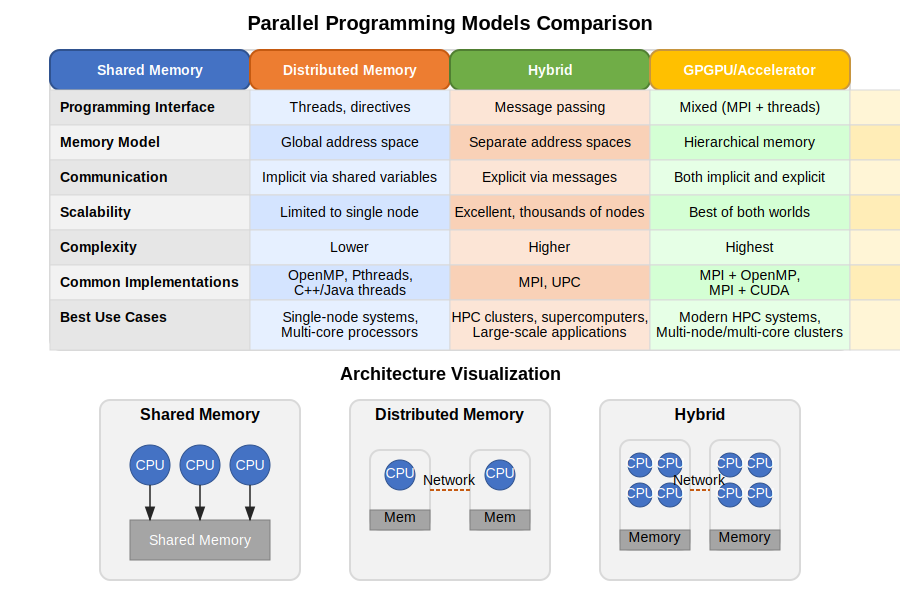

---

## 11. Advanced Topics

### Load Balancing Strategies

- **Static load balancing**:
  - Predetermined task distribution before execution
  - Block distribution: consecutive chunks to each process
  - Cyclic distribution: interleaved assignment (round-robin)
  - Good for homogeneous tasks/processors
  - Simple implementation with low overhead

- **Dynamic load balancing**:
  - Tasks assigned during runtime as processors become available
  - Work stealing: idle processors take work from busy ones
  - Centralized queue: central task pool for all processors
  - Better for irregular workloads and heterogeneous systems
  - Adds runtime overhead but improves resource utilization

- **Hybrid approaches**:
  - Combine static initial distribution with dynamic adjustments
  - Hierarchical strategies for different architecture levels
  - Example: static distribution between nodes, dynamic within nodes


---

## Scalability: Strong vs. Weak Scaling

- **Strong scaling**:
  - Fixed problem size
    - *Total amount of work remains the same as processors increase*
    - *Each processor gets less work as processor count grows*
    - *Goal: Solve the same problem faster with more processors*
  
  - Measure speedup as processors increase
    - *Ideal: Linear speedup (doubling processors halves execution time)*
    - *Reality: Sub-linear due to communication overhead and Amdahl's Law*
    - *Formula: Speedup(N) = T₁/T_N where T₁ is single-processor time and T_N is N-processor time*
  
  - Challenges: Communication overhead, Amdahl's law
    - *Communication costs grow relative to computation as work per processor shrinks*
    - *Serial portions become the dominant factor limiting performance*
    - *Eventually adding more processors yields diminishing or negative returns*

- **Weak scaling**:
  - Problem size increases with processors
    - *Work per processor remains constant as system scales*
    - *Total problem size grows linearly with processor count*
    - *Goal: Solve larger problems with more processors in the same time*
  
  - Each processor gets same amount of work
    - *Processor workload stays balanced as system grows*
    - *More practical for many real-world scenarios with large datasets*
  
  - Measure efficiency as processors increase
    - *Ideal: Constant execution time regardless of processor count (efficiency = 1.0)*
    - *Reality: Slight increase in time due to growing communication overhead*
    - *Formula: Efficiency(N) = T₁/(T_N) where T₁ is execution time on one processor and T_N is execution time on N processors*
  
  - Challenges: Memory scaling, increased communication
    - *Global communication operations often scale with log(N) or worse*
    - *Memory footprint must increase with problem size*
    - *May encounter system limitations as problem size grows*

- **Crossover point**: Where adding more processors hurts performance
  - *The number of processors beyond which performance degrades*
  - *Determined by problem characteristics, communication patterns, and hardware*
  - *Critical to identify for production deployments*

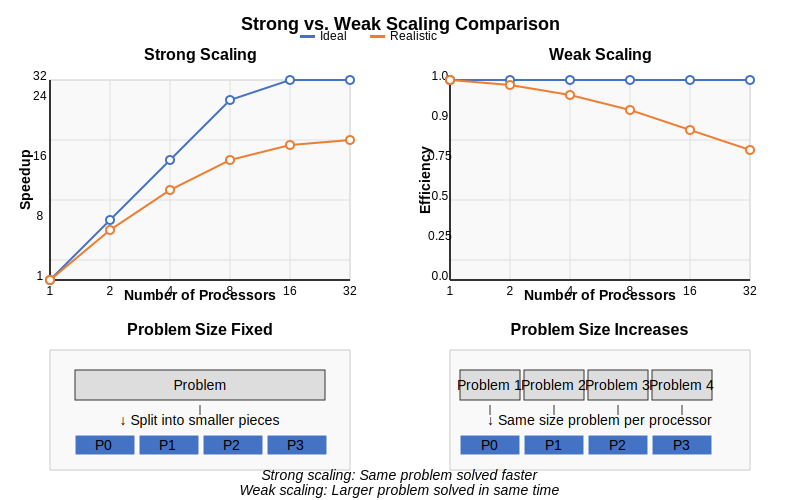

---

## Fault Tolerance in Parallel Systems

- **Why it matters**: Large systems have higher failure rates
- **Techniques**:
  - **Checkpointing**: Save state periodically
  - **Replication**: Multiple copies of tasks/data
  - **Message logging**: Record communication for replay
  - **Algorithm-based fault tolerance**: Exploit algorithm properties

- **Programming models support**:
  - Spark: Built-in resilience for RDDs
  - MPI: Fault tolerance extensions
  - Custom middleware for checkpointing

---

## Energy Efficiency in Parallel Computing

- **Growing concern** in high-performance computing
- **Hardware approaches**:
  - Dynamic voltage and frequency scaling
  - Power gating unused components
  - Heterogeneous computing (specialized accelerators)

- **Software approaches**:
  - Workload consolidation
  - Energy-aware scheduling
  - Algorithm redesign to reduce communication
  - Trading off performance for energy

- **Metrics**: FLOPS/watt, Energy Delay Product (EDP)

---

## Parallelism in the Cloud: Serverless and Autoscaling

- **Serverless computing model**:
  - Functions as building blocks
  - Automatic scaling
  - Event-driven parallelism

- **Auto-scaling services**:
  - Dynamic resource allocation
  - Horizontal vs. vertical scaling
  - Load-based triggers

- **Challenges**:
  - Stateless function limitations
  - Cold start overhead
  - Limited execution time
  - Resource allocation granularity

---

## Heterogeneous Parallelism (CPUs, GPUs, FPGAs, TPUs)

- **Diverse computing devices**:
  - CPUs: General purpose, complex cores
  - GPUs: Massively parallel, simpler cores
  - FPGAs: Reconfigurable hardware
  - TPUs/ASICs: Domain-specific acceleration

- **Programming challenges**:
  - Multiple programming models
  - Data movement overhead
  - Load balancing across different devices
  - Performance portability

- **Unified approaches**: OpenCL, SYCL, OneAPI, ROCm

---

## Future Trends: Quantum and Neuromorphic Computing

- **Quantum computing**:
  - Qubit-based systems
  - Quantum parallelism
  - Specialized algorithms (Shor's, Grover's)
  - Hybrid classical-quantum approaches

- **Neuromorphic computing**:
  - Brain-inspired architectures
  - Spiking neural networks
  - Low power, highly parallel
  - Event-driven processing

- **Impact on parallel programming**:
  - New programming models
  - Different decomposition strategies
  - Specialized algorithm designs

---

## 12. Wrap-Up

### Summary of Key Concepts

- **Parallel programming foundations**:
  - Decomposition: Breaking down problems
  - Assignment: Mapping tasks to processors
  - Orchestration: Coordinating execution
  - Communication: Exchanging data

- **Performance considerations**:
  - Amdahl's Law and scalability limits
  - Overhead vs. parallelism
  - Load balancing
  - Communication minimization

- **Programming models**: Choose based on application requirements

---

## Common Pitfalls to Avoid

- **Over-synchronization**: Unnecessary barriers and locks
  - *Adding too many synchronization points creates bottlenecks and reduces parallel efficiency*
  - *Example: Placing locks around operations that don't require protection*

- **Fine-grained parallelism** with high overhead
  - *When parallelism is too fine-grained, the management overhead exceeds the performance benefits*
  - *Example: Parallelizing tiny loops where thread creation costs more than the computation*

- **Ignoring locality**: Excessive remote memory access
  - *Remote memory access is significantly slower than local access in distributed systems*
  - *Failing to organize data for locality leads to performance degradation*

- **Over-optimistic scaling expectations**: Amdahl's Law
  - *Serial portions of your code fundamentally limit your maximum possible speedup*
  - *Even small serial fractions (1-5%) can severely restrict scaling at higher processor counts*

- **One-size-fits-all approach**: No universal solution
  - *Different problems require different parallelization strategies*
  - *Using the wrong pattern for your specific problem leads to suboptimal performance*

- **Premature optimization**: Measure before optimizing
  - *Optimizing without measurement often targets the wrong bottlenecks*
  - *Profile first to identify where time is actually being spent*

- **Ignoring serial bottlenecks**: Focus where it matters
  - *Per Amdahl's Law, optimizing parallel sections has diminishing returns if serial bottlenecks remain*
  - *A small serial bottleneck can negate benefits from even perfectly parallelized code*

- **Racing conditions and deadlocks**: Careful synchronization design
  - *Improper synchronization leads to data corruption or program freezes*
  - *Use higher-level synchronization constructs and validate concurrent code carefully*

---

## Further Learning Resources

- **Books**:
  - "Patterns for Parallel Programming" (Mattson, Sanders, Massingill)
  - "Programming Massively Parallel Processors" (Kirk, Hwu)
  - "Structured Parallel Programming" (McCool, Reinders, Robison)

- **Online courses**:
  - "Parallel Programming" on Coursera
  - "High Performance Computing" on edX

- **Documentation and tutorials**:
  - OpenMP, MPI, CUDA programming guides
  - Lawrence Livermore National Lab tutorials
  - Intel and NVIDIA developer resources 