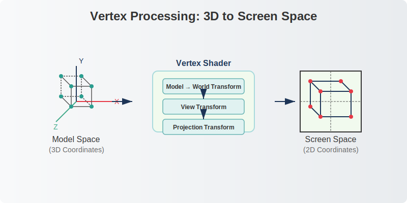
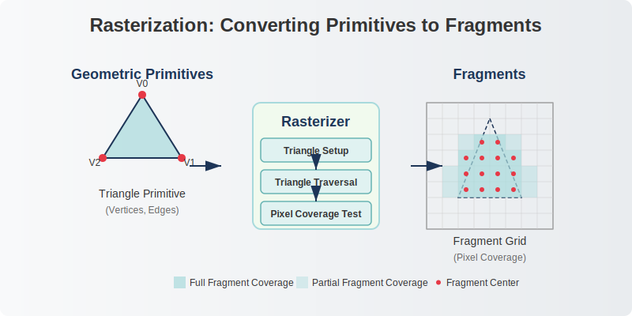
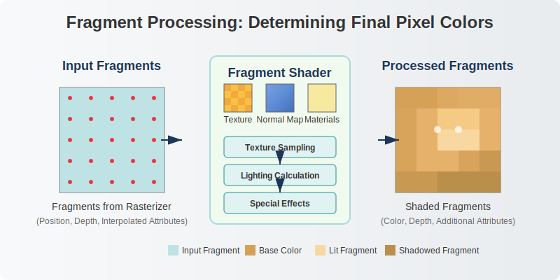
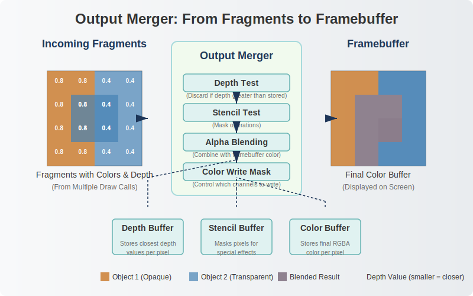
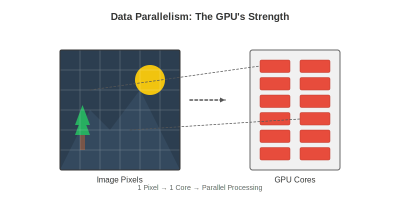
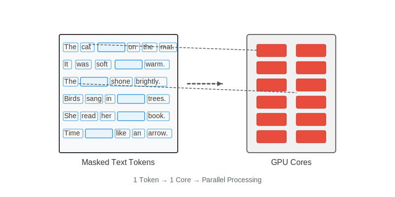
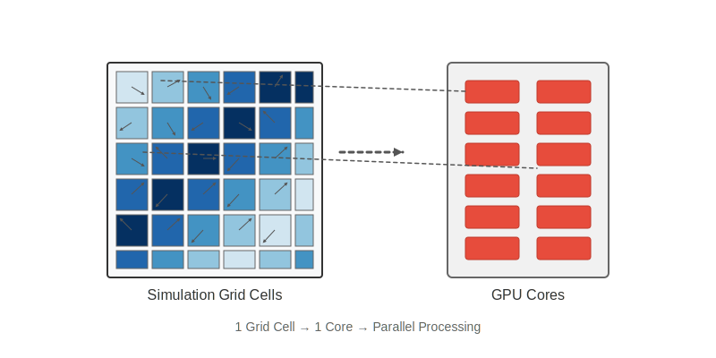
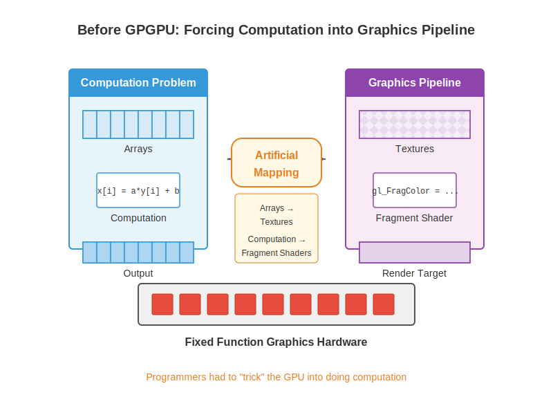

# Lecture 7: GPU Architecture & Programming

## GWU ECE 6125: Parallel Computer Architecture
### Armin Mehrabian
#### Spring 2025

---

# What is a GPU?

- **GPU** = Graphics Processing Unit
- Originally designed to accelerate **graphics rendering**
- Highly parallel architecture suited for:
  - Processing large blocks of visual data
  - Executing the same operation on many data elements

---

# CPU vs GPU: Architectural Differences

| CPU | GPU |
|-----|-----|
| Few powerful cores (4-32) | Many simple cores (100s-1000s) |
| Complex control logic | Simple control logic |
| Large caches | Small caches, high bandwidth memory |
| Optimized for sequential code | Optimized for parallel code |
| Branch prediction, out-of-order execution | In-order execution, massive threading |
| Low latency focus | High throughput focus |

---

# Brief History of GPUs

- **1980s–1990s**: Fixed-function graphics pipelines (2D blitters, VGA cards)
- **1999**: NVIDIA introduces the **GeForce 256**, marketed as the "world's first GPU"
  - Integrated transform and lighting (T&L) engines
  - Offloaded complex calculations from CPU to GPU
- **2001-2005**: Programmable shaders emerge (vertex, pixel)
- **2006-2007**: NVIDIA releases **CUDA**, enabling general-purpose computing on GPUs (GPGPU)
- **Today**: GPUs power graphics, AI/ML, scientific computing, cryptocurrency mining

---

# GPU Evolution: From Graphics to General Computing

| Era | Programming Model | Hardware Focus | Applications |
|-----|-----------------|----------------|-------------|
| Pre-2000 | Fixed-function | Graphics only | 3D games, CAD |
| 2000-2006 | Programmable shaders | Graphics pipeline | Advanced rendering |
| 2007-2012 | CUDA, OpenCL | General computing | HPC, simulations |
| 2013-present | Unified compute | Specialized units (Tensor cores) | AI/ML, ray tracing |

---

# Rendering: The Original GPU Job

Input: scene description (geometry, materials, lights)  
Output: image

## Traditional Graphics Pipeline
* **Vertex Processing**: Transform 3D coordinates to screen space
* **Rasterization**: Convert geometric primitives to fragments/pixels
* **Fragment Processing**: Calculate final color for each pixel
* **Output Merger**: Combine fragments with depth/stencil tests

---

# Graphics Pipeline: Detailed View

## 1. **Vertex Processing**
- Transforms vertex positions (Model → World → View → Projection)
- Calculates lighting per vertex
- Programmable via **vertex shaders**



---

## 2. **Rasterization**
- Converts triangles to pixel fragments
- Interpolates vertex attributes across triangle surface
- Mostly fixed-function hardware



---

## 3. **Fragment Processing**
- Determines final color for each pixel
- Applies textures, lighting models, effects
- Programmable via **fragment/pixel shaders**



---

## 4. **Output Merging**
- Depth testing (which pixels are visible)
- Blending (transparency handling)
- Writes final color to framebuffer



---

# Shader Programs: The Key to GPU Flexibility

**What are shaders?**
- Small programs that run on the GPU
- Each program instance processes one data element (vertex, pixel)
- All instances execute same code on different data (SIMD)
- Originally for graphics, now generalized for computation

**Key shader types:**
- Vertex shaders
- Fragment/pixel shaders
- Compute shaders (general purpose)

---

# Data Parallelism: The GPU's Strength

**Shader programs execute the same code on different data:**

* Same vertex shader runs on every vertex in parallel
* Same fragment shader runs on every pixel in parallel
* Perfect example of **SIMD** (Single Instruction, Multiple Data)
* Each shader instance is independent with its own data
* Enables massive parallelism across thousands of processors




---

# The Birth of GPGPU: Graphics Cards for Computation

## Early Realization (~2001-2005)
> "GPUs are fast because they run the same function on many data elements in parallel"

---

## Challenge
How to use graphics cards for non-graphics calculations?

## Early Approach
Map computation problems to graphics concepts:
- Arrays → Textures
- Computation → Fragment Shaders
- Output → Render targets




---

# Hacky GPGPU: Before Dedicated Compute APIs

```cpp
// To process a 512x512 array:
1. Create a 512x512 texture containing input data
2. Render a fullscreen quad (two triangles)
3. Run fragment shader on every pixel:
   fragment_program() {
     // Access input from texture
     // Perform computation
     // Output result as pixel color
   }
4. Read back the resulting framebuffer
```

Computation disguised as graphics rendering!

---

# Early GPGPU Applications (2002-2006)

## Scientific Computing
- N-body simulations
- Fluid dynamics
- Wave equations
- Linear algebra

## Signal & Image Processing
- Convolution filters
- Fourier transforms
- Image recognition
- Video encoding

## Data Analysis
- Database operations
- Pattern matching
- Financial modeling

      
---

# Brook: First GPU Stream Programming (Stanford, 2004)

- One of the first high-level GPGPU programming models
- Introduced **stream programming** paradigm:
  - Streams = collections of data elements
  - Kernels = functions applied to streams

**Note:** In Brook, streams (denoted with `<>`) are arrays where each element is processed in parallel across GPU cores.

```cpp
// A simple kernel to scale values in a stream
kernel void scale(float amount, float a<>, out float b<>) {
  // 'kernel' keyword: Defines a function that runs in parallel on the GPU
  // 'void': The function doesn't return a value
  // 'amount': A scalar input parameter (single value shared by all executions)
  // 'float a<>': Input stream (array) of floating-point values
  // 'out float b<>': Output stream (array) that will hold results
  
  // This single line executes in parallel for each element in the stream
  // Each thread/instance processes one element from 'a' and writes to 'b'
  b = amount * a;  // Apply scaling to each element
}

// Kernel invocation
// 'scale_amount': Scalar value passed to all stream elements
// 'input_stream': Source data array to be processed
// 'output_stream': Destination array for results
// This launches many parallel executions across the GPU
scale(scale_amount, input_stream, output_stream);
```

---

# CUDA: A Turning Point in GPU Computing (2007)

## What is CUDA?
- **C**ompute **U**nified **D**evice **A**rchitecture
- First mainstream GPU computing platform
- Developed by NVIDIA for their GPUs

## Key Innovations
- Direct GPU programming (no graphics API required)
- C-like programming model
- Explicit parallel thread management
- Hierarchical memory model
- Access to full GPU capabilities

---

# CUDA Programming Model: Core Concepts

## Kernels
- Functions that run on the GPU
- Launched from CPU (host) to run on GPU (device)
- Execute in parallel across many threads

## Thread Hierarchy
- **Thread**: Single execution unit
- **Block**: Group of threads that can cooperate
- **Grid**: Array of blocks for a kernel launch

## Memory Hierarchy
- **Global Memory**: Accessible by all threads
- **Shared Memory**: Fast memory shared within a block
- **Local/Register**: Private to each thread


*Source: [https://modal-cdn.com/gpu-glossary/terminal-cuda-programming-model.svg](https://modal-cdn.com/gpu-glossary/terminal-cuda-programming-model.svg)*


---

# CUDA Thread Organization

Threads are organized in a hierarchical structure:


*Source: [https://upload.wikimedia.org/wikipedia/commons/a/af/Software-Perspective_for_thread_block.jpg](https://upload.wikimedia.org/wikipedia/commons/a/af/Software-Perspective_for_thread_block.jpg)*

- **Threads**: Individual execution units
- **Blocks**: Groups of up to 1024 threads
  - Can share memory and synchronize
  - Run on a single SM (Streaming Multiprocessor)
  
- **Grid**: Collection of blocks
  - Can be arranged in 1D, 2D, or 3D
  - Blocks execute independently

--- 
# GPU Warps: Basic Concepts

## What Are Warps?
- A **warp** is a fundamental execution unit of 32 threads (on NVIDIA GPUs)
  - This is the smallest unit of threads that are scheduled together
  - AMD GPUs use "wavefronts" with 64 threads, but the concept is identical
- All threads in a warp execute the **same instruction simultaneously**
  - When one thread executes an add, all 32 threads execute that same add
  - Each thread operates on its own data (SIMD parallelism)
- Warps are the unit of scheduling on Streaming Multiprocessors (SMs)
  - GPUs don't schedule individual threads; they schedule entire warps
  - Each SM can have multiple active warps at any given time

## Warp Execution
- If one thread in a warp stalls, the entire warp stalls
  - All 32 threads must wait for the slowest thread
  - This is why thread divergence is so costly
- Hardware maintains a "thread mask" that tracks which threads are active
  - Allows masked execution for branches and predication
  - Inactive threads don't commit results during predicated instructions

---

# GPU Warps: Why They Exist

## Hardware Efficiency
- **Instruction Processing Efficiency**: One instruction fetch/decode serves 32 threads
  - Greatly reduces hardware complexity and power consumption
  - Single instruction decoder can feed many execution units
- **SIMT Implementation**: Enables Single Instruction, Multiple Thread execution
  - Combines flexibility of threads with efficiency of SIMD
  - Allows for control flow (if/else, loops) unlike pure SIMD
- **Control Overhead Reduction**: Control logic is amortized across many threads
  - PC (program counter), instruction decode, etc., shared across 32 threads
  - Much more efficient than having independent control logic per thread

## Execution Benefits
- **Context Switching**: Zero-overhead switching between warps when one stalls
  - When a warp hits a long-latency operation (e.g., memory load), SM switches to another warp
  - No register saving/restoring like CPU thread switching
  - Masks memory latency with computation from other warps
- **Resource Sharing**: Threads in a warp can share resources without explicit synchronization
  - Threads in same warp are always at same point in execution
  - Simplifies execution model and hardware design

---

# GPU Warps: Performance Implications


*Source: [https://doimages.nyc3.cdn.digitaloceanspaces.com/010AI-ML/content/images/2024/08/image-7.png](https://doimages.nyc3.cdn.digitaloceanspaces.com/010AI-ML/content/images/2024/08/image-7.png)*

---


- **Warp Scheduling**: Warp scheduler selects warps for execution based on their readiness, aiming to maximize GPU utilization.
- **Latency Hiding**: Hide instruction latency by switching between warps, ensuring that the GPU cores remain active while some warps wait for data.
- **Efficient Execution**: Important to have multiple active warps to effectively hide latencies and maintain high throughput in GPU computations. 

*Source: [https://doimages.nyc3.cdn.digitaloceanspaces.com/010AI-ML/content/images/2024/08/image-13.png](https://doimages.nyc3.cdn.digitaloceanspaces.com/010AI-ML/content/images/2024/08/image-13.png)*

---

## Thread Divergence Impact
- **Thread Divergence Penalty**: Conditional branches within a warp cause serialization
  - When threads take different paths (e.g., if/else), both paths must be executed
  - Performance drops proportionally to the number of different paths
  ```cpp
  // Example of divergent code (BAD):
  if (threadIdx.x % 2 == 0) {   // Even vs odd threads diverge
      result = doExpensiveCalculation();
  } else {
      result = doAnotherExpensiveCalculation();
  }
  // Both calculations execute sequentially, wasting 50% efficiency
  ```
---

## Memory Access Patterns
- **Memory Coalescing Benefit**: Aligned memory access patterns maximize throughput
  - When threads in a warp access adjacent memory, requests combine into fewer transactions
  - Accessing 32 consecutive float values can be as fast as accessing a single value
  - Non-coalesced access can reduce bandwidth by up to 32x
  ```cpp
  // Coalesced (GOOD):            // Non-coalesced (BAD):
  int idx = threadIdx.x;          int idx = threadIdx.x * 32;
  float val = data[blockIdx.x *   float val = data[threadIdx.x]; 
                blockDim.x + idx];
  ```
---

## Execution Optimization
- **Warp-Level Synchronization**: Threads within a warp are implicitly synchronized
  - No need for explicit barriers for intra-warp communication
  - Enables warp-level primitives like `__shfl()` for fast data exchange
- **Occupancy Considerations**: Higher number of active warps hides latency better
  - More warps = more opportunities to hide memory latency
  - But limited by register and shared memory usage
  - Finding the optimal balance is key to high performance

---

# CUDA Thread Mapping: 3D Indexing

## Comprehensive Indexing System
- CUDA supports up to 3D indexing for both grids and blocks
- Each thread identified by a unique combination of coordinates
- Built-in variables (`threadIdx`, `blockIdx`, `blockDim`, `gridDim`)
- Can calculate global ID from multi-dimensional coordinates

## Accessing Thread Position
```cpp
// Convert 3D position to global linear index
int globalIdx = (blockIdx.z * gridDim.y * gridDim.x + 
                 blockIdx.y * gridDim.x + 
                 blockIdx.x) * (blockDim.x * blockDim.y * blockDim.z) +
                (threadIdx.z * blockDim.y * blockDim.x + 
                 threadIdx.y * blockDim.x + 
                 threadIdx.x);
```

---
# 2D Thread Indexing Example


## Grid and Block Structure
- Grid: 5×4×1 (5 blocks in x, 4 in y)
- Each Block: 5×5×1 (5 threads in x, 5 in y)
- Total: 20 blocks with 25 threads each = 500 threads

## Finding Thread 343's Position
- Thread 343 = (13 blocks × 25 threads) + 18 threads
- Block position: `blockIdx` = (3,2,0)
- Thread position within block: `threadIdx` = (2,3,0)

## Important Notes
- Thread execution order is undefined
- Blocks can execute in any order
- Threads within a block can execute in any order

*Source: [http://thebeardsage.com/wp-content/uploads/2020/05/cudamapping.png](http://thebeardsage.com/wp-content/uploads/2020/05/cudamapping.png)*

---

# CUDA Thread Indexing

Each thread needs to know which data elements to process.
CUDA provides built-in variables for position identification:

```cpp
// 1D thread indexing pattern
int idx = blockIdx.x * blockDim.x + threadIdx.x;

// Access array element
float value = input[idx];
```

Where:
- `threadIdx.x`: Thread's position within its block (0-1023)
- `blockDim.x`: Number of threads per block
- `blockIdx.x`: Block's position within the grid

---

# Multi-Dimensional Thread Indexing

## 2D Thread Indexing (Matrix Operations)
```cpp
// 2D indexing for a matrix operation
int row = blockIdx.y * blockDim.y + threadIdx.y;
int col = blockIdx.x * blockDim.x + threadIdx.x;

// Access element in a matrix
float value = matrix[row * width + col];
```

## 3D Thread Indexing (Volume Processing)
```cpp
// 3D indexing for volume processing
int x = blockIdx.x * blockDim.x + threadIdx.x;
int y = blockIdx.y * blockDim.y + threadIdx.y;
int z = blockIdx.z * blockDim.z + threadIdx.z;

// Access element in a 3D volume
float value = volume[z * width * height + y * width + x];
```

## Kernel Launch Configuration
```cpp
// 2D grid of 2D blocks for matrix processing
dim3 blocks(16, 16);         // 16×16 threads per block
dim3 grid(width/16, height/16); // Grid dimensions
matrixKernel<<<grid, blocks>>>(d_input, d_output);
```

---

# CUDA Example: Vector Addition

```cpp
// Kernel definition - runs on the GPU
__global__ void vectorAdd(float* A, float* B, float* C, int N) 
{
  // Calculate global thread ID
  // - blockIdx.x is this thread's block index
  // - blockDim.x is the number of threads per block
  // - threadIdx.x is this thread's index within its block
  int i = blockIdx.x * blockDim.x + threadIdx.x;
  
  // Check bounds - ensures we don't access beyond array size
  // This is necessary when N is not a multiple of blockDim.x
  if (i < N) {
    // Each thread processes exactly one element:
    // Thread 0 processes A[0]+B[0], thread 1 processes A[1]+B[1], etc.
    C[i] = A[i] + B[i];
  }
}

// In host code (CPU):
// Choose thread organization:
int blockSize = 256;  // 256 threads per block is common
// Calculate number of blocks needed (ceiling division):
int numBlocks = (N + blockSize - 1) / blockSize;
// Launch kernel with calculated grid dimensions
vectorAdd<<<numBlocks, blockSize>>>(d_A, d_B, d_C, N);
```

## 1D Thread Mapping Example
- Input array size: N = 1000 elements
- Block size: 256 threads
- Grid size: 4 blocks (⌈1000/256⌉ = 4)
- Total threads: 1024 threads (some idle if i ≥ N)
- Thread #513 would process: A[513]+B[513]=C[513]
  - Located in block #2 (513/256 = 2), thread index #1 (513%256 = 1)

---

# CUDA Memory Management

```cpp
// 1. Allocate memory on GPU
float *d_A, *d_B, *d_C;
cudaMalloc(&d_A, size);  // Allocate space for input array A
cudaMalloc(&d_B, size);  // Allocate space for input array B
cudaMalloc(&d_C, size);  // Allocate space for output array C

// 2. Copy input data from host to device
// Transfer data from CPU memory (h_A) to GPU memory (d_A)
cudaMemcpy(d_A, h_A, size, cudaMemcpyHostToDevice);
cudaMemcpy(d_B, h_B, size, cudaMemcpyHostToDevice);

// 3. Launch kernel
// Run the kernel with specified number of blocks and threads
// Data is processed entirely on the GPU without CPU involvement
vectorAdd<<<numBlocks, blockSize>>>(d_A, d_B, d_C, N);

// 4. Copy results back to host
// Transfer computed results from GPU memory (d_C) back to CPU memory (h_C)
cudaMemcpy(h_C, d_C, size, cudaMemcpyDeviceToHost);

// 5. Free GPU memory
// Release GPU memory to prevent leaks
cudaFree(d_A); cudaFree(d_B); cudaFree(d_C);
```

## Memory Management Workflow
1. **Allocate**: Reserve space on GPU memory (device memory)
2. **Transfer**: Copy input data from CPU to GPU
3. **Compute**: Process data entirely on the GPU
4. **Retrieve**: Copy results from GPU back to CPU
5. **Free**: Release GPU memory resources

## Key Considerations
- CPU (host) and GPU (device) have separate memory spaces
- Data must be explicitly moved between them
- Memory transfers are expensive operations
- Modern CUDA supports Unified Memory for easier management

---

# CUDA Memory Hierarchy

| Memory Type | Scope | Access Speed | Lifetime | Size | Use Case |
|-------------|-------|--------------|----------|------|----------|
| Global | All threads | Slow | Application | GB | Main data storage |
| Shared | Block | Fast | Block | KB | Block-level collaboration |
| Local/Register | Thread | Very fast | Thread | Bytes | Thread-local variables |
| Constant | All threads | Fast (cached) | Application | KB | Read-only constants, uniform values shared by all threads |
| Texture | All threads | Fast (cached) | Application | GB | Spatially cached data with 2D/3D locality, image processing |

**Memory bandwidth** is often the performance bottleneck!

---
# CUDA Memory Hierarchy (Cont.)

**Why specialized memory types?** Different GPU tasks have different memory needs:
1. **Constant Memory**: For values that all threads read but never change
2. **Texture Memory**: For 2D/3D data with spatial locality (like images)

Both improve performance by reducing memory bottlenecks for common access patterns.

## Constant Memory
- Read-only memory cached on each SM
- Optimized for broadcasting (all threads reading same address)
- Ideal for lookup tables, kernel parameters, and configuration data
- Declared with `__constant__` keyword
- Limited size (typically 64KB)

## Texture Memory
- Cached memory optimized for 2D spatial locality
- Hardware filtering and interpolation
- Great for image processing and graphics operations
- Handles boundary cases automatically
- Offers specialized addressing modes (e.g., clamping, wrapping)

---

# Shared Memory: Block-Level Collaboration

**What is shared memory?**
- Fast on-chip memory (similar to L1 cache)
- Shared between all threads in a block
- Explicitly managed by the programmer
- Much faster than global memory access

**Key uses:**
- Cache frequently accessed data
- Share intermediate results between threads
- Reduce global memory traffic
- Enable thread cooperation

---

# Shared Memory Example: 1D Convolution

Naive approach (using global memory):
```cpp
__global__ void convolveNaive(float* in, float* out, int N) 
{
  int i = blockIdx.x * blockDim.x + threadIdx.x;
  
  // Each thread reads multiple values from global memory
  if (i > 0 && i < N-1) {
    out[i] = (in[i-1] + in[i] + in[i+1]) / 3.0f;
  }
}
```

---

# Shared Memory Example: Optimized Version

```cpp
__global__ void convolveShared(float* in, float* out, int N) 
{
  // Declare shared memory for this block
  __shared__ float tile[BLOCK_SIZE + 2];
  
  int idx = threadIdx.x + blockDim.x * blockIdx.x;
  
  // Load data collaboratively
  tile[threadIdx.x + 1] = in[idx];
  
  // Load halo elements
  if (threadIdx.x == 0 && idx > 0)
    tile[0] = in[idx - 1];
    
  if (threadIdx.x == BLOCK_SIZE-1 && idx < N-1)
    tile[BLOCK_SIZE+1] = in[idx + 1];
  
  __syncthreads();  // Ensure all data is loaded
  
  // Compute using shared memory
  if (idx > 0 && idx < N-1) {
    out[idx] = (tile[threadIdx.x] + 
                tile[threadIdx.x + 1] + 
                tile[threadIdx.x + 2]) / 3.0f;
  }
}
```


*Source: [https://www.researchgate.net/profile/Thomas-Schiffer/publication/266882577/figure/fig10/AS:669410314440708@1536611264319/Parallel-Sum-Reduction-from-HARRIS07.png](https://www.researchgate.net/profile/Thomas-Schiffer/publication/266882577/figure/fig10/AS:669410314440708@1536611264319/Parallel-Sum-Reduction-from-HARRIS07.png)*

---

# Optimizing 1D Convolution: Performance Challenges

## Common Performance Bottlenecks
- **Memory Access Patterns**: Strided access vs. coalesced access
- **Warp Occupancy**: Maximizing active warps per SM
- **Thread Synchronization**: Reducing barrier stalls
- **Shared Memory Usage**: Balancing shared memory usage vs. register pressure

## Real-World Example
```cpp
// First-pass naive convolution with performance issues
template <int InputChannels, int InputLength, int Padding, int KernelSize>
__global__ void conv1d_naive(float *d_input, float *d_weight, float *d_bias, float *d_output)
{
    // Each block handles one output channel
    // Each thread handles convolution for one input channel
    
    // Shared memory for parallel reduction
    __shared__ float sumReduce[InputChannels];
    
    // For each output position, calculate convolution and reduce
    for (int tileIdx = 0; tileIdx < InputLength; ++tileIdx) {
        // Each thread calculates dot product for its input channel
        // Results combined through shared memory reduction
        // Thread 0 writes final output with bias added
    }
}
```

---

# GPU Profiling Insights: 1D Convolution

## Performance Analysis with Nsight Compute

| Issue | Root Cause | Impact | Solution |
|-------|------------|--------|----------|
| Uncoalesced Memory | Strided loading from global memory | ~576B vs 128B optimal per request | Rearrange memory access pattern |
| Warp Stalls | Barriers and memory dependencies | 22 cycles between issued instructions | Reduce synchronization, optimize memory access |
| Low Occupancy | Too many resources per thread block | 8/12 active warps per scheduler | Adjust block size and resource usage |

---

## Key Optimization Strategies
1. **Eliminate strided global memory loads**:
   - Reorganize thread indexing for coalesced access
   
2. **Reduce synchronization overhead**:
   - Minimize barriers or replace with warp-level synchronization
   - Use warp-level primitives for small reductions

3. **Balance resource usage**:
   - Tune block size for better occupancy
   - Consider memory vs. compute tradeoffs


---

# Thread Synchronization in CUDA

Threads within a block can coordinate using:

## Barriers
```cpp
__syncthreads(); // All threads in block wait here until everyone arrives
```

## Atomic Operations
```cpp
atomicAdd(&counter, 1); // Safely increment shared counter
```

Other atomic operations:
- `atomicSub`, `atomicMax`, `atomicMin`
- `atomicExch`, `atomicCAS` (compare-and-swap)

**Important**: No direct synchronization between different blocks!

---

# GPU Hardware Architecture Deep Dive

Modern GPU architecture consists of:

## Streaming Multiprocessors (SMs)
- Main computational units (16-128 per GPU)
- Each SM contains many CUDA cores/shader units
- Has its own shared memory, registers, L1 cache

## Memory System
- GDDR6/HBM2 DRAM (global memory)
- Memory controllers and L2 cache
- Specialized units (texture, RT cores, tensor cores)

## SIMT Execution Model
- Single Instruction, Multiple Thread
- Hardware manages individual thread execution

---

# Warps: The GPU Execution Unit

## What is a warp?
- A group of 32 threads (NVIDIA GPUs)
- Executed in **lockstep** on a single SM
- All threads in a warp execute the same instruction
- The basic unit of thread scheduling

## Warp execution
- Each SM has multiple warp schedulers
- Warps are scheduled independently
- When a warp stalls (e.g., memory access), another ready warp executes
- Zero-cost context switching between warps

---

# Thread Divergence: SIMT Challenge

When threads in a warp take different execution paths:

```cpp
// Bad: Creates divergence within warps
if (threadIdx.x % 2 == 0) {
  // Path A - taken by even-numbered threads
  result = doSomething();
} else {
  // Path B - taken by odd-numbered threads
  result = doSomethingElse();
}

// Better: Align work to warp boundaries
if (warpId % 2 == 0) {
  // All threads in warp take this path
  result = doSomething();
} else {
  // All threads in warp take this path
  result = doSomethingElse();
}
```

---

# Latency Hiding Through Massive Threading

GPUs achieve high performance despite memory latency by:

## Thread Oversubscription
- Run many more threads than physical cores
- When one warp stalls on memory access, switch to another

## Example: Memory Latency Hiding
- Memory access may take hundreds of cycles
- Instead of waiting, the SM switches to another ready warp
- With enough warps, always have work to do
- Pipeline stays full, achieving high throughput

## Key metrics:
- **Occupancy**: Ratio of active warps to maximum warps per SM
- Higher occupancy = better latency hiding potential

---

# Memory Coalescing: Critical for Performance

```cpp
// Good: Coalesced access pattern
// Threads in a warp access adjacent memory
int idx = threadIdx.x + blockIdx.x * blockDim.x;
float value = globalArray[idx];  // Efficient!

// Bad: Non-coalesced access pattern
// Threads in a warp access memory far apart
int stride = 32;  // Same as warp size
int idx = threadIdx.x * stride;
float value = globalArray[idx];  // Very inefficient!
```

---

# Performance Optimization Guidelines

## Memory Optimizations
- Maximize memory coalescing
- Use shared memory for frequently accessed data
- Minimize global memory transfers

## Execution Optimizations
- Minimize thread divergence
- Balance register usage vs. occupancy
- Choose appropriate block sizes (multiple of 32)

## Resource Management
- Manage register pressure
- Consider occupancy impact
- Balance parallelism and resource usage

---

# Advanced GPU Programming Techniques

## Persistent Threads
```cpp
__global__ void persistentKernel(int* queue, int* counter, int total) 
{
  // Keep running until all work is complete
  while (true) {
    // One thread per block atomically gets next work item
    int work_idx;
    if (threadIdx.x == 0) {
      work_idx = atomicAdd(counter, 1);
      // Share with all threads in block
      shared_idx = work_idx;
    }
    __syncthreads();
    
    // Exit condition
    if (shared_idx >= total) 
      break;
      
    // Process this work item (all threads)
    process_work(queue[shared_idx], threadIdx.x);
  }
}
```

## Dynamic Parallelism
- GPU threads can launch child kernels
- Useful for recursive algorithms, adaptive work

## Cooperative Groups
- Flexible thread synchronization
- Synchronize at various granularities (warp, block, multi-block)

---

# GPU Computing Ecosystem Beyond CUDA

## OpenCL
- Open standard for heterogeneous parallel computing
- Vendor-neutral (AMD, Intel, NVIDIA, etc.)
- More verbose than CUDA

## DirectCompute / Direct3D Compute Shaders
- Microsoft's GPU computing API 
- Integrated with DirectX

## Vulkan Compute
- Modern, low-overhead API
- Cross-platform

## HIP (Heterogeneous-Computing Interface for Portability)
- AMD's CUDA-compatible programming model
- Can run on both AMD and NVIDIA GPUs

---

# GPU Computing in Machine Learning

## Tensor Cores
- Specialized hardware units for matrix operations
- 4×4 matrix multiply-accumulate in a single operation
- Primarily for AI/ML workloads

## Deep Learning Libraries
- cuDNN: NVIDIA's Deep Neural Network library
- TensorRT: Optimized inference engine
- CUTLASS: Template library for custom operations

**Impact**: GPUs have enabled the deep learning revolution

---

# Debugging and Profiling GPU Code

## Debugging Tools
- `printf` debugging in kernels
- CUDA-GDB
- NVIDIA Nsight
- Memory checkers (e.g., `cuda-memcheck`)

## Profiling
- NVIDIA Visual Profiler / Nsight Compute
- Metrics:
  - Kernel execution time
  - Memory throughput
  - Warp execution efficiency
  - SM occupancy

---

# Key Takeaways

## GPU Architecture
- Massively parallel processor
- SIMT execution model
- Memory-bound in many applications

## Programming Model
- Explicit parallelism (thread blocks, grids)
- Hierarchical memory system
- Synchronization within thread blocks

## Optimization Principles
- Maximize memory coalescing
- Utilize shared memory
- Minimize thread divergence
- Balance occupancy and resources

---

# What's Next in GPU Computing?

## Hardware Trends
- Specialized accelerators (ray tracing, tensor cores)
- Higher bandwidth memory systems
- Improved power efficiency

## Software Trends
- Unified memory models
- Higher-level programming abstractions
- AI-assisted optimization

## Emerging Applications
- Real-time ray tracing
- Large language models
- Scientific simulations at unprecedented scale

---

# Questions?

[Leave space for Q&A]

---

# Thank You

## Additional Resources
- NVIDIA CUDA Programming Guide
- Professional CUDA C Programming (Cheng et al.)
- Programming Massively Parallel Processors (Kirk & Hwu)

---


