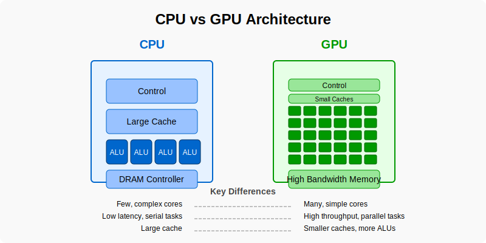
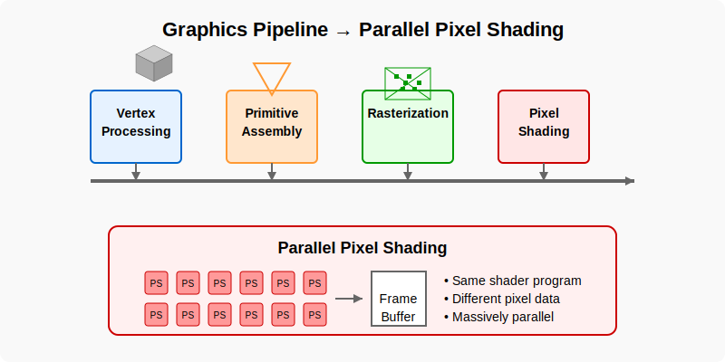
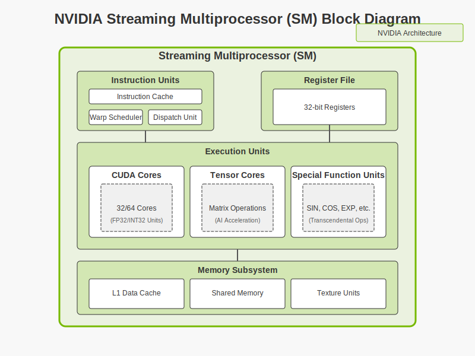
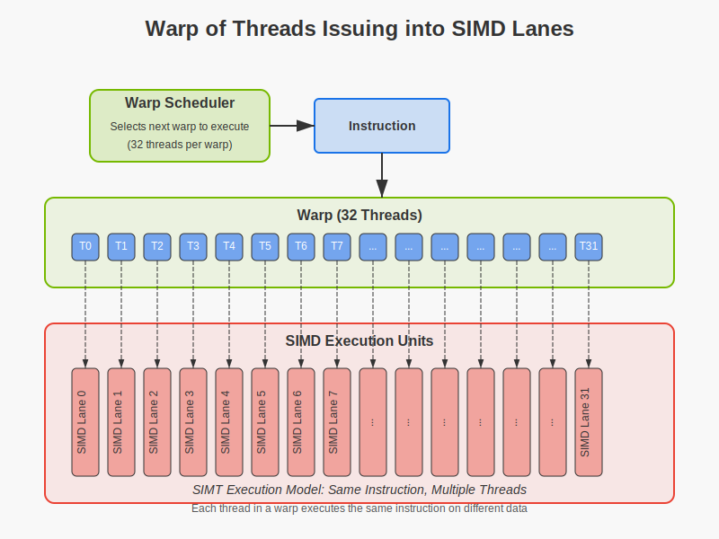
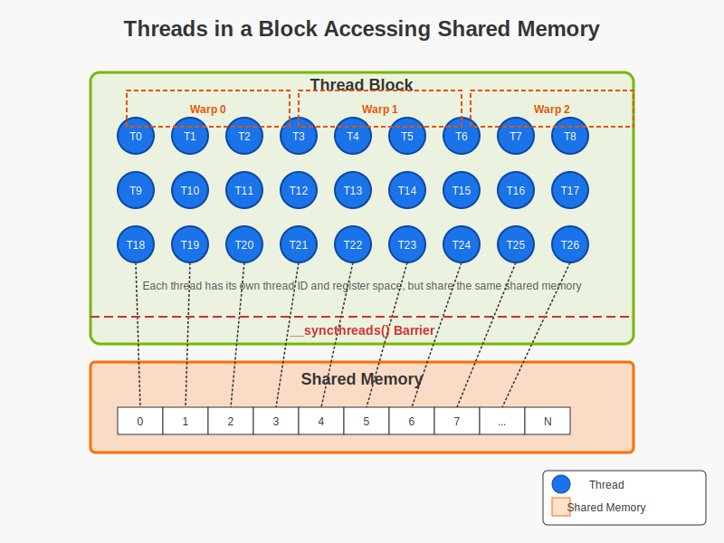
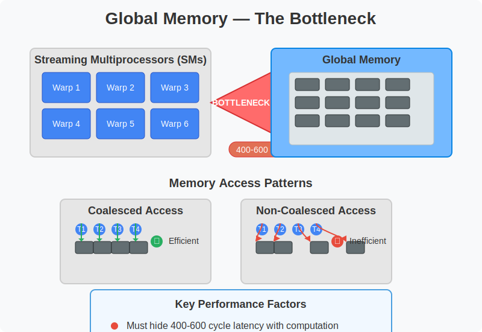
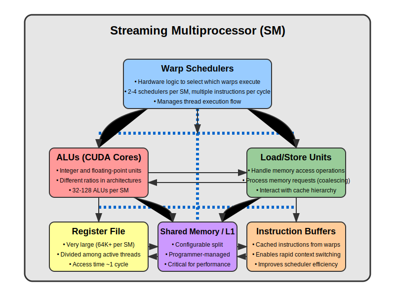
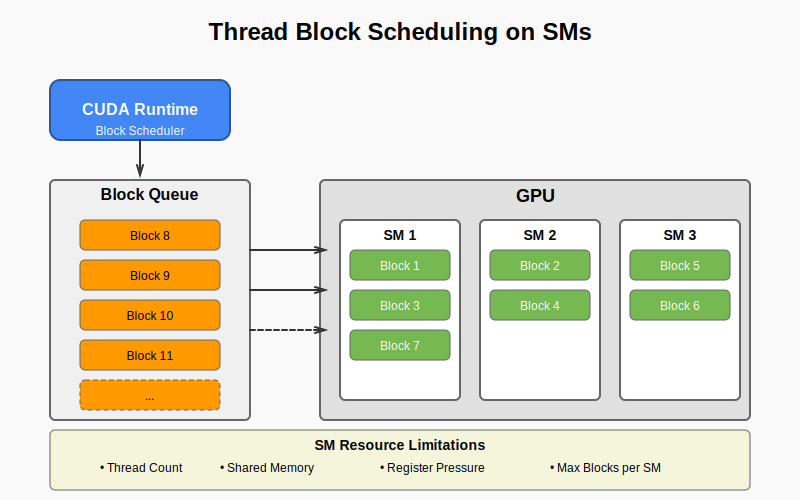

# GPU Architectures
## GWU ECE 6125: Parallel Computer Architecture

# GPU Architectures
## GWU ECE 6125: Parallel Computer Architecture

---

## 2: Agenda

- Evolution of GPUs: From graphics pipelines to general-purpose computing
- GPU architecture deep dive: Core components and execution model
- CUDA programming model: Thread hierarchies and memory management
- Thread and memory hierarchy: How they work together for performance
- Performance considerations: Optimization techniques and bottlenecks
- Advanced topics in GPU computing: Multi-GPU systems and emerging trends

---

## 3: Evolution of GPUs

- Originally built for graphics pipelines
  - Fixed-function hardware designed only for rendering
  - Early 2000s: Programmable shading revolutionized graphics capabilities
- Gradually became programmable
  - Introduction of shader languages allowed custom graphics algorithms
  - Researchers discovered non-graphics potential around 2005
- Now used in:
  - Deep learning: Training and inference for neural networks
  - Scientific computing: Simulation, modeling, molecular dynamics
  - Real-time visualization: Medical imaging, GIS, virtual reality

---

## 4: GPU vs CPU: Key Differences

| Feature       | CPU                          | GPU                                |
|---------------|------------------------------|-------------------------------------|
| Cores         | Few, complex                 | Many, simple                        |
| Optimized For | Low latency, serial tasks    | High throughput, parallel tasks     |
| Cache Size    | Large                        | Smaller per core                    |
| Control Logic | Sophisticated branch prediction | Minimal control hardware         |
| Memory Access | Coherent with sophisticated prefetching | High bandwidth, throughput-oriented |



---

## 5: The Graphics Pipeline Origin

- GPUs originally handled:
  - Geometry transformation: Converting 3D vertices to 2D screen space
  - Lighting calculations: Per-vertex and per-pixel shading 
  - Rasterization and pixel shading: Converting polygons to pixels

- Parallelism was implicit: many pixels = many computations
  - A 1080p display has over 2 million pixels to process
  - Each pixel calculation is independent from others
  - Perfect for parallel hardware design



---

## 6: Early GPU Parallelism

- Graphics shaders ran **the same program** on **every vertex or pixel**
  - Vertex shader: Applied once per 3D vertex (position, normal, etc.)
  - Pixel/fragment shader: Applied once per screen pixel
- Extremely data-parallel workload
  - Perfect SIMD (Single Instruction, Multiple Data) operation
  - No communication needed between processing units
- Foreshadowed GPU compute for science
  - Many scientific algorithms have similar "same operation on many data points" pattern
  - Example: Matrix operations, image processing, physics simulations

---

## 7: Shaders to General Purpose Computing

- Mid-2000s: researchers began using shaders for computation
  - Had to "trick" GPU by encoding computation as texture operations
  - Data stored in texture memory, calculations as shader operations
- GPGPU = general-purpose computing on graphics hardware
  - Term coined around 2004 for non-graphics use of GPUs
  - Early libraries: Brook, Sh, RapidMind
- Hacky but showed potential for **massive parallel throughput**
  - Orders of magnitude faster than CPUs for certain algorithms
  - Example: N-body simulations achieved 50-100x speedups

---

## 8: From Shaders to CUDA

- 2007: NVIDIA releases CUDA with the Tesla architecture
  - First GPU architecture designed with computing in mind, not just graphics
  - Introduced unified shader cores that could handle any computation type
- First time GPU cores exposed directly for programming
  - No need to disguise computation as graphics operations
  - Direct memory access, better control flow capabilities
- CUDA = C-like syntax with thread/block/grid execution model
  - Familiar programming model for developers
  - Abstracted hardware details while exposing parallelism
  - Enabled fine-grained control over execution and memory

---

## 9: Why Use GPUs for Parallelism?

- CPU performance growth plateaued (end of Dennard scaling)
  - Single-thread performance hit physical limits around 2005
  - Clock speeds stopped increasing dramatically
  - Multi-core CPUs couldn't scale efficiently for massively parallel workloads
- GPUs offered:
  - Higher FLOPs/$: More computational power per dollar
  - Higher FLOPs/Watt: More energy-efficient computation
  - Built-in scalability: Architecture designed to scale with more cores

- Ideal for tasks with **high data-parallelism**
  - Many independent calculations performed on different data
  - Limited control flow divergence
  - High arithmetic intensity (computation vs. memory access)

---

## 10: GPU Architectural Overview

- GPU = many **Streaming Multiprocessors (SMs)**
  - Each SM is a computational building block
  - Modern GPUs have dozens to hundreds of SMs
- Each SM has:
  - SIMD ALUs: Arithmetic Logic Units operating in lockstep
  - Shared memory: Fast on-chip memory shared within SM
  - Instruction units: Fetch, decode, and schedule operations
  - Special function units: Trigonometry, square root, etc.
- Thousands of threads can be in-flight simultaneously
  - Hardware manages thread creation, scheduling, and context switching
  - No OS intervention needed for thread management



---

## 11: Design Philosophy: Throughput vs. Latency

- CPUs prioritize:
  - Low latency: Minimize time to complete a single operation
  - Complex branching: Sophisticated branch prediction and speculative execution
  - Fast response to individual tasks: Optimize for single-thread performance
  - Deep cache hierarchies: Reduce memory access latency

- GPUs prioritize:
  - High throughput: Maximize total operations completed per second
  - Many threads: Use parallelism to hide individual operation latency
  - Long-running workloads: Amortize launch overhead with sustained computation
  - Memory bandwidth: Move large amounts of data, not necessarily quickly

---

## 12: GPU as a Throughput-Oriented Machine

- Thousands of threads execute concurrently
  - Not truly simultaneous, but interleaved execution
  - Hardware scheduler manages thread execution
- Latency hiding through warp switching
  - When one thread group (warp) stalls on memory, another executes
  - Memory latency effectively hidden by computation from other threads
  - No need for complex branch prediction or speculative execution
- Key idea: **run so much in parallel that individual delays don't matter**
  - Performance comes from aggregate throughput, not individual thread speed
  - Design optimized for total work completed, not time-to-completion of single task

---

## 13: Architecturally, What Is a GPU?

- Think of a GPU as:
  - A grid of **simple, scalar ALUs**
    - Hundreds to thousands of compute units
    - Each performs basic arithmetic operations
  - Each running **similar instructions** on **different data**
    - SIMD execution model at its core
    - Most efficient when executing identical operations
  - With massive memory bandwidth to feed computation
    - Memory subsystem designed for throughput
    - Coalesced access patterns critical for performance
- Managed by hardware-level schedulers and warp control
  - Zero-overhead thread switching
  - Dynamic work distribution
  - Lockstep execution within thread groups

---

## 13.5: SIMD vs. SPMD — Key Models

- **SIMD**: One instruction operates on many data elements
  - Used in vector processors, CPU intrinsics (AVX, SVE)
  - Single control unit broadcasts instructions to multiple ALUs
  - All processing elements must execute same instruction
  - Examples: Intel AVX-512, ARM NEON, traditional vector machines

- **SPMD**: Each processor/thread runs the same program independently
  - Can follow different paths based on data (branches possible)
  - More flexible than pure SIMD
  - Used in MPI, OpenMP, and CUDA
  - Easier programming model for developers
  - Matches more realistic algorithm requirements

---

## 14: SIMT — GPU's Execution Model

- SIMT = Single Instruction, Multiple Threads
  - NVIDIA's term for their execution model
  - Combines aspects of SIMD and SPMD
- Threads are grouped into **warps** of 32
  - Hardware scheduling unit (32 threads in NVIDIA GPUs)
  - All threads in warp share instruction fetch and decode
- Each warp executes instructions in lockstep **(SIMD)**
  - Same instruction applied to different data elements
  - Entire warp advances to next instruction together
- Divergence = serialized branches
  - If threads in warp take different paths, execution serializes
  - Performance penalty proportional to branch complexity

---

## 14.5: CUDA: SPMD Interface, SIMD Underneath

To the programmer:
- CUDA looks like SPMD (independent threads)
  - Write code as if each thread executes independently
  - Simple to understand and reason about
  - Familiar to developers used to CPU threading models

Under the hood:
- GPU executes **SIMD-style** across warps
  - 32 threads in lockstep per warp
  - Divergence handled automatically (but with performance penalty)
- Threads share fetch/decode; ALUs execute same instruction
  - One instruction counter per warp
  - Threads only differ in which registers they access



---

## 15: Implications of SIMT

- Writing code in SPMD style is easy
  - Familiar programming model
  - Simple mental model: "one thread per data element"
  - Abstraction hides hardware complexity
- But performance depends on:
  - **Divergence** within a warp
    - Different control flow paths cause serialization
    - If/else branches particularly expensive if threads differ
  - **Memory alignment** across threads
    - Adjacent threads should access adjacent memory
    - Non-coalesced access severely limits bandwidth
- Warp = performance-critical unit
  - Always think in terms of groups of 32 threads
  - Organize data and algorithms with warp behavior in mind

---

## 16: Thread, Block, Grid Hierarchy

- Grid = collection of blocks
  - Entire GPU computation (one kernel launch)
  - Can be 1D, 2D, or 3D arrangement
  - Size limited only by hardware capabilities
- Block = group of threads (up to 1024)
  - Executed on a single SM
  - Threads in block can communicate via shared memory
  - Can be 1D, 2D, or 3D arrangement
- Threads execute the same kernel code
  - Each knows its unique ID via built-in variables
  - Uses ID to determine which data to process
- Organize parallelism at three levels
  - Fine-grained: Thread (element-level work)
  - Medium-grained: Block (coherent workgroups)
  - Coarse-grained: Grid (entire problem)


---

## 17: The Streaming Multiprocessor (SM)

Each SM contains:
- Warp scheduler
  - Selects which warps execute next
  - Manages hundreds of threads simultaneously
- ALUs for float/int
  - CUDA cores (traditional floating-point/integer units)
  - Special function units (SFUs) for transcendentals
  - Tensor cores (in newer architectures) for matrix operations
- Shared memory and cache
  - Fast on-chip memory for thread collaboration
  - L1 cache (often configurable with shared memory)
- Registers and load/store units
  - Large register file (compared to CPUs)
  - Specialized units for memory operations

Multiple warps execute on one SM
  - Interleaved execution hides latency
  - Hardware manages context for all active warps
  - Zero-overhead switching between warps

---

## 18: Warp Execution Mechanics

- Scheduler picks a ready warp each cycle
  - "Ready" means not waiting on memory or dependencies
  - Sophisticated policies determine priority
  - Multiple warp schedulers per SM in modern GPUs
- Warps are interleaved to hide stalls
  - When one warp stalls, another immediately takes over
  - No context switch overhead (all warp contexts maintained in hardware)
  - Extremely efficient fine-grained multithreading
- If a warp stalls (e.g., memory), another one runs
  - Memory latency (400-800 cycles) hidden by computation
  - Requires sufficient independent warps (occupancy)
  - Explains why GPUs need many threads to perform well

---

## 19: Performance Depends on Warp Behavior

- Coalesced memory → fast
  - Adjacent threads access adjacent memory locations
  - Maximizes memory bandwidth utilization
  - Single transaction can service multiple threads
- Divergence → slow
  - Different execution paths within warp
  - Causes serialization of execution
  - Worst case: 32x slowdown if every thread takes unique path
- High occupancy → better latency hiding
  - More active warps per SM means better latency hiding
  - Depends on register/shared memory usage per thread
  - Sweet spot depends on algorithm characteristics

Think in terms of **groups of 32 threads**
  - Optimize at warp level, not individual thread level
  - Arrange data access and control flow for warp efficiency
  - Profile to understand warp execution patterns

---

## 20: SIMT vs. Traditional SIMD (Summary Table)

| Feature              | SIMD (CPU)         | SIMT (GPU)          |
|----------------------|--------------------|----------------------|
| Instruction stream   | Shared             | Shared (per warp)    |
| Control flow         | Uniform only       | Divergence allowed   |
| Registers            | Shared (vector)    | Private per thread   |
| Scheduling           | Static             | Warp-level dynamic   |
| Programming model    | Explicit vectors   | Implicit parallelism |
| Masking              | Manual             | Automatic            |
| Memory access        | Contiguous only    | Coalesced preferred  |

---

## 21: Memory Hierarchy Overview

Modern GPU memory hierarchy:

- **Registers**: Fastest, thread-private
  - Accessible in a single cycle
  - Typically thousands per SM, allocated per thread
  - Register pressure can limit occupancy
  - Spills to "local memory" (which is actually in global memory)

- **Shared Memory**: On-chip, block-scoped, user-managed
  - Programmable L1 cache
  - Low latency (20-40 cycles)
  - Manually managed by programmer
  - Used for inter-thread communication within a block

- **Global Memory**: Large, off-chip, high latency
  - Several GB capacity, accessible to all threads
  - 400-800 cycle latency
  - Coalescing critical for performance
  - Cached in L2 and sometimes L1

- **Constant Memory**: Read-only, cached
  - Small (64KB) but highly cached
  - Best for values read by all threads
  - Single broadcast to all threads in warp

- **Texture Memory**: Read-only, spatial locality optimized
  - Hardware filtering and interpolation
  - 2D/3D spatial caching benefits
  - Good for spatially coherent access patterns

---

## 22: Shared Memory — The Workhorse

- **Scoped to thread block**
  - Visible only to threads within the same block
  - Lifetime matches the block's execution
  - Size typically 48-164KB per SM (architecture dependent)

- Useful for:
  - Data reuse: Load once from global, use many times
  - Communication among threads: Producer-consumer patterns
  - Algorithmic tiling: Breaking large problems into block-sized chunks
  - Reduction operations: Partial sums within blocks

- Low latency, high bandwidth
  - ~20-40 cycles latency (vs. 400-800 for global)
  - Organized in banks for parallel access
  - Bank conflicts can reduce effective bandwidth



---

## 23: Global Memory — The Bottleneck

- Accessible by all threads, but:
  - ~400–600 cycle latency
    - Must hide this latency with computation
    - Requires many warps to keep hardware busy
  - Limited bandwidth per SM
    - Shared among all active warps
    - Typically the primary performance bottleneck

- Coalesced access is essential:
  - Adjacent threads should access adjacent memory addresses
  - Ideal: All threads in warp access contiguous 128-byte segment
  - Non-coalesced access: Multiple transactions required
  - Worst case: One transaction per thread (32x performance penalty)

- Access patterns to avoid:
  - Strided access (threads access memory with gaps)
  - Random access (unpredictable patterns)
  - Misaligned starting addresses (not multiple of 128 bytes)



---

## 24: Memory Access Example

Naive case:
```cpp
output[i] = (input[i] + input[i+1] + input[i+2]) / 3.0;
```

- Each thread loads 3 elements → uncoalesced global loads
  - Thread 0 reads indices 0,1,2
  - Thread 1 reads indices 1,2,3
  - Massive redundant reads and memory transactions
  - Poor bandwidth utilization

Optimized:
- Use shared memory to load once, reuse among threads
  - Each thread loads one element into shared memory
  - Barrier synchronize to ensure all data is loaded
  - Each thread computes result using shared data
  - Eliminates redundant global memory accesses
  - Much better memory bandwidth efficiency

---

## 25: Why Memory Patterns Matter

- Memory bandwidth is finite
  - Modern GPUs: ~1-2 TB/s memory bandwidth
  - Still limited compared to compute capacity
  - Often the primary bottleneck in real applications

- Poor layout = wasted bandwidth
  - Non-coalesced access may use <10% of available bandwidth
  - Bank conflicts in shared memory reduce effective throughput
  - Strided access patterns particularly problematic

- Goal: minimize global memory access, maximize reuse via shared memory
  - Tiling algorithms: Break problem into shared-memory-sized chunks
  - Cooperative loading: Threads work together for efficient memory operations
  - Data layout: Structure of arrays vs. array of structures
  - Prefetching: Load next tile while computing on current tile

---

## 26: Streaming Multiprocessor Architecture

Each SM includes:
- Warp scheduler
  - Hardware logic to select which warps execute
  - Typically 2-4 schedulers per SM in modern GPUs
  - Can issue multiple instructions per cycle

- ALUs (CUDA cores)
  - Integer and floating-point arithmetic units
  - Different ratios in different architectures
  - Typically 32-128 ALUs per SM

- Load/Store Units
  - Handle memory access operations
  - Process memory requests in groups (coalescing)
  - Interact with cache hierarchy

- Register file
  - Very large compared to CPU (64K+ registers per SM)
  - Divided among active threads
  - Access time ~1 cycle

- Shared memory / L1 cache
  - Configurable split in many architectures
  - Programmer-managed scratchpad
  - Critical for high-performance algorithms

- Instruction buffers
  - Cached instructions from multiple warps
  - Enables rapid context switching



---

## 27: Warp Execution Lifecycle

1. Warp fetched into scheduler
   - Instruction cache provides next instruction
   - Decoded and dispatched to appropriate execution units
   - Multiple warps in flight simultaneously

2. If not stalled, executes instruction
   - ALUs process data elements in parallel
   - Up to 32 operations completed simultaneously
   - All threads execute same instruction on different data

3. If stalled (e.g., waiting on memory), scheduler picks next warp
   - Zero-overhead context switching
   - Hardware maintains state for all active warps
   - Critical for latency hiding

4. Multiple warps interleaved to hide latency
   - Fine-grained multithreading at warp level
   - Keeps execution units busy despite stalls
   - More warps = better latency hiding (up to certain limit)

---

## 28: Warp Divergence

Occurs when:
```cpp
if (threadIdx.x % 2 == 0)
   A();
else
   B();
```

- Different paths in same warp → serialized execution
  - Hardware executes each path separately
  - Threads taking path A execute while B threads are masked
  - Then threads taking path B execute while A threads are masked
  - Both paths must be traversed by the hardware

- Can reduce throughput significantly
  - Worst case: 32 different paths = 32x slowdown
  - Deep or complex branching particularly costly
  - Nested conditionals multiply the effect

- Strategies to minimize:
  - Reorder data to make threads in a warp take same path
  - Use branch-free code where possible (e.g., predication)
  - Structure algorithms to minimize divergence

---

## 29: Execution Resources and Warp Limits

Per-SM limits:
- Max active threads
  - Typically 1024-2048 per SM
  - Hardware constraint based on thread context storage

- Max registers and shared memory
  - Register file: 64K-256K registers per SM (architecture-dependent)
  - Shared memory: 48-164KB per SM (architecture-dependent)
  - Both are partitioned among active threads/blocks

- These constraints impact **occupancy**
  - Using more resources per thread = fewer concurrent threads
  - Trade-off between resource usage and parallelism
  - Finding optimal balance is application-specific

Compiler tools (e.g., `nvcc --ptxas-options=-v`) can report usage
  - Shows register count per thread
  - Shows shared memory usage per block
  - Allows calculating theoretical occupancy

---

## 30: Register and Shared Memory Tradeoffs

- Using more registers per thread:
  - Reduces total threads per SM
    - Example: 64K registers / 64 registers per thread = 1024 threads
    - Using 128 registers per thread cuts max threads to 512
  - May cause register spilling to local memory
    - Compiler moves variables to global memory
    - Dramatically impacts performance (~100x slower access)
  - But can improve per-thread performance by reducing recomputation

- Using more shared memory per block:
  - Reduces how many blocks can reside on SM
    - Example: 96KB shared / 16KB per block = 6 blocks max
    - Using 32KB per block cuts max blocks to 3
  - Limits parallelism and latency hiding
  - But enables advanced algorithms with more data reuse

**Balance is key!**
  - Occupancy sweet spot: 50-75% often sufficient
  - Use only as many resources as needed
  - Profile to find optimal configuration

---

## 31: Thread Block Scheduling on SMs

- CUDA runtime assigns blocks dynamically to SMs
  - No programmer control over assignment
  - Blocks assigned as resources become available
  - Continues until all blocks in grid are processed

- Each SM may host **multiple blocks**, limited by:
  - Total threads: Max threads per SM (1024-2048)
  - Shared memory per block: Must fit in SM's shared memory
  - Register pressure: Total registers used by all threads
  - Block limit: Hardware max concurrent blocks per SM

- Implications:
  - Workload automatically distributed across GPU
  - Load balancing handled by hardware
  - Scales to different GPU capabilities
  - Enables forward compatibility



---

## 32: Occupancy — Hiding Latency

**Occupancy** = ratio of active warps to the maximum warps per SM

- High occupancy helps:
  - Hide latency from memory accesses
    - More warps = more candidates to execute during stalls
    - Critical when memory access is frequent
  - Keep ALUs busy
    - Prevents execution units from going idle
    - Maximizes computational throughput
  - Improve hardware utilization
    - More threads = better amortization of SM resources

- But more is not always better:
  - Register and cache pressure can negate benefits
    - Too many threads compete for limited resources
    - Can cause register spilling or cache thrashing
  - Diminishing returns after ~50-75% occupancy
    - Most applications see minimal benefit beyond this point
  - Some algorithms perform better with lower occupancy and more resources per thread

---

## 33: Measuring Occupancy

Use:
- CUDA Occupancy Calculator
  - Spreadsheet tool from NVIDIA
  - Inputs: threads per block, registers per thread, shared memory per block
  - Shows theoretical and practical occupancy limits

- Compiler feedback from `nvcc`
  - `--ptxas-options=-v` shows resource usage
  - Reveals register count and shared memory usage

- Profilers (Nsight Compute)
  - Shows actual achieved occupancy during execution
  - Identifies occupancy limiters (registers, shared memory, block size)
  - Suggests optimization strategies

Balance threads/block, registers/thread, and shared memory
  - No one-size-fits-all solution
  - Requires experimentation and profiling
  - Often involves counterintuitive tradeoffs

---

## 34: Thread Block Size Tradeoffs

- More threads per block:
  - Better latency hiding
    - More threads ready to execute when others stall
    - Improves utilization under memory-bound conditions
  - But more contention for shared resources
    - Greater register pressure
    - More competition for shared memory
    - May reduce max blocks per SM

- Fewer threads per block:
  - Easier to fit more blocks
    - More independent work units
    - Better distribution across SMs
  - May underutilize hardware
    - Not enough parallelism to hide latency
    - Harder to achieve full occupancy
    - Warp utilization may suffer

**Sweet spot** depends on your kernel
  - Memory-bound: Maximize occupancy (more threads)
  - Compute-bound: More resources per thread
  - Common sizes: 128, 256, or 512 threads per block
  - Always benchmark multiple configurations

---

## 35: Warp Scheduling

Each SM contains:
- Multiple warp schedulers
  - 2-4 independent schedulers per SM in modern GPUs
  - Can issue instructions from different warps simultaneously
  - Enables dual-issue or quad-issue execution

- Arbitrates between ready warps
  - Selects warps that are not stalled
  - Uses variety of scheduling policies
    - Round-robin
    - Greedy oldest first
    - Fair share

- Picks warp per cycle, issues instruction
  - Instruction latency hidden by switching warps
  - No thread context switching overhead
  - All warp states maintained in hardware

Goal: Keep execution pipelines full
  - Maximize instruction throughput
  - Hide memory and instruction latencies
  - Maintain high utilization of execution units

---

## 36: Volta and Later: Independent Thread Scheduling

- From Volta (2017) onward, threads in a warp can diverge **without serialization**
  - More flexible thread scheduling
  - Each thread can progress at its own pace
  - Breaks strict lockstep execution model of earlier GPUs

- Enables more flexible programming
  - Better handling of irregular control flow
  - Improved support for synchronization primitives
  - Reduced penalty for warp divergence
  - Helps with producer-consumer patterns within a warp

- Still benefits from uniform control flow
  - Maximum performance still achieved with coherent execution
  - Hardware optimized for SIMD-style execution
  - Best practice: minimize divergence when possible

$[Image Placeholder: Divergence in warp with vs without independent scheduling](images/independent-thread-scheduling-svg.svg)

---

## 37: Grid-Stride Loops for Scalability

```cpp
int idx = blockIdx.x * blockDim.x + threadIdx.x;
for (int i = idx; i < N; i += blockDim.x * gridDim.x) {
    output[i] = input[i] * 2;
}
```

- Scales to any number of threads
  - Launch fixed grid size, handle any data size
  - Each thread processes multiple elements
  - Thread stride = total number of threads

- Eliminates hard-coding of problem sizes
  - Same kernel works for any data size
  - No need to recompile for different problem sizes
  - Forward compatible with future GPUs

- Benefits:
  - Better load balancing
  - Works on any GPU regardless of SM count
  - Simplifies kernel launches
  - Enables dynamic problem sizing

---

## 38: Persistent Threads (Advanced Concept)

- Instead of many blocks, launch just enough to saturate GPU
  - Typically one block per SM
  - Each block runs continuously
  - Manually manage work distribution

- Threads loop over work queue using `atomicAdd()`
  - Acquire work items from shared queue
  - Process data
  - Repeat until queue is empty
  - Use atomics to ensure work items assigned once

Used in:
- Dynamic workloads
  - Unpredictable or imbalanced tasks
  - Task generation during execution
  - Irregular data structures (graphs, trees)

- Work-stealing designs
  - Blocks can steal work from other blocks' queues
  - Better load balancing for irregular workloads
  - Improves utilization for variable-time tasks

---

## 39: Why Understanding Warp Behavior Matters

- GPU is efficient **when warps run uniformly**
  - All threads in warp follow same execution path
  - Memory accesses are coalesced
  - Same instruction executed by all threads

- Divergence, memory stalls, resource limits = performance drop
  - Divergent branches cause serialization
  - Non-coalesced memory wastes bandwidth
  - Resource constraints limit occupancy

- The best CUDA programs:
  - Align thread behavior
    - Minimize control flow divergence
    - Group similar operations together
  - Manage memory well
    - Coalesced access patterns
    - Effective use of shared memory
  - Launch enough work
    - Saturate GPU capabilities
    - Hide latency through parallelism

---

## 40: SM Scheduling Analogy

- Think of an SM as a **mini CPU with lots of hyperthreads**
  - Multiple hardware contexts (warps) share execution units
  - Zero-overhead switching between contexts
  - Fine-grained interleaving of execution

- It hides stalls by **switching threads**, not prediction
  - No branch prediction or speculative execution
  - Relies entirely on having other work ready to go
  - Performance depends on having enough parallel work

- Scheduling = warp-level round-robin with heuristics
  - Greedy execution of ready warps
  - Fairness mechanisms prevent starvation
  - Prioritization based on various factors:
    - How long warp has been waiting
    - Resource availability
    - Instruction type