# Parallel Programming: Concepts and Strategies
## GWU ECE 6125: Parallel Computer Architecture

---

## Lecture Roadmap

| Part | Topic | Key Question |
|------|-------|-------------|
| 1 | **Introduction** | Why can't we just make one core faster? |
| 2 | **Thinking in Parallel** | What kinds of parallelism exist? |
| 3 | **Decomposition** | How do we split a problem into parallel pieces? |
| 4 | **Assignment & Load Balancing** | How do we keep all processors busy? |
| 5 | **Orchestration & Synchronization** | How do parallel pieces coordinate safely? |

Note: This lecture covers the **software side** of parallel computing. Previous lectures covered hardware (interconnects, cache coherence). Now we ask: given all that hardware, how do programmers actually use it?

---

## Part 1: Introduction to Parallel Programming

### Why Can't We Just Make One Core Faster?

Note: If we could keep doubling single-core speed, parallel programming wouldn't exist. Three "walls" explain why that era ended around 2005.

---

## What is Parallel Programming?

**Writing software that breaks a computation into pieces that execute simultaneously on multiple processors.**

> **Analogy:** Building a house with 1 worker vs. 10 workers. More workers *can* finish faster -- but only if you plan who does what, avoid conflicts (two workers painting the same wall), and coordinate handoffs (electrician finishes before drywaller starts).

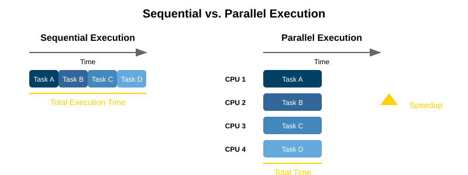

Note: The house analogy captures every challenge we'll cover: decomposition (divide the house into tasks), assignment (who does what), synchronization (electrician before drywaller), and why 10 workers ≠ 10× speedup -- some tasks are inherently sequential (pouring the foundation).

---

## The Power Wall

**Higher clock speeds → exponential heat increase.**

Power ∝ Voltage² × Frequency, and voltage must increase with frequency.

**What happened:** Intel's Pentium 4 Prescott (2004) hit 130W at 3.8 GHz -- a thermal disaster. The planned 4+ GHz successors were cancelled.

**The industry's response:** Stop making cores faster. Put **more cores** on the chip instead. Intel Core 2 Duo (2006) marked the shift.

Note: Clock speeds have been stuck at ~4-5 GHz since 2005. Moore's Law continues -- transistor counts still double -- but those transistors now go into more cores, wider SIMD units, and specialized accelerators, not faster single cores.

---

## The Memory Wall and ILP Wall

| Wall | Problem | Why It Matters |
|---|---|---|
| **Memory Wall** | CPU speed grew ~50%/year, memory speed grew ~7%/year | CPUs spend most time **waiting for data** |
| **ILP Wall** | Out-of-order execution, branch prediction -- diminishing returns | Sequential code has limited parallelism to extract |

**Bottom line:** Single-core performance hit a ceiling. The only path forward is **parallel execution**.

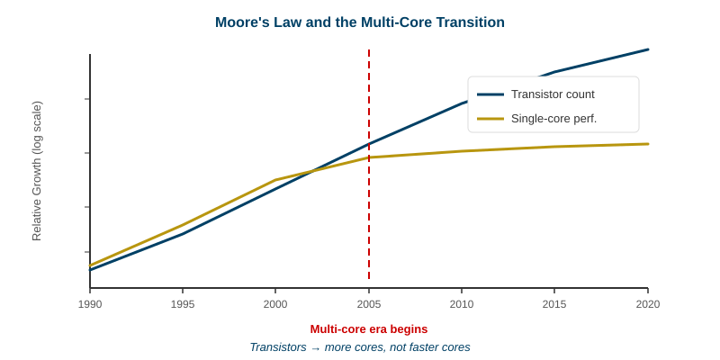

Note: The Memory Wall is why we spent two lectures on cache coherence -- caches exist to hide memory latency. The ILP Wall means even the cleverest hardware can only find so much parallelism in sequential code. Together, these walls made multi-core inevitable.

---

## Amdahl's Law: The Fundamental Limit

**If a fraction *s* of your program is inherently serial, the maximum speedup with *P* processors is:**

$$Speedup = \frac{1}{s + \frac{1-s}{P}}$$

| Serial fraction (*s*) | Max speedup (P → ∞) |
|---|---|
| 10% | 10× |
| 5% | 20× |
| 1% | 100× |

> **The lesson:** Before parallelizing, find and minimize the serial bottleneck. Adding more processors won't help if 10% of your code is sequential -- you're capped at 10×.

**As P grows, the speedup approaches 1/s.** With 10% serial code, 16 processors give ~6.4× -- already more than half the theoretical max of 10×. Doubling to 32 processors only gets you to ~7.5×. The closer you get to the ceiling, the less each added processor helps.

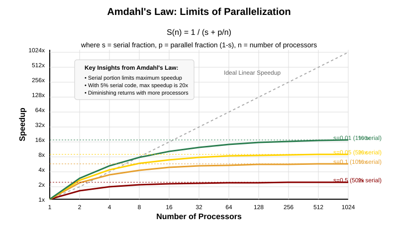

Note: Amdahl's Law is the single most important equation in parallel computing. It tells you the theoretical ceiling before you write a single line of code. Notice how the curves flatten -- each doubling of processors buys less and less speedup. In practice, real speedups are even lower because of communication overhead and load imbalance.

---

## Strong Scaling vs. Weak Scaling

Amdahl's Law assumes a **fixed problem size** (strong scaling). But in practice, more processors often means solving **bigger problems**.

| | Strong Scaling | Weak Scaling |
|---|---|---|
| **Problem size** | Fixed | Grows with processor count |
| **Goal** | Same problem, faster | Bigger problem, same time |
| **Governed by** | Amdahl's Law | Gustafson's Law |
| **Example** | Weather forecast: same grid, more CPUs → faster | Weather forecast: finer grid, more CPUs → same time, better resolution |

**Efficiency** = Speedup / P -- how well you're using each processor. An efficiency of 100% means every processor is doing useful work the entire time. In weak scaling, efficiency is the key metric: ideally it stays near 100% as you add processors.

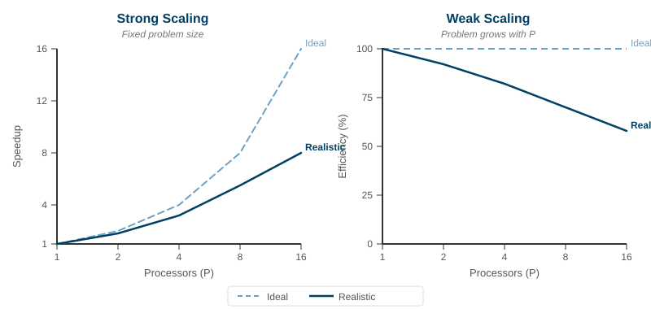

Note: In the AI era, weak scaling dominates. When you double your GPUs, you typically double the batch size and train in the same time -- that's Gustafson's Law. ML training is *designed* for weak scaling. Strong scaling still matters for latency-critical workloads like real-time inference.

---

## Challenges: What Makes Parallel Programming Hard?

**Correctness challenges:**

| Challenge | What Goes Wrong |
|---|---|
| **Race conditions** | Two threads modify shared data simultaneously → corrupted result |
| **Deadlocks** | Threads wait for each other's locks forever → program hangs |
| **Non-determinism** | Bugs appear sometimes, disappear when you add print statements |

Note: Parallel bugs are fundamentally harder than sequential bugs. Sequential bugs are reproducible -- same input, same crash. Parallel bugs depend on timing: thread A might finish before B 99% of the time, but the 1% where B wins causes corruption. These are called **heisenbugs** -- they disappear when you try to observe them.

---

## Challenges: Performance Pitfalls

| Challenge | What Goes Wrong |
|---|---|
| **Synchronization overhead** | 8 threads waiting for 1 lock → 7 threads idle |
| **Load imbalance** | Some processors finish early and wait for others |
| **Communication overhead** | Time spent moving data between processors, not computing |

> "Making sequential programs run in parallel is so hard that it's considered one of computer science's grand challenges." -- Tim Mattson, Intel

Note: Over-synchronization is the #1 performance killer. Many parallel programs run slower than sequential because they spend more time coordinating than computing. The art of parallel programming is minimizing synchronization while maintaining correctness.

---

## Part 2: Thinking in Parallel

### What Kinds of Parallelism Exist?

Note: Before writing parallel code, recognize what kind of parallelism your problem offers. This determines your entire strategy.

---

## The Parallel Programmer's Mindset

| Sequential Thinking | Parallel Thinking |
|---|---|
| "What is the **next step**?" | "What can be done **at the same time**?" |
| Focus on order of operations | Focus on **independence** of operations |
| Debug by stepping through | Debug by reasoning about **all possible interleavings** |

**Three questions to ask about any computation:**
1. Which operations are **independent**? → Can run in parallel
2. Which operations **depend on another's result**? → Must be sequential
3. Which operations **share data**? → Need synchronization

Note: The mental shift is hard. Take any algorithm you know, draw its dependency graph, and find the longest chain of dependent operations -- that's your serial bottleneck, and Amdahl's Law applies to it.

---

## Three Types of Parallelism

| Type | What It Means | Example |
|---|---|---|
| **Data Parallelism** | Same operation, different data elements | Blur filter on each pixel |
| **Task Parallelism** | Different operations at the same time | Game engine: physics + rendering + AI |
| **Pipeline Parallelism** | Data flows through stages; different items at different stages | Video: decode → filter → encode |

**Which dominates?** Data parallelism -- because the largest computations (matrix algebra, neural networks, image processing) apply the same operation to millions of elements.

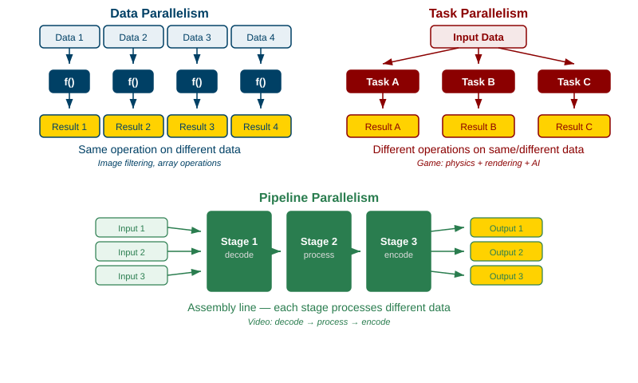

Note: These types aren't mutually exclusive. A video encoder uses all three: pipeline (decode → process → encode), data parallelism within each stage (process many pixels at once), and task parallelism (audio encoding in parallel with video). But data parallelism is why GPUs exist -- thousands of cores doing the same operation on different data.

---

## "Embarrassingly Parallel" Problems

Some problems have **zero dependencies** between parallel pieces. No synchronization needed, no communication needed.

> **The parallelism is so obvious it's almost embarrassing.**

**Examples:**
- Adjust brightness on every pixel in an image
- Render each frame of an animation independently
- Run the same simulation with 1000 different parameter sets
- Serve independent web requests

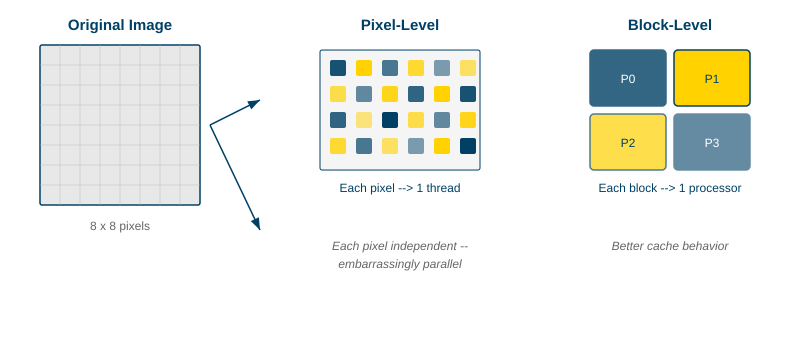

Note: Embarrassingly parallel problems are the dream case -- they scale nearly linearly with processor count. Instagram filters, Monte Carlo simulations, and MapReduce jobs are all embarrassingly parallel. The hard problems are the ones with dependencies between pieces.

---

## The SPMD Model

**Single Program, Multiple Data** -- the dominant parallel programming pattern.

One program is written once. The runtime launches many copies. Each copy uses its **unique ID** to decide which data to work on.

**OpenMP (C) -- shared-memory parallelism with compiler directives:**
```c
#pragma omp parallel                       // Fork: launch a team of threads
{
    int tid = omp_get_thread_num();        // Each thread gets a unique ID (0, 1, 2, ...)
    int total = omp_get_num_threads();     // How many threads are running
    int chunk = N / total;                 // Divide data evenly
    int start = tid * chunk;              // This thread's starting index
    for (int i = start; i < start + chunk; i++)
        result[i] = process(data[i]);      // Same function, different slice of data
}                                          // Join: all threads rejoin here
```

**Used everywhere:** MPI programs, CUDA kernels, OpenMP parallel regions, MapReduce jobs, Spark transformations.

Note: SPMD is so widespread because it's simple: same code, different data. CUDA takes this to the extreme -- a kernel launches thousands of threads, each computing one output element. The programmer writes code for ONE thread; the hardware replicates it.

---

## Shared Memory vs. Distributed Memory

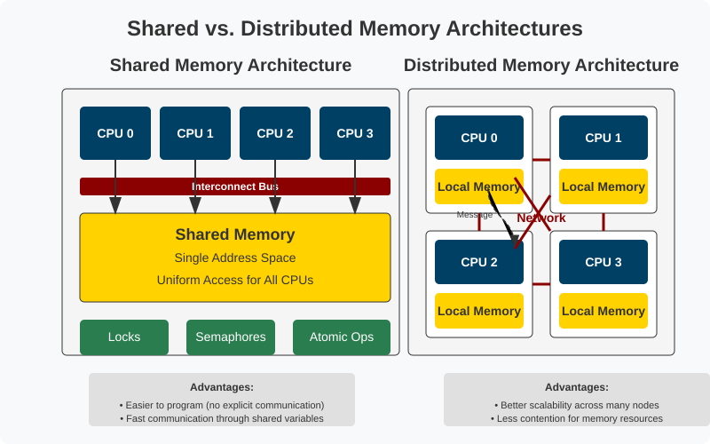

Note: Most real HPC systems use both: shared memory within a node (cores share DRAM), distributed memory between nodes (MPI over InfiniBand). The cache coherence protocols from Lecture 06 are what make shared memory work.

---

## Shared Memory vs. Distributed Memory: Trade-offs

| | Shared Memory | Distributed Memory |
|---|---|---|
| **Communication** | Read/write shared variables | Send/receive messages |
| **Programming** | OpenMP, Pthreads | MPI |
| **Hardware** | Multi-core CPU | Cluster of servers |
| **Advantage** | Easier to program | Scales to thousands of nodes |
| **Disadvantage** | Limited to one machine | Must manage all data movement |

Note: Shared memory is easier because threads just read and write variables -- the hardware handles cache coherence. Distributed memory forces the programmer to decide what data goes where and when to send it. That's harder but necessary for anything beyond one machine.

---

## The Modern Parallel Stack

**In practice, you use all three models together:**

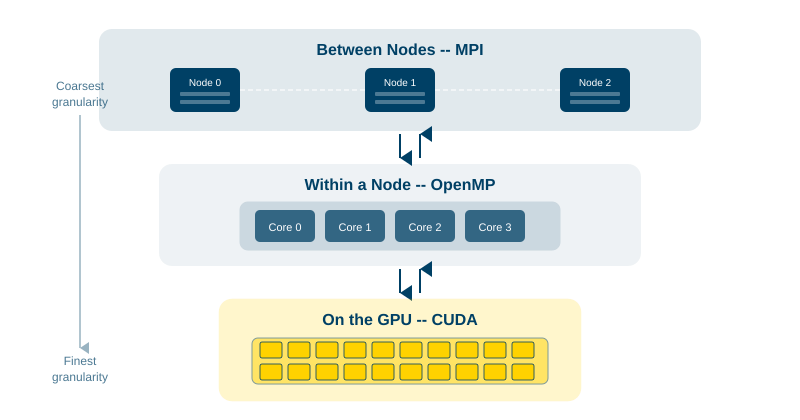

**The standard HPC recipe (2025):**
- **MPI** between nodes (distributed memory)
- **OpenMP** within each node (shared memory)
- **CUDA** on each GPU (massively parallel)

Note: This MPI+OpenMP+CUDA stack is how every major HPC application works today -- from weather forecasting (ECMWF) to molecular dynamics (GROMACS) to AI training (PyTorch distributed). CUDA dominates GPU computing with ~90% market share, though AMD's ROCm and Intel's oneAPI are growing. Portability frameworks like Kokkos and SYCL aim to write once, run on any accelerator -- but CUDA's ecosystem advantage remains enormous.

---

## Part 3: Decomposition

### How Do We Split a Problem into Parallel Pieces?

> Decomposition is the first and most important design decision. Get this wrong, and no amount of clever scheduling can save you.

Note: Decomposition determines how much parallelism you have, how much communication is needed, and whether you can balance the load. A bad decomposition can make a parallel program slower than sequential.

---

## Task Decomposition vs. Data Decomposition

| | Task Decomposition | Data Decomposition |
|---|---|---|
| **Divide by** | Different functions | Different data chunks |
| **Tasks are** | Heterogeneous (different work) | Homogeneous (same work) |
| **Load balance** | Harder (tasks vary in size) | Easier (chunks are equal) |
| **Example** | Physics + Rendering + AI | Each processor computes a block of matrix rows |

> **Rule of thumb:** "Same operation on lots of data" → data decomposition. "Several different things" → task decomposition.

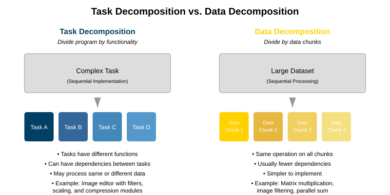

Note: Data decomposition is far more common in scientific computing and ML because the dominant operations (matrix multiply, convolution, stencil) apply the same operation to large arrays. Task decomposition appears more in systems programming -- web servers, game engines, OS schedulers.

---

## Example: Summing an Array in Parallel

**Sequential (C):**
```c
long sum = 0;                          // Single accumulator
for (int i = 0; i < N; i++)           // One thread processes ALL N elements
    sum += array[i];                   // Runs in O(N) time
```

**Parallel with OpenMP (C) -- one line turns it parallel:**
```c
long sum = 0;
#pragma omp parallel reduction(+:sum)  // Each thread gets a private copy of sum;
for (int i = 0; i < N; i++)           // OpenMP splits iterations across threads
    sum += array[i];                   // Each thread sums its chunk
// reduction(+:sum) combines all private copies into final sum via tree reduction
```

**Tree reduction** combines partial sums in **log₂(P) steps** instead of P steps:

| 8 processors | Step 1 | Step 2 | Step 3 |
|---|---|---|---|
| P0+P1 → S01 | S01+S23 → S0123 | | |
| P2+P3 → S23 | | S0123+S4567 = **Total** | |
| P4+P5 → S45 | S45+S67 → S4567 | | |
| P6+P7 → S67 | | | |

Note: Tree reduction is a fundamental parallel primitive. It appears everywhere: summing arrays, dot products, aggregating ML gradients across GPUs. MPI provides `MPI_Reduce()` and `MPI_Allreduce()` which implement optimized tree reductions. NVIDIA's NCCL library does the same for GPU collectives in distributed training.

---

## Decomposition Granularity: How Small?

| | Fine-Grained | Coarse-Grained |
|---|---|---|
| **Piece size** | Small (one matrix element) | Large (one matrix row block) |
| **Communication** | High overhead | Low overhead |
| **Load balance** | Excellent | Risky if work varies |
| **Best when** | Sync is cheap (shared memory) | Messages are expensive (distributed) |

> **The trade-off:** Finer → better balance but more overhead. Coarser → less overhead but risk of imbalance.

Note: On shared memory (OpenMP), synchronization costs hundreds of cycles, so fine granularity works. On distributed systems (MPI), each message costs microseconds, so you want large chunks. This is why MPI programs typically have P chunks (one per processor) while OpenMP can schedule thousands of tiny loop iterations.

---

## Data Distribution Patterns

| Pattern | How It Works | When to Use |
|---|---|---|
| **Block** | P0 gets elements 0–99, P1 gets 100–199, etc. | Uniform work per element |
| **Cyclic** | P0 gets 0,4,8…; P1 gets 1,5,9…; etc. | Work varies by position |
| **Block-cyclic** | Blocks of *k* elements, distributed round-robin | Balance of locality + load |

> Block-cyclic is the default in ScaLAPACK -- the standard library for distributed dense linear algebra.

Note: If a triangular matrix is block-distributed, processors with the top rows (few nonzeros) finish much earlier than those with bottom rows (many nonzeros). Cyclic distribution spreads work evenly but destroys cache locality. Block-cyclic is the compromise used by almost all production HPC math libraries.

---

## Part 4: Assignment & Load Balancing

### How Do We Keep All Processors Busy?

> After decomposition gives us pieces, **assignment** decides which processor executes which piece. The goal: keep every processor computing for the entire runtime.

Note: Assignment is separate from decomposition. You might decompose a matrix into 1000 blocks but only have 64 processors -- how you map blocks to processors determines efficiency.

---

## Static vs. Dynamic Assignment

| | Static | Dynamic |
|---|---|---|
| **When decided** | Before execution | During execution |
| **Overhead** | Near zero | Queue management, task migration |
| **Load balance** | Good if work is **predictable** | Good for **unpredictable** workloads |
| **Example** | Dense matrix multiply | Graph traversal (nodes vary wildly) |

> **When to use which:** Can you predict work per task at compile time? → static. Work varies unpredictably? → dynamic.

Note: Static assignment works for regular computations -- dense linear algebra, stencil codes, image processing -- where every element requires the same work. Dynamic assignment shines for irregular problems: graph algorithms (some nodes have 2 edges, others 10,000), adaptive mesh refinement, sparse matrix operations.

---

## Work Stealing: The Dominant Dynamic Strategy

**Each processor maintains its own task queue. When a processor finishes, it "steals" tasks from a busy processor's queue.**

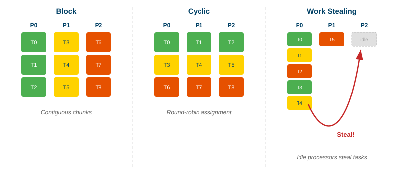

**Why it works:**
- The victim barely notices (it works from the top of its queue; theft happens from the bottom)
- Stolen tasks tend to be large (recursive algorithms put coarse work at the bottom)
- Fully decentralized -- no single bottleneck

**Used in:** Intel TBB, Java ForkJoinPool, Go goroutines, Rust's Rayon, Tokio async runtime

Note: Work stealing is *the* load balancing technology of choice in both industry and academia as of 2025. Go's entire concurrency model is built on a work-stealing scheduler -- that's how millions of goroutines efficiently share a few OS threads. Rust's Rayon makes it one line: `array.par_iter().map(|x| process(x))` -- work stealing happens automatically.

---

## Part 5: Orchestration & Synchronization

### How Do Parallel Pieces Coordinate Safely?

> Decomposition splits the work. Assignment maps it to processors. **Orchestration** ensures correctness -- managing dependencies, protecting shared data, and coordinating completion.

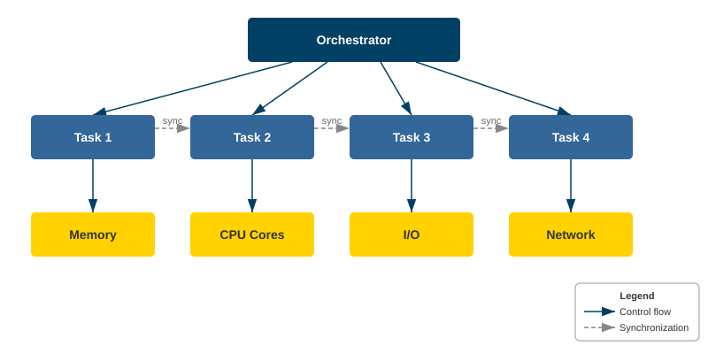

Note: Orchestration is where most parallel bugs live. Getting decomposition right is a design challenge; getting synchronization right is an implementation nightmare. Race conditions, deadlocks, and livelocks are all orchestration failures.

---

## Communication Patterns (Part 1)

Parallel tasks need to exchange data. These are the fundamental patterns:

| Pattern | What It Does | Example |
|---|---|---|
| **Broadcast** | One sender → all receivers | Master sends config to all workers |
| **Scatter** | One sender distributes different pieces to each | Distributing array chunks |
| **Gather** | All senders → one receiver collects | Collecting partial results |

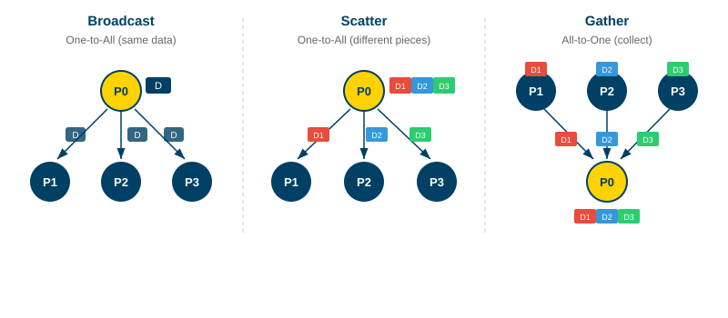

Note: MPI provides optimized implementations of all these as "collective operations" (`MPI_Bcast`, `MPI_Scatter`, `MPI_Gather`). Using collectives instead of hand-coded point-to-point messages is almost always faster -- the MPI library uses tree-based algorithms and can exploit hardware multicast on modern InfiniBand networks.

---

## Communication Patterns (Part 2)

| Pattern | What It Does | Example |
|---|---|---|
| **Reduce** | Combine values from all processors | Global sum, max, min |
| **All-to-all** | Every processor sends to every other | Matrix transpose |
| **Neighbor** | Each processor talks only to its neighbors | Finite difference stencil codes |

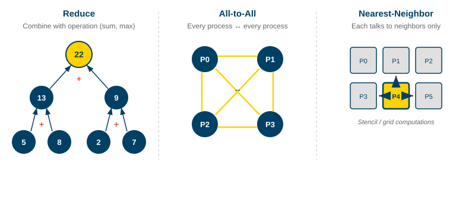

Note: Reduce (`MPI_Allreduce`) is the most performance-critical collective in distributed ML training. When training a neural network across 1000 GPUs, every iteration requires an allreduce to average the gradients. NVIDIA's NCCL library is purpose-built to make this fast using ring-allreduce and tree-allreduce algorithms optimized for GPU-to-GPU NVLink and InfiniBand topologies.

---

## Types of Dependencies

Before adding synchronization, identify what **actually** needs coordination:

| Type | What It Is | Example |
|---|---|---|
| **Data dependency** | Task B needs the output of Task A | Sort before binary search |
| **Control dependency** | Execution depends on a condition | Process after validation |
| **Resource dependency** | Multiple tasks need the same resource | Two threads writing one log file |

> **Key insight:** Only synchronize where a real dependency exists. Over-synchronization is the #1 performance killer.

Note: Draw the dependency graph of your computation. Nodes are tasks, edges are dependencies. The longest path is the **critical path** -- it determines minimum execution time regardless of processor count. This *is* Amdahl's serial fraction.

---

## Race Conditions: The Classic Bug

A **race condition** occurs when correctness depends on the **timing** of thread execution.

**Pseudocode (C-style) -- two threads sharing a counter:**
```c
// BUG: "counter++" looks like one operation but is actually THREE steps
// Both threads run counter++ on a shared variable (initially counter = 0)

// Thread A                          Thread B
// --------                         --------
   load counter   // → sees 0
                                     load counter   // → also sees 0 (stale!)
   add 1          // → computes 1
                                     add 1          // → computes 1
   store 1        // → writes 1
                                     store 1        // → overwrites with 1

// Expected: counter = 2.  Actual: counter = 1.  B's increment was lost!
```

**Three fixes:**

| Fix | How | Overhead |
|---|---|---|
| **Atomic** | `atomic_fetch_add(&counter, 1)` | Lowest -- single hardware instruction |
| **Lock** | `lock(m); counter++; unlock(m)` | Medium -- thread may block |
| **Thread-local + reduce** | Each thread has private counter, combine at end | Lowest contention |

Note: This connects to cache coherence from Lecture 06. When Thread A writes `counter`, the cache line enters M state. When Thread B writes, it invalidates A's line -- the coherence protocol doing its job. But coherence ensures memory consistency, NOT that load-add-store is atomic. That's why we need explicit atomics or locks.

---

## Synchronization Primitives: Locks and Atomics

| Tool | How It Works | Use When |
|---|---|---|
| **Mutex (lock)** | Only one thread holds it; others block | Protecting complex shared data |
| **Atomic operation** | Hardware read-modify-write in one instruction | Simple counters, flags, CAS |
| **Reader-Writer Lock** | Multiple readers OR one writer | Reads are frequent, writes rare |

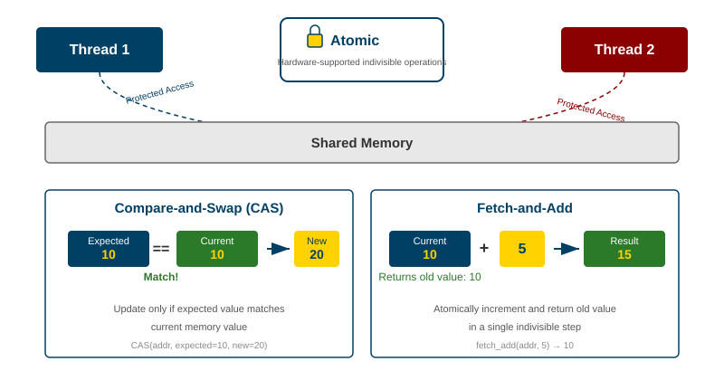

Note: Compare-and-swap (CAS) is the foundation of lock-free programming. Each thread reads a value, computes the new value, and attempts to write -- if another thread changed it first, it retries. This avoids locks entirely and is used extensively in database engines, OS kernels, and concurrent data structures like lock-free queues.

---

## Synchronization Primitives: Barriers and Semaphores

| Tool | How It Works | Use When |
|---|---|---|
| **Barrier** | All threads must arrive before any can proceed | Phase-based algorithms (finish step N before N+1) |
| **Semaphore** | Counter allowing up to *N* concurrent accesses | Limiting concurrency (e.g., connection pool) |

> **Danger with barriers:** The slowest thread determines wait time for everyone. A single slow thread serializes the entire program.

Note: Barriers are common in scientific simulations that proceed in timesteps -- all processors must finish timestep N before anyone starts N+1. MPI's `MPI_Barrier()` and OpenMP's `#pragma omp barrier` implement this. The performance cost is real: if one processor has 10% more work than others, every processor wastes 10% of its time waiting at the barrier.

---

## Deadlocks: When Everyone Waits Forever

A **deadlock** occurs when threads wait for resources held by each other -- and none can proceed.

**Pseudocode (C-style) -- two threads acquiring locks in opposite order:**
```c
// Thread A                        Thread B
// --------                       --------
lock(mutex_1);   // A grabs lock 1    lock(mutex_2);   // B grabs lock 2
lock(mutex_2);   // A waits for 2...  lock(mutex_1);   // B waits for 1...
// A holds 1, needs 2                 // B holds 2, needs 1
// → DEADLOCK: neither can ever proceed -- both wait forever
```

**Four conditions (all must be true):**
1. **Mutual exclusion** -- resource held by one thread at a time
2. **Hold and wait** -- hold one resource, wait for another
3. **No preemption** -- can't forcibly take resources
4. **Circular wait** -- A waits for B, B waits for A

> **Easiest prevention:** Always acquire locks in the **same global order**. If every thread locks mutex_1 before mutex_2, circular wait is impossible.

Note: Deadlocks are devastating because the program hangs silently -- no crash, no error. Database systems detect deadlocks by tracking the wait-for graph; if a cycle appears, one transaction is aborted and retried. In parallel programming, prevention (global lock ordering) is preferred over detection.

---

## Part 6: The Four-Step Framework

Every parallel program follows this pattern:

| Step | Question | What You Decide |
|---|---|---|
| **1. Decompose** | How to split the problem? | Data vs. task vs. pipeline |
| **2. Assign** | Which processor gets which piece? | Static vs. dynamic |
| **3. Orchestrate** | How do pieces coordinate? | Locks, barriers, messages |
| **4. Map** | What hardware runs it? | OpenMP vs. MPI vs. CUDA |

Note: This framework comes from Culler, Singh, and Gupta's "Parallel Computer Architecture" textbook. It applies to everything from a 4-thread OpenMP loop to a 10,000-GPU distributed training job. The order matters: decomposition determines what's possible, assignment determines efficiency, orchestration determines correctness, and mapping determines which hardware you exploit.

---

## What's Changing: The Next Frontier

The **concepts** in this lecture are timeless. But the **landscape** is shifting:

| Trend | What's Happening |
|---|---|
| **GPU-first computing** | CUDA dominates AI/ML (~90% market share). AMD ROCm and Intel oneAPI are catching up but lack CUDA's ecosystem |
| **Portability frameworks** | Kokkos, SYCL, oneAPI aim for "write once, run on any accelerator" -- increasingly important as hardware diversifies |
| **Chiplet architectures** | AMD Zen, Intel tiles -- parallelism now exists *within* the chip across chiplets with different latencies |
| **CXL memory pooling** | Compute Express Link allows shared memory pools across chips -- blurring the shared/distributed boundary |
| **Weak scaling dominates AI** | ML training is designed for Gustafson's Law: more GPUs → larger batches, same training time |

> **Next lecture:** We apply this framework to real parallel algorithms using OpenMP, MPI, and CUDA.

Note: The biggest shift is that the "programming abstraction" problem is now harder than the "parallelism" problem. We have thousands of cores -- the challenge is writing code that adapts to heterogeneous, chiplet-based, CXL-augmented systems without rewriting for each architecture. This is why portability frameworks like Kokkos and SYCL matter, even if they haven't replaced CUDA yet.
