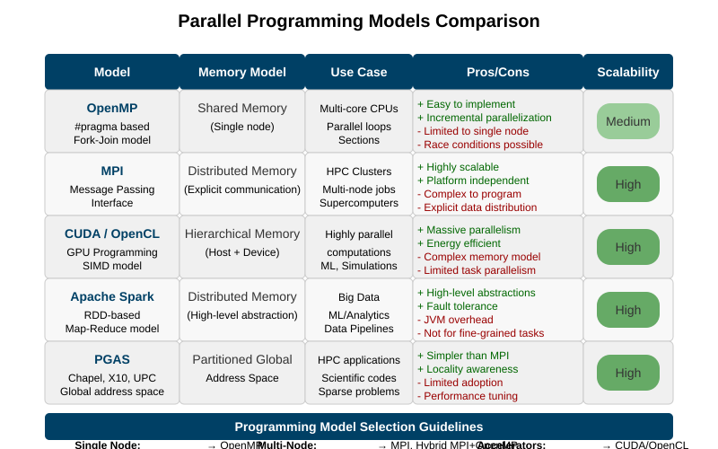
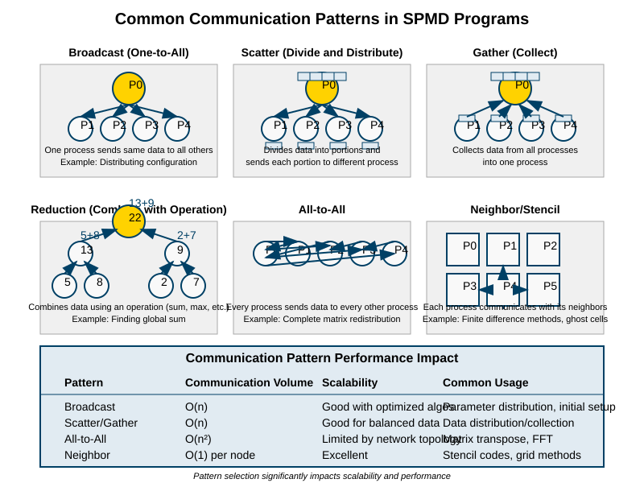

# Parallel Programming: Concepts and Strategies
## GWU ECE 6125: Parallel Computer Architecture

---

## Lecture Roadmap

| Part | Topic | Key Question |
|------|-------|-------------|
| 1 | **Introduction** | Why can't we just make one core faster? |
| 2 | **Thinking in Parallel** | What kinds of parallelism exist? |
| 3 | **Decomposition** | How do we split a problem into parallel pieces? |
| 4 | **Assignment & Load Balancing** | How do we map pieces to processors efficiently? |
| 5 | **Orchestration & Synchronization** | How do parallel pieces coordinate safely? |

Note: This lecture covers the **software side** of parallel computing. The previous lectures covered hardware (interconnects, cache coherence). Now we ask: given all that hardware, how do programmers actually use it? The framework is: Decompose → Assign → Orchestrate → Map. Every parallel program, from a simple OpenMP loop to a thousand-node MPI simulation, follows this pattern.

---

## Key Terms for This Lecture

| Abbreviation | Full Name | What It Is |
|---|---|---|
| **SIMD** | Single Instruction, Multiple Data | One instruction operates on many data elements at once (e.g., adding 4 floats in one cycle) |
| **SPMD** | Single Program, Multiple Data | Same program runs on every processor, but each processes a different chunk of data |
| **MPI** | Message Passing Interface | A library standard for sending/receiving data between processors in distributed memory systems |
| **OpenMP** | Open Multi-Processing | Compiler directives (`#pragma omp`) for shared-memory parallelism on multi-core CPUs |
| **CUDA** | Compute Unified Device Architecture | NVIDIA's programming model for running code on GPUs |

Note: Students often confuse SIMD and SPMD. SIMD is a hardware feature — the CPU has wide registers that process multiple data elements per instruction (like Intel AVX-512). SPMD is a programming model — you write one program, and the runtime launches many copies, each working on different data. CUDA kernels are SPMD: thousands of threads run the same function on different array elements.

---

## Part 1: Introduction to Parallel Programming

### Why Can't We Just Make One Core Faster?

Note: This is the fundamental question. If we could keep doubling single-core speed, we wouldn't need parallel programming at all. The three "walls" explain why that's no longer possible.

---

## What is Parallel Programming?

**Parallel programming** means writing software that breaks a computation into pieces that execute simultaneously on multiple processors.

| Sequential | Parallel |
|---|---|
| One task at a time, one after another | Multiple tasks running at the same time |
| Simple to write and debug | Harder to write, but potentially much faster |
| Limited by single-core speed | Scales with number of processors |

> **Analogy:** Building a house with 1 worker vs. 10 workers. More workers *can* finish faster — but only if you plan who does what, avoid conflicts (two workers painting the same wall), and coordinate handoffs (electrician finishes before drywaller starts).


Note: The house analogy is useful because it illustrates all the key challenges: decomposition (divide the house into tasks), assignment (who does what), synchronization (electrician before drywaller), and communication overhead (workers coordinating). It also shows that 10 workers ≠ 10× speedup — some tasks are sequential (pouring the foundation).

---

## Why Parallelism? The Three Walls

| Wall | What Happened | Consequence |
|---|---|---|
| **Power Wall** | Higher clock speeds → exponential heat increase (power ∝ frequency³) | Clock speeds plateaued at ~4-5 GHz around 2005 |
| **Memory Wall** | Processor speed grew 50%/year, memory speed grew 7%/year | CPUs spend most time waiting for memory |
| **ILP Wall** | Instruction-Level Parallelism has diminishing returns | Superscalar techniques (branch prediction, out-of-order) can only extract so much parallelism from sequential code |

**The industry's answer:** Stop making cores faster. Instead, put **more cores** on the chip and let software use them in parallel.


Note: The "Power Wall" is the most intuitive: Intel's Pentium 4 Prescott (2004) hit 130W at 3.8 GHz and was a thermal disaster. The industry pivoted to multi-core with Intel Core 2 Duo (2006). Moore's Law continues (transistor count doubles every ~2 years) but those transistors now go into more cores, not faster single cores. This is why parallel programming went from a niche HPC skill to something every programmer needs.

---

## Amdahl's Law: The Fundamental Limit

**If a fraction *s* of your program is inherently serial (cannot be parallelized), then the maximum speedup with *P* processors is:**

$$Speedup = \frac{1}{s + \frac{1-s}{P}}$$

| Serial fraction (*s*) | Max speedup (P → ∞) | Implication |
|---|---|---|
| 50% | 2× | Half the program is serial → never faster than 2× |
| 10% | 10× | 10% serial → 1000 processors give you at most 10× |
| 5% | 20× | Even 5% serial caps you at 20× |
| 1% | 100× | Only with 1% serial can you approach 100× |

**The lesson:** Before parallelizing, identify and minimize the serial fraction. Adding more processors doesn't help if the serial bottleneck dominates.


Note: Amdahl's Law is arguably the single most important equation in parallel computing. It tells you the theoretical ceiling before you write a single line of code. In practice, real speedups are even lower because of communication overhead, synchronization costs, and load imbalance — none of which Amdahl's Law accounts for. Gustafson's Law (covered next) provides a more optimistic perspective for certain workloads.

---

## Strong Scaling vs. Weak Scaling

Amdahl's Law assumes a **fixed problem size** — that's called strong scaling. But in practice, when we get more processors, we often want to solve **bigger problems**, not just the same problem faster.

| | Strong Scaling | Weak Scaling |
|---|---|---|
| **Problem size** | Fixed | Grows with processor count |
| **Goal** | Solve the same problem faster | Solve a bigger problem in the same time |
| **Governed by** | Amdahl's Law | Gustafson's Law |
| **Example** | Weather forecast: same grid, more CPUs → faster result | Weather forecast: finer grid with more CPUs → same time, better resolution |
| **Typical limit** | Serial fraction caps speedup | Communication overhead caps efficiency |


Note: In HPC, weak scaling is often more relevant. When scientists get access to a bigger supercomputer, they don't run the same simulation faster — they increase the resolution or add more physics. Machine learning training is similar: more GPUs often means training on larger batches or larger models, not just training the same model faster.

---

## Challenges in Parallel Programming

| Challenge | What Goes Wrong | Real-World Example |
|---|---|---|
| **Concurrency** | Multiple threads conflict over shared data | Two database transactions updating the same row |
| **Synchronization** | Overhead of coordinating access to shared resources | 8 threads waiting for 1 lock → 7 threads idle |
| **Load imbalance** | Some processors finish early and wait for others | Sparse matrix: some rows have 10 elements, others have 10,000 |
| **Communication overhead** | Time spent sending data between processors | MPI simulation: 30% of runtime is message passing, not computation |
| **Scalability** | Adding more processors gives diminishing returns | Amdahl's Law: 5% serial code caps speedup at 20× |
| **Debugging** | Bugs are non-deterministic — they appear sometimes and disappear when you add print statements | Race condition in a web server crashes 1 in 10,000 requests |

> "Making sequential programs run in parallel is so hard that it is considered one of computer science's grand challenges." — Tim Mattson, Intel

Note: The debugging challenge deserves emphasis. Sequential bugs are reproducible — run the same input, get the same crash. Parallel bugs depend on timing: thread A might finish before thread B 99% of the time, but the 1% where B finishes first causes a data corruption that doesn't manifest until millions of operations later. This is called a **heisenbug** — it disappears when you try to observe it (because adding debug output changes the timing).

---

## Part 2: Thinking in Parallel

### What Kinds of Parallelism Exist?

Note: Before writing parallel code, you need to recognize what kind of parallelism your problem offers. Not all problems decompose the same way. This section covers the three fundamental types and two key programming models.

---

## The Parallel Programmer's Mindset

| Sequential Thinking | Parallel Thinking |
|---|---|
| "What is the **next step**?" | "What can be done **at the same time**?" |
| Focus on order of operations | Focus on **independence** of operations |
| One path through the code | Many paths, each on different data or tasks |
| Debug by stepping through | Debug by reasoning about **all possible interleavings** |

**Three questions to ask about any computation:**
1. Which operations are **independent** of each other? (Can run in parallel)
2. Which operations **depend** on another's result? (Must be sequential)
3. Which operations **share data**? (Need synchronization)

Note: The mental shift is genuinely hard. Students trained on sequential algorithms tend to think step-by-step. Parallel thinking requires looking at the entire computation and asking "what CAN happen simultaneously?" A useful exercise: take any algorithm you know, draw its dependency graph, and identify the longest chain of dependent operations — that's your serial bottleneck.

---

## Types of Parallelism

| Type | What It Means | Example | Scales With |
|---|---|---|---|
| **Data Parallelism** | Same operation applied to different data elements | Apply a blur filter to each pixel in an image | Data size (more pixels → more parallelism) |
| **Task Parallelism** | Different operations run at the same time on different (or same) data | Game engine: physics, rendering, and AI run in parallel | Number of distinct tasks |
| **Pipeline Parallelism** | Data flows through a series of stages; different data items are at different stages simultaneously | Video processing: decode → filter → encode | Number of stages × stream length |

**Which is most common?** Data parallelism dominates in practice because most large-scale computations (matrix algebra, image processing, neural network training) involve applying the same operation to millions of data elements.


Note: These three types are not mutually exclusive. A real system often uses all three: a video encoder uses pipeline parallelism (decode → process → encode stages), data parallelism within each stage (process many pixels at once), and task parallelism (audio encoding runs in parallel with video encoding). The important thing is recognizing which type fits your problem best, because the decomposition and assignment strategies differ.

---

## Case Study: Parallelism in Image Processing

**An image is a 2D array of pixels — one of the most naturally parallel data structures.**

| Parallelism Level | What It Does | Speedup | When to Use |
|---|---|---|---|
| **Pixel-level** | Each pixel processed independently | Near-linear (embarrassingly parallel) | Point operations: brightness, contrast, threshold |
| **Block-level** | Blocks of pixels (e.g., 16×16 tiles) processed in parallel | Near-linear, better cache behavior | Convolutions, blur, edge detection |
| **Pipeline** | Load → Process → Save stages overlap | Bounded by slowest stage | Batch processing thousands of images |

**"Embarrassingly parallel"** = a problem where the parallel pieces have **zero dependencies** between them. No synchronization needed, no communication needed. The parallelism is so obvious it's almost embarrassing.


Note: Image processing is the go-to example because students can visualize it. Instagram filters, Photoshop adjustments, medical image analysis — these all process millions of pixels with the same operation. The key insight is that operations like "add 10 to every pixel's brightness" have zero data dependencies between pixels, so they scale perfectly. Operations like blur require neighbor pixels (stencil pattern), which introduces boundary communication but is still highly parallel.

---

## The SPMD Model (Single Program, Multiple Data)

**The dominant parallel programming pattern.** One program is written once, and the runtime launches many copies — each copy uses its unique ID to decide which data to work on.

```c
// OpenMP example: SPMD-style parallel loop
#pragma omp parallel
{
    int tid = omp_get_thread_num();      // My unique ID (0, 1, 2, ...)
    int chunk = N / omp_get_num_threads();
    int start = tid * chunk;
    int end = start + chunk;

    for (int i = start; i < end; i++)
        result[i] = process(data[i]);    // Same function, different data
}
```

**Used everywhere:** MPI programs, CUDA kernels, OpenMP parallel regions, MapReduce jobs.

Note: SPMD is so widespread because it's conceptually simple: same code, different data. CUDA takes this to the extreme — a GPU kernel launches thousands of threads, each computing one output element. The programmer writes the code for ONE thread, and the hardware replicates it. The `threadIdx` in CUDA is the equivalent of `omp_get_thread_num()` in OpenMP.

---

## Shared Memory vs. Distributed Memory

These are the two fundamental hardware models that determine how parallel programs communicate:

| | Shared Memory | Distributed Memory |
|---|---|---|
| **How processors communicate** | Read/write to the same memory (connected by cache coherence, covered in Lecture 06) | Send messages to each other over a network |
| **Programming model** | OpenMP, Pthreads — threads share variables | MPI — processes send/receive messages explicitly |
| **Hardware example** | Multi-core CPU (all cores share DRAM) | Cluster of servers connected by InfiniBand |
| **Advantage** | Easy to program (just read/write shared variables) | Scales to thousands of nodes |
| **Disadvantage** | Limited to one machine; cache coherence overhead | Programmer must manage all data movement explicitly |
| **Synchronization** | Locks, atomics, barriers | Message send/receive acts as implicit synchronization |


Note: Most real HPC systems are hybrid — shared memory within a node (32-128 cores sharing DRAM), distributed memory between nodes (MPI over InfiniBand). This means production HPC code often uses MPI+OpenMP: MPI between nodes, OpenMP within each node. Understanding both models is essential. The cache coherence protocols from Lecture 06 are what make shared memory work — without MESI/MOESI, shared-memory programming would be impossible.

---

## Parallel Programming Models Comparison

| Model | Memory Type | Parallelism | Typical Scale | Best For |
|---|---|---|---|---|
| **OpenMP** | Shared | Compiler directives (`#pragma omp`) | 1–128 cores | Loop parallelism on multi-core CPUs |
| **MPI** | Distributed | Explicit message passing | 1–1,000,000+ cores | Large-scale HPC simulations |
| **CUDA** | GPU device memory | SPMD kernel launch | 1,000–100,000 GPU threads | Matrix algebra, neural networks, image processing |
| **Pthreads** | Shared | Manual thread management | 1–64 threads | Fine-grained control, OS-level programming |



Note: OpenMP is the easiest entry point — add a `#pragma omp parallel for` to an existing loop and the compiler handles thread creation. MPI is harder but necessary for anything beyond one machine. CUDA requires rethinking your algorithm for GPU architecture (thousands of lightweight threads, coalesced memory access). In practice, the choice depends on your hardware: single multi-core machine → OpenMP, cluster → MPI, GPU → CUDA.

---

## Part 3: Decomposition

### How Do We Split a Problem into Parallel Pieces?

> **Decomposition** is the first step: break the problem into pieces that can execute concurrently. Get this wrong, and no amount of clever scheduling can save you.

Note: Decomposition is the most important design decision in parallel programming. It determines how much parallelism is available, how much communication is required, and whether load can be balanced. A bad decomposition can make a parallel program slower than the sequential version.

---

## Task Decomposition vs. Data Decomposition

| | Task Decomposition | Data Decomposition |
|---|---|---|
| **Divide by** | Functionality — different tasks do different things | Data — same task applied to different chunks |
| **Tasks are** | Often heterogeneous (different sizes, different work) | Usually homogeneous (same work per chunk) |
| **Example** | Game engine: physics thread, render thread, AI thread | Matrix multiply: each processor computes a block of rows |
| **Communication** | Tasks exchange results at defined points | Processors exchange boundary data |
| **Load balance** | Harder (tasks vary in size) | Easier (chunks are usually equal) |

**Rule of thumb:** If your problem is "apply the same operation to lots of data" → data decomposition. If your problem is "do several different things" → task decomposition.


Note: Data decomposition is far more common in scientific computing and machine learning because the dominant operations (matrix multiply, convolution, stencil computation) are applying the same operation to large arrays. Task decomposition appears more in systems programming (web servers with worker threads, game engines with physics/render/AI threads).

---

## Example: Summing an Array in Parallel

**Sequential:**
```c
long sum = 0;
for (int i = 0; i < N; i++)
    sum += array[i];
```

**Parallel (data decomposition + tree reduction):**
```c
// Step 1: Each processor sums its chunk
#pragma omp parallel reduction(+:sum)
{
    for (int i = start; i < end; i++)
        sum += array[i];
}
// OpenMP's reduction clause handles the tree reduction automatically
```

**Tree reduction:** Combine partial sums in log₂(P) steps instead of P steps.

| 8 processors | Step 1 | Step 2 | Step 3 (final) |
|---|---|---|---|
| P0+P1 → | S01 | | |
| P2+P3 → | S23 | S01+S23 → S0123 | |
| P4+P5 → | S45 | | |
| P6+P7 → | S67 | S45+S67 → S4567 | S0123+S4567 = **Total** |

**3 steps** instead of 7 sequential additions.

Note: Tree reduction is a fundamental parallel primitive. It appears everywhere: summing arrays, finding min/max, computing dot products, aggregating neural network gradients across GPUs. MPI provides `MPI_Reduce()` and `MPI_Allreduce()` which implement optimized tree reductions automatically. OpenMP's `reduction` clause does the same for shared memory.

---

## Choosing a Decomposition Strategy

| Problem Pattern | Best Decomposition | Example |
|---|---|---|
| Regular data operations with uniform work | **Data decomposition (block)** | Matrix multiply, image filtering |
| Regular data with varying work per element | **Data decomposition (cyclic)** | Sparse matrix with uneven row sizes |
| Distinct computational phases | **Task decomposition** | Game: physics + rendering + AI |
| Complex, irregular dependencies | **Hybrid (task + data)** | Adaptive mesh refinement, graph algorithms |
| Streaming data through processing stages | **Pipeline decomposition** | Video encoding, compiler stages |

Note: The decision isn't always obvious. A weather simulation might use data decomposition (divide the atmosphere grid into blocks per processor), but the computational work per block varies — ocean vs. mountain terrain requires different physics. This leads to load imbalance. Adaptive mesh refinement is the hardest case: the mesh changes at every timestep, so the decomposition must change too.

---

## Decomposition Granularity

**How small should each parallel piece be?**

| Granularity | Pieces | Communication | Load Balance | Best When |
|---|---|---|---|---|
| **Fine-grained** | Many small tasks (e.g., one matrix *element* per task) | High overhead — lots of synchronization | Excellent — easy to distribute evenly | Shared memory with low sync cost |
| **Coarse-grained** | Few large tasks (e.g., one matrix *row block* per task) | Low overhead — infrequent communication | Risky — some processors may finish early | Distributed memory with high message cost |
| **Adaptive** | Start coarse, split if load is imbalanced | Medium — adjusts at runtime | Good — self-correcting | Irregular workloads (graph algorithms) |

**The trade-off:** Finer granularity → better load balance but higher overhead. Coarser → lower overhead but risk of imbalance. The optimal point depends on your hardware's synchronization cost.

Note: On a shared-memory system (OpenMP), synchronization is cheap (a few hundred cycles for an atomic operation), so fine granularity works well. On a distributed system (MPI), each message costs microseconds of latency plus bandwidth, so you want large chunks. This is why MPI programs typically decompose into P chunks (one per processor) while OpenMP programs can have thousands of tiny tasks.

---

## Data Distribution Patterns

When doing data decomposition, how you distribute data across processors matters for both **load balance** and **cache locality**:

| Pattern | How It Works | Pros | Cons |
|---|---|---|---|
| **Block** | Processor 0 gets elements 0–99, P1 gets 100–199, etc. | Good spatial locality, simple indexing | Poor balance if work varies by region |
| **Cyclic** | P0 gets 0, 4, 8…; P1 gets 1, 5, 9…; etc. | Better balance for irregular work | Poor spatial locality (cache misses) |
| **Block-cyclic** | Blocks of *k* elements distributed round-robin | Balances locality and load | More complex indexing |

**Block-cyclic** is the default in ScaLAPACK (Scalable Linear Algebra PACKage) — a widely-used library for distributed dense matrix operations.

Note: The choice of distribution pattern has real performance impact. In a sparse matrix-vector multiply, block distribution assigns each processor a contiguous range of rows. If the matrix is triangular, processors assigned to the top rows (few nonzeros) finish much faster than processors assigned to the bottom rows (many nonzeros). Cyclic distribution spreads the work more evenly but destroys cache locality. Block-cyclic is the compromise.

---

## Part 4: Assignment & Load Balancing

### How Do We Map Pieces to Processors?

> After decomposition gives us parallel pieces, **assignment** decides which processor executes which piece. The goal: keep all processors busy for the entire computation.

Note: Assignment is separate from decomposition because the same decomposition can be assigned in different ways. You might decompose a matrix into 1000 blocks but only have 64 processors — the assignment decides which processor gets which blocks, and whether that mapping is fixed or changes at runtime.

---

## Static vs. Dynamic Assignment

| | Static Assignment | Dynamic Assignment |
|---|---|---|
| **When decided** | Before execution (compile time or program start) | During execution (runtime) |
| **How it works** | Each processor gets a fixed set of tasks | Processors grab tasks from a shared queue as they become available |
| **Overhead** | Very low — no runtime scheduling | Higher — queue management, task migration |
| **Load balance** | Good only if work is **predictable and uniform** | Good for **irregular or unpredictable** workloads |
| **Example** | Dense matrix multiply: each processor gets a fixed block | Graph traversal: nodes have unpredictable work |

**When to use which:** If you can predict the work per task at compile time → static. If work varies unpredictably → dynamic.

Note: Static assignment works beautifully for regular computations like dense linear algebra, stencil codes, and image processing where every element requires the same work. Dynamic assignment shines for irregular problems like graph algorithms (some nodes have 2 edges, others have 10,000), recursive divide-and-conquer, and adaptive mesh refinement where the mesh changes at every timestep.

---

## Load Balancing Strategies

| Strategy | How It Works | Best For | Overhead |
|---|---|---|---|
| **Block distribution** | Contiguous chunks to each processor | Uniform workloads with good locality | Lowest |
| **Cyclic distribution** | Round-robin assignment | Workloads where cost varies by position | Low |
| **Work stealing** | Idle processors "steal" tasks from busy processors' queues | Unpredictable task sizes | Medium |
| **Centralized task queue** | All processors pull from a shared pool | Many small, independent tasks | Medium-High (queue contention) |
| **Hybrid** | Static across nodes + dynamic within each node | Large-scale clusters | Depends on mix |

**Work stealing** is the most important dynamic technique — it's used by Intel TBB (Threading Building Blocks), Java ForkJoinPool, Go goroutines, and Rust's Rayon library.


Note: Work stealing deserves special attention. Each processor maintains its own deque (double-ended queue) of tasks. When a processor finishes its tasks, it randomly picks another processor and steals from the BOTTOM of that processor's deque. This is brilliant because: (1) the victim doesn't notice the theft most of the time (it works from the top), (2) stolen tasks tend to be large (recursive algorithms put coarse tasks at the bottom), and (3) it's fully decentralized — no single bottleneck.

---

## Part 5: Orchestration & Synchronization

### How Do Parallel Pieces Coordinate Safely?

> Decomposition splits the work. Assignment maps it to processors. **Orchestration** ensures the pieces execute correctly — managing dependencies, protecting shared data, and coordinating completion.


Note: Orchestration is where most parallel programming bugs live. Getting the decomposition right is a design challenge; getting the synchronization right is an implementation challenge. Race conditions, deadlocks, and livelocks are all orchestration failures.

---

## Communication Patterns

Parallel tasks need to exchange data. These are the fundamental patterns:

| Pattern | Description | Example |
|---|---|---|
| **Point-to-point** | One sender, one receiver | MPI_Send / MPI_Recv between two processors |
| **Broadcast** | One sender, all receivers | Master sends parameters to all workers |
| **Scatter** | One sender distributes pieces to all | Distributing array chunks to processors |
| **Gather** | All senders, one receiver collects | Collecting partial results from all processors |
| **All-to-all** | Every processor sends to every other | Transpose of a distributed matrix |
| **Reduce** | Combine values from all processors into one result | Sum, max, min across all processors |



Note: MPI provides optimized implementations of all these patterns as "collective operations" (`MPI_Bcast`, `MPI_Scatter`, `MPI_Gather`, `MPI_Reduce`, `MPI_Allreduce`). Using collective operations instead of hand-coded point-to-point messages is almost always faster — the MPI library uses tree-based algorithms internally, and on modern networks (InfiniBand), it can exploit hardware support for multicast and reduction.

---

## Types of Dependencies

Before adding synchronization, identify what **actually** needs coordination:

| Dependency Type | What It Is | Example | Requires |
|---|---|---|---|
| **Data dependency** | Task B needs the output of Task A | Sort result needed before binary search | Wait for A to complete |
| **Control dependency** | Task execution depends on a condition | Process data only after validation passes | Conditional synchronization |
| **Resource dependency** | Multiple tasks need the same resource | Multiple threads writing to the same log file | Mutual exclusion (lock) |

**Key insight:** Only add synchronization where a real dependency exists. **Over-synchronization** (locking things that don't need locking) is the #1 performance killer in parallel programs.

Note: A useful exercise: draw the dependency graph of your computation. Nodes are tasks, edges are dependencies. The longest path through the graph is the **critical path** — it determines the minimum possible execution time regardless of how many processors you have. This connects directly to Amdahl's Law: the serial fraction IS the critical path.

---

## Race Conditions: What Can Go Wrong

A **race condition** occurs when the program's correctness depends on the **timing** of thread execution — and different timings give different (wrong) results.

**Classic example — shared counter:**
```c
// BUG: Two threads incrementing a shared counter
// "counter++" is actually three steps: load, add 1, store
//
// Thread A: load counter (=0)
//                                Thread B: load counter (=0)
// Thread A: add 1 → 1
//                                Thread B: add 1 → 1
// Thread A: store 1
//                                Thread B: store 1
//
// Expected: counter = 2. Actual: counter = 1. Lost update!
```

**Three fixes, different trade-offs:**

| Fix | Code | Overhead |
|---|---|---|
| **Atomic operation** | `atomic_fetch_add(&counter, 1);` | Lowest — hardware instruction |
| **Lock (mutex)** | `lock(m); counter++; unlock(m);` | Medium — thread may wait |
| **Thread-local + reduce** | Each thread has local counter, combine at end | Lowest contention, more code |

Note: This connects directly to cache coherence from Lecture 06. When Thread A writes counter, the cache line enters M state on A's core. When Thread B writes, it invalidates A's line — this is the coherence protocol doing its job. But the protocol ensures memory is consistent, NOT that the load-add-store sequence is atomic. That's why we need explicit atomic operations or locks. The `atomic_fetch_add` instruction uses a hardware lock on the cache line (LL/SC on ARM, LOCK prefix on x86).

---

## Synchronization Tools

| Tool | How It Works | Use When | Overhead | Danger |
|---|---|---|---|---|
| **Mutex (lock)** | Only one thread can hold the lock at a time; others wait | Protecting a critical section (shared data structure) | Medium — threads block and context-switch | **Deadlock** if locks acquired in wrong order |
| **Reader-Writer Lock** | Multiple readers OR one writer (not both) | Reads are frequent, writes are rare (e.g., config data) | Medium | Starvation of writers |
| **Semaphore** | Counter that allows up to *N* concurrent accesses | Limiting concurrency (e.g., 3 threads accessing a DB pool) | Medium | Complex to reason about |
| **Barrier** | All threads must arrive before any can proceed | Phase-based algorithms (all finish step N before step N+1) | Can be high — slowest thread determines wait time | Over-use → serialization |
| **Atomic operation** | Hardware-supported indivisible read-modify-write | Simple counters, flags, compare-and-swap | Lowest | Only works for simple operations |


Note: The choice of synchronization tool has enormous performance impact. A mutex on a hot counter accessed by 64 threads will serialize almost all work — threads spend their time waiting for the lock instead of computing. Compare-and-swap (CAS) avoids the lock entirely: each thread reads the counter, adds 1, and attempts to write back the new value — if another thread changed it in the meantime, it retries. This is the basis of lock-free programming, used extensively in database engines, operating systems, and concurrent data structures.

---

## Deadlocks: When Everyone Waits Forever

A **deadlock** occurs when two or more threads are each waiting for a resource held by another — and none can proceed.

**Classic scenario:**
```c
// Thread A                    // Thread B
lock(mutex_1);                 lock(mutex_2);
lock(mutex_2);  // BLOCKED     lock(mutex_1);  // BLOCKED
// waiting for B               // waiting for A
// → DEADLOCK: neither can proceed
```

**Four conditions (all must be true for deadlock):**
1. **Mutual exclusion** — resource can only be held by one thread
2. **Hold and wait** — thread holds one resource while waiting for another
3. **No preemption** — resources can't be forcibly taken away
4. **Circular wait** — A waits for B, B waits for A

**Prevention:** Break any one condition. The easiest: **always acquire locks in the same global order.** If every thread locks mutex_1 before mutex_2, circular wait is impossible.

Note: Deadlocks are devastating in production systems because they cause the program to hang silently — no crash, no error message, just frozen. Database systems handle this with deadlock detection: they track the wait-for graph and if a cycle is detected, one transaction is aborted and retried. Operating systems use the same approach. In parallel programming, the simpler prevention strategy (global lock ordering) is preferred because detection adds runtime overhead.

---

## Part 6: Putting It All Together — The Four-Step Framework

Every parallel program follows these four steps:

| Step | Question | Techniques Covered |
|---|---|---|
| **1. Decompose** | How to split the problem? | Data decomposition, task decomposition, pipeline |
| **2. Assign** | Which processor gets which piece? | Static (block, cyclic) vs. dynamic (work stealing, task queue) |
| **3. Orchestrate** | How do pieces coordinate? | Locks, barriers, atomics, message passing |
| **4. Map** | How does this map to real hardware? | Shared memory (OpenMP) vs. distributed (MPI) vs. GPU (CUDA) |

> **Next lecture:** We'll apply this framework to real parallel algorithms — matrix multiplication, sorting, and graph algorithms — using OpenMP, MPI, and CUDA.

Note: This four-step framework comes from Culler, Singh, and Gupta's "Parallel Computer Architecture" textbook. It provides a systematic way to approach any parallel programming problem. The order matters: decomposition determines what's possible, assignment determines efficiency, orchestration determines correctness, and mapping determines which hardware features you can exploit. In the next lecture, we'll see these steps applied to concrete algorithms.
