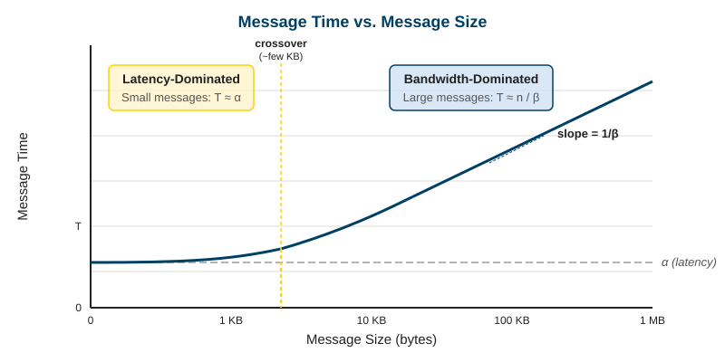
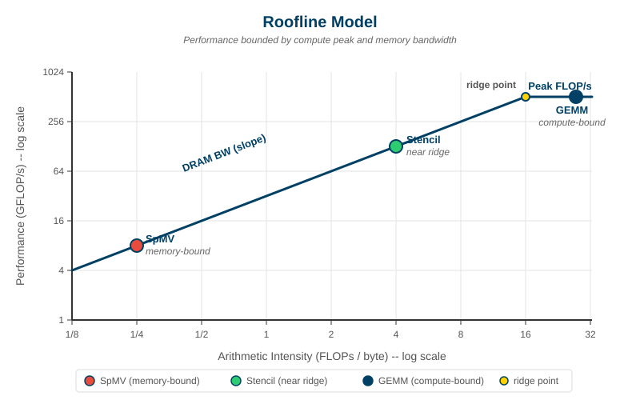
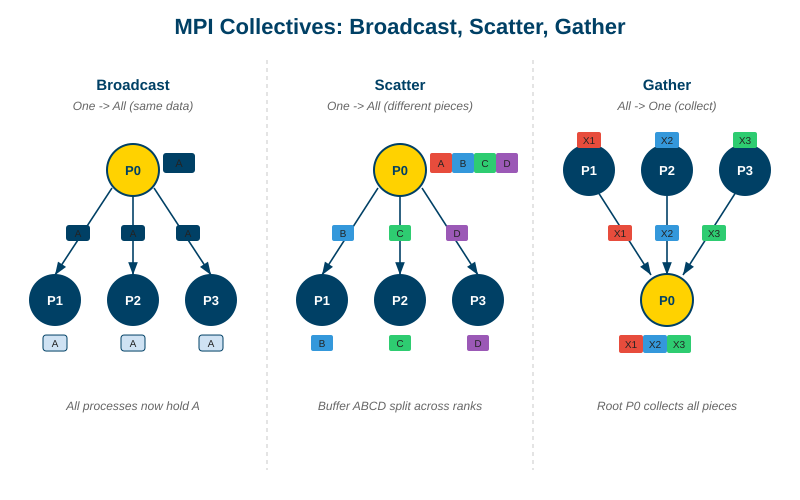
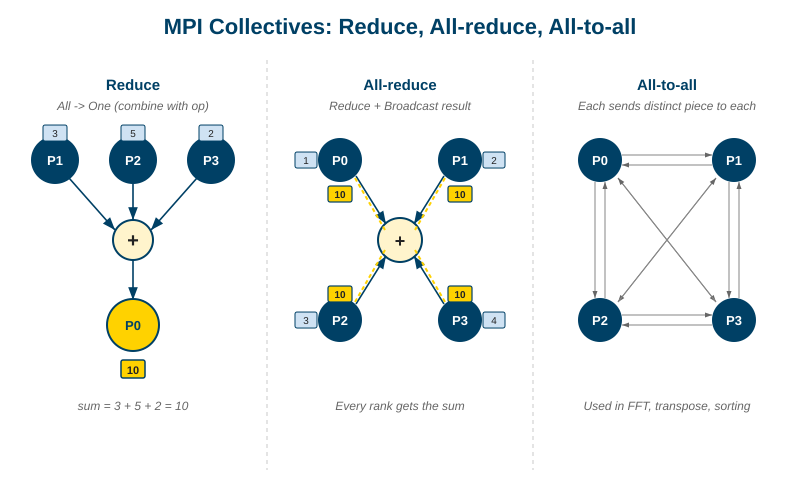
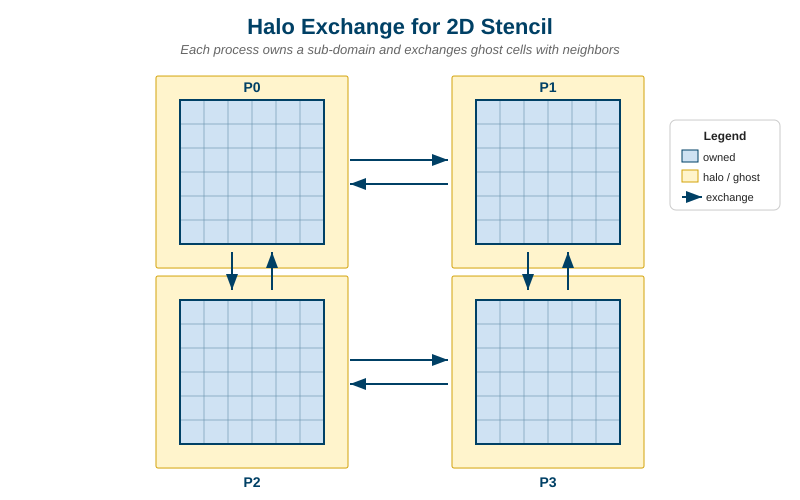
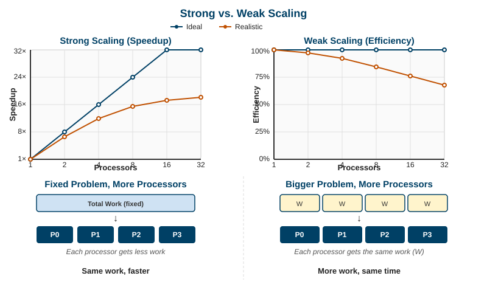
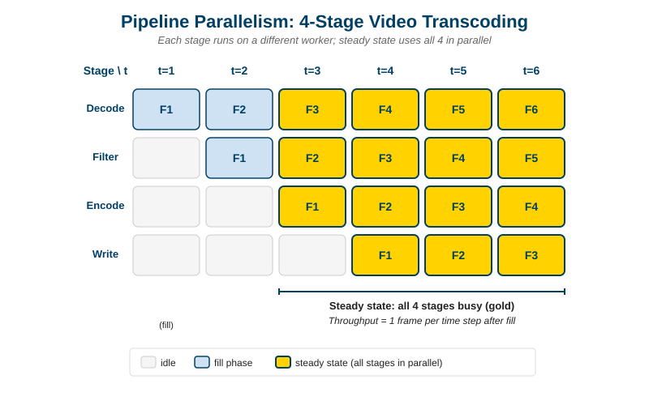
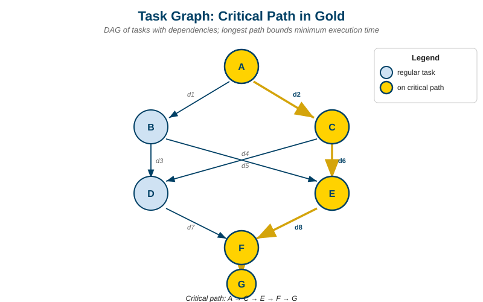
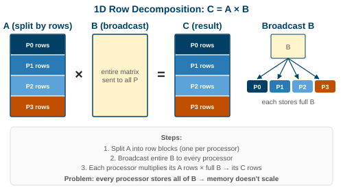
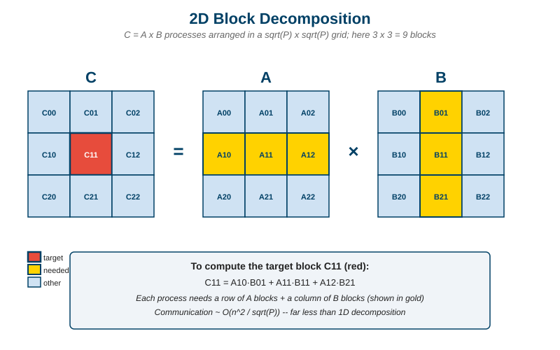

# Parallel Programming II
## Communication, Scaling, and Patterns
### GWU ECE 6125: Parallel Computer Architecture

---

## Lecture Roadmap

| Part | Topic | Key Question |
|------|-------|-------------|
| 1 | **Communication Costs** | Why is moving data -- not computing -- the real bottleneck? |
| 2 | **Communication Patterns** | Broadcast, scatter, gather, all-to-all, stencil -- when to use which? |
| 3 | **Scaling Laws in Depth** | When does doubling processors double performance? |
| 4 | **Parallel Patterns** | What reusable templates solve most parallel problems? |
| 5 | **Programming Models** | MPI, OpenMP, CUDA, PGAS, Spark -- how do we pick? |
| 6 | **Case Study** | End-to-end: parallel matrix multiply with real numbers |
| 7 | **Modern Context** | Heterogeneous, cloud, energy, fault tolerance |
| 8 | **Pitfalls & Wrap-Up** | What goes wrong, and how to avoid it |

Note: Lecture 7 gave you the four-step framework (decompose → assign → orchestrate → map) and Amdahl's Law. This lecture goes deeper into what makes real parallel programs fast or slow -- and the answer is almost always communication, not computation. We'll assume you already know the basics of decomposition, synchronization, and SPMD from Lecture 7.

---

## Part 1: Communication Costs

### Why moving data dominates everything

Note: Before we can pick the right programming model or pattern, we need to understand how expensive communication actually is. The numbers are shocking -- and they shape every design decision in parallel computing.

---

## The Central Truth of Parallel Computing

> **Modern hardware computes far faster than it moves data. Performance is almost always limited by communication, not computation.**

A single CPU core in 2026 can execute ~10 billion floating-point operations per second. But reading one value from DRAM takes ~100 nanoseconds -- during which the core could have done **1,000 floating-point operations**.

**Analogy:** Imagine a chef who can chop vegetables at superhuman speed, but the pantry is a 10-minute walk away. The chef's peak speed is irrelevant -- the walking time decides how many meals get made.

> **Think about it:** What strategies can we use to hide or reduce the cost of moving data? We've already seen the hardware's answers -- caches, coherence protocols, fast interconnects. Today's question: what can the *programmer* do?

Note: This fact explains almost everything about modern parallel architecture. Why do we have caches? To avoid the walk. Why are GPUs fast for ML? Because matrix multiply does O(n³) work on O(n²) data -- the ratio of compute to communication is high. Why is all-reduce the hot topic in distributed training? Because it's the step that limits how many GPUs you can usefully throw at a model. The question at the end bridges prior lectures (hardware solutions) to today's content (software solutions): overlapping communication with computation, choosing the right collective, raising arithmetic intensity, and picking the right programming model.

---

## Latency, Bandwidth, and Arithmetic Intensity

Three numbers define the cost of every communication:

| Term | Definition | Units |
|---|---|---|
| **Latency ($\alpha$)** | Time to deliver *one* message, independent of size | microseconds (μs) |
| **Bandwidth ($\beta$)** | Steady-state data rate for large transfers | gigabytes/second (GB/s) |

$$T_{\text{message}} = \alpha + \frac{n}{\beta}$$

where $n$ is the message size in bytes. For small $n$, **latency dominates**. For large $n$, **bandwidth dominates**.



> **Arithmetic intensity** $= \frac{\text{FLOPs performed}}{\text{bytes communicated}}$. Low → memory-bound. High → compute-bound.

Note: Arithmetic intensity is the single most useful number to compute when you're analyzing a parallel algorithm. Dense matrix multiply has high intensity (~n operations per byte loaded, with blocking). Sparse matrix-vector multiply has low intensity (~2 operations per byte). This tells you before writing a line of code whether your algorithm will scale.

---

## A Table You Should Memorize

Approximate costs on a modern system (2026):

| Operation | Latency | Bandwidth |
|---|---|---|
| L1 cache access | ~1 ns | ~1 TB/s |
| L3 cache access | ~10 ns | ~400 GB/s |
| Local DRAM access | ~100 ns | ~100 GB/s |
| Remote DRAM (NUMA) | ~200 ns | ~50 GB/s |
| NVLink (GPU↔GPU, same node) | ~1 μs | ~900 GB/s |
| InfiniBand (node↔node) | ~1–2 μs | ~50 GB/s |
| Ethernet (cloud, cross-rack) | ~50 μs | ~25 GB/s |
| Cross-region WAN | ~50 ms | varies |

Note: Every step down this table is roughly 10× slower than the one above it. Good parallel algorithms structure themselves around this hierarchy: do as much work as possible at the top of the table, and move data across the expensive boundaries only when absolutely necessary. This is why GPU programmers obsess over shared memory and coalesced access -- they're fighting this table at every level.

---

## The Roofline Model

A picture of what limits your program:



- **Memory-bound region** (left): performance rises with arithmetic intensity -- you're limited by bandwidth
- **Compute-bound region** (right): performance plateaus at peak FLOP/s -- you're limited by the processor
- **Ridge point**: the intensity at which you transition

> If your kernel lands on the memory-bound slope, buying a faster CPU won't help. You need to raise arithmetic intensity -- by blocking, fusing operations, or changing the algorithm.

Note: The roofline model was popularized by Sam Williams at Berkeley around 2009 and is now the standard way performance engineers reason about kernels on CPUs, GPUs, and accelerators. NVIDIA Nsight, Intel Advisor, and AMD uProf all generate roofline plots automatically. If your point is well below the roof, you know there's headroom; if it's on the roof, further optimization requires architectural changes.

---

## The Cost of Synchronization

Communication isn't just data movement -- waiting counts too.

| Event | Typical Cost |
|---|---|
| Lock/unlock (uncontended) | ~20 ns |
| Lock (contended) | ~1 μs and up |
| Barrier across 16 threads (node) | ~1 μs |
| Barrier across 1000 MPI ranks | ~100 μs–1 ms |
| GPU kernel launch | ~5–10 μs |

> **Rule of thumb:** If you synchronize more often than you compute, no algorithm will scale.

Note: This is why kernel fusion is such a big deal on GPUs -- each kernel launch costs 10 μs, so if you have 100 tiny kernels you spend a millisecond just launching them. Fusing ten kernels into one saves 90 μs. The same idea applies to MPI: batching messages and overlapping communication with computation is the bread and butter of HPC optimization.

---

## Overlapping Communication with Computation

The single most effective optimization: **don't wait for messages**.

```c
// BAD: wait for receive, then compute (CPU idle during transfer)
MPI_Recv(buffer, ...);
compute(buffer);

// GOOD: start receive, compute on local data, then wait
MPI_Irecv(buffer, ..., &request);
compute_local_data();          // overlaps with network transfer
MPI_Wait(&request, &status);
compute(buffer);
```

- `MPI_Irecv` is **non-blocking** -- it returns immediately and the NIC fills the buffer in the background
- Hide as much communication latency as you can behind useful work
- The best case: communication takes zero observable time

Note: Non-blocking communication is the standard practice in production HPC codes. The technique applies everywhere -- async I/O in web servers, CUDA streams on GPUs, prefetching in CPU caches. All the same principle: start the slow thing early, do other work in the meantime, and ideally never wait.

---

## Part 2: Communication Patterns

### The vocabulary of parallel data exchange

Note: Nearly every parallel algorithm uses one or more of these patterns. Learning to recognize them lets you reach for the right MPI collective or NCCL call instead of hand-coding point-to-point messages.

---

## Collectives: One-to-Many and Many-to-One



| Pattern | Meaning | Typical Use |
|---|---|---|
| **Broadcast** | One process sends the *same* data to all | Distributing model weights, config |
| **Scatter** | One process sends *different* pieces to each | Handing out work chunks |
| **Gather** | Every process sends its piece to one collector | Assembling partial results |

> **Why use a collective instead of a loop of point-to-point sends?** The library uses tree-based algorithms: O(log P) steps instead of O(P). At 1024 processes, that's 10 steps vs. 1024.

Note: Every major parallel library (MPI, NCCL, Gloo, Horovod) has highly tuned collective implementations. Never hand-roll them. On modern networks these collectives even use hardware offload -- InfiniBand switches can perform reductions inside the network without ever sending data back to the host. Mellanox calls this SHARP; it's a real feature of the Quantum-2 switches powering most AI training clusters.

---

## Collectives: All-to-All and Reductions



| Pattern | Meaning | Typical Use |
|---|---|---|
| **Reduce** | Combine values from all → one result on one process | Sum, max, min |
| **All-reduce** | Combine, and the result ends up on *every* process | Averaging gradients in ML training |
| **All-to-all** | Every process sends a different chunk to every other | FFT, matrix transpose |

> **All-reduce is the hottest collective in the world.** Every step of training a neural network across N GPUs ends with an all-reduce to average the gradients. NVIDIA's NCCL and AMD's RCCL exist primarily to make it fast.

Note: Ring all-reduce -- invented by Baidu researchers around 2017 and popularized by Horovod -- achieves optimal bandwidth by arranging GPUs in a logical ring and passing partial sums around. Each GPU sends and receives at full bandwidth throughout. This is why you'll see Meta, Google, and OpenAI obsess over network topology: a bad topology can cut all-reduce bandwidth in half, which directly slows down LLM training.

---

## Stencils and Neighbor Exchange

Many scientific codes compute each point from its **neighbors**:

```c
new[i][j] = 0.25 * (old[i-1][j] + old[i+1][j]
                  + old[i][j-1] + old[i][j+1]);
```

When we split the grid across processes, **edge values** live on the neighbor:



- Each process owns a **block** of the grid
- It keeps a **halo** (ghost region) with copies of the neighbors' edges
- Before each step, processes exchange halos with their neighbors

> **Scalability is good**: communication is O(boundary), computation is O(area). Doubling the grid per processor halves the communication-to-computation ratio.

Note: This is the pattern behind weather simulation, computational fluid dynamics, seismic imaging, and finite-element analysis. The halo exchange is usually the bottleneck, and it's where non-blocking sends really shine -- start the exchange, compute the *interior* of the block (which doesn't need neighbor data), then wait and compute the boundary.

---

## Picking the Right Pattern

A decision table for common situations:

| You Need To… | Use |
|---|---|
| Send the same data to everyone | Broadcast |
| Split work among workers | Scatter |
| Assemble results | Gather |
| Compute a global statistic | Reduce / All-reduce |
| Rearrange data globally (e.g., FFT, transpose) | All-to-all |
| Share edges in a grid algorithm | Neighbor / halo exchange |
| Merge streaming updates | Reduction tree |

> **Wrong pattern = wasted bandwidth.** An all-to-all when broadcast would do is 100× more expensive.

Note: The biggest performance wins in real HPC codes come from *replacing* communication patterns, not tuning them. Someone writes a naive version that does O(P²) point-to-point messages, you notice it's really an all-reduce, and swap in MPI_Allreduce -- 100× speedup, no other changes. Pattern recognition is the single highest-leverage skill in performance engineering.

---

## Part 3: Scaling Laws in Depth

### When doubling processors actually doubles performance

Note: Lecture 7 introduced Amdahl's Law. Here we go deeper: what do "strong" and "weak" scaling really mean, when does each apply, and why is weak scaling the only thing that matters for modern ML?

---

## Strong Scaling vs. Weak Scaling

The two questions you can ask about parallel performance:

| Scaling | What's Fixed | What Changes | Question Answered |
|---|---|---|---|
| **Strong** | Problem size | Processor count | *Can I finish the same work faster?* |
| **Weak** | Work per processor | Problem size and processors grow together | *Can I solve a bigger problem in the same time?* |



> **Strong scaling hits a wall.** As you add processors to a fixed-size problem, the per-processor work shrinks until communication dominates. Speedup plateaus -- often well before theoretical maximum.

> **Weak scaling is more forgiving.** Communication usually grows slower than computation when the problem grows, so efficiency holds up much better.

Note: Here's the real-world punch line: modern ML training is designed around weak scaling. You don't train GPT-4 on a fixed dataset "faster" by adding more GPUs -- you train it on a *larger* model or larger batch. Amdahl's Law tells you strong scaling is hopeless past a few hundred GPUs. Gustafson's Law tells you weak scaling can reach tens of thousands, and this is what actually happens in every large training cluster.

---

## Amdahl vs. Gustafson: The Same Equation, Different Assumptions

**Amdahl (fixed problem size):**

`Speedup = 1 / (s + (1-s)/P)`

- As P → ∞, speedup → 1/s
- A 5% serial fraction caps speedup at 20×, no matter how many processors you throw at it

**Gustafson (fixed time, scale the problem):**

`Speedup = s + (1-s) * P`

- As P → ∞, speedup grows linearly
- Adding processors lets you solve a proportionally larger problem in the same wall-clock time

> **They don't contradict each other.** They answer different questions.

Note: When people say "Amdahl was wrong," they usually mean "we shouldn't optimize for fixed problem sizes." That's fair for HPC and ML, where the goal is often to solve problems that were previously impossible. But Amdahl is *still* the right answer if your problem size is genuinely fixed -- for example, a real-time simulation that must finish in 16 ms per frame. Know which question you're asking.

---

## Why Efficiency Drops as P Grows

Parallel efficiency = speedup ÷ P. Four forces push it below 1.0:

| Force | Why It Kills Efficiency |
|---|---|
| **Serial fraction** | Non-parallelizable code sets a hard ceiling (Amdahl) |
| **Communication overhead** | More processors → more messages and more synchronization |
| **Load imbalance** | The slowest processor sets the pace -- idle time wastes resources |
| **Contention** | Shared resources (memory, network, locks) saturate |

> **Quick diagnostic:** Run at P=2, 4, 8, 16, 32. Plot efficiency. The shape of the curve tells you which force dominates.

Note: The shape of the efficiency curve is diagnostic. A flat ~0.9 curve that suddenly drops at large P: you've hit a communication wall. A linearly decreasing curve from the start: load imbalance. A plateau at exactly some fraction: Amdahl's serial section. Different shapes point you to different fixes -- profile first, optimize second.

---

## Part 4: Parallel Patterns

### Reusable templates for parallel computation

Note: Just as object-oriented programming has design patterns (Factory, Observer, Strategy), parallel programming has a small set of templates that cover most problems. Learning these lets you recognize "oh, this is a map-reduce" and reach for the right library instead of reinventing the wheel.

---

## Map, Reduce, and Map-Reduce

**Map**: apply the same independent operation to every element.

```python
# Python / multiprocessing
result = pool.map(square, [1, 2, 3, 4, 5])
# → [1, 4, 9, 16, 25]
```

**Reduce**: combine all elements using an associative operation (+, max, ...).

```python
total = sum(result)
```

**Map-Reduce**: map first, then reduce -- trivially parallel because both steps have no dependencies between elements.

> **Why it scales:** The map phase is embarrassingly parallel. The reduce phase is O(log P) with a tree. You can scale this pattern to thousands of machines -- which is how Google indexed the web in the 2000s and how Apache Spark works today.

Note: Map-reduce is the starting point for data parallelism. If you can express your problem this way, you get parallelism essentially for free from any modern framework -- Spark, Dask, Ray, BigQuery, even SQL window functions. The hard part is realizing that many problems *are* map-reduce in disguise: word counting, training an ML model on batches, rendering a movie frame-by-frame.

---

## Fork-Join and Task Parallelism

**Fork-join**: split work into subtasks, run them in parallel, wait at a join point.

```c
// OpenMP: classic fork-join
#pragma omp parallel
{
    #pragma omp for
    for (int i = 0; i < N; i++) {
        a[i] = heavy_work(i);
    }
    // implicit join/barrier at end of parallel region
}
```

- Works naturally for **recursive divide-and-conquer**: quicksort, tree traversals, Cilk-style parallelism
- Each branch can spawn more branches -- good load balancing via **work stealing**

> **Work stealing:** Idle processors steal work from the queues of busy processors. Used by Cilk, Intel TBB, OpenMP tasks, Java's ForkJoinPool. It self-balances without any programmer effort.

Note: Fork-join fits problems where the shape of the parallelism is dynamic -- you don't know in advance how many pieces there will be. Quicksort is the canonical example: each partition creates two new parallel subproblems of unpredictable size. Work stealing handles this gracefully; static assignment would leave processors idle.

---

## Pipeline Parallelism

Different stages run in parallel on different data items -- like an assembly line.



**Example: video transcoding**

1. Decode → 2. Filter → 3. Encode → 4. Write

Once the pipeline is full, every stage is working on a different frame simultaneously. Throughput = 1 / (slowest stage time).

> **Matches hardware:** This is exactly how a CPU's instruction pipeline works, and how GPU kernel streams and CUDA graphs overlap data movement with compute.

Note: Pipeline parallelism is the key scaling technique for LLM training at extreme scale. Models like GPT-4 are too big to fit on a single GPU, so each layer runs on a different GPU, and micro-batches flow through the pipeline. Getting good utilization requires careful "pipeline scheduling" (GPipe, PipeDream, 1F1B) to avoid bubbles where GPUs sit idle waiting for the previous stage.

---

## Stencil / Structured Grid Pattern

Each cell updates from neighbors -- we saw the halo exchange earlier.

```c
for (int t = 0; t < steps; t++) {
    exchange_halos();                 // neighbor communication
    for (int i = 1; i < N-1; i++)     // update interior
        for (int j = 1; j < N-1; j++)
            new_u[i][j] = f(u[i-1][j], u[i+1][j],
                            u[i][j-1], u[i][j+1]);
    swap(u, new_u);
}
```

- Drives weather simulation, seismic imaging, CFD, image processing
- Maps beautifully to GPUs via tiling and shared memory
- Communication is O(√N) per step; computation is O(N) -- scales well

Note: Stencils are the reason supercomputers exist. A huge fraction of the top-500 supercomputer workload is some flavor of stencil computation -- climate models, nuclear simulations, structural analysis. The pattern is so important that specialized DSLs (Halide, PolyMage, Exo) exist just to optimize stencil kernels.

---

## Task Graphs and Dataflow

Describe the computation as a **DAG of tasks** and let a runtime schedule them.



- Each node is a task; each edge is a data dependency
- The runtime runs any task whose inputs are ready
- **Critical path** = longest path through the DAG = minimum wall-clock time

> **Modern incarnation:** TensorFlow, PyTorch, Dask, and Ray all build task graphs under the hood. You write straight-line code; the framework extracts parallelism automatically.

Note: This is how deep learning frameworks get parallelism without asking you to manage threads. When you write `y = model(x)` in PyTorch, it's silently building a DAG of tensor operations that can be fused, reordered, and dispatched to CPU or GPU. CUDA graphs go even further: you capture a DAG once and replay it thousands of times with zero kernel-launch overhead.

---

## Part 5: Programming Models Compared

### How do you actually write these programs?

Note: The patterns we just covered are abstract. In practice, you pick a programming model -- a concrete library and runtime -- that supports the memory model and parallelism style of your hardware. Choosing correctly can save months of work.

---

## The Five Major Models

| Model | Memory Style | Parallelism Style | Hardware Target |
|---|---|---|---|
| **OpenMP** | Shared | Threads + SIMD | Single node (multi-core CPU) |
| **MPI** | Distributed | Message passing | Clusters of any size |
| **CUDA / HIP** | GPU-local + host | Massive SIMT | NVIDIA / AMD GPUs |
| **PGAS** (Chapel, UPC) | Partitioned global | Global address space | Clusters w/ fast interconnect |
| **Spark / Dask** | Distributed | Data parallel / map-reduce | Big-data clusters (cloud) |

> **Real systems mix these.** A typical HPC code uses MPI between nodes, OpenMP within a node, and CUDA on the GPU -- three models in one program.

Note: This three-level mix (MPI + OpenMP + CUDA) is called "MPI+X" and has been the dominant HPC pattern for a decade. The hierarchy mirrors the hardware: MPI crosses node boundaries, OpenMP crosses socket boundaries, CUDA crosses the host/device boundary. Each layer handles what it's good at.

---

## OpenMP: Shared-Memory, Minimal Friction

```c
// Parallel loop with reduction -- 3 extra characters turn this parallel
#pragma omp parallel for reduction(+:sum)
for (int i = 0; i < N; i++) {
    sum += a[i] * b[i];
}
```

- Incremental: add pragmas one loop at a time
- No explicit data movement -- it's all shared
- Limited to a single node (~100 cores, ~1 TB memory)

> **When to pick OpenMP:** Your problem fits on one machine, you already have serial code, you want parallelism without restructuring everything.

Note: OpenMP started in 1997 and is still going strong -- the 2021 5.2 spec even added GPU offloading, making it a credible alternative to CUDA for portable code. It's the easiest parallel programming model on the planet: if you can understand a for loop, you can parallelize one with OpenMP.

---

## MPI: Distributed-Memory, Explicit Control

```c
// Distributed dot product across P processes
int rank, size;
MPI_Comm_rank(MPI_COMM_WORLD, &rank);
MPI_Comm_size(MPI_COMM_WORLD, &size);

double local_sum = 0;
for (int i = rank; i < N; i += size) {
    local_sum += a[i] * b[i];
}

double global_sum;
MPI_Allreduce(&local_sum, &global_sum, 1, MPI_DOUBLE,
              MPI_SUM, MPI_COMM_WORLD);
```

- Every process runs the same program (SPMD) with a different `rank`
- All data movement is explicit -- you see every byte that crosses the network
- Scales to the world's largest systems (~10 million ranks)

> **When to pick MPI:** Your problem doesn't fit on one machine, or you want the ultimate control over communication.

Note: MPI is notoriously harder than OpenMP because it forces you to think about data ownership and movement. But that same explicitness is why it scales further than anything else -- there's no magic, so nothing degrades unexpectedly. Every top-500 supercomputer on Earth runs MPI.

---

## CUDA: Massive SIMT on GPUs

```c
__global__ void saxpy(int N, float a, float *x, float *y) {
    int i = blockIdx.x * blockDim.x + threadIdx.x;
    if (i < N) y[i] = a * x[i] + y[i];
}

// Host code: launch 1 million threads in a single call
int threads_per_block = 256;
int num_blocks = (N + threads_per_block - 1) / threads_per_block;
saxpy<<<num_blocks, threads_per_block>>>(N, 2.0f, d_x, d_y);
```

- Thousands of threads in **warps** of 32 execute the same instruction (SIMT)
- Memory hierarchy you manage explicitly: global, shared, registers
- The model for ML, graphics, scientific simulation

> **When to pick CUDA:** Your kernel has high arithmetic intensity and regular data access -- ideal for the GPU execution model.

Note: We'll cover GPU architecture in depth in Lecture 9. For now, the key mental model is: a GPU is a massively parallel SIMD processor with deep memory hierarchy. CUDA exposes all of it so the programmer can optimize aggressively. Frameworks like PyTorch hide this behind autograd and tensor ops, but under the hood it's CUDA kernels all the way down.

---

## PGAS: Partitioned Global Address Space

The middle ground between shared and distributed memory.

```chapel
// Chapel: distribute an array across processors, then write
// code as if it's a single shared array
var A: [1..N] int dmapped Block(boundingBox = {1..N});
forall i in 1..N do
    A[i] = compute(i);   // runs on the processor that owns A[i]
```

- Every process sees a **single logical address space**, but each portion has an owner
- Remote accesses compile to one-sided messages automatically (`MPI_Put`/`MPI_Get`)
- Code reads like shared-memory; runtime handles the network

**Languages:** Chapel (Cray/HPE), UPC, UPC++, X10, Fortran coarrays

> **When to pick PGAS:** You want the productivity of shared-memory programming with the scalability of distributed memory -- if the runtime delivers.

Note: PGAS is a beautiful idea that never quite took over. The challenge is that the abstraction hides where data lives, making it easy to write code with hidden remote accesses that kill performance. Chapel has seen a renaissance lately as HPE/Cray has been pushing it for modern exascale systems. Whether it catches on will depend on whether productivity gains outweigh CUDA/MPI inertia.

---

## Spark and Dask: Big Data in the Cloud

```python
# PySpark: count words across terabytes of logs, parallelized automatically
counts = (spark.read.text("s3://logs/")
          .rdd
          .flatMap(lambda line: line.value.split())
          .map(lambda word: (word, 1))
          .reduceByKey(lambda a, b: a + b))
```

- Data sits in distributed storage (S3, HDFS)
- The framework partitions data, schedules tasks, and **handles failures** automatically
- The programmer writes functional-style transformations; parallelism is implicit

> **When to pick Spark/Dask:** Your problem is data-heavy rather than compute-heavy, you need fault tolerance across hundreds of commodity nodes, and you're OK with map-reduce semantics.

Note: Spark/Dask/Ray exist because HPC tools (MPI, OpenMP) weren't designed for cheap cloud hardware where individual machines fail constantly. These frameworks accept a small overhead in exchange for automatic fault tolerance -- if a node dies mid-job, the framework restarts that partition. HPC codes don't tolerate this because a failed MPI rank typically kills the whole job.

---

## When to Use Which Model

A pragmatic decision table:

| Situation | Model |
|---|---|
| One machine, multi-core, existing C/C++/Fortran | **OpenMP** |
| Cluster, scientific code, need to scale big | **MPI** (often with OpenMP inside) |
| Dense compute, regular data access | **CUDA / HIP** |
| Cluster, global data view, productivity matters | **PGAS (Chapel)** |
| Large data, cloud, fault tolerance, SQL-ish | **Spark / Dask** |
| "Write once, run anywhere" portable accelerator code | **SYCL / Kokkos / oneAPI** |

> **Reality check:** Most real production systems combine two or three of these. Pick the simplest one that could work -- add others only when forced.

Note: A common trap is over-engineering: someone reaches for MPI + CUDA + OpenMP on day one when OpenMP alone would have worked. Start simple, measure, and add complexity only when the simpler tool hits a wall. Your future maintenance self will thank you.

---

## Part 6: Case Study -- Parallel Matrix Multiply

### From naive to near-optimal in four steps

Note: Matrix multiply is the canonical parallel algorithm and the computational core of deep learning. Walking through how we parallelize it touches every concept in this lecture: decomposition, communication patterns, arithmetic intensity, scaling.

---

## The Problem

Compute `C = A × B`, where A, B, C are n × n matrices.

- Work: O(n³) multiply-add operations
- Data: O(n²) elements per matrix
- **Arithmetic intensity:** ~ n / 3 -- grows with n, which is why matrix multiply is *great* for parallel hardware

Sequential cost: 2n³ floating-point operations. On a single modern CPU at 50 GFLOP/s, a 4096×4096 multiply takes about 2.7 seconds. We want to make it go faster using P processors.

Note: The fact that matrix multiply has high and growing arithmetic intensity is *why* GPUs are so fast at ML workloads. A GPU's peak FLOP rate is only achievable on kernels with high intensity; matrix multiply hits that target easily, which is why tensor cores exist and why ML training uses them nearly 100% of the time.

---

## Approach 1: 1D Row Decomposition



- Split A by rows: each of P processes owns n/P rows
- Every process needs the **entire matrix B** to compute its block of C
- Broadcast B to everyone, then compute locally

**Cost analysis:**

- Compute per process: 2n³ / P
- Communication: broadcast of n² elements → O(n² log P) with tree algorithm
- Memory per process: O(n²) -- full copy of B

> **Problem:** Memory footprint is *constant* in P -- every process holds an n² matrix. Can't scale to matrices that don't fit on one machine.

Note: The 1D approach is easy to code and fine for small clusters with small matrices. It fails exactly when you need parallelism most: big matrices on big clusters. The per-process memory doesn't shrink as you add processors, so you run out of RAM long before you run out of parallelism.

---

## Approach 2: 2D Block Decomposition



- Arrange P processes in a √P × √P grid
- Each process owns an (n/√P) × (n/√P) block of A, B, and C
- To compute its block of C, a process needs the corresponding **row of A blocks** and **column of B blocks**

**Cost analysis:**

- Compute: 2n³ / P
- Communication: O(n² / √P) per process
- Memory: O(n² / P) per process -- **scales with P**

> **Win:** Communication grows only as √P, not P. Memory shrinks linearly. This is why 2D decomposition is the standard.

Note: The square-root scaling of communication volume is the central result of 2D decomposition. It's not obvious the first time you see it, but it's the reason dense linear algebra on supercomputers uses 2D grids universally. ScaLAPACK, PLASMA, and every modern dense LA library works this way.

---

## Approach 3: Cannon's Algorithm and SUMMA

Two famous refinements of 2D decomposition:

**Cannon's Algorithm (1969)**

- Each step: shift A left by one block, shift B up by one block, multiply-accumulate
- After √P steps, every block of C is complete
- Only neighbor communication -- maps perfectly to a 2D torus network

**SUMMA (Scalable Universal Matrix Multiplication, 1995)**

- At step k: broadcast the k-th column of A blocks across rows, broadcast the k-th row of B blocks down columns, multiply-accumulate
- Uses collective broadcasts (which are efficient) instead of careful shifts
- Easier to implement and works for non-square process grids

> **Both achieve the same O(n² / √P) communication.** SUMMA is what you'll find in production libraries (ScaLAPACK's `PDGEMM`) because it's simpler and handles irregular sizes.

Note: Cannon's algorithm is a historical artifact that every HPC student learns because it beautifully illustrates neighbor-only communication. SUMMA, which came 26 years later, is what everyone actually uses because collective broadcasts are well-optimized in every MPI implementation. A good example of how the "simpler algorithm that uses a better primitive" often beats the clever one.

---

## Real Numbers: Strong Scaling of GEMM

Approximate strong-scaling efficiency for a fixed 32768×32768 matrix multiply on a typical HPC cluster:

| Processors | Time | Speedup | Efficiency |
|---|---|---|---|
| 1 | 2400 s | 1.0× | 100% |
| 16 | 160 s | 15.0× | 94% |
| 256 | 11 s | 218× | 85% |
| 4096 | 0.9 s | 2667× | 65% |
| 16384 | 0.35 s | 6857× | 42% |

> **Efficiency drops** as communication dominates: at 16k processors, each one has only a 256×256 block to compute, and communication overhead catches up with compute.

Note: These numbers are representative -- actual efficiencies depend heavily on network quality, with InfiniBand clusters doing much better than Ethernet clusters of the same size. On modern GPU systems, the equivalent scaling for mixed-precision GEMM is what enables training foundation models: a single H100 does 1 petaFLOP/s, and 1024 of them in a well-tuned cluster deliver close to 500 petaFLOP/s on large matrix multiplies.

---

## Part 7: Modern Context

### What's actually happening in the real world

Note: The patterns we covered are timeless, but the hardware and workloads driving them have shifted dramatically in the last few years. This section grounds the theory in 2026 reality.

---

## Heterogeneous Parallelism

Modern systems are not uniform -- they combine multiple kinds of compute:

| Unit | Strength | Weakness |
|---|---|---|
| **CPU** | Flexible control flow, large caches | Modest peak throughput |
| **GPU** | Massive throughput, high intensity kernels | Weak at branches, kernel-launch overhead |
| **TPU / NPU** | Matmul-optimized, power-efficient | Inflexible, fixed-function |
| **FPGA** | Custom datapaths, deterministic latency | Hard to program, long build times |

> **Challenge:** Writing code that uses the right unit for each piece of work -- and moves data between them efficiently -- is the central problem of modern performance engineering.

Note: Frameworks like SYCL, oneAPI, Kokkos, and Raja try to unify these with a single source-level abstraction. They mostly work, but "zero cost abstraction" is a lie -- there's always a gap between hand-tuned CUDA and portable code. The gap is narrowing, though, and for many applications portable is good enough.

---

## CXL and the Blurring of Memory Boundaries

**Compute Express Link (CXL)** is an emerging interconnect (CXL 3.0 shipping in 2026) that lets CPUs, GPUs, and accelerators share **coherent memory pools**.

- A pool of DRAM on the network can be mapped into a server's address space
- Multiple servers can access the same pool
- The traditional wall between shared-memory and distributed-memory erodes

> **Implication:** You may soon write PGAS-style code on commodity hardware with hardware coherence. The programming model shifts back toward shared memory -- at least for medium-scale systems.

Note: CXL isn't just theoretical -- Intel Sapphire Rapids, AMD Genoa, and every major cloud provider are actively deploying it. Meta's OCP-style servers use CXL memory expansion to disaggregate memory from compute. The long-term vision is a data center where any server can access any memory with coherent semantics, eliminating the need for most explicit data movement.

---

## Cloud and Serverless Parallelism

Parallel computing has left the supercomputer and moved to the cloud:

| Approach | What It Looks Like | Typical Use |
|---|---|---|
| **Dedicated cluster** | EC2 instances with SLURM / K8s | HPC, training |
| **Managed Spark** | Databricks, EMR, Dataproc | ETL, analytics |
| **Serverless** | AWS Lambda, Cloud Run fanout | Embarrassingly parallel batch jobs |
| **Managed training** | SageMaker, Vertex AI | ML at scale |

> **Serverless insight:** If your problem is embarrassingly parallel (like image processing or Monte Carlo), you can spawn 10,000 Lambda functions for 30 seconds each and pay only for what you use. No cluster to manage.

Note: Serverless parallelism flips the economics of HPC on its head. Traditional HPC amortizes a $10M cluster over five years; serverless charges per millisecond. For bursty workloads -- rendering a movie frame, processing satellite imagery, running a one-off Monte Carlo -- serverless often wins dramatically on cost. For sustained workloads like LLM training, dedicated clusters still win.

---

## Fault Tolerance at Scale

At 1000 nodes, something fails every day. At 10,000 nodes, something fails every hour.

| Strategy | How | Used By |
|---|---|---|
| **Checkpoint / restart** | Periodically save state; restart from last checkpoint | HPC, LLM training |
| **Recompute from lineage** | Remember *how* to reconstruct a partition | Spark, Dask |
| **Replication** | Keep copies on multiple nodes | HDFS, Kafka |
| **Redundant computation** | Run the same task twice, vote | Mission-critical systems |

> **LLM training example:** Meta's Llama training recorded failures every few hours on ~16k GPUs. Restart from checkpoints cost millions of GPU-hours over a training run.

Note: Fault tolerance is usually absent from intro parallel programming courses, but it's unavoidable at real scale. Every large ML training job has a dedicated reliability team whose full-time job is detecting, isolating, and working around hardware failures. The checkpoint-restart loop is so central that frameworks like PyTorch Lightning and DeepSpeed include it as a first-class feature.

---

## Energy Efficiency

Power is a first-class constraint, not an afterthought.

- A supercomputer like Frontier (Oak Ridge) consumes ~20 MW -- enough for 20,000 homes
- Training GPT-class models uses **gigawatt-hours** -- comparable to the annual consumption of thousands of homes
- Data center electricity is projected to be **~10% of global electricity** by 2030

> **Design implication:** Performance per watt matters as much as raw performance. This is why TPUs, tensor cores, and FP8 training exist -- lower precision means less energy per operation.

Note: The new axis of hardware competition is performance per watt, not peak performance. NVIDIA's H100 is faster than its predecessor but also more efficient per operation. Google's TPU v5 trades flexibility for efficiency on a narrow set of ML operations. Energy constraints are also pushing accelerators closer to the source of power -- Microsoft recently signed deals for nuclear reactors to power AI training campuses.

---

## Part 8: Pitfalls and Wrap-Up

### The mistakes that actually kill performance

Note: Knowing the theory isn't enough. Real parallel programs fail in specific, repeated ways. Recognizing these anti-patterns saves enormous amounts of debugging time.

---

## The Top Parallel Programming Pitfalls

| Pitfall | What It Looks Like | The Fix |
|---|---|---|
| **Premature parallelization** | Parallel version is *slower* than serial for small inputs | Only parallelize when profiling says you must |
| **False sharing** | Threads modify different variables on the same cache line | Pad data, use per-thread accumulators |
| **Load imbalance** | One processor finishes last, everyone else waits | Dynamic scheduling, work stealing |
| **Too-fine granularity** | Overhead of synchronizing exceeds work done | Chunk tasks to amortize overhead |
| **Over-synchronization** | Locks or barriers at every step | Only synchronize on real dependencies |
| **Hidden serial sections** | Library call that secretly takes a global lock | Profile; check library docs for thread safety |

Note: False sharing is especially insidious because the code *looks* correct -- each thread writes a distinct variable -- but performance crashes because those variables happen to share a 64-byte cache line. The fix is often just adding padding or aligning data structures to cache-line boundaries. Lecture 6 covered this from the hardware side; here we care about recognizing it in your own code.

---

## Deadlocks, Livelocks, and Race Conditions

A quick glossary of correctness failures (Lecture 7 covered these in detail):

| Bug | Symptom | Classic Cause |
|---|---|---|
| **Race condition** | Wrong answer, non-deterministic | Missing synchronization |
| **Deadlock** | Program hangs, no progress | Circular lock dependency |
| **Livelock** | Program runs but makes no progress | Retry loops colliding |
| **Starvation** | One thread never gets to run | Unfair scheduling / locking |

> **The golden rules:**
> 1. Acquire locks in a **global order** to prevent deadlock
> 2. Minimize the size of critical sections
> 3. Prefer atomics and lock-free data structures when possible
> 4. Use tools -- ThreadSanitizer, Helgrind, Intel Inspector -- to find races automatically

Note: Every large parallel code has *some* race condition that hasn't been caught yet. Modern tools find most of them automatically by instrumenting memory accesses at runtime. The cost is a 5-10× slowdown during testing, but it's worth it -- a race that hits production once a week is much more expensive to chase than a slow test run.

---

## Key Takeaways from Parallel Programming II

1. **Communication, not computation, is the bottleneck.** Know the latency/bandwidth table cold.
2. **Use collective patterns.** Broadcast, scatter, gather, reduce, all-reduce, stencil -- picking the right one beats tuning the wrong one.
3. **Amdahl and Gustafson answer different questions.** Fixed problem vs. fixed time -- ML training uses Gustafson.
4. **Learn the parallel patterns.** Map-reduce, fork-join, pipeline, stencil, task graphs -- they cover most problems.
5. **Pick the simplest programming model that works.** OpenMP → MPI → CUDA → PGAS, in order of complexity.
6. **Heterogeneous and cloud are the future.** CXL, GPUs, serverless -- the old shared vs. distributed wall is crumbling.
7. **Profile before optimizing.** The efficiency curve tells you whether you're fighting Amdahl, communication, or imbalance.

> **Next lecture: GPU Architecture.** We'll go deep on the SIMT execution model, memory hierarchy, and why GPUs dominate modern AI workloads.

Note: These seven points are what I'd want you to remember five years from now -- after the specific library names and syntax have changed. Communication costs, scaling laws, and pattern recognition are durable skills; APIs come and go. The four-step framework from Lecture 7 plus these seven ideas give you the mental model to approach any new parallel system and quickly figure out what matters.

---

## Further Reading

- **Culler, Singh, Gupta** -- *Parallel Computer Architecture: A Hardware/Software Approach.* Still the canonical textbook.
- **McCool, Robison, Reinders** -- *Structured Parallel Programming.* Best modern treatment of parallel patterns.
- **Williams, Waterman, Patterson** -- *Roofline: An Insightful Visual Performance Model.* The paper that launched the roofline model.
- **Horace He -- "Making Deep Learning Go Brrrr From First Principles"** -- the best modern essay on arithmetic intensity and GPU performance.
- **MPI Forum** -- the MPI-4.1 standard, free online.
- **NVIDIA NCCL documentation** -- how all-reduce actually works at scale.
- **Apache Spark / Dask / Ray docs** -- hands-on experience with data-parallel frameworks in the cloud.

Note: The single best way to learn this material is to write parallel code and profile it. Pick a small problem -- matrix multiply, N-body, image filter -- and implement it in OpenMP, then MPI, then CUDA. Measure. Discover why your first version is slow. That hands-on loop is worth more than any number of lectures.
