# Lecture 8: Specialized Parallel Architectures

## GWU ECE 6125: Parallel Computer Architecture
### Armin Mehrabian
#### Spring 2025

---

<!-- .slide: data-background="#004065" data-transition="zoom" -->
# Specialized Parallel Architectures
### GWU ECE 6125
---

## ENERGY-CONSTRAINED COMPUTING

Three key domains where energy constraints matter:

1. **Supercomputers**
   * Power consumption can reach 10-20 MW for top systems
   * Annual electricity costs: $5-20 million per system
   * Cooling requires specialized infrastructure (water, liquid)

2. **Datacenters**
   * Energy can represent 60-70% of operational costs
   * Power Usage Effectiveness (PUE) critical metric
   * Location often dictated by energy availability/costs

3. **Mobile Devices**
   * Battery tech improves ~5% annually vs. computing needs
   * Thermal design power (TDP) limits maximum performance
   * Energy budget drives architectural decisions

---

## Performance and Power

## ENERGY EFFICIENCY FUNDAMENTALS

Power = (Ops/second) × (Joules/Op)

**Key Insight:** Specialization (fixed function) ⇒ better energy efficiency

- **General-purpose processors**: ~10-100 pJ/op
  * Flexibility comes at energy cost
  * Overhead from instruction fetch, decode, scheduling

- **Specialized hardware (ASICs/accelerators)**:
  * 10-1000× more energy efficient (0.1-1 pJ/op)
  * Example: Google TPU achieves ~2 pJ/op for ML workloads
  * Trade-off: Limited to specific computational patterns

- **Real-world impact**: 
  * Same computation on specialized hardware can use 1/100th power
  * Or deliver 100× performance within same power envelope

---

## Why General-Purpose Processors are "Inefficient"

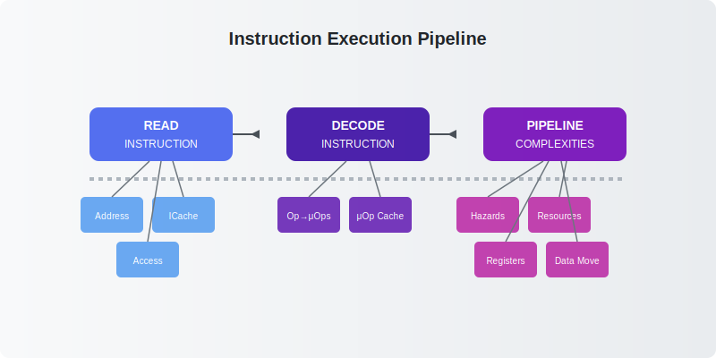

### Complex instruction execution pipeline:

1. **Read instruction** (~30-40% energy)
   - Virtual → physical address translation (TLB lookup)
   - Cache tag comparison and validation
   - Instruction fetch bandwidth: 16-32 bytes/cycle
   - Branch prediction: 90-99% accuracy but costly

2. **Decode instruction** (~15-25% energy)
   - x86: Complex instructions → multiple micro-ops
   - Modern CPUs: 3-5 decode stages
   - Micro-op fusion/cache to improve efficiency

3. **Pipeline complexities** (~35-45% energy)
   - Out-of-order execution: 100-300 instructions in flight
   - Register renaming to eliminate false dependencies
   - Reorder buffer: 192-348 entries in modern CPUs
   - Memory disambiguation and speculation
   - Data forwarding networks span entire core

---

## H.264 Video Encoding Energy Profile

Energy consumption breakdown:
- FU (Functional Units)
- RF (Register Fetch)
- Ctrl (Pipeline Control)
- Pip (Pipeline Registers)
- IF (Instruction Fetch + Cache)
- D-$ (Data Cache)

*Even with SIMD optimization, overhead dominates*
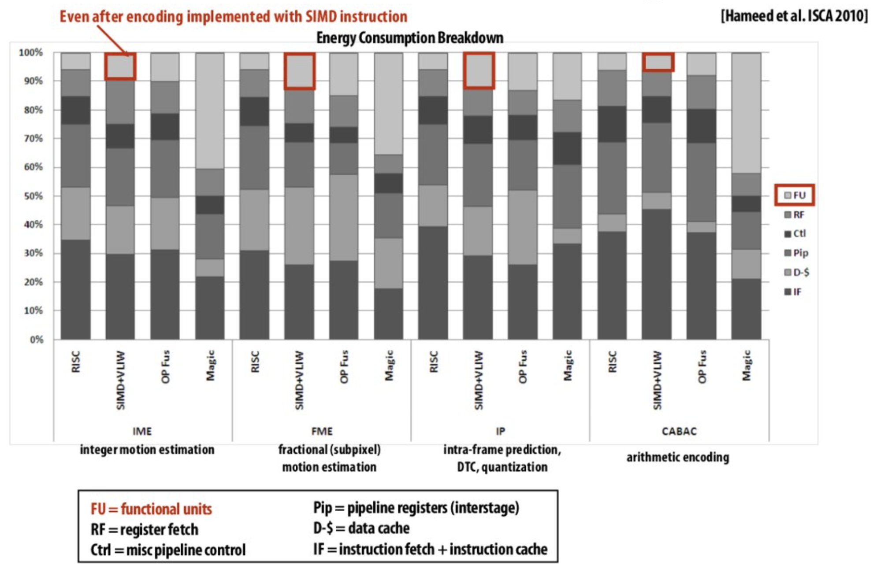
---

## Fast Fourier Transform (FFT) Case Study

Comparing implementations:

- **ASIC vs CPU**
  - 1/1000th chip area
  - 1/100th power consumption

- **GPU vs CPU**
  - 5-7x more area efficient

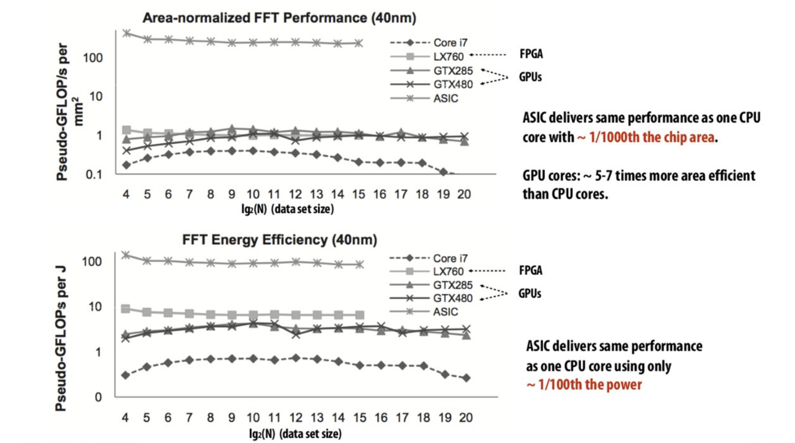

---

## Specialized Processors

### Anton Supercomputer
- Purpose: Molecular dynamics simulation
- Features:
  - 512 ASICs for particle-particle interactions
  - Custom FFT subsystem
  - Specialized communication network

  
  
*Source: [d3fw8ue024hgfm.cloudfront.net](https://d3fw8ue024hgfm.cloudfront.net/assets/technology.jpg)*

---

### Google TPU
- Purpose: Deep learning acceleration
- Pioneered specialized AI hardware
- Sparked research in ML accelerators

  
*Source: [WIRED](https://media.wired.com/photos/5926fc487034dc5f91bed40c/master/w_2240,c_limit/google-chip1.jpg)*

  
*Source: [The Next Platform](https://www.nextplatform.com/wp-content/uploads/2018/09/TPU_diagram.png)*

---

## FPGAs: The Middle Ground


Field Programmable Gate Arrays:
- Between ASICs and processors
- Programmable logic blocks
- Configurable interconnects

**Modern Usage:** Amazon EC2 F1
  
*Source: [AWS FPGA Development Workshop](https://fpga-development-on-ec2.workshop.aws/en/4-f1-application-development-flow/images/how-aws-fpga-acceleration-works.png)*


---

## FPGAs: The Middle Ground
  
*Source: [AWS FPGA Development Workshop](https://fpga-development-on-ec2.workshop.aws/en/4-f1-application-development-flow/images/fpga-board.png?width=30pc)*
Components:
1. LUT (Look-Up Tables)
2. Flip-flops
3. Hard gates
   - Memory blocks
   - DSP blocks

---
## HARDWARE SPECIALIZATION: PERFORMANCE/WATT RULES OF THUMB

Compared to optimized CPU code:

### Throughput-Focused Architectures (GPUs)
* **~10× improvement in perf/watt**
* Requirements:
  * Workload amenable to SIMD parallelism
  * Compute-bound (not memory-bound)
  * High arithmetic intensity (operations per byte)

### Fixed-Function ASICs
* **~100-1000× improvement in perf/watt**
* Requirements:
  * Well-defined computational patterns
  * Integer/fixed-point operations preferred
  * Limited control flow divergence
  * Examples: Video codecs, crypto, ML inference

### Key Tradeoff
* Energy efficiency ↑ as flexibility ↓
* Specialized hardware = narrow application scope
---

## Efficiency Benefits

Performance/Watt improvements vs CPU:

1. **GPU Cores** (~10x)
   - For data-parallel, compute-bound code

2. **Fixed-function ASIC** (100-1000x)
   - For compute-bound, non-floating-point

3. **FPGA** (~50x)
   - Reconfigurable logic

4. **Domain Specific Accelerators** (~20x)
   - e.g., Google TPU

---
# Choosing the Right Hardware
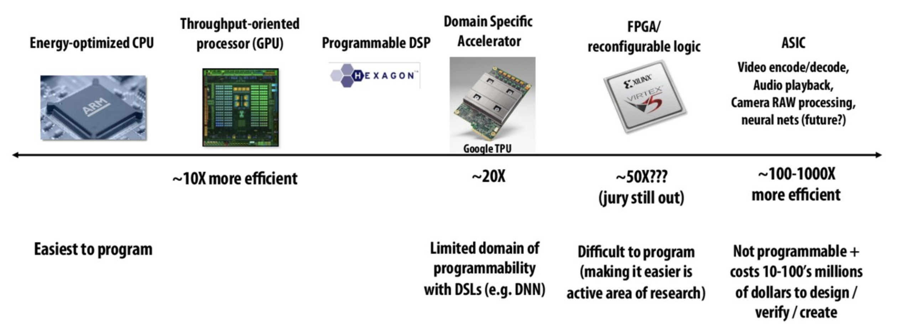 
*Source: [Stanford CS149 - Fall 2024](https://gfxcourses.stanford.edu/cs149/fall24/lecture/hwaccelerators/slide_18)*


---

## DATA MOVEMENT COSTS

### Energy Cost Per Operation
- **Integer op**: ~1 pJ
- **Floating point op**: ~20 pJ
- **Reading 64 bits (local SRAM)**: ~26 pJ
- **Reading 64 bits (LPDDR)**: ~1200 pJ

### Memory Hierarchy Impact
- **On-chip**: 10-100× cheaper than off-chip
- **L1 cache access**: ~10 pJ
- **Last-level cache**: ~100 pJ
- **Distance matters**: 1mm wire ≈ 1 pJ

### Real-World Implications
- **10 GB/sec memory bandwidth**: ~1.6 watts
- **Mobile GPU power budget**: ~1 watt
- **iPhone battery capacity**: ~14 watt-hours
- **Memory wall**: Compute often stalled waiting for data

---

## Memory System Architecture

### DRAM Basics
- 1 transistor + capacitor per bit
- 2 Kbits per row
- Row buffer (2 Kbits)
- Data pins (8 bits)

  
*Source: [StoredBits](https://storedbits.com/wp-content/uploads/2024/09/DRAM-cell-1.png)*

---

### DRAM Operation Steps
1. Precharge (~10 ns)
2. Row activation (~10 ns)
3. Column selection
4. Data transfer (~10 ns)

  
*Source: [SemiEngineering](https://semiengineering.com/wp-content/uploads/2019/11/memory1.png)*


---
## Memory System Architecture

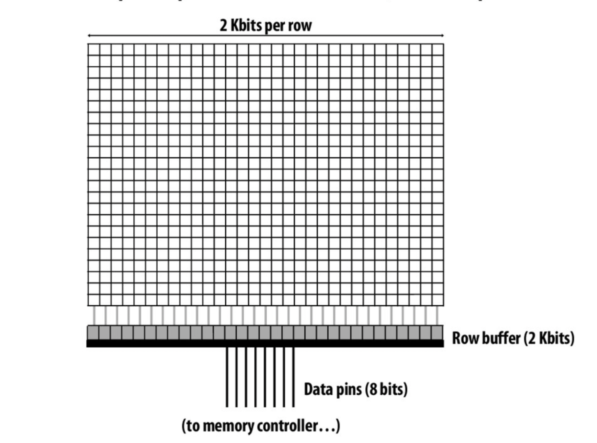  
*Source: [Stanford CS149 - Fall 2024](https://gfxcourses.stanford.edu/cs149/fall24/lecture/hwaccelerators/slide_53)*


---
# DRAM load 1 Byte
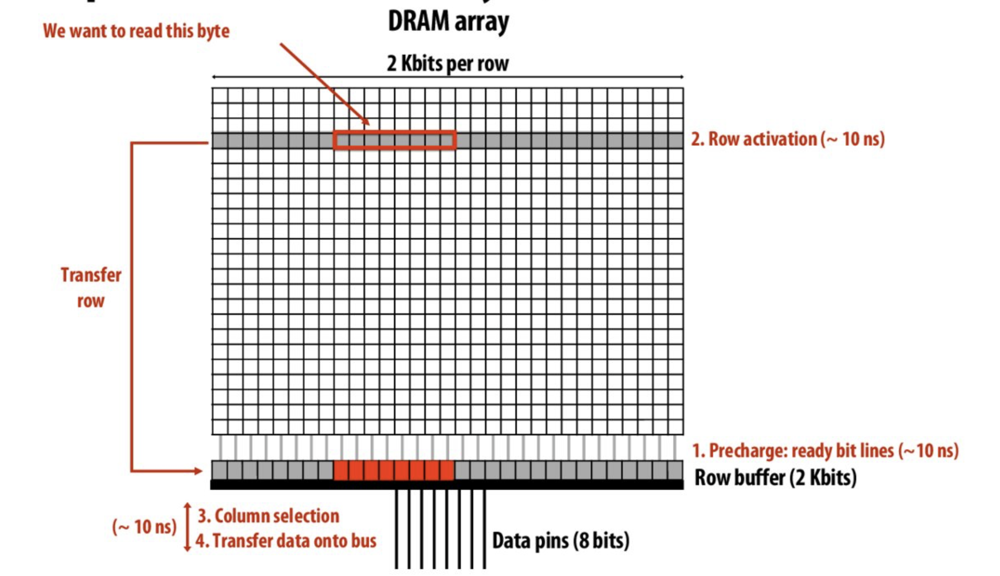  
*Source: [Stanford CS149 - Fall 2024](https://gfxcourses.stanford.edu/cs149/fall24/lecture/hwaccelerators/slide_54)*

---
# DRAM load next Byte
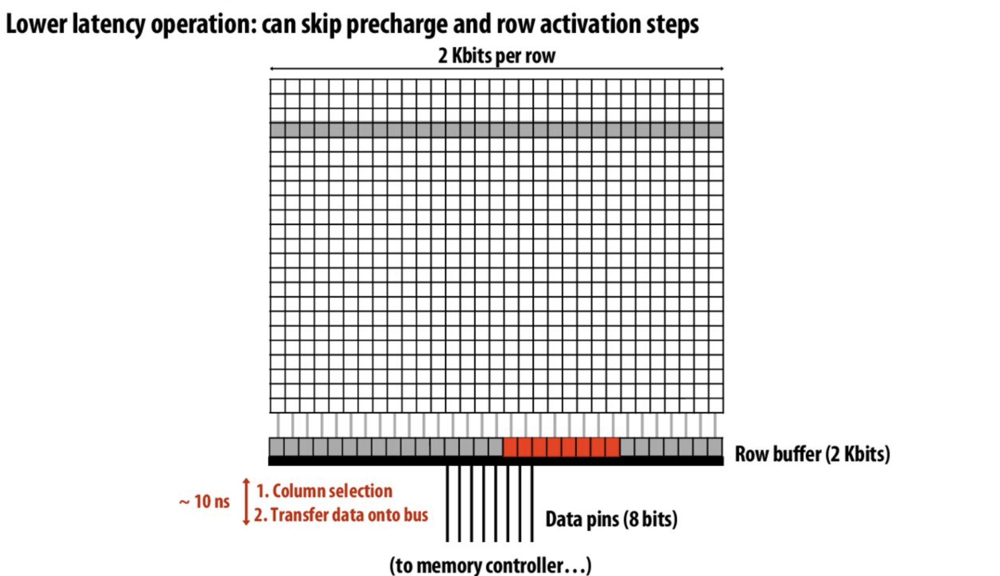  
*Source: [Stanford CS149 - Fall 2024](https://gfxcourses.stanford.edu/cs149/fall24/lecture/hwaccelerators/slide_54)*
---

## DRAM Access Latency

### Latency Variations
- **Best case**: Read from already active row
  - Only column access time (CAS): ~15ns
- **Worst case**: Read from new row
  - Full sequence: Precharge + Row Activate + Column Access
  - Total latency: ~45-60ns (3-4× slower!)

### Precharge Operation
- Readies bit lines for next operation
- Writes row buffer contents back to DRAM cells
- Critical because DRAM reads are destructive

### Key Design Questions
1. **When to execute precharge?**
   - After each column access? (closed page policy)
   - Only when new row needed? (open page policy)

2. **How to handle DRAM access latency?**
   - Cache hierarchies
   - Memory-level parallelism
   - Prefetching
   - Out-of-order execution

---

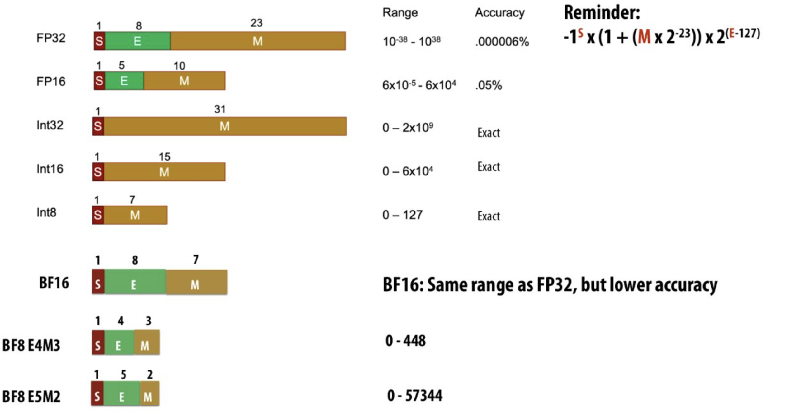  
*Source: [Stanford CS149 - Fall 2024](https://gfxcourses.stanford.edu/cs149/fall24/lecture/hwaccelerators/slide_25)*

---
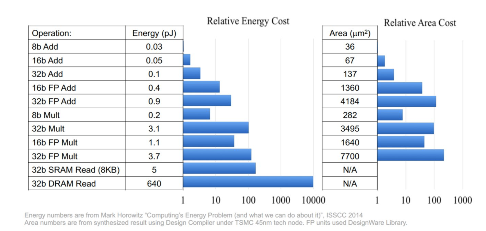  
*Source: [Stanford CS149 - Fall 2024](https://gfxcourses.stanford.edu/cs149/fall24/lecture/hwaccelerators/slide_26)*

---

## AMORTIZING INSTRUCTION OVERHEAD

### Overhead Percentage by Instruction Complexity
- **Half-precision FMA** (fused multiply-add): **2000%** overhead
- **Half-precision DP4** (vec4 dot product): **500%** overhead
- **Half-precision 4x4 MMA** (matrix-matrix multiply-accumulate): **27%** overhead

### Key Principle
Amortize instruction processing costs by packing more arithmetic operations into single complex instructions

### Modern Examples
- **Tensor Cores**: NVIDIA A100 - 1024 FP16 ops per instruction
- **Matrix Units**: Google TPUv4 - 16K bfloat16 ops per instruction
- **Apple Neural Engine**: Specialized matrix instructions for ML

---

## DRAM ACCESS PATTERNS

### Variable Latency
**Best case**: Read from active row
 * ~15ns latency (tCAS only)
 * Up to 10× faster than worst case
 * Locality critical for performance

**Worst case**: New row access
 * ~60-100ns latency (tRP + tRAS + tCAS)
 * Requires precharge, row activation, column access
 * Random access patterns severely penalized

---
# DRAM Inefficient Access
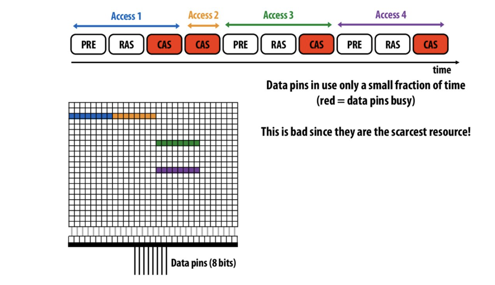  
*Source: [Stanford CS149 - Fall 2024](https://gfxcourses.stanford.edu/cs149/fall24/lecture/hwaccelerators/slide_57)*

---
# DRAM Burst Mode

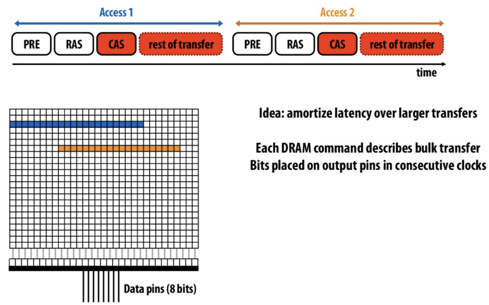  
*Source: [Stanford CS149 - Fall 2024](https://gfxcourses.stanford.edu/cs149/fall24/lecture/hwaccelerators/slide_58)*

---
## DRAM ACCESS PATTERNS

### Burst Mode Efficiency
**Transfer size impact**:
 * 64-byte cache line: ~70% efficiency
 * 4KB page: ~95% efficiency
 * Bandwidth utilization scales with transfer size

**Bank parallelism**:
 * Modern DRAM: 8-16 banks per channel
 * Interleaved access hides latency
 * Memory controllers optimize scheduling

---
## DRAM ACCESS PATTERNS

### Memory Organization Hierarchy

* **Channel**
  * Independent path to memory controller
  * Multiple channels provide system-level parallelism
  * Modern systems: 2-8 channels

* **Rank**
  * Set of DRAM chips that operate in lockstep
  * Typically 8 or 16 chips working together
  * 64-bit data path per rank

* **Bank**
  * Independent array of memory cells within a chip
  * Can be accessed in parallel with other banks
  * Has its own row buffer and sense amplifiers
  * DDR4: 16 banks/rank, DDR5: up to 32 banks/rank

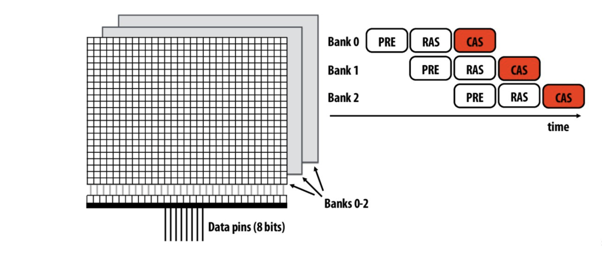  
*Source: [Stanford CS149 - Fall 2024](https://gfxcourses.stanford.edu/cs149/fall24/lecture/hwaccelerators/slide_59)*


---

# Bank parallelism
  
*Source: [The Next Platform](https://www.nextplatform.com/wp-content/uploads/2024/10/image001.png)*

* Modern DRAM: 8-16 banks per channel
  * DDR5: Up to 32 banks per rank
* Interleaved access hides latency
  * Operations to different banks proceed independently

---

## MODERN MEMORY SYSTEMS

### DIMM Organization
**Multiple DRAM chips** (64-bit bus)
 * 8-9 chips per rank (8 data + ECC)
 * 1-4 ranks per DIMM
 * Bandwidth: 25.6 GB/s (DDR4-3200)
 * Minimum 64-bit transfer (8 bytes)

  
*Source: [AnandTech](https://images.anandtech.com/doci/3851/DRAM%20Memory%20Topology.png)*

---

### Memory Controller

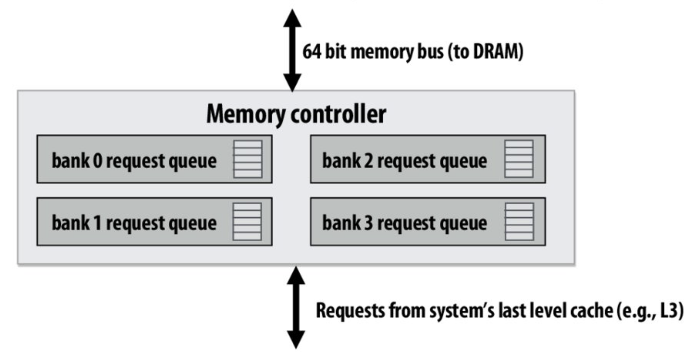  
*Source: [Stanford CS149 - Fall 2024](https://gfxcourses.stanford.edu/cs149/fall24/lecture/hwaccelerators/slide_66)*

## DRAM ACCESS OPTIMIZATIONS

### Request Scheduling (FR-FCFS)
* **First Ready - First Come First Serve**
  * Prioritizes row hits over older requests - *Exploits locality in memory access patterns*
  * Reduces average latency by ~30% - *Significant performance gain from row buffer reuse*
  * Can create fairness issues between threads - *Some threads may starve if others have high locality*
  * Modern variants use age thresholds - *Prevents indefinite postponement of older requests*

---

### Advanced Optimizations
* **Read/write grouping**
  * Reduces bus turnaround penalties (5-7 cycles) - *Minimizes costly direction changes on data bus*
* **Page policy management**
  * Open/closed policies tuned per application - *Matches policy to application access patterns*
  * Adaptive row buffer management - *Dynamically adjusts based on observed locality*
* **Address mapping**
  * Channel/rank/bank interleaving for bandwidth - *Spreads accesses for maximum parallelism*
  * XOR-based schemes to reduce conflicts - *Remaps addresses to avoid bank conflicts*


---

## Advanced Memory Technologies

### High Bandwidth Memory (HBM)
- 3D stacking with TSVs
- 1024-bit interface
- Closer to processor

  
*Source: [Micron Technology](https://dmassets.micron.com/is/image/microntechnology/product-hbm3e-cube-12-high?ts=1742500080704&dpr=off)*

---

# Example: NVIDIA H100

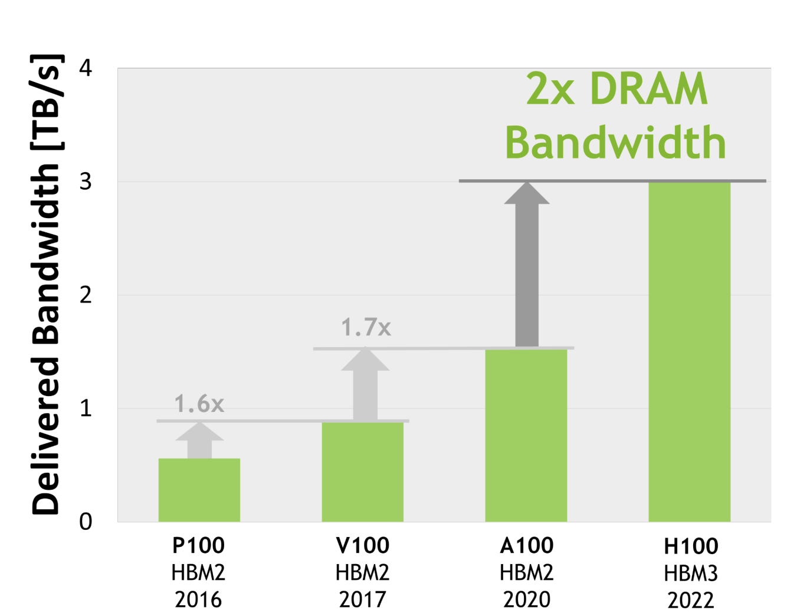  
*Source: [TechPowerUp](https://www.techpowerup.com/gpu-specs/docs/nvidia-gh100-architecture.pdf)*

- 6144-bit interface
- 3.2 TB/sec bandwidth
- 80 GB capacity

---

## Memory System Optimization

### HARDWARE APPROACHES

1. **Intelligent Scheduling**
  * Smart reordering of memory requests to maximize row buffer hits and minimize latency

2. **3D Stacking**
  * Vertically stacking memory dies directly on or near processors to dramatically reduce data travel distance

3. **Wider Interfaces**
  * Increasing the number of data pins to transfer more bits in parallel per clock cycle

4. **Near-Memory Computing**
  * Moving computation closer to data storage to eliminate energy-intensive data movement

5. **Hardware Compression**
  * Encoding memory contents to store more effective data in the same physical space

  
*Source: [AMD](AMD)*

---
## MEMORY SYSTEM OPTIMIZATION

### SOFTWARE APPROACHES

1. **Locality Optimization**
  * Restructuring code and data layout to maximize cache hits and reuse accessed memory

2. **Data Movement Minimization**
  * Redesigning algorithms to reduce transfers between memory hierarchy levels and compute units

3. **Compression Algorithms**
  * Implementing software techniques to reduce data size before storage and transmission
---

## Machine Learning Hardware

### TPU Architecture
- Matrix operations focus with **systolic array design**
- 30% chip area dedicated to arithmetic units
- 8-bit integer arithmetic for efficiency
- Minimal control overhead with fixed dataflow
- 256×256 matrix multiply unit (MXU)

### Key Operations
- Host memory I/O (PCIe/NVLink)
- Weight management in on-chip memory
- Matrix multiply at 45 TOPS (int8)
- Convolution as matrix operations
- Non-linear activations (ReLU, sigmoid, tanh)

### Ironwood TPU (v5)
- 2x-3x performance over previous generation
- Advanced liquid cooling system
- Optimized for large language models
- Enhanced memory hierarchy for transformer workloads

  


  
*Source: [Google Cloud Blog](https://storage.googleapis.com/gweb-uniblog-publish-prod/images/TPUv7_Inline_PeakPerformanceGrap.width-1000.format-webp.webp)*

---

## Programming Specialized Hardware: Challenges

### Key Challenges
- Balancing efficiency vs. programmability
- Complex memory hierarchies (HBM, SRAM, registers)
- Asynchronous execution and synchronization barriers
- Specialized instruction sets with limited compiler support
- Workload-specific optimizations

### Common Solutions
- Domain-specific languages (DSLs)
- Hardware-specific compilers and optimizers
- Auto-tuning frameworks
- High-level APIs with specialized backends
- Performance profiling and modeling tools

---
## Programming Specialized Hardware: Examples

### Google TPU (JAX/TensorFlow)
```python
# Matrix multiplication on TPU
import jax.numpy as jnp
from jax import devices, device_put

x = jnp.ones((128, 128))
y = jnp.ones((128, 128))
tpu = devices("tpu")[0]
result = device_put(jnp.matmul(x, y), tpu)

---

## Programming Models

### ThunderKittens DSL

- **Register tiles**: Optimal sizing (8x8, 16x16) for vectorized operations
- **Shared memory tiles**: Cooperative loading with warp-level synchronization
- **Vector operations**: SIMD execution across tensor cores
- **Auto-tuning**: Compiler-driven parameter optimization

#### Pipeline stages:
1. **Global → Shared Memory**
2. **Shared → Registers**
3. **Tensor Core Compute**
4. **Results → Global**

#### Code Example:
```cpp
// Matrix multiplication kernel in ThunderKittens
kernel<matmul_config>
  .tile<16, 16>()                     // Define compute tile size
  .shared<Tile<float, 128, 128>>()    // Shared memory buffer
  .registers<Tile<float, 16, 16>>()   // Register tile
  .pipeline(
    copy(global_A, shared_A),         // Stage 1: Global to shared
    copy(shared_A, reg_A),            // Stage 2: Shared to registers
    mma(reg_A, reg_B, reg_C),         // Stage 3: Tensor core compute
    copy(reg_C, global_C)             // Stage 4: Results to global
  )
  .launch(grid, block);               // Launch configuration
---
### SambaNova Dataflow

- **Map/Reduce/Zip operations**
  - Declarative patterns for parallel computation
  - Auto-pipelined across Processing Elements (PEs)
  - Compiler-optimized data tiling

- **Streaming compute**
  - Zero-copy data movement between operations
  - Spatial execution model eliminates memory bottlenecks
  - Dynamic workload balancing

- **High bandwidth interconnect**
  - 45 TB/s aggregate on-chip bandwidth
  - Non-blocking routing with QoS guarantees
  - Hierarchical network topology

- **Composable primitives**

```python
# SambaNova RDU dataflow example
@dataflow
def matmul_block(A, B):
    tiled_A = tile(A, (128, 128))
    tiled_B = tile(B, (128, 128))
    partial_C = map((tiled_A, tiled_B), lambda x, y: x @ y)
    return reduce(partial_C, lambda x, y: x + y)
---

## Metapipelining Concept

### Characteristics
- Hierarchical pipelines
- Nested parallelism
- Streaming dataflow
- Double buffering

### Benefits
1. Reduced synchronization
2. Better data locality
3. Efficient resource usage
4. Simplified programming

---

## ADDRESSING THE MEMORY BOTTLENECK

### Software Approaches
* **Schedule computation for locality**
  * Minimize required data movement
  * Block-based algorithms
  * Loop tiling and fusion
* **Data compression algorithms**
  * Trade computation for reduced transfers
  * Workload-specific compression

### Hardware Solutions
* **Intelligent DRAM scheduling**
  * FR-FCFS and fairness-aware variants
* **Deep memory hierarchies**
  * HBM, 3D-stacked memory (5-8× bandwidth)
  * Last-level caches exceeding 100MB
* **Near-memory computing**
  * Processing-in-memory (PIM)
  * Computational storage

### General Principles
* **Move data closer to computation**
* **Move computation closer to data**
* **Reduce data movement requirements**

---
