# GPU Architecture
## From Silicon to LLM Training
### GWU ECE 6125: Parallel Computer Architecture

---

## Lecture Roadmap

| Part | Topic | Key Question |
|------|-------|-------------|
| 1 | **Why GPUs?** | Why did a graphics chip become the world's most important compute platform? |
| 2 | **GPU Hardware** | What does a GPU look like inside? |
| 3 | **SIMT Execution Model** | What happens when threads in a warp disagree? |
| 4 | **GPU Memory Hierarchy** | How do you get data to the ALUs fast enough? |
| 5 | **Memory Access Patterns** | Why does memory layout matter more than algorithm choice? |
| 6 | **Tensor Cores and Mixed Precision** <span class="optional">(Optional)</span> | How do tensor cores achieve 10x throughput? |
| 7 | **Modern GPU Architectures** <span class="optional">(Optional)</span> | What does a 2025 GPU cluster look like? |
| 8 | **Best Practices and Wrap-Up** | What are the most impactful optimizations? |

Note: Lectures 7 and 8 introduced CUDA programming: kernels, thread blocks, warps of 32, and the basics of shared vs. global memory. This lecture goes inside the hardware. By the end, you'll understand why certain code patterns are fast and others are slow, at the transistor level.

---

## Part 1: Why GPUs?

### Why did a graphics chip become the world's most important compute platform?

Note: GPUs started as fixed-function graphics accelerators. The path from rendering triangles to training GPT is shorter than you might think, and understanding it explains the GPU's fundamental design philosophy.

---

## The Graphics Pipeline in 60 Seconds

> **Intuition:** rendering a 3D scene means running the *same math* on millions of vertices and pixels independently. This is the original data-parallel workload.

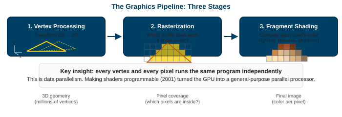

When shaders became *programmable* (2001), the GPU became a general-purpose data-parallel processor hiding inside a graphics card.

Note: The key moment was programmable shaders. Before that, the pipeline was fixed-function hardware. Programmable shaders meant the GPU could run arbitrary math on every pixel. Researchers realized: if it can shade pixels, it can do matrix multiply, fluid simulation, anything data-parallel. That insight created GPGPU.

---

## From Shaders to GPGPU

| Year | Milestone |
|---|---|
| 2001 | Programmable shaders (DirectX 8, GeForce 3) |
| 2003 | Researchers encode scientific problems as "texture operations" |
| 2004 | Brook (Stanford): first stream programming language for GPUs |
| 2007 | <span class="accent">CUDA</span> (NVIDIA): dedicated compute API, no graphics disguise needed |
| 2009 | OpenCL: cross-vendor GPU compute standard |
| 2012 | AlexNet wins ImageNet using GPU training, launching the deep learning era |

> CUDA removed the need to pretend your matrix multiply was a graphics operation. That single change made GPU computing accessible to every programmer.

Note: Before CUDA, you had to encode your computation as a fragment shader operating on textures. CUDA gave you threads, shared memory, and synchronization primitives. The floodgates opened.

---

## CPU vs GPU: Two Design Philosophies

<div class="cols">
<div class="left">

**CPU: optimized for <span class="accent">latency</span>**

- Few powerful cores (8 to 128)
- Large caches (up to 256 MB L3)
- Branch prediction, out-of-order execution
- Goal: finish one task as fast as possible

</div>
<div class="right">

**GPU: optimized for <span class="accent">throughput</span>**

- Thousands of simple cores
- Small caches, massive register files
- No branch prediction, no out-of-order
- Goal: finish a million tasks in total time

</div>
</div>

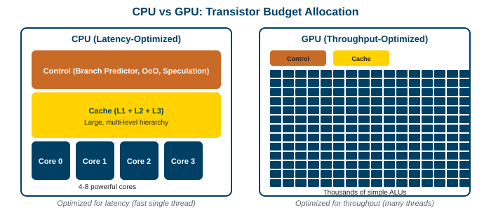

Note: A CPU spends most of its transistors on control logic (branch prediction, speculative execution, reorder buffers) and caches. A GPU spends them on ALUs. The CPU is a sports car (fast for one person). The GPU is a bus (slower per person, but moves 50 people at once).

---

## The Numbers: CPU vs GPU (2025)

| Spec | AMD EPYC 9754 (CPU) | NVIDIA H100 (GPU) |
|---|---|---|
| Cores | 128 | 16,896 FP32 |
| Clock | 2.25 GHz (base) | 1.83 GHz (boost) |
| Peak FP64 | ~4 TFLOPS | ~34 TFLOPS |
| Peak FP16 | ~8 TFLOPS | ~1,979 TFLOPS (tensor) |
| Memory | DDR5, ~460 GB/s | HBM3, 3,350 GB/s |
| Memory capacity | up to 1.5 TB | 80 GB |
| TDP | 360 W | 700 W |

> The GPU has <span class="accent">8x</span> the FP64 throughput, <span class="accent">250x</span> the FP16 throughput, and <span class="accent">7x</span> the memory bandwidth. But only 80 GB of memory vs 1.5 TB.

*Why 7x bandwidth?* GPUs use HBM (High Bandwidth Memory) stacked directly on the chip package via silicon interposers (5120-bit bus). CPUs use DDR on DIMM slots connected by long PCB traces (~512-bit bus). Short wires = wide bus = high bandwidth. The tradeoff: HBM is ~5x more expensive per GB and limited in capacity.

Note: The memory capacity gap is why CPUs still matter. If your data doesn't fit in 80 GB, you need the CPU or multiple GPUs. The bandwidth gap (7x) is why memory-bound kernels run faster on GPU even if they don't use much compute.

---

## Why GPUs Win at Parallel Workloads

> **Intuition:** a CPU is like one expert surgeon. A GPU is like 10,000 medical students. For brain surgery, pick the surgeon. For giving 10,000 flu shots, pick the students.

**The GPU's trick: latency hiding through thread oversubscription**

- A CPU hides memory latency with caches and out-of-order execution
- A GPU hides it by switching to another thread while waiting for data
- This only works if you have *thousands* of threads ready to go

> <span class="accent">GPUs don't make individual operations faster.</span> They make the aggregate throughput of millions of operations higher by never letting the hardware sit idle.

Note: This is the single most important concept in GPU architecture. The GPU doesn't have faster ALUs or faster memory. It has more ALUs and enough threads to keep them busy while memory requests are in flight. Understanding this explains every design decision in GPU hardware.

---

## Where GPUs Struggle

Not every problem maps to a GPU:

| Problem Type | Why GPUs Struggle |
|---|---|
| Serial algorithms | One thread on a 1.8 GHz core is 3x slower than a 5 GHz CPU core |
| Irregular branching | Thread divergence wastes execution slots (Part 3) |
| Pointer-chasing | Random memory access kills coalescing (Part 5) |
| Small problems | Kernel launch overhead (~5 μs) dominates if the work is tiny |
| Large working sets | 80 GB HBM is not enough for some databases or simulations |

> **Rule of thumb:** if your problem has high arithmetic intensity and regular data access, the GPU wins. Otherwise, start with the CPU.

Note: A common mistake is assuming "GPU = faster." For a linked list traversal or a recursive tree search, the CPU is dramatically faster because it has branch prediction, large caches, and low-latency memory. Always profile before moving to the GPU.

---

## Part 2: GPU Hardware

### What does a GPU look like inside?

Note: Now that we know why GPUs exist, let's open one up. The key building block is the Streaming Multiprocessor (SM). Everything else is scaling SMs up with caches, memory controllers, and interconnects.

---

## GPU Architecture at 10,000 Feet

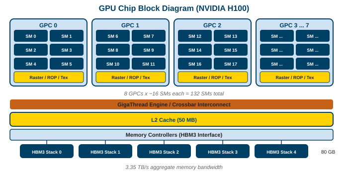

- **GPC** (Graphics Processing Cluster): a group of SMs that share scheduling and rasterization hardware
- **SM** (Streaming Multiprocessor): the core compute unit (next slide)
- **L2 cache**: shared across all SMs (50 MB on H100)
- **Memory controllers**: connect to HBM stacks via wide buses

> An H100 has 8 GPCs containing 132 SMs total (not evenly split: some GPCs have 16 SMs, others 17). Think of each SM as a small parallel processor.

Note: Why "Streaming" Multiprocessor? The name comes from the stream processing model: data flows through the processor like a stream, with each element processed independently by the same program. This is the same idea as the graphics pipeline (vertices and pixels "stream" through shaders). NVIDIA kept the name even as GPUs moved to general-purpose compute. The diagram shows "Raster / ROP / Tex" in each GPC. These are graphics-specific units: **Raster** converts triangles to pixel fragments, **ROP** (Raster Operations Pipeline) handles final pixel output (blending, depth testing, antialiasing, writing to the framebuffer), and **Tex** (Texture Units) fetch and filter texture data from memory. For compute workloads these units are largely idle, but they remain on the chip because GPUs still serve graphics. The GPC is an organizational unit that groups SMs with these fixed-function units. For compute, what matters is the SM count and the L2/HBM bandwidth.

---

## The Streaming Multiprocessor (SM)

The SM is the fundamental building block. Everything in GPU programming maps to the SM.

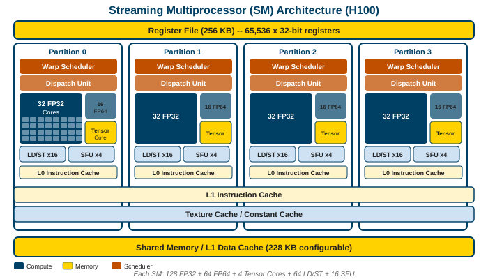

Note: The SM has four partitions sharing a register file and shared memory / L1. SM component glossary:
- **Register file:** large SRAM bank (256 KB) holding working variables for ALL resident threads simultaneously. This is what enables zero-cost warp switching (no save/restore needed).
- **Dispatch unit:** decodes instructions from the warp scheduler and routes them to the correct execution unit (FP32, FP64, tensor core, or LD/ST). The traffic cop between scheduler and ALUs.
- **L0 instruction cache:** tiny per-partition cache holding recently fetched *instructions* (not data). Avoids fetching from L1 every cycle. Not the register file: registers hold data, L0 I-cache holds the program.
- **Texture cache:** read-only cache optimized for 2D spatial locality. When neighboring threads access neighboring locations in a 2D array (common in image processing, stencils, rendering), this cache serves them efficiently. Also used by `__ldg()` for read-only global loads in compute.
- **Constant cache:** broadcast cache for scalar values that all 32 threads need (learning rate, kernel config, lookup table entries). SIMT is same-instruction-different-data, but sometimes all threads genuinely read the same value. When they do, the constant cache serves the whole warp in one cycle. If threads read different constant addresses, it serializes to 32 cycles (use global memory instead).
- **Tensor core:** specialized 4x4 matrix-multiply-accumulate unit, 128 FMA ops per cycle. Covered in Part 6.
- **Why block sizes of 128 or 256?** 4 partitions x 32 threads/warp. Block of 128 = 4 warps = one per partition (clean fit). Block of 256 = 8 warps = two per partition. Block of 100 = 3 full warps + 1 partial warp (28 of 32 cores idle). Always use multiples of 32; prefer multiples of 128.

---

## SM Resources: The Real Numbers (H100)

| Resource | Amount per SM | Why It Matters |
|---|---|---|
| FP32 CUDA cores | 128 | Raw throughput |
| FP64 CUDA cores | 64 | Double precision (scientific) |
| Tensor cores | 4 | Matrix multiply (AI training) |
| Warp schedulers | 4 | Can issue 4 instructions per cycle |
| Register file | 256 KB (65,536 x 32-bit) | Holds state for all resident threads |
| Shared memory / L1 | 228 KB (configurable split) | Programmer-managed fast storage |
| Max warps | 64 (2,048 threads) | Upper bound on occupancy |
| Max thread blocks | 32 | How many blocks fit simultaneously |

Note: The register file is huge (256 KB) because it holds the state for all 2,048 possible threads simultaneously. This is what enables zero-cost context switching between warps.

---

## How Thread Blocks Map to SMs

> **Intuition:** you write a kernel and launch thousands of thread blocks. The GPU's block scheduler assigns each block to an SM, like a dispatcher assigning jobs to workers.

- One thread block runs on exactly one SM (never split across SMs)
- Multiple blocks can share an SM if resources allow
- Once assigned, a block runs to completion on that SM
- You cannot control which SM gets which block

> <span class="accent">Implication:</span> if your kernel uses too many registers or shared memory per block, fewer blocks fit on each SM, and the GPU is underutilized.

Note: The block scheduler is a hardware unit. It looks at each block's resource requirements (registers, shared memory, threads) and assigns it to an SM that has enough capacity. If no SM has room, the block waits. This is why over-allocating resources per block hurts performance.

---

## Thread Indexing: How Threads Find Their Data

Each thread computes its unique <span class="accent">global ID</span> from its position in the hierarchy:

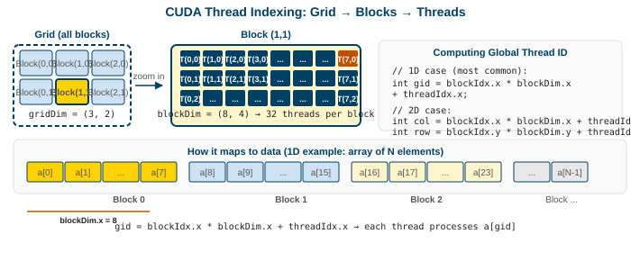

- `blockIdx.x` / `.y` : which block am I in? (within the grid)
- `threadIdx.x` / `.y` : which thread am I? (within my block)
- `blockDim.x` / `.y` : how many threads per block?
- `gridDim.x` / `.y` : how many blocks in the grid?

> Each thread uses its global ID to index into the data array. This is how millions of threads each process a different element without any coordination.

Note: The formula `gid = blockIdx.x * blockDim.x + threadIdx.x` is the most-written line in all of CUDA. It maps the 2-level hierarchy (grid of blocks, block of threads) down to a flat array index. For 2D problems (images, matrices), you compute separate row and col indices using the .y components. The hardware provides these built-in variables for free; they come from the thread's position in the launch configuration.

---

## Warps: The True Execution Unit

Lecture 8 introduced warps as "32 threads executing the same instruction." Now let's look at the hardware.

- A warp scheduler selects one warp and issues one instruction to 32 CUDA cores
- All 32 threads execute that instruction in lockstep (SIMT)
- Each SM has <span class="accent">4 warp schedulers</span>, so 4 warps can issue in the same cycle
- The warp is the smallest unit the hardware sees; individual threads don't exist at the scheduling level

> Think of a warp as a single wide instruction operating on 32 data elements simultaneously.

Note: "32 threads" is a programming abstraction. The hardware reality is one instruction broadcast to 32 lanes of a vector unit. The SIMT model lets each lane have its own registers and (logically) its own program counter, but the execution is fundamentally SIMD.

---

## Warp Schedulers and Dual Issue

Each of the 4 warp schedulers in an SM can:

- Select one ready warp from its pool
- Issue one instruction per cycle to that warp
- Optionally issue a second independent instruction (dual issue) on some architectures

With 4 schedulers, an SM can execute <span class="accent">4 warp-instructions per cycle</span>, keeping 128 CUDA cores busy.

**Per SM throughput:**

$$4 \text{ schedulers} \times 32 \text{ threads/warp} \times 2 \text{ (multiply + add)} \times 1.83 \times 10^9 \text{ Hz} \approx 469 \text{ GFLOPS}$$

**Full GPU (H100):**

$$469 \text{ GFLOPS/SM} \times 132 \text{ SMs} \approx 62 \text{ TFLOPS FP32}$$

Note: Dual issue means the scheduler can dispatch two non-dependent instructions from the same warp in one cycle (e.g., a multiply and an add). This is architecture-dependent and the compiler must arrange instructions to enable it.

---

## Zero-Cost Context Switching

> **Intuition:** on a CPU, switching threads takes thousands of cycles (save registers, load new registers, flush pipeline). On a GPU, it takes <span class="accent">zero cycles</span> because all thread state lives in the register file simultaneously.

- The register file holds registers for ALL resident warps at once
- No save/restore needed; the scheduler just points to a different warp's registers
- This is why the register file is so large (256 KB per SM)

> **The tradeoff:** if each thread uses more registers, fewer warps fit, and you have fewer options for hiding latency. This is the occupancy tradeoff (Part 3).

Note: A CPU allocates its register file to one thread and saves/restores on context switch. A GPU statically partitions its register file among all resident warps. More registers per thread = fewer resident warps = less latency hiding.

---

## Latency Hiding: Why More Warps Help

When a warp issues a memory load (300+ cycles to HBM), the scheduler switches to another ready warp. By the time it cycles back, the data has arrived.

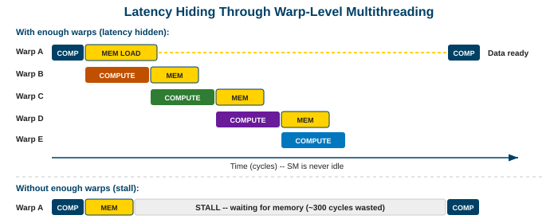

$$\text{Warps needed} \geq \frac{\text{memory latency (cycles)}}{\text{throughput (cycles/instruction)}}$$

With 300-cycle latency and 4 warp schedulers (each consuming 1 warp per cycle): need $300 / 4 = 75$ warps per SM to fully hide latency. H100 allows 64 warps max, so in practice you can almost fully hide it.

Note: The 4 in the denominator is the number of warp schedulers per SM. Each cycle, all 4 schedulers can issue in parallel, so the SM retires 4 warp-instructions per cycle. To keep all 4 schedulers busy for 300 cycles while one warp waits on memory, you need 300 / 4 = 75 other warps ready to execute. Since H100 caps at 64 warps per SM, there's a small gap, which is why even at 100% occupancy you can't fully hide HBM latency. Occupancy (active warps / max warps) directly measures how well you're hiding latency. But as we'll see in Part 3, maximum occupancy isn't always optimal.

---

## From SM to Full GPU: H100

| | Count | Total |
|---|---|---|
| SMs | 132 | |
| FP32 cores | 128 per SM | 16,896 |
| Tensor cores | 4 per SM | 528 |
| Register file | 256 KB per SM | 33 MB |
| Shared memory / L1 | 228 KB per SM | 30 MB |
| L2 cache | shared | 50 MB |
| HBM3 | 5 stacks | 80 GB at 3.35 TB/s |
| Interconnect | NVLink 4 | 900 GB/s (18 links) |
| TDP | | 700 W |

> 132 SMs running at 1.83 GHz with tensor cores delivers <span class="accent">~1,979 TFLOPS FP8</span>, which is the number that matters for LLM training.

Note: The jump from FP32 (~62 TFLOPS) to FP8 (~1,979 TFLOPS) via tensor cores is ~32x. This is why mixed-precision training is so important. The next slide explains what a tensor core actually is.

---

## What is a Tensor Core?

> **Intuition:** a regular CUDA core does one multiply-add per cycle. A tensor core does a <span class="accent">4x4 matrix multiply-accumulate in one cycle</span> (128 multiply-adds).

- **Introduced:** Volta architecture (V100, 2017) to accelerate deep learning
- **Why it helps:** neural network training is dominated by matrix multiplications (forward pass, backward pass, attention). Tensor cores do this 10-30x faster than regular CUDA cores.
- **The trick:** they operate on <span class="accent">lower precision</span> (FP16, BF16, FP8) for the bulk of computation, while keeping FP32 where it matters (weight updates, optimizer state). Gradients *are* sensitive to precision (small values can underflow to zero in FP16), which is why mixed precision uses loss scaling and BF16 (same range as FP32).

| Generation | Precision Support | Peak Throughput |
|---|---|---|
| Volta (2017) | FP16 | 125 TFLOPS |
| Ampere (2020) | FP16, BF16, TF32, INT8 | 312 TFLOPS |
| Hopper (2022) | FP16, BF16, FP8 | 1,979 TFLOPS |

> Without tensor cores, training GPT-scale models would take 10-30x longer. They are the reason modern AI is economically feasible.

Note: You don't call tensor cores directly in most code. Libraries like cuBLAS and cuDNN use them automatically when you call matrix multiply with compatible precision. PyTorch's `torch.cuda.amp` (automatic mixed precision) handles the FP16/FP32 bookkeeping. Part 6 (optional) covers the details of mixed precision and the WMMA API.

---

## Part 3: SIMT Execution Model

### What happens when threads in a warp disagree?

Note: SIMT (Single Instruction, Multiple Threads) is the GPU's execution model. It's more flexible than pure SIMD, but divergence still has a cost. Understanding this is essential for writing efficient GPU code.

---

## SIMT vs SIMD

| | SIMD (CPU) | SIMT (GPU) |
|---|---|---|
| Width | 4, 8, 16, or 32 lanes | 32 threads (1 warp) |
| Branching | Not supported in hardware | Hardware masks inactive threads |
| Registers | One set per SIMD unit | Each thread has private registers |
| Programming | Explicit vector intrinsics | Write scalar code, hardware broadcasts |

> **Key difference:** SIMT lets each thread branch independently. The hardware handles it by masking. You write code for one thread; the hardware runs 32 copies.

Note: SIMD on a CPU (AVX-512) requires the programmer to explicitly vectorize. SIMT on a GPU implicitly broadcasts one instruction to 32 threads. The programmer writes scalar code (`if (tid < N) y[tid] = ...`) and the hardware figures out which threads are active.

---

## Thread Divergence: The Problem

When threads in a warp take different paths, the warp executes both paths serially with threads masked:

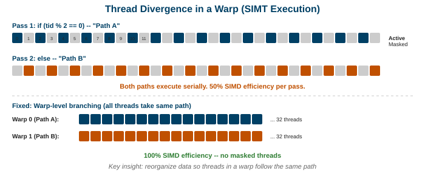

```c
if (tid % 2 == 0) {
    pathA();   // only even threads active, odd threads masked (wasted)
} else {
    pathB();   // only odd threads active, even threads masked (wasted)
}
// Both paths execute, so the warp takes 2x the time
```

> Worst case: 32 threads taking 32 different paths = <span class="accent">1/32 efficiency</span>.

Note: The hardware doesn't skip the inactive path. It executes both paths and masks the results. The warp takes the time of the longest path. This is the fundamental cost of divergence.

---

## Divergence: How to Fix It

> **Intuition:** keep threads in the same warp on the same path. Diverge between warps, not within them.

**Bad (50% efficiency):**
```c
if (tid % 2 == 0) pathA();    // threads 0,2,4...30 vs 1,3,5...31
else pathB();                   // splits every warp in half
```

**Good (100% efficiency):**
```c
if (tid / 32 % 2 == 0) pathA(); // warp 0 takes A, warp 1 takes B
else pathB();                     // each warp is uniform, no masking
```

> The same branching logic rearranged from per-thread to per-warp goes from 50% to 100% warp efficiency.

Note: This is a fundamental GPU optimization pattern. Whenever you have a branch, ask: "do threads within the same warp take different paths?" If yes, restructure so the branch aligns with warp boundaries.

---

## Volta+ Independent Thread Scheduling

Pre-Volta GPUs forced all threads in a warp to reconverge at a single point. Volta (2017) introduced **independent thread scheduling:**

- Each thread has its own program counter and call stack
- Threads can diverge and reconverge at different points
- Enables fine-grained producer-consumer patterns within a warp

> This makes warp-level synchronization safer and enables patterns like cooperative groups, but divergence still costs throughput.

Note: Independent thread scheduling doesn't eliminate the cost of divergence (masked threads still waste execution slots). It makes the behavior more predictable and enables patterns that were unsafe before, like threads in a warp communicating through shared memory at arbitrary points.

---

## Warp-Level Primitives

Threads within a warp can exchange data without shared memory using shuffle instructions:

```c
// Warp-level reduction: sum 32 values in 5 steps (log2(32) = 5)
float val = data[tid];
val += __shfl_down_sync(0xffffffff, val, 16);  // add from 16 lanes away
val += __shfl_down_sync(0xffffffff, val, 8);   // add from 8 lanes away
val += __shfl_down_sync(0xffffffff, val, 4);
val += __shfl_down_sync(0xffffffff, val, 2);
val += __shfl_down_sync(0xffffffff, val, 1);
// thread 0 now holds the sum of all 32 values
```

- `__shfl_down_sync`: read a value from a thread N lanes below
- `__ballot_sync`: each thread votes a bit, returns 32-bit mask
- `__any_sync` / `__all_sync`: check if any/all threads satisfy a condition

Note: Warp shuffles are faster than shared memory for intra-warp communication because they use the register crossbar directly. They're the building block of efficient reductions, scans, and sorting networks on GPUs.

---

## Occupancy: Definition

$$\text{Occupancy} = \frac{\text{active warps per SM}}{\text{max warps per SM}}$$

On H100, max warps = 64. If your kernel uses enough resources that only 32 warps fit, occupancy is 50%.

**Three resource limits determine occupancy:**

| Resource | How It Limits |
|---|---|
| **Registers per thread** | More registers per thread = fewer threads fit in the 256 KB register file |
| **Shared memory per block** | More shared memory per block = fewer blocks fit on the SM |
| **Threads per block** | Fewer threads per block = more blocks needed to fill the SM |

Query occupancy before launching:

```c
int maxActiveBlocks;
cudaOccupancyMaxActiveBlocksPerMultiprocessor(
    &maxActiveBlocks, myKernel, blockSize, sharedMemSize);
```

Note: This CUDA API tells you how many blocks of your kernel can run simultaneously on one SM, given the kernel's resource usage. Nsight Compute shows the same information visually.

---

## Occupancy Limiters: Worked Example

> The chart below shows how the maximum number of warps per SM drops as you use more registers per thread. The horizontal dashed line is the hardware max (64 warps). The <span class="accent">orange bar</span> marks the bottleneck.

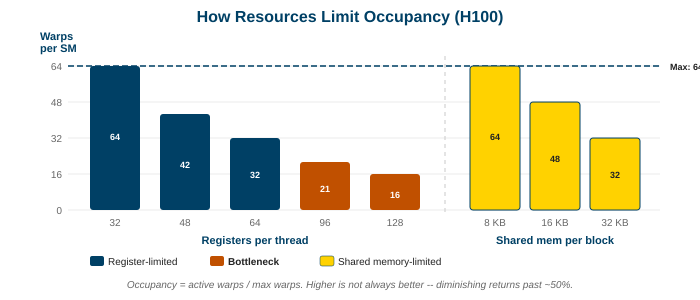

**Walking through the math** (64 registers/thread, 256 threads/block):

- Register file is 65,536 registers per SM
- $65{,}536 / 64 = 1{,}024$ threads = 32 warps can fit
- Block limit: 32 max blocks × 8 warps each = 256 warps (not the bottleneck)
- <span class="accent">Result:</span> $32 / 64 = 50\%$ occupancy, limited by registers
- Reducing to 48 registers: $65{,}536 / 48 \approx 1{,}365$ threads ≈ 42 warps → 66%

Note: You can cap register usage with the compiler flag `-maxrregcount=N`, but the compiler may spill excess registers to local memory (which is actually global memory speed, ~400 cycles). It's a tradeoff: higher occupancy but slower per-thread execution. Always measure both ways.

---

## The Occupancy Myth

> **Higher occupancy does not always mean higher performance.**

A kernel at 50% occupancy with good instruction-level parallelism can outperform one at 100% occupancy. The goal is <span class="accent">enough warps to hide latency</span>, not maximum warps.

**When lower occupancy wins:**
- More registers per thread → fewer spills to slow memory
- More shared memory per block → better data reuse, fewer global loads

> "Use occupancy as a diagnostic, not an optimization target." (Vasily Volkov, GTC 2010)

Note: Volkov's "Better Performance at Lower Occupancy" is a landmark GPU computing talk. He showed that a matrix multiply kernel at 25% occupancy outperformed one at 100% because the low-occupancy version used more registers to hold tile data, avoiding repeated global loads. Profile and measure; don't blindly chase occupancy.

---

## Part 4: GPU Memory Hierarchy

### How do you get data to the ALUs fast enough?

Note: The memory hierarchy is where most GPU performance is won or lost. Even with 3.35 TB/s of HBM bandwidth, most kernels are still memory-bound. Understanding each level and its cost is essential.

---

## Memory Hierarchy Overview

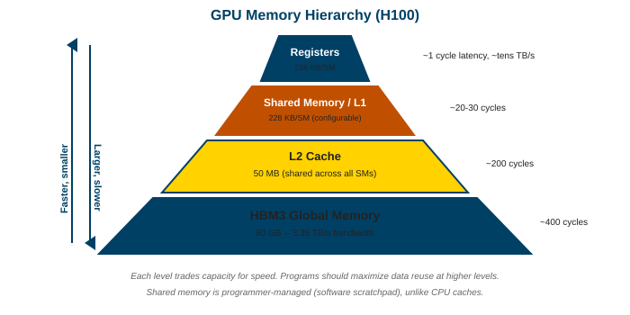

| Level | Size (H100) | Latency | Bandwidth | Managed By |
|---|---|---|---|---|
| Registers | 256 KB / SM | ~1 cycle | ~tens of TB/s | Compiler |
| Shared memory / L1 | 228 KB / SM | ~20-30 cycles | ~10+ TB/s | Programmer |
| L2 cache | 50 MB | ~200 cycles | ~5 TB/s | Hardware |
| Global memory (HBM3) | 80 GB | ~300-500 cycles | 3.35 TB/s | Programmer |

> Every level down is ~10x more capacity but ~10x slower. The programmer's job is to keep data as high up this pyramid as possible.

Note: Registers are the fastest but smallest. HBM is the largest but slowest. Shared memory is the sweet spot: programmer-managed, on-chip, and fast enough to feed the ALUs if you use it well.

---

## Registers: The Fastest Memory

- Each SM has 256 KB of registers (65,536 x 32-bit on H100)
- Access latency: ~1 cycle
- Statically partitioned among all resident threads (not shared between threads)
- Compiler assigns variables to registers automatically

**Register pressure:** if a kernel uses too many registers, two things happen:
1. <span class="accent">Reduced occupancy</span> (fewer warps fit)
2. <span class="accent">Register spilling</span> to local memory (which is actually global memory speed)

> Spilling is catastrophic: a "register" access that spills takes 300+ cycles instead of 1.

Note: You can check register usage with `nvcc --ptxas-options=-v`. If your kernel uses more than ~40-50 registers, consider whether you can reduce it by recomputing values instead of storing them, or by using shared memory instead.

---

## Shared Memory and L1 Cache

Shared memory and L1 share the same physical SRAM on the SM (228 KB on H100, configurable split).

**Shared memory:**
- Programmer-managed (you declare `__shared__` arrays)
- Visible to all threads in a block
- Organized in <span class="accent">32 banks</span> (critical for performance, see Part 5)
- Typical use: load a tile of data from global memory, sync, compute on it

**L1 cache:**
- Hardware-managed (caches global memory loads automatically)
- No programmer control over what's cached

```c
__shared__ float tile[BLOCK_SIZE][BLOCK_SIZE];  // on-chip, ~20 cycle access
float val = global_array[idx];                   // may hit L1 (~30 cycles) or HBM (~400 cycles)
```

Note: The split between shared memory and L1 is configurable via `cudaFuncSetAttribute()`. For kernels that use shared memory heavily, allocate more to shared. For kernels that rely on cache, allocate more to L1.

---

## L2 Cache

- 50 MB on H100, shared across all 132 SMs
- ~200 cycle access latency
- Hardware-managed (you don't control what's cached)
- Acts as the last level before going off-chip to HBM

**Hopper feature: L2 persistence control**

```c
cudaAccessPolicyWindow policy;              // create a caching policy
policy.base_ptr = frequently_used_buffer;   // which buffer to pin
policy.num_bytes = size;                    // how many bytes to keep in L2
policy.hitProp = cudaAccessPropertyPersisting; // "don't evict this data"
// After setting this, accesses to this buffer stay in L2 across kernel launches
```

> For kernels that repeatedly access the same small dataset (like an embedding table), pinning in L2 can be a significant win.

Note: The L2 is shared across all SMs, so contention is possible. If 132 SMs all miss in L1 and hit L2 simultaneously, the L2 bandwidth becomes the bottleneck. This is rare but can happen with all-to-all communication patterns.

---

## Global Memory (HBM)

<div class="cols">
<div class="left">

**HBM3 on H100:** 80 GB, 3,350 GB/s, 300-500 cycle latency.

- Main data store: arrays, matrices, model weights
- 5 HBM stacks, each 1024-bit wide bus
- <span class="accent">Bandwidth is the bottleneck for most kernels</span>

**Is 3.35 TB/s enough?** Find the roofline ridge point:

$$\text{Ridge} = \frac{\text{Peak FLOPS}}{\text{Peak BW}} = \frac{62 \text{ TFLOPS}}{3.35 \text{ TB/s}} \approx 18.5 \text{ FLOPs/byte}$$

If your kernel does fewer than ~18 FLOPs per byte loaded, it is <span class="accent">memory-bound</span> and will never hit peak compute.

> Most kernels fall below this. Most GPU kernels are memory-bound.

</div>
<div class="right">


</div>
</div>

Note: This connects to the roofline model from Lecture 8. The ridge point tells you the minimum arithmetic intensity needed to be compute-bound. Below it, adding more ALUs won't help because the bottleneck is feeding them data. Above it, you're in the good case where the hardware is fully utilized. Dense matrix multiply (~n/12 FLOPs/byte) crosses this threshold for large matrices; sparse operations and element-wise ops typically do not.

---

## Constant and Texture Memory

| Memory | Size | Best For | Hardware Feature |
|---|---|---|---|
| **Constant** | 64 KB | All threads read the same address | Broadcast to warp in one cycle |
| **Texture** | cached | 2D/3D spatial locality | Hardware interpolation, clamping |

- Constant memory is ideal for lookup tables and kernel parameters read by every thread
- Texture memory is mostly used in graphics and image processing (spatial filters)
- Both are read-only from the kernel's perspective

Note: These are niche but worth knowing. If all 32 threads in a warp read the same constant, it's served in one cycle via broadcast. If they read different addresses from constant memory, it serializes (32 cycles). So constant memory is only fast for uniform access.

---

## Unified Memory and Page Migration

> **The problem:** normally CPU and GPU have separate memory. The programmer must `cudaMalloc` on GPU, `cudaMemcpy` to transfer, run the kernel, then copy back. Tedious and error-prone.

> **Unified Memory** (CUDA 6, 2014): one pointer that works on both sides. The OS migrates pages automatically on access, like virtual memory page faults.

```c
float *data;
cudaMallocManaged(&data, N * sizeof(float));  // single allocation, works on CPU and GPU
for (int i = 0; i < N; i++) data[i] = i;      // CPU writes (data lives in CPU RAM)
kernel<<<blocks, threads>>>(data, N);          // GPU reads (OS migrates pages to HBM)
```

- **Pro:** no manual `cudaMemcpy`, simpler code
- **Con:** first GPU access triggers a <span class="accent">page fault</span> (~10-50 μs stall per page migration)
- **Result:** unpredictable latency spikes during kernel execution

> Production code uses explicit transfers so you control *when* data moves (and overlap it with compute). Unified memory is for prototyping.

Note: Unified memory improved with `cudaMemPrefetchAsync` (prefetch pages before the kernel needs them) and `cudaMemAdvise` (hints about access patterns). But for latency-sensitive code, explicit management is still preferred because you control exactly when transfers happen and can overlap them with computation using streams.

---

## The Bandwidth Bottleneck

Even 3.35 TB/s is not enough for many kernels. The programmer's toolkit for fighting bandwidth:

| Strategy | How It Helps |
|---|---|
| **Shared memory tiling** | Load once from HBM, reuse many times on-chip |
| **Coalesced access** (Part 5) | Maximize bytes per memory transaction |
| **Kernel fusion** | One kernel reads data once instead of two kernels reading twice |
| **Compression** | NVIDIA hardware can compress HBM data on the fly |
| **Mixed precision** | FP16 uses half the bytes of FP32 for the same operation count |

> The hierarchy from Lecture 8: if you're on the slope of the roofline, reduce data movement. If you're on the roof, you're compute-bound (the good case).

Note: Kernel fusion is one of the highest-impact optimizations. If kernel A reads a matrix from HBM and writes a result, then kernel B reads that result from HBM, fusing them into one kernel eliminates one round-trip to HBM. PyTorch's `torch.compile` and Triton both automate this.

---

## Part 5: Memory Access Patterns

### Why does memory layout matter more than algorithm choice?

Note: The difference between coalesced and non-coalesced access can be 10x or more. Bank conflicts in shared memory can cut throughput in half. These are the make-or-break details of GPU performance.

---

## Memory Coalescing: The Critical Rule

> **Intuition:** when 32 threads in a warp access 32 consecutive addresses, the hardware combines them into one transaction. Non-consecutive access needs multiple transactions.

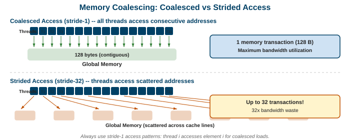

- **Coalesced (stride-1):** `data[tid]` → one 128-byte transaction for 32 × 4 bytes
- **Strided:** `data[tid * N]` → up to 32 separate transactions
- **Random:** `data[index[tid]]` → worst case, 32 transactions

Note: The memory controller serves requests in 32-byte or 128-byte sectors. If all 32 threads access a contiguous 128-byte range, one transaction suffices. If they scatter across memory, each unique sector requires its own transaction. The throughput difference is dramatic.

---

## Coalesced Access: Code Examples

```c
// GOOD: stride-1, all 32 threads access consecutive addresses
float val = input[blockIdx.x * blockDim.x + threadIdx.x];  // one 128B transaction

// BAD: stride-N, each thread accesses a different cache line
float val = input[threadIdx.x * N + blockIdx.x];  // up to 32 transactions

// BAD: random access
float val = input[indices[threadIdx.x]];  // scattered, worst case
```

| Pattern | Transactions per warp | Effective bandwidth |
|---|---|---|
| Stride-1 (coalesced) | 1 | ~100% of peak |
| Stride-2 | 2 | ~50% |
| Stride-32 | 32 | ~3% |
| Random | up to 32 | ~3% |

Note: The bandwidth column is approximate. Even stride-2 access halves your effective bandwidth because you're loading cache lines that are only half-used. Always aim for stride-1 access in the innermost loop.

---

## Structure of Arrays vs Array of Structures

> **Intuition:** on a CPU, you group related fields together (AoS) for cache locality per element. On a GPU, you group same fields together (SoA) so adjacent threads access adjacent memory.

**Array of Structures (AoS), CPU-friendly:**
```c
struct Particle { float x, y, z, mass; };
Particle particles[N];
// Thread i reads particles[i].x → stride-4, non-coalesced
```

**Structure of Arrays (SoA), GPU-friendly:**
```c
float x[N], y[N], z[N], mass[N];
// Thread i reads x[i] → stride-1, coalesced
```

> <span class="accent">SoA on GPU can be 10x faster</span> than AoS for the same computation, purely from coalescing.

Note: If you port CPU code to CUDA and it's slow, the first thing to check is your data layout. AoS-to-SoA conversion is often the single biggest performance win. Libraries like Thrust provide zip iterators to help.

---

## Bank Conflicts in Shared Memory

Shared memory is organized in <span class="accent">32 banks</span>, each 4 bytes wide. Address mapping: `bank = (address / 4) % 32`.

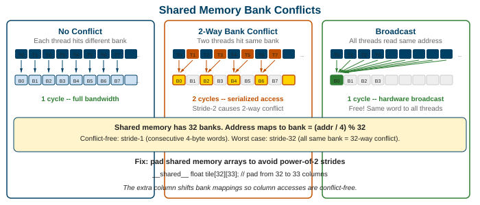

- **No conflict:** each thread accesses a different bank → one cycle
- **2-way conflict:** two threads hit the same bank → serialized, 2 cycles
- **32-way conflict:** all threads hit the same bank → 32 cycles (worst case)
- **Exception:** all threads reading the *same address* is a broadcast (free)

Note: Bank conflicts are silent performance killers. Your code produces correct results, but shared memory throughput drops. Use Nsight Compute's "shared memory bank conflicts" metric to detect them.

---

## Bank Conflicts: Padding Fix

**Problem:** `shared[tid * 2]` only uses even banks (2-way conflict).

**Fix:** pad the array so stride and bank count are coprime:

```c
// BAD: 2-way bank conflicts
__shared__ float s[256];
float val = s[tid * 2];       // bank = (tid*2) % 32, only 16 unique banks

// GOOD: add 1 padding element per row
__shared__ float s[256 + 8];  // +8 shifts every 32nd element by one bank
float val = s[tid * 2 + tid / 16]; // adjusted indexing
```

> Padding is the standard fix. It wastes a few bytes of shared memory but eliminates conflicts.

Note: The exact padding depends on the access pattern. For a 2D tile with column access, adding one padding element per row (`tile[32][33]` instead of `tile[32][32]`) is the classic fix. The compiler cannot do this automatically because it changes the array layout.

---

## Worked Example: Matrix Transpose

**Naive transpose (non-coalesced writes):**
```c
// Read is coalesced (row-major), but write is strided (column-major)
out[j * N + i] = in[i * N + j];  // write stride = N, terrible
```

**Tiled transpose (shared memory):**
```c
__shared__ float tile[32][33];                // 33 = padding to avoid bank conflicts
tile[threadIdx.y][threadIdx.x] = in[row * N + col];  // coalesced read into shared
__syncthreads();
out[col * N + row] = tile[threadIdx.x][threadIdx.y];  // coalesced write from shared
```

> The shared memory tile decouples the read pattern from the write pattern. Both accesses to global memory are now coalesced. Padding `[32][33]` prevents bank conflicts on the column read.

Note: Matrix transpose is the canonical example of shared memory tiling. The naive version achieves ~10% of peak bandwidth. The tiled version achieves ~90%. The only difference is a 32x33 shared memory buffer and a `__syncthreads()`.

---

## Part 6: Tensor Cores and Mixed Precision
### <span class="optional">Optional Reading</span>

### How do tensor cores achieve 10x the throughput of regular CUDA cores?

Note: Parts 6 and 7 are supplementary material, not required for exams. Tensor cores are the single biggest architectural innovation for AI workloads in the last decade. They exploit the fact that neural networks tolerate lower precision, which lets the hardware do dramatically more work per cycle.

---

## What is a Tensor Core?

> **Intuition:** a regular CUDA core does one multiply-add per cycle. A tensor core does a <span class="accent">4×4 matrix multiply-accumulate</span> in one cycle, which is 128 multiply-adds.

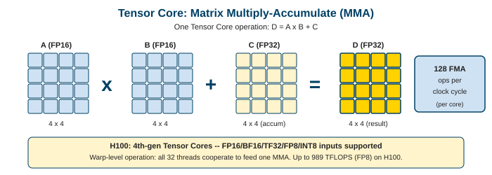

$$D = A \times B + C$$

Where $A$, $B$ are 4×4 matrices in FP16/BF16/FP8 and $C$, $D$ are 4×4 in FP32.

- One tensor core: 128 FMA operations per cycle
- H100 has 4 tensor cores per SM × 132 SMs = 528 tensor cores

Note: The 4×4 operation is the hardware primitive. Libraries like cuBLAS break larger matrix multiplies into tiles that map to this 4×4 operation. The programmer rarely calls tensor cores directly; cuBLAS and cuDNN handle it.

---

## Mixed Precision Training

> **Intuition:** neural networks don't need 32-bit precision for every operation. Using FP16 for the forward pass halves memory usage and doubles throughput, while keeping FP32 for critical accumulations to maintain accuracy.

**The recipe:**
1. **Forward pass:** FP16 activations and weights (tensor cores)
2. **Loss computation:** FP32 (avoid underflow)
3. **Backward pass:** FP16 gradients (tensor cores)
4. **Weight update:** FP32 master weights + FP32 optimizer state

**Loss scaling:** multiply the loss by a large constant before backprop to prevent FP16 gradient underflow, then divide after.

> <span class="accent">Result:</span> ~2x memory savings, 2-8x throughput gain, no accuracy loss on most models.

Note: Mixed precision training was popularized by Micikevicius et al. (NVIDIA, 2017). Today it's the default for all large model training. PyTorch's `torch.cuda.amp` and TensorFlow's mixed precision API automate the FP16/FP32 bookkeeping.

---

## Precision Formats

| Format | Exponent | Mantissa | Range | Precision | Use Case |
|---|---|---|---|---|---|
| FP32 | 8 bits | 23 bits | ±3.4e38 | High | Master weights, optimizer |
| TF32 | 8 bits | 10 bits | ±3.4e38 | Medium | Ampere+ default for matmul |
| FP16 | 5 bits | 10 bits | ±65504 | Medium | Training (pre-Hopper) |
| BF16 | 8 bits | 7 bits | ±3.4e38 | Low | Training (preferred, same range as FP32) |
| FP8 E4M3 | 4 bits | 3 bits | ±448 | Very low | Hopper+ training |
| FP8 E5M2 | 5 bits | 2 bits | ±57344 | Very low | Hopper+ gradients |

> <span class="accent">BF16 is the sweet spot</span> for training: same range as FP32 (8 exponent bits) with enough precision for most models. FP8 is the frontier, requiring careful scaling.

Note: The trend is clear: every generation uses lower precision. V100 introduced FP16 tensor cores. A100 added TF32 and BF16. H100 added FP8. Blackwell adds FP4. Each step doubles throughput per watt.

---

## Tensor Core Performance Across Generations

| GPU | Architecture | FP16 Tensor | FP8 Tensor | Memory BW |
|---|---|---|---|---|
| V100 (2017) | Volta | 125 TFLOPS | n/a | 900 GB/s |
| A100 (2020) | Ampere | 312 TFLOPS | n/a | 2,039 GB/s |
| H100 (2022) | Hopper | 990 TFLOPS | 1,979 TFLOPS | 3,350 GB/s |
| B200 (2024) | Blackwell | ~2,250 TFLOPS | ~4,500 TFLOPS | ~8,000 GB/s |

> Each generation roughly <span class="accent">doubles</span> both compute and bandwidth. This is how training runs that took months in 2020 take days in 2025.

Note: These are spec-sheet peak numbers. Real-world training efficiency (MFU, model FLOP utilization) is typically 30-60% of peak, depending on model size, batch size, and communication overhead.

---

## Structured Sparsity (Ampere+)

> **Intuition:** if half the weights in a matrix are zero (in a specific pattern), the hardware can skip those multiplications and double throughput.

**The 2:4 pattern:** in every group of 4 consecutive values, exactly 2 must be zero.

- Hardware stores only the non-zero values + a 2-bit index per group
- Tensor cores skip the zero multiplications
- <span class="accent">2x throughput</span> over dense tensor core operations

> Useful for inference after pruning. Training with structured sparsity is an active research area.

Note: The constraint (exactly 2:4 zeros) is strict. Random sparsity doesn't help because the hardware can't exploit it. Pruning algorithms must be sparsity-aware to produce the required pattern. NVIDIA provides libraries for sparse matrix operations.

---

## Part 7: Modern GPU Architectures
### <span class="optional">Optional Reading</span>

### What does a 2025 GPU cluster look like?

Note: This part is supplementary material, not required for exams. Individual GPU performance matters, but modern AI training uses thousands of GPUs connected by high-speed networks. The cluster architecture is as important as the chip architecture.

---

## NVIDIA Architecture Timeline

| Architecture | Year | Key Innovation |
|---|---|---|
| **Kepler** | 2012 | Dynamic parallelism (kernels launching kernels) |
| **Maxwell** | 2014 | Energy efficiency, unified memory improvements |
| **Pascal** | 2016 | NVLink 1.0, HBM2, first deep learning GPU (P100) |
| **Volta** | 2017 | First tensor cores, independent thread scheduling |
| **Turing** | 2018 | RT cores (ray tracing), INT8 inference |
| **Ampere** | 2020 | TF32, BF16, structured sparsity, 3rd gen tensor cores |
| **Hopper** | 2022 | FP8, transformer engine, thread block clusters, TMA |
| **Blackwell** | 2024 | Multi-die design, FP4, 5th gen NVLink, 2nd gen transformer engine |

> The trend: each generation adds new precision formats and specialized units for the dominant workload (which is now transformers).

Note: Notice how the innovations shifted from graphics (RT cores in Turing) to AI training (tensor cores, transformer engine, FP8). NVIDIA designs its architectures around the workloads that drive GPU sales, and since 2020 that's been overwhelmingly AI.

---

## Hopper (H100) Deep Dive

Key innovations beyond raw performance:

- **Transformer Engine:** automatically selects FP8 or FP16 per layer based on the tensor's value distribution. No programmer intervention needed.
- **TMA (Tensor Memory Accelerator):** hardware unit for async bulk data movement. Replaces manual `memcpy` loops with a single instruction.
- **Thread Block Clusters:** new hierarchy level. Blocks in a cluster can access each other's shared memory via <span class="accent">distributed shared memory</span> without going through L2/HBM.

> Thread block clusters let blocks on neighboring SMs cooperate directly, which is critical for operations like attention that need cross-block communication.

Note: The transformer engine is significant because it removes the programmer burden of choosing precision. The hardware profiles the data range at runtime and picks FP8 when safe, falling back to FP16 when needed. This is a sign that GPU hardware is specializing for transformer workloads.

---

## Blackwell (B200) Overview

| Spec | H100 | B200 |
|---|---|---|
| Transistors | 80 billion | 208 billion |
| Design | Single die | <span class="accent">Two dies</span> connected via 10 TB/s link |
| HBM | 80 GB HBM3 | 192 GB HBM3e |
| Memory BW | 3.35 TB/s | ~8 TB/s |
| FP8 tensor | 1,979 TFLOPS | ~4,500 TFLOPS |
| New precision | n/a | FP4 |
| NVLink | Gen 4 (900 GB/s) | Gen 5 (1,800 GB/s) |

> Blackwell's two-die design breaks the reticle limit (the maximum size a single lithography exposure can produce). It's the first GPU that couldn't physically fit on one chip.

Note: The multi-die trend will continue. As transistors shrink, interconnect between dies becomes the bottleneck. This connects back to the chiplet discussion in Lecture 6 (cache coherence). CXL and NVLink are both solutions to the multi-die communication problem.

---

## NVLink and NVSwitch

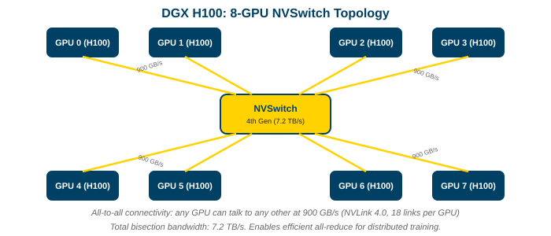

**Evolution:**
- NVLink 1 (Pascal, 2016): 80 GB/s per GPU
- NVLink 4 (Hopper, 2022): 900 GB/s per GPU (18 links)
- NVLink 5 (Blackwell, 2024): 1,800 GB/s per GPU

**NVSwitch:** a chip that connects all GPUs in a node in a full crossbar.

- DGX H100: 8 GPUs, each connected to every other at 900 GB/s via NVSwitch
- Any GPU can read any other GPU's memory at full bandwidth
- This is what makes all-reduce fast within a node (Lecture 8)

Note: NVLink bandwidth (900 GB/s) is comparable to each GPU's HBM bandwidth (3,350 GB/s). This means cross-GPU communication is only ~3.7x slower than local memory, which is remarkably fast. For comparison, PCIe 5.0 is only 64 GB/s (14x slower than NVLink).

---

## Multi-Node: NVLink Network and InfiniBand

| Interconnect | Scope | Bandwidth per GPU |
|---|---|---|
| NVLink + NVSwitch | Within a node (8 GPUs) | 900 GB/s |
| NVLink Network (Hopper+) | Across nodes (up to 256 GPUs) | 900 GB/s |
| InfiniBand NDR | Across a cluster | ~50 GB/s |
| Ethernet (RoCE) | Across a data center | ~25-50 GB/s |

> **NVLink Network** extends the NVSwitch fabric across nodes, creating a single 256-GPU domain where any GPU can access any other at NVLink speed. Beyond that, you drop to InfiniBand.

Note: The bandwidth cliff between NVLink Network (900 GB/s) and InfiniBand (50 GB/s) is 18x. This is why LLM training clusters carefully place tensor parallelism within NVLink domains and use pipeline/data parallelism across InfiniBand boundaries. Network topology dictates the parallelism strategy.

---

## DGX SuperPOD: How LLM Training Clusters Are Built

**Building blocks:**
- **DGX node:** 8 GPUs + NVSwitch (all-to-all within node)
- **SuperPOD:** 32 DGX nodes = 256 GPUs, connected via NVLink Network or InfiniBand spine
- **Training cluster:** multiple SuperPODs

**Real examples:**
- Meta Llama 3: ~16,000 H100 GPUs
- Google PaLM: ~6,000 TPU v4
- xAI Colossus: ~100,000 H100 GPUs

> At this scale, network topology, fault tolerance, and power delivery are as important as chip performance.

Note: Building these clusters is a systems engineering challenge. Power (each DGX node draws ~10 kW), cooling (liquid cooling is now standard), and reliability (at 16k GPUs, something fails every few hours) are all critical. The chip is almost the easy part.

---

## AMD and Intel: The Competition

| | NVIDIA H100 | AMD MI300X | Intel Gaudi 3 |
|---|---|---|---|
| Memory | 80 GB HBM3 | <span class="accent">192 GB</span> HBM3 | 128 GB HBM2e |
| Bandwidth | 3.35 TB/s | <span class="accent">5.3 TB/s</span> | 3.7 TB/s |
| Interconnect | NVLink 4 | Infinity Fabric | Ethernet-native |
| Software | CUDA | ROCm / HIP | oneAPI |
| Ecosystem | Dominant | Growing | Early |

> AMD's advantage is memory capacity (192 GB vs 80 GB). Intel's bet is Ethernet-native networking (no proprietary interconnect). NVIDIA's moat is the CUDA ecosystem.

Note: HIP (AMD) is source-compatible with CUDA for most kernels. The challenge is libraries: cuDNN, NCCL, TensorRT have no direct AMD equivalents at the same maturity level. This is why CUDA lock-in is real and why portability frameworks (SYCL, Kokkos) matter.

---

## Part 8: Best Practices and Wrap-Up

### What are the most impactful optimizations?

Note: After all this theory, here's the practical priority list. These are ordered by typical impact, from highest to lowest.

---

## Optimization Priority List

1. **Maximize parallelism:** launch enough threads to fill the GPU. Thousands of thread blocks, not tens.
2. **Optimize memory access:** coalesce global loads, use shared memory to reduce HBM traffic
3. **Minimize divergence:** keep threads in the same warp on the same path
4. **Balance occupancy vs. resources:** enough warps to hide latency, but don't sacrifice registers for it
5. **Use tensor cores:** for any matrix multiply or convolution, use cuBLAS/cuDNN (they use tensor cores automatically)
6. **Fuse kernels:** reduce HBM round-trips by combining operations
7. **Use appropriate precision:** FP16/BF16/FP8 whenever accuracy permits
8. <span class="accent">Profile, don't guess:</span> use Nsight Compute to find the actual bottleneck

Note: Most people jump to step 3 or 4 before getting steps 1 and 2 right. If your kernel doesn't have enough threads, no amount of shared memory optimization will help. If your access pattern is non-coalesced, fixing divergence won't matter. Always work top-down.

---

## Profiling with Nsight Compute

Key metrics to check:

| Metric | What It Tells You | Ideal |
|---|---|---|
| SM occupancy | Are there enough warps? | >50% (but see "occupancy myth") |
| Memory throughput (% peak) | Are you bandwidth-bound? | >80% if memory-bound |
| Compute throughput (% peak) | Are you compute-bound? | >80% if compute-bound |
| Warp stall reasons | What are warps waiting for? | Mostly "not selected" (latency hiding working) |
| Shared memory bank conflicts | Are bank conflicts killing throughput? | 0 |

> Nsight Compute also generates a <span class="accent">roofline plot</span> automatically, showing exactly where your kernel lands relative to the hardware limits.

Note: The roofline plot from Nsight is the single most useful visualization. If your kernel is below both roofs, there's headroom. If it's on the memory roof, optimize data movement. If it's on the compute roof, you've done well.

---

## Common Pitfalls

| Pitfall | Symptom | Fix |
|---|---|---|
| Non-coalesced access | Low memory throughput | Restructure data layout (SoA) |
| Too many registers | Low occupancy, register spills | Reduce register pressure or `-maxrregcount` |
| Divergent branches | Low warp efficiency | Align branches to warp boundaries |
| Unnecessary `__syncthreads()` | Warp stall on barrier | Only sync when threads share data |
| Too-small kernel | Kernel launch overhead dominates | Fuse kernels or use CUDA graphs |
| Ignoring precision | Using FP32 when BF16 works | Enable mixed precision training |

Note: These are the problems that show up in 90% of unoptimized GPU code. If your kernel is slow, check these in order. Use Nsight Compute to confirm which one is the actual bottleneck before optimizing.

---

## The GPU Ecosystem Stack

| Layer | Examples | Who Works Here |
|---|---|---|
| **Application** | PyTorch, TensorFlow, JAX | ML engineers |
| **Libraries** | cuBLAS, cuDNN, NCCL, CUTLASS | Framework developers |
| **Runtime** | CUDA runtime, driver | Systems engineers |
| **Hardware** | SM, tensor cores, NVLink | Chip architects |

> Most users stay at the top layer. Performance optimization means going one layer deeper than your current level. The deepest gains come from understanding the hardware.

Note: This lecture gave you the hardware understanding. When PyTorch is slow, you can now reason about whether it's a memory bandwidth problem, a divergence problem, or an occupancy problem, and know which layer to investigate.

---

## Key Takeaways

1. **GPUs trade latency for throughput.** They hide memory latency with thousands of concurrent threads.
2. **The SM is the building block.** Understanding SM resources (cores, registers, shared memory, warp schedulers) explains all performance behavior.
3. **Warps of 32 are the true execution unit.** Divergence within a warp wastes execution slots.
4. **Memory hierarchy determines performance.** Registers > shared memory > L2 > HBM. Keep data as high as possible.
5. **Coalescing and bank conflicts are make-or-break.** Data layout (SoA vs AoS) matters more than algorithm cleverness.
6. **Tensor cores enable mixed-precision training.** FP16/BF16/FP8 multiply throughput while FP32 preserves accuracy.
7. **Modern GPUs are designed for AI.** Transformer engines, FP8, and NVLink exist because of LLM training demand.
8. <span class="accent">Profile before optimizing.</span> The efficiency curve tells you whether you're fighting bandwidth, divergence, or occupancy.

Note: These eight points are the mental model for reasoning about GPU performance. When you encounter a slow kernel, walk through this list: is it bandwidth-bound (memory hierarchy)? Divergence-bound (warp execution)? Occupancy-limited (resource allocation)? The answer determines the fix.

---

## Further Reading

- **Kirk, Hwu.** *Programming Massively Parallel Processors* (4th edition). The standard GPU programming textbook.
- **NVIDIA CUDA Programming Guide.** Comprehensive reference for the CUDA execution and memory model.
- **Volkov, V.** "Better Performance at Lower Occupancy" (GTC 2010). Debunks the occupancy myth.
- **He, H.** "Making Deep Learning Go Brrrr From First Principles." Connects arithmetic intensity to GPU performance.
- **NVIDIA H100 Whitepaper.** Architecture deep dive with SM diagrams and performance analysis.
- **NVIDIA Blackwell Architecture Whitepaper.** Multi-die design, FP4, 5th gen NVLink.
- **Micikevicius et al.** "Mixed Precision Training" (ICLR 2018). The paper that launched mixed-precision training.

Note: The single best way to learn GPU programming is to write a kernel, profile it with Nsight Compute, and iterate. Start with a simple kernel (vector add, matrix transpose, reduction), check the roofline plot, and optimize until you hit the roof. That cycle teaches more than any textbook.
