# Specialized Parallel Architectures
## When and Why to Build Custom Hardware
### GWU ECE 6125: Parallel Computer Architecture

---

## Lecture Roadmap

| Part | Topic | Key Question |
|------|-------|-------------|
| 1 | **The Specialization Spectrum** | Why can't GPUs do everything? |
| 2 | **Energy Efficiency** | Where does the energy go in a CPU instruction? |
| 3 | **The Memory Bottleneck** | Why is moving data more expensive than computing? |
| 4 | **FPGAs** | What if you could reprogram the hardware itself? |
| 5 | **Domain-Specific Architectures** | Can we get ASIC efficiency with some programmability? |
| 6 | **Systolic Arrays and Dataflow** | How does data flow through a TPU? |
| 7 | **Programming Specialized Hardware** | How do programmers actually use this hardware? |
| 8 | **The Future** | Chiplets, disaggregation, composable accelerators |

Note: Lecture 09 covered GPU architecture in depth. This lecture asks the next question: when is even a GPU not specialized enough? The answer leads to FPGAs, TPUs, and custom ASICs, all driven by one fundamental constraint: energy.

---

## Part 1: The Specialization Spectrum

### Why can't GPUs do everything?

Note: GPUs are great for data-parallel workloads, but they still spend transistors on generality (branch handling, thread scheduling, programmable cores). For some workloads, that overhead is unacceptable.

---

## Why Specialize?

> **Intuition:** a Swiss Army knife can do many things, but a surgeon's scalpel does one thing far better. Specialization means removing everything except what the workload actually needs.

- **Dennard scaling ended** (~2006): we can't keep making transistors faster and more power-efficient
- **Moore's Law is slowing:** transistor counts still grow, but the gains per transistor shrink
- **The only path forward:** do fewer things per transistor, but do them <span class="accent">much more efficiently</span>

> This is why every hyperscaler (Google, Amazon, Meta, Microsoft, Apple) now designs custom silicon for their most important workloads.

Note: The end of Dennard scaling is the root cause. When you could get free performance from smaller, faster transistors, generality was fine. Now that each transistor costs real energy, you must spend them wisely.

---

## The Specialization Spectrum

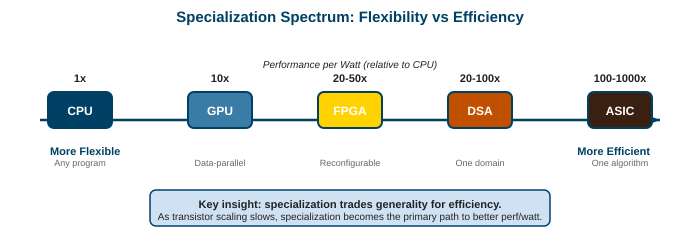

| Hardware | Perf/Watt vs CPU | Flexibility | Development Cost |
|---|---|---|---|
| **CPU** | 1x (baseline) | Any program | Lowest (software) |
| **GPU** | ~10x | Data-parallel programs | Low (CUDA) |
| **FPGA** | ~20-50x | Reconfigurable logic | Medium (RTL/HLS) |
| **DSA** (e.g., TPU) | ~20-100x | One domain (e.g., ML) | High (chip design) |
| **ASIC** | ~100-1000x | One algorithm | Highest ($50M-500M NRE) |

> Moving right trades flexibility for efficiency. The question is: how stable is your workload?

Note: NRE = Non-Recurring Engineering cost. An ASIC can cost $50-500M to design and tape out. You only do this if the volume justifies it (millions of chips) or the performance is critical (Google TPU, Apple Neural Engine).

---

## When to Specialize: A Decision Framework

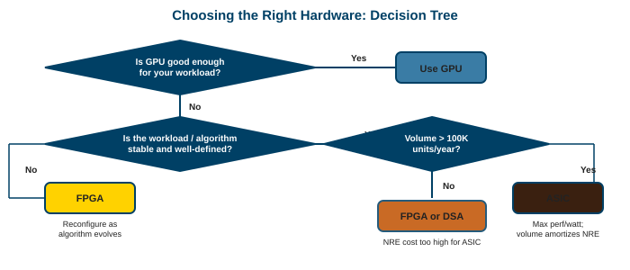

Key questions to ask:
- **Is the workload stable?** If the algorithm changes every year, an ASIC is risky.
- **Is volume high enough?** ASIC NRE only makes sense at scale.
- **Is latency critical?** FPGAs and ASICs can achieve deterministic sub-microsecond latency.
- **Can a GPU do it?** If yes, start there. GPUs have the best ecosystem.

> <span class="accent">Default to GPU.</span> Specialize only when GPU hits a wall (power, latency, or cost per inference).

Note: Most companies should not build custom chips. The ecosystem cost (compilers, debuggers, profilers, libraries) is enormous. Google, Amazon, and Apple do it because they deploy millions of chips and can amortize the cost.

---

## Case Study: Anton Supercomputer

> **What:** a purpose-built machine for molecular dynamics simulation (D.E. Shaw Research, 2008 and 2024).

- **Why not GPUs?** Molecular dynamics has fixed communication patterns (particle interactions) that a custom interconnect handles much better than generic NVLink.
- **Key innovations:**
  - Custom ASIC for force calculations (specialized math pipelines)
  - 3D torus network with sub-microsecond latency between nodes
  - Entire machine designed around one algorithm (N-body simulation)
- **Result:** 100x faster than GPU clusters for long molecular dynamics trajectories

> Anton is the poster child for specialization: if your workload is stable and important enough, custom hardware wins decisively.

Note: Anton-3 (2024) can simulate millisecond-scale protein dynamics, which would take years on a GPU cluster. D.E. Shaw Research uses it to study drug interactions at timescales no other machine can reach.

---

## Part 2: Energy Efficiency

### Where does the energy go in a CPU instruction?

Note: Energy is the fundamental reason specialization exists. If we had infinite energy, general-purpose processors would be fine. We don't, so every wasted picojoule matters.

---

## The Energy Equation

$$P = \frac{\text{Operations}}{\text{second}} \times \frac{\text{Joules}}{\text{Operation}}$$

Two ways to improve performance within a power budget:

- **More operations per second** at the same energy per op (parallelism, higher clock)
- **Fewer joules per operation** at the same throughput (specialization)

> GPUs improved the first term (more parallel ops). Specialized hardware improves the second (less energy per op). <span class="accent">Specialization is the only path when both matter.</span>

Note: This equation frames the entire lecture. A GPU does more ops/sec than a CPU but uses roughly the same joules/op for each floating-point multiply. A TPU does the same ops/sec as a GPU but fewer joules/op because it removes overhead.

---

## Energy-Constrained Domains

Every computing domain has a power wall:

| Domain | Power Budget | Why It Matters |
|---|---|---|
| **Supercomputers** | 20-60 MW | Electricity is ~60% of operating cost |
| **Data centers** | 10-50 MW per facility | Cooling scales with power |
| **Mobile / Edge** | 3-10 W | Battery improves ~5%/year, compute demand grows 30%/year |
| **IoT / Embedded** | milliwatts | Must run on harvested energy or coin cells |

> At every scale, doing more work per joule is the path to better products. A phone that uses half the energy per inference gets twice the battery life.

Note: Data center power is becoming a geopolitical issue. Microsoft, Google, and Amazon are all signing deals for dedicated power sources (nuclear, solar) because they can't get enough grid power for AI training. Energy efficiency is not just a technical issue.

---

## Where Does Energy Go in a CPU Instruction?

> **Key insight:** on a general-purpose CPU, <span class="accent">less than 15% of the energy</span> does useful computation. The rest is overhead.

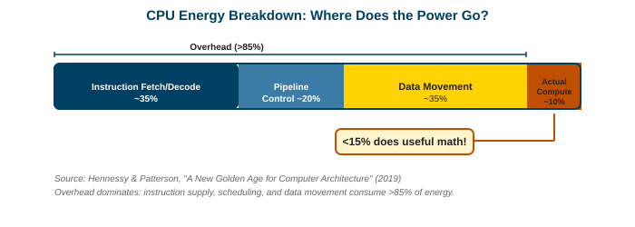

| Component | Energy Share | What It Does |
|---|---|---|
| Instruction fetch/decode | ~30-40% | Read instruction from cache, figure out what it means |
| Pipeline control | ~15-20% | Branch prediction, register renaming, out-of-order scheduling |
| Data movement | ~30-40% | Move operands between register file, cache, and ALU |
| <span class="accent">Actual computation</span> | ~5-15% | The multiply or add you actually wanted |

> A specialized processor removes the first three rows. That is where the 100-1000x efficiency comes from.

Note: This breakdown comes from research by Mark Horowitz (Stanford). The numbers vary by workload, but the key insight is consistent: the overhead of generality dominates. An ASIC that does matrix multiply doesn't need instruction fetch, branch prediction, or out-of-order execution.

---

## Case Study: H.264 Video Encoding

The same task on different hardware:

| Implementation | Power | Relative Efficiency |
|---|---|---|
| General-purpose CPU | ~1 W for 1080p encode | 1x |
| CPU with SIMD (SSE/AVX) | ~500 mW | 2x |
| GPU (NVENC-style) | ~50 mW | 20x |
| Dedicated ASIC (hardware encoder) | ~10 mW | <span class="accent">100x</span> |

> The ASIC removes instruction fetch, branch prediction, cache management, and thread scheduling. What's left is pure video encoding logic.

- Every smartphone has a hardware H.264/H.265 encoder
- This is why your phone can record 4K video for hours without draining the battery
- A CPU doing the same encode would kill the battery in minutes

Note: The H.264 case study perfectly illustrates specialization. The algorithm is stable (the standard hasn't changed fundamentally), the volume is enormous (billions of phones), and the power constraint is strict (battery). All three conditions for specialization are met.

---

## Case Study: FFT

Fast Fourier Transform on different hardware:

| | Area (relative) | Power (relative) |
|---|---|---|
| CPU (software FFT) | 1x | 1x |
| GPU | ~5-7x more area efficient | ~5-10x more power efficient |
| ASIC (hardwired FFT butterfly) | <span class="accent">~1000x smaller</span> | <span class="accent">~100x less power</span> |

> **Why?** FFT has a fixed dataflow (butterfly pattern). No branches, no dynamic scheduling needed. The ASIC hardwires the butterfly connections, eliminating all control overhead.

Note: FFT is used everywhere: 5G signal processing, audio codecs, radar, MRI reconstruction. In each case, the ASIC version wins on power because the algorithm is well-understood and stable. This is why every 5G baseband chip has a hardwired FFT unit.

---

## The Takeaway: Generality Costs Energy

> **Every transistor spent on flexibility is a transistor NOT doing useful math.**

Specialization means removing overhead until only the computation remains:

- No instruction fetch (the "program" is hardwired)
- No branch prediction (the control flow is fixed)
- No cache hierarchy (data movement is planned at design time)
- No thread scheduling (the parallelism pattern is known)

> The more predictable your workload, the more overhead you can remove, and the more efficient your hardware becomes.

Note: This principle explains the entire specialization spectrum. A CPU removes nothing (maximum flexibility). A GPU removes some branch prediction and out-of-order logic. An FPGA removes instruction fetch. A DSA removes most control logic. An ASIC removes everything except the computation itself.

---

## Part 3: The Memory Bottleneck

### Why is moving data more expensive than computing on it?

Note: We covered the memory hierarchy from the programmer's perspective in Lectures 8 and 9. Now we look at the hardware: how DRAM actually works, why it's slow, and what specialized hardware does about it.

---

## Data Movement Energy Costs

The energy to move data dwarfs the energy to compute on it:

| Operation | Energy (picojoules) | Relative |
|---|---|---|
| 8-bit integer add | ~0.03 pJ | 1x |
| 32-bit integer multiply | ~3 pJ | 100x |
| 32-bit FP multiply | ~4 pJ | 130x |
| Read 64 bits from L1 cache | ~10 pJ | 330x |
| Read 64 bits from LLC | ~100 pJ | 3,300x |
| Read 64 bits from LPDDR | ~1,200 pJ | <span class="accent">40,000x</span> |

> Reading 64 bits from DRAM costs <span class="accent">40,000x</span> more energy than an 8-bit integer add. This is why specialized hardware focuses on minimizing data movement.

Note: These numbers are from Horowitz's ISSCC 2014 keynote for 45nm technology. At smaller nodes the compute energy drops faster than the memory energy, making the gap even larger. This is the fundamental reason every specialized accelerator includes large on-chip SRAM buffers.

---

## DRAM Basics

> **Intuition:** DRAM stores each bit as charge on a tiny capacitor. Reading is destructive (drains the charge), so every read must be followed by a rewrite. This fundamental physics shapes everything about DRAM performance.

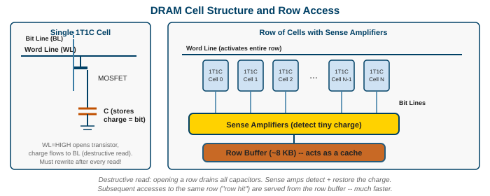

- **1T1C cell:** one transistor (access gate) + one capacitor (stores the bit)
- **Row buffer:** a row of sense amplifiers that holds one activated row (~2 Kbits = 8 KB)
- **Destructive read:** opening the transistor shares charge between capacitor and bitline. Sense amplifier detects the tiny voltage difference, then rewrites the value.

Note: The 1T1C cell is the smallest possible storage element, which is why DRAM is so dense (and cheap). But the destructive read and the need for periodic refresh (every ~64ms) add complexity and latency that SRAM avoids.

---

## DRAM Access Timing

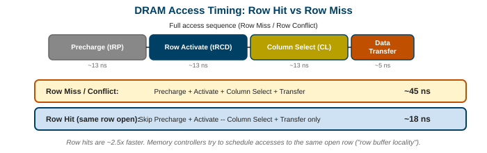

| Step | Time | What Happens |
|---|---|---|
| **Precharge** | ~10 ns | Prepare bitlines to neutral voltage |
| **Row Activate** | ~10 ns | Open the row, charge flows to sense amps |
| **Column Select** | ~10 ns | Pick which columns to read from the row buffer |
| **Data Transfer** | ~5 ns | Send data to the memory controller |

**Row hit** (data already in row buffer): ~15 ns. **Row miss** (need precharge + activate): ~45-60 ns.

> <span class="accent">Row hits are 3-4x faster than row misses.</span> This is why access patterns matter so much, even at the DRAM level.

Note: The row buffer acts like a cache inside DRAM. If you access the same row repeatedly (sequential reads), you get fast column selects. If you jump between rows randomly, you pay the full precharge + activate penalty every time. This is the hardware reason sequential access is faster than random access.

---

## DRAM Access Patterns

| Pattern | Efficiency | Why |
|---|---|---|
| **Sequential (same row)** | ~95% | Row already activated, just column selects |
| **Burst mode (64B cache line)** | ~70% | Amortizes row activation over multiple columns |
| **Random (different rows)** | ~20-30% | Every access pays precharge + activate penalty |

> **Burst mode** is how real systems access DRAM: request a cache line (64 bytes), get consecutive columns from the same row. DDR5 minimum burst is 64 bytes.

- This is the hardware reason why coalesced GPU access matters (Lecture 09)
- It's also why CPU prefetchers try to predict sequential access patterns

Note: The efficiency numbers represent fraction of peak bandwidth actually achieved. Random access wastes most of the available bandwidth on row activations and precharges.

---

## DRAM Organization: Bank/Rank/Channel

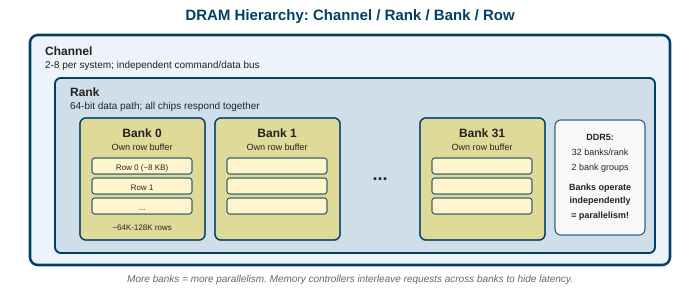

| Level | What It Is | Parallelism |
|---|---|---|
| **Channel** | Independent path to memory controller | 2-8 channels per system |
| **Rank** | Group of chips operating in lockstep | 1-2 ranks per channel |
| **Bank** | Independent array with own row buffer | DDR5: 32 banks per rank |
| **Row** | One row of cells (~8 KB) | Activated into row buffer |

> **Bank parallelism** is the key to DRAM throughput: while one bank precharges, another can activate, and a third can transfer data. Modern DDR5 with 32 banks enables significant overlap.

Note: The memory controller exploits bank parallelism by reordering requests. It groups accesses to the same bank/row together (row hit optimization) and interleaves accesses to different banks. This is transparent to the programmer but critical for performance.

---

## Memory Controller Scheduling

The memory controller reorders requests for performance:

- **FR-FCFS** (First-Ready, First-Come-First-Served): prioritize row hits over older requests
- **Read/write grouping:** batch reads together, then writes, to minimize bus turnaround (~5 ns penalty per direction switch)
- **Address mapping:** XOR bank bits with row bits to spread accesses across banks

> A good memory controller can improve effective bandwidth by <span class="accent">~30%</span> over naive FIFO ordering.

Note: Memory controller scheduling is a hardware optimization invisible to the programmer, but it explains why benchmark results can vary with access patterns. The controller is constantly making decisions about which request to serve next, balancing fairness, latency, and throughput.

---

## Numerical Precision and Energy

Halving precision roughly halves the energy and area per operation:

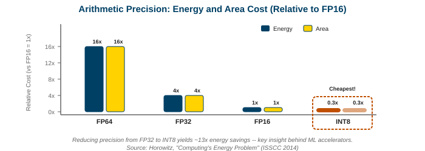

| Format | Bits | Relative Energy | Relative Area |
|---|---|---|---|
| FP64 | 64 | 16x | 16x |
| FP32 | 32 | 4x | 4x |
| FP16 | 16 | 1x (baseline) | 1x |
| INT8 | 8 | ~0.3x | ~0.3x |

> This is the hardware reason mixed precision works (Lecture 09). Using FP16 instead of FP32 halves memory bandwidth needs AND halves compute energy. Using INT8 for inference cuts both by another 3x.

Note: The relationship is roughly quadratic for floating-point (energy scales with bit-width squared because the multiplier area scales that way). This is why every generation of ML accelerator pushes lower precision: FP32 → FP16 → BF16 → FP8 → INT4.

---

## Addressing the Memory Bottleneck

<div class="cols">
<div class="left">

**Software approaches:**
- Data locality and tiling
- Compression (sparse formats)
- Kernel fusion (fewer round-trips)
- Prefetching

</div>
<div class="right">

**Hardware approaches:**
- 3D stacking (HBM)
- Wider interfaces (5120-bit HBM bus)
- Near-memory computing (PIM)
- Large on-chip SRAM (TPU: 24 MB unified buffer)

</div>
</div>

> **Three principles:** (1) Move data closer to compute. (2) Move compute closer to data. (3) Reduce how much data you move.

Note: Every specialized accelerator embodies these principles. The TPU has a 24 MB on-chip buffer to avoid DRAM trips. HBM stacks memory on the chip. Processing-in-memory (PIM) puts compute logic inside the DRAM chip itself. The trend is clear: the future is about co-locating compute and data.

---

## Part 4: FPGAs

### What if you could reprogram the hardware itself?

Note: FPGAs occupy a unique position on the spectrum: they offer near-ASIC efficiency for some workloads, but you can reprogram them in the field. No other hardware type offers this combination.

---

## What is an FPGA?

> **Intuition:** an FPGA is a chip made of millions of tiny programmable logic blocks connected by a configurable routing network. You "program" it by configuring which logic each block implements and how they connect. It's like a breadboard that can become any circuit.

**Field Programmable Gate Array:**
- **Field programmable:** reconfigure after manufacturing (unlike an ASIC)
- **Gate array:** a grid of logic elements that can implement any digital circuit

> Unlike software (which runs instructions sequentially on fixed hardware), an FPGA physically rewires itself to become the circuit you need.

Note: FPGAs were invented by Xilinx (now AMD) in 1985. They started as glue logic for prototyping but evolved into serious compute platforms. Today the biggest FPGAs have millions of logic cells and compete with GPUs for specific workloads.

---

## FPGA Architecture

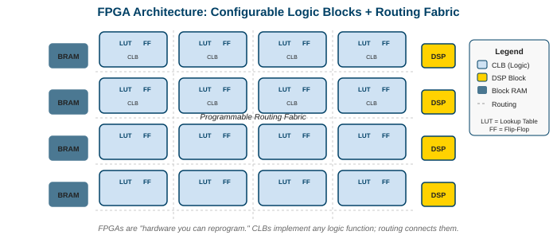

| Component | What It Does |
|---|---|
| **LUT** (Look-Up Table) | Implements any N-input boolean function (typically 6-input) |
| **Flip-Flop** | Stores one bit of state (registers) |
| **DSP Block** | Hardened multiply-accumulate unit (for math-heavy workloads) |
| **Block RAM** | On-chip SRAM blocks (tens of MB total) |
| **Routing Fabric** | Configurable wires connecting all components |

> A 6-input LUT is a 64-entry truth table stored in SRAM. It can implement ANY boolean function of 6 inputs in one clock cycle.

Note: The routing fabric typically consumes more area and power than the logic blocks themselves. This is the fundamental overhead of reconfigurability: the wires that could connect anything are less efficient than the fixed wires of an ASIC that connect exactly what's needed.

---

## FPGA vs GPU vs ASIC Tradeoffs

| | FPGA | GPU | ASIC |
|---|---|---|---|
| **Development time** | Weeks to months | Days (software) | 1-3 years |
| **NRE cost** | ~$100K | ~$0 (software) | $50-500M |
| **Per-unit cost** | $100-10,000 | $1,000-30,000 | $1-100 (at volume) |
| **Flexibility** | Reconfigurable | Programmable | Fixed |
| **Clock speed** | 300-500 MHz | 1.5-2 GHz | Up to 3+ GHz |
| **Perf/watt** | 20-50x vs CPU | 10x vs CPU | 100-1000x vs CPU |
| **Latency** | <span class="accent">Deterministic, sub-μs</span> | Variable (kernel launch) | Deterministic |

> FPGA sweet spot: <span class="accent">low latency, medium volume, evolving algorithms.</span>

Note: The latency advantage is key. A GPU kernel launch takes ~5 μs. An FPGA pipeline can process data in tens of nanoseconds with deterministic timing. This is why high-frequency trading firms and 5G base stations use FPGAs.

---

## FPGA Use Cases

| Domain | Why FPGA Wins | Example |
|---|---|---|
| **Network packet processing** | Deterministic line-rate processing | Cisco, Juniper routers |
| **Financial trading** | Sub-microsecond latency | HFT firms (Citadel, Jump) |
| **Genomics** | Smith-Waterman alignment is regular but evolving | Illumina sequencers |
| **Video transcoding** | Real-time, low latency | Broadcast infrastructure |
| **Cloud acceleration** | Reconfigurable per customer | AWS F1, Microsoft Catapult |
| **5G baseband** | Evolving standards, strict latency | Nokia, Ericsson |

> Microsoft's Project Catapult deployed FPGAs in every Azure server for network acceleration and ML inference. AWS F1 instances let customers deploy custom FPGA logic in the cloud.

Note: The cloud FPGA trend is significant. AWS F1 lets you rent FPGA hardware by the hour and deploy your own bitstream. This lowers the barrier to FPGA use from "buy a $10K board" to "spin up an instance for $1.65/hour."

---

## FPGA Limitations

- **Clock speed:** 300-500 MHz vs. CPU at 4-5 GHz and GPU at 1.5-2 GHz. FPGAs compensate with massive parallelism, but the clock gap is real.
- **Utilization:** routing overhead means only ~60-70% of logic cells are usable in practice.
- **Programming difficulty:** Verilog/VHDL is hardware design, not software. HLS (High-Level Synthesis) from C/C++ helps but produces less efficient circuits.
- **Power efficiency:** better than GPU but worse than ASIC (routing fabric wastes energy).
- **Ecosystem:** much smaller developer community than CUDA.

> FPGAs are the right choice when your workload needs custom logic but changes too fast for an ASIC, or when deterministic latency matters more than raw throughput.

Note: Intel (Altera) and AMD (Xilinx) dominate the FPGA market. Both are investing heavily in making FPGAs easier to program (Intel oneAPI for FPGAs, AMD Vitis HLS). The programming difficulty is the biggest barrier to broader adoption.

---

## Part 5: Domain-Specific Architectures

### Can we get ASIC efficiency with some programmability?

Note: DSAs are the "Goldilocks zone." They specialize for a domain (ML, video, networking) rather than one algorithm, giving near-ASIC efficiency while remaining programmable within that domain.

---

## What is a DSA?

> **Intuition:** a DSA is hardware designed for a *domain* (like machine learning), not a single algorithm. It's programmable within that domain but throws away generality outside it.

- **GPU:** any parallel computation (graphics, ML, science, crypto)
- **DSA:** one domain done extremely well (ML inference, video codec, network packet processing)
- **ASIC:** one specific algorithm (Bitcoin SHA-256, H.264 encode)

> The insight: most of the overhead in a CPU comes from supporting *all possible programs*. If you only need to support *all ML programs*, you can remove most of that overhead while staying programmable.

Note: Hennessy and Patterson (Turing Lecture, 2018) argued that DSAs are the future of computing performance improvement now that Moore's Law and Dennard scaling have ended. The TPU is their primary example.

---

## Google TPU: The Canonical DSA

> **Design philosophy:** ML workloads are dominated by matrix multiply. Design everything around matrix multiply and remove everything else.

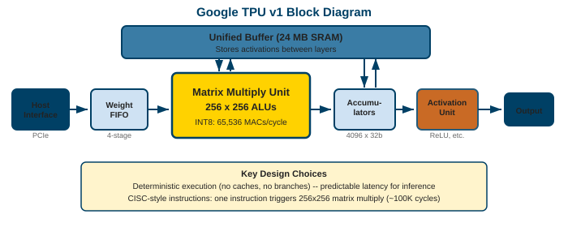

- **Unified Buffer:** 24 MB of on-chip SRAM (holds activations, avoids DRAM)
- **Matrix Multiply Unit (MXU):** 256×256 systolic array (65,536 MAC units)
- **Accumulators:** store partial sums in high precision
- **Activation Unit:** applies ReLU, sigmoid, etc.
- **Weight FIFO:** streams weights from DRAM through the MXU

Note: The TPU v1 (2015) was inference-only and had no HBM. TPU v2+ added HBM and training support. The key insight remains: dedicate most of the die to matrix multiply and use large on-chip SRAM to minimize DRAM access.

---

## Why 30% of TPU Die is ALUs (vs ~5% on CPU)

| Component | CPU | TPU |
|---|---|---|
| Branch predictor | ~10% of die | <span class="accent">None</span> (no branches in matrix multiply) |
| Out-of-order engine | ~15% | <span class="accent">None</span> (fixed dataflow) |
| Register renaming | ~5% | <span class="accent">None</span> (no register hazards) |
| Speculative execution | ~10% | <span class="accent">None</span> (no speculation needed) |
| L1/L2/L3 cache hierarchy | ~40% | Replaced by 24 MB managed buffer |
| Compute (ALUs) | ~5-15% | <span class="accent">~30%+</span> |

> The TPU asks: "what if we removed everything except matrix multiply?" The silicon freed up goes to more MAC units and bigger on-chip buffers.

Note: This table is approximate and varies by CPU design, but the principle is robust. The TPU trades generality for compute density. A CPU must handle any program; a TPU only handles matrix operations, so it can dedicate the die area accordingly.

---

## Other Domain-Specific Accelerators

| Accelerator | Company | Target Domain | Key Feature |
|---|---|---|---|
| **Neural Engine** | Apple | On-device ML inference | 16-core, integrated in M-series SoC |
| **Trainium / Inferentia** | AWS | Cloud ML training / inference | Custom interconnect (NeuronLink) |
| **Gaudi** | Intel | ML training | Ethernet-native (no proprietary interconnect) |
| **Maia** | Microsoft | ML inference in Azure | Co-designed with Azure software stack |
| **MTIA** | Meta | Recommendation models | Optimized for sparse, embedding-heavy workloads |

> Every major hyperscaler now builds custom ML silicon. The economics are clear: at their scale, even a 2x efficiency gain saves billions in electricity.

Note: Meta's MTIA is interesting because it targets recommendation models (not LLMs). Recommendation models have different compute patterns: sparse lookups, large embedding tables, irregular memory access. A GPU is not ideal for this workload, which is why Meta built custom hardware.

---

## DSA Design Principles (Hennessy & Patterson)

1. **Dedicate silicon to the dominant operation.** If 90% of cycles are matrix multiply, make 90% of the die matrix multiply units.
2. **Use the simplest data types that preserve accuracy.** INT8 for inference, BF16 for training (Lecture 09).
3. **Use a simple control model.** No speculation, no out-of-order. Fixed dataflow or simple VLIW.
4. **Invest in local memory.** Large on-chip SRAM buffers to minimize DRAM access.
5. **Co-design hardware and software.** The compiler and hardware are designed together (XLA for TPU).

> These five principles explain the design of every successful DSA, from Google's TPU to Apple's Neural Engine.

Note: Principle 5 is often underestimated. A TPU without XLA is useless because no existing compiler can target the systolic array. The hardware-software co-design cost is why only large companies build DSAs.

---

## Part 6: Systolic Arrays and Dataflow

### How does data flow through a TPU?

Note: The systolic array is the computational core of the TPU and many other ML accelerators. Understanding how data flows through it explains why these architectures are so efficient for matrix multiply.

---

## What is a Systolic Array?

> **Intuition:** named by H.T. Kung (CMU, 1978) after the rhythmic contractions of a heart. Data pulses through a grid of simple processing elements in lockstep, like blood through a circulatory system.

- Each processing element (PE) does one operation: <span class="accent">multiply and accumulate</span>
- Data flows in from the edges, passes through the array, and results flow out the other side
- No PE ever fetches from memory. Data arrives from its neighbor.

> The beauty: each data element loaded from memory is used N times (once per PE it passes through). This is O(N) data reuse from O(1) memory reads.

Note: Kung's original insight was about reducing memory bandwidth requirements. A naive matrix multiply reads O(N³) values from memory. A systolic array reads O(N²) and reuses each value N times inside the array. This is why systolic arrays dominate when memory bandwidth is the bottleneck.

---

## Systolic Array: Matrix Multiply

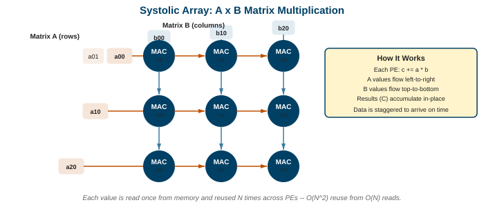

For $C = A \times B$ on a $3 \times 3$ systolic array:

- **A rows** flow left-to-right (one element per cycle, staggered)
- **B columns** flow top-to-bottom (one element per cycle, staggered)
- Each PE multiplies arriving A and B values, adds to its running sum
- After $2N-1$ cycles, all partial sums are complete

> **Data reuse:** each element of A passes through N PEs (used N times). Each element of B passes through N PEs. Total memory reads: $2N^2$. Total multiplies: $N^3$. <span class="accent">Arithmetic intensity: N/2.</span>

Note: The staggering is important. A[0][0] enters at cycle 0, A[0][1] at cycle 1, A[1][0] at cycle 1. This ensures each PE receives the right pair of values at each cycle. The TPU v1 uses a 256×256 array, so each value is reused 256 times.

---

## Why Systolic Arrays Are Efficient

| Property | Systolic Array | GPU | CPU |
|---|---|---|---|
| Memory reads per multiply | $2/N$ | ~1 (with tiling) | ~2 (cache dependent) |
| Data reuse | O(N) per element | Depends on shared mem | Depends on cache |
| Control overhead | Zero (fixed dataflow) | Warp scheduling | Full OOO pipeline |
| Interconnect | Nearest-neighbor only | Crossbar + shared mem | Register file + cache |

> At N=256 (TPU), each value is reused 256 times. The array does 65,536 multiplies per cycle while reading only 512 values from the buffer.

Note: The nearest-neighbor interconnect is key to efficiency. Each PE only talks to its immediate neighbors (up, down, left, right). No global bus, no crossbar, no shared memory arbitration. This is the simplest possible interconnect, which means minimum wire energy and maximum clock speed.

---

## Dataflow vs Control Flow

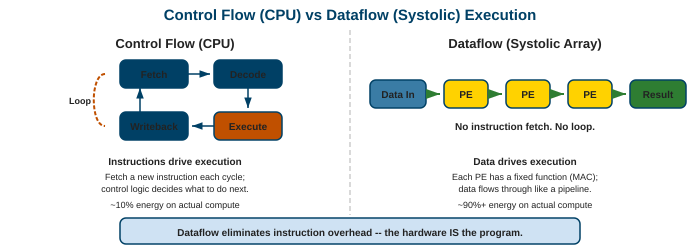

| | Control Flow (CPU/GPU) | Dataflow (Systolic/DSA) |
|---|---|---|
| **Execution model** | Fetch instruction, decode, execute | Data flows through fixed pipeline |
| **Control overhead** | Every operation needs fetch + decode | Zero (pipeline is the program) |
| **Memory access** | Data lives in memory, instructions fetch it | Data streams through, never stored |
| **Best for** | General-purpose, irregular code | Regular, predictable computation |

> <span class="accent">Dataflow eliminates instruction overhead entirely.</span> The "program" is the physical arrangement of processing elements.

Note: This is the theoretical foundation of why specialized hardware is more efficient. A CPU spends 85% of its energy on control and data movement (fetching, decoding, scheduling). Dataflow architectures spend nearly 100% on computation because the control is embedded in the hardware structure.

---

## Amortizing Instruction Overhead

The bigger the operation, the less overhead matters:

| Operation | Useful Work | Overhead | Overhead % |
|---|---|---|---|
| Scalar FP add | 1 FLOP | fetch + decode + writeback | ~2000% |
| 4-wide SIMD add | 4 FLOPs | same overhead | ~500% |
| 4×4 matrix multiply (tensor core) | 128 FLOPs | one instruction | ~27% |
| 256×256 systolic MMA (TPU) | 131,072 FLOPs | one command | <span class="accent"><1%</span> |

> This is the same principle behind tensor cores (Lecture 09). The systolic array takes it to the extreme: one "instruction" triggers 131,072 operations.

Note: This table shows the progression from scalar (terrible overhead ratio) to systolic (nearly zero overhead). Each step bundles more computation into a single control action. The limit is the systolic array where the "instruction" is just "start the pipeline" and data flows for thousands of cycles.

---

## Part 7: Programming Specialized Hardware

### How do programmers actually use this hardware?

Note: The best hardware is useless without a way to program it. This is the Achilles' heel of specialization: the more specialized the hardware, the harder it is to write software for it.

---

## The Programmability Challenge

| Hardware | Programming Model | Difficulty | Ecosystem Maturity |
|---|---|---|---|
| **CPU** | C/C++, Python, any language | Easy | Decades of tools |
| **GPU** | CUDA, ROCm, Metal | Medium | Strong (CUDA dominant) |
| **FPGA** | Verilog/VHDL, HLS | Hard | Limited |
| **DSA (TPU)** | JAX/TensorFlow + XLA | Medium (for ML) | Growing |
| **ASIC** | Custom HDL, no reuse | Hardest | None (one-off) |

> Moving down this table: hardware gets more efficient, but the programmer's job gets harder and the ecosystem shrinks.

> <span class="accent">This is why CUDA dominates.</span> It's not the best hardware, but it has the best software ecosystem. Developers choose ecosystems, not chips.

Note: The ecosystem moat is real. NVIDIA has spent 17 years building CUDA libraries, tools, and community. A new chip with 2x the perf/watt still loses if it doesn't have cuDNN, NCCL, and TensorRT equivalents. This is the biggest barrier to competition.

---

## Approaches to Programmability

| Approach | How It Works | Example |
|---|---|---|
| **Domain-Specific Languages** | Language designed for one domain | JAX (ML), Halide (images), Triton (GPU kernels) |
| **Hardware-specific compilers** | Compile high-level code to hardware | XLA (TPU), TVM (any accelerator) |
| **High-level APIs** | Framework handles backend dispatch | PyTorch compile, TensorFlow |
| **Auto-tuning** | Search for optimal parameters | Ansor, AutoTVM |

> The trend: programmers write in Python/JAX/PyTorch. A compiler stack (XLA, Triton, TVM) maps it to the hardware. The programmer never writes hardware-specific code.

Note: This layered approach is essential because hardware changes faster than programmers can retrain. If every new chip required learning a new language, adoption would be impossible. The compiler layer absorbs hardware differences.

---

## Example: JAX on TPU

```python
import jax
import jax.numpy as jnp

# Define a matrix multiply (looks like normal NumPy)
def matmul(A, B):
    return jnp.dot(A, B)           # high-level: just "multiply these matrices"

# JIT compile: XLA optimizes for the target hardware
fast_matmul = jax.jit(matmul)      # compiles to TPU systolic array instructions

# Run on TPU (data placement is automatic)
A = jnp.ones((1024, 1024))         # allocated on TPU HBM
B = jnp.ones((1024, 1024))
C = fast_matmul(A, B)              # executes on 256x256 systolic array
```

> The programmer writes NumPy-style code. `jax.jit` invokes XLA, which tiles the 1024×1024 multiply into 256×256 chunks for the systolic array, schedules data movement, and pipelines the execution.

Note: This is the power of hardware-software co-design. The programmer doesn't know about systolic arrays. JAX and XLA handle tiling, data layout, memory scheduling, and pipelining. The same code runs on CPU, GPU, or TPU by changing one line.

---

## The Compiler's Role: XLA

XLA (Accelerated Linear Algebra) bridges high-level code and specialized hardware:

| Stage | What Happens |
|---|---|
| **HLO (High-Level Ops)** | Python code becomes a graph of tensor operations |
| **Optimization** | Fuse operations, eliminate redundant copies, simplify math |
| **Tiling** | Break large matrices into chunks that fit in on-chip memory |
| **Scheduling** | Plan when data moves between HBM, buffers, and compute |
| **Code generation** | Emit hardware-specific instructions (TPU, GPU, CPU) |

> Without XLA, a TPU is just a grid of multipliers with no way to use it. <span class="accent">The compiler is half the product.</span>

Note: XLA is open-source and supports multiple backends. When you call `jax.jit` or `tf.function`, XLA runs behind the scenes. For GPUs, XLA competes with NVIDIA's proprietary compilers (cuDNN auto-tuning). For TPUs, XLA is the only option.

---

## Part 8: The Future

### Chiplets, disaggregation, composable accelerators

Note: The future of specialized hardware isn't just better chips. It's about composing different specialized chiplets into systems tailored to each workload.

---

## The Chiplet Revolution

> **Intuition:** monolithic dies are hitting the reticle limit (~858 mm²). Instead of one giant chip, compose smaller dies (chiplets) connected by high-bandwidth interconnects.

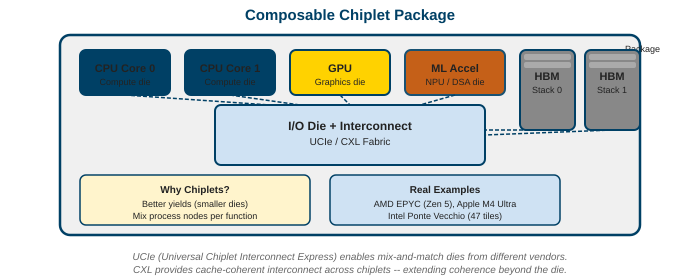

**Already shipping:**
- AMD EPYC: CPU chiplets + I/O die
- Apple M-series: CPU + GPU + Neural Engine on one package
- Intel Ponte Vecchio: 47 chiplets from 5 process nodes
- NVIDIA Blackwell B200: two GPU dies connected at 10 TB/s

> Chiplets enable mixing process nodes (CPU on 3nm, I/O on 12nm) and mixing specializations (CPU + GPU + accelerator on one package).

Note: This connects to the cache coherence discussion in Lecture 06 (chiplet coherence protocols). The challenge is keeping coherence across dies with different latency characteristics. CXL and UCIe are the emerging standards for this.

---

## UCIe: Universal Chiplet Interconnect Express

- **Open standard** for die-to-die communication (1.0 spec: March 2022)
- Bandwidth: <span class="accent">1.35 TB/s per mm</span> of die edge
- Goal: mix and match chiplets from different vendors on one package
- Supported by: Intel, AMD, ARM, Samsung, TSMC, Google, Meta, Microsoft

> Today you buy a monolithic chip from one vendor. Tomorrow you might assemble a package with an AMD CPU chiplet, an NVIDIA GPU chiplet, and a custom ML accelerator chiplet, all communicating via UCIe.

Note: UCIe is still early. The first commercial UCIe products are just emerging. But the industry alignment is strong because everyone benefits from an open interconnect standard. It's similar to how PCIe standardized card-level interconnects.

---

## Composable Accelerator Systems

The vision: a rack-scale system where each workload gets exactly the hardware it needs.

| Component | What It Provides |
|---|---|
| CPU chiplets | Control plane, OS, irregular code |
| GPU chiplets | Data-parallel compute |
| ML accelerator chiplets | Matrix multiply, inference |
| FPGA chiplets | Custom logic, low latency |
| Memory pools (CXL) | Shared, disaggregated DRAM |
| Interconnect fabric (UCIe/CXL) | Glues everything together |

> Instead of buying a fixed server with a fixed GPU, you allocate the right mix of chiplets per job. Training job: more GPU + ML chiplets. Database: more CPU + memory. Networking: add FPGA chiplets.

Note: This is the long-term vision. Today's data centers are moving toward this with CXL memory pooling and composable infrastructure (like Liqid, GigaIO). Full chiplet composability is still 5-10 years away, but the building blocks are shipping now.

---

## Key Takeaways

1. **Specialization trades flexibility for efficiency.** The spectrum runs from CPU (any program, 1x) to ASIC (one algorithm, 1000x).
2. **Energy is the fundamental constraint.** Less than 15% of a CPU's energy does useful math. Removing overhead is the point of specialization.
3. **Data movement dominates energy.** Reading from DRAM costs 40,000x more than an integer add. Every good accelerator minimizes data movement.
4. **FPGAs are reprogrammable near-ASIC.** Best for low-latency, medium-volume, evolving workloads.
5. **DSAs (TPU) hit the sweet spot.** Domain-specific programmability with near-ASIC efficiency for that domain.
6. **Systolic arrays eliminate control overhead.** Data flows through, each element reused N times. Near-zero overhead.
7. **The compiler is half the product.** XLA, Triton, and TVM bridge the gap between Python and specialized hardware.
8. **Chiplets and CXL are the future.** Compose the right mix of specialized silicon per workload.

Note: These eight points capture the entire specialization story. When someone asks "should we build custom hardware?", walk through: Is the workload stable? Is volume high enough? Can a GPU do it? If the answer is "stable, high volume, GPU not enough," then specialization makes sense.

---

## Further Reading

- **Hennessy, Patterson.** "A New Golden Age for Computer Architecture" (Turing Lecture, 2018). The case for domain-specific architectures.
- **Jouppi et al.** "In-Datacenter Performance Analysis of a Tensor Processing Unit" (ISCA 2017). The original TPU paper.
- **Kung, H.T.** "Why Systolic Architectures?" (IEEE Computer, 1982). The foundational systolic array paper.
- **Horowitz, M.** "Computing's Energy Problem" (ISSCC 2014). The energy breakdown numbers used in this lecture.
- **Shaw et al.** "Anton 3: Twenty Microseconds of Molecular Dynamics Simulation before Lunch" (SC 2021). The Anton supercomputer.
- **UCIe Consortium.** UCIe 1.0 Specification. The chiplet interconnect standard.

Note: The Hennessy-Patterson Turing Lecture is essential reading for anyone in computer architecture. It argues that the end of Moore's Law and Dennard scaling creates a "new golden age" where innovative architectures (not just smaller transistors) drive performance gains. DSAs are their central prescription.
